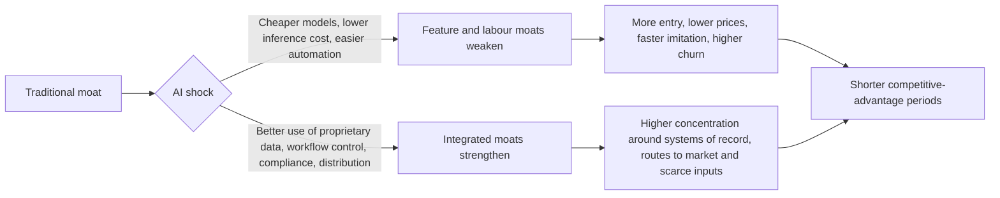

# Corporate Moats in the Age of AI-Native Businesses

## Executive summary

The corporate “moat” remains a useful concept, but its centre of gravity is shifting. In classic strategy and investing usage, a moat is the persistent ability to earn returns on invested capital above the cost of capital because rivals cannot easily copy, bypass, or outbid the firm. Historically, that mattered enormously. McKinsey’s work on global economic profit found that the top quintile captured nearly 90% of economic profit, while the odds of moving from the middle of the pack to the top quintile over a decade were only 8%. Earlier strategy research also found that both industry structure and business-specific factors explain persistent profitability differences, and that superior performance is real but uncommon and usually hard to sustain. citeturn40search10turn37view0turn35view1turn35view2turn7search6turn28search2turn7search11

AI does not make moats irrelevant. It changes which moats are durable. Falling inference costs, rapid model diffusion, and increasingly capable open-weight models weaken feature-based differentiation and purely labour-arbitrage advantages. Stanford’s AI Index reported that the cost of achieving GPT-3.5-level performance fell more than 280-fold between late 2022 and late 2024, and that open-weight models narrowed the performance gap sharply before the frontier gap reopened somewhat in early 2026. At the same time, BCG’s 2025 survey found that only 5% of firms are “future-built” on AI, yet those firms report five times the revenue uplift and three times the cost reduction of the rest. In other words, AI makes weak moats easier to attack, but it also rewards firms that have the right control points. citeturn5search0turn5search2turn31view0

The most defensible moats in AI-native markets are usually not “having a model”. They are owning privileged data loops, being embedded in customer workflows, controlling default distribution, operating trusted and compliant systems, securing scarce compute or specialised partnerships, and combining AI with human oversight where mistakes are costly. Regulators are already focused on these control points. The UK CMA has warned of concentration risks around compute, data, routes to market, and partnerships, while Gartner reports that successful AI initiatives invest up to four times more in data and analytics foundations than unsuccessful ones. citeturn32view2turn32view1turn31view1

My bottom line is blunt. AI is dismantling lazy moats, especially those based on user-interface polish, generic content, basic service labour, or narrow feature breadth. It is reinforcing harder moats based on proprietary context, system-of-record ownership, default placement, trusted execution, and capital intensity. For valuation, that means investors should think less about whether a company “uses AI” and more about whether AI lengthens or shortens the duration of its ROIC-over-WACC spread. For strategy, incumbents should move from selling AI features to controlling AI-enabled workflows; startups should avoid competing at the commodity model layer unless they can own a unique data, compliance, or distribution wedge. citeturn31view3turn37view0turn37view1

## Scope, assumptions and uncertainties

This report treats a moat as a firm’s sustainable competitive advantage in the economic sense: the capacity to preserve superior value creation over time, typically observable through sustained excess returns on capital, economic profit, or pricing power. The scope is global, but the evidence base is strongest for the US and Europe because that is where public-company disclosures, market studies, and competition-policy work are richest. “AI” is used broadly here to include predictive AI, generative AI, agentic systems, and AI-enabled automation and robotics. citeturn37view0turn29search3

Two uncertainties matter. First, the technology trajectory is unusually fast and non-linear. Open-weight models narrowed the performance gap with closed models in 2024, but the frontier gap reopened in 2025 and early 2026; inference costs are collapsing even as frontier training and compute costs keep rising. Second, enterprise execution remains uneven. Gartner found just 39% of technology leaders confident that current AI investments will improve financial performance, and Reuters, citing Gartner, reported that more than 40% of agentic AI projects may be scrapped by 2027 because of cost and unclear value. Any forward view therefore needs to keep both commoditisation and concentration in play at the same time. citeturn5search0turn5search2turn30search2turn30search6turn31view1turn29news40

## What the moat is

Morningstar defines an economic moat as the source of a company’s sustainable competitive advantage, popularising Buffett’s castle-and-moat metaphor in public markets research. Morgan Stanley’s recent strategy work expresses the same idea more formally: sustainable value creation comes from the magnitude and duration of the spread between ROIC and WACC, and sustaining that spread is difficult precisely because competition is drawn to high returns. That framing is still the cleanest analytical starting point. citeturn40search10turn40search2turn37view0

Morningstar’s formal taxonomy covers five primary moat sources: intangible assets, switching costs, network effects, cost advantages, and efficient scale. In broader corporate strategy practice, it is also useful to separate regulatory and legal barriers, proprietary technology and data, distribution advantages, and culture and talent, because those often operate as distinct mechanisms, especially in platform and AI-heavy markets. citeturn40search2turn40search14turn40search3

| Moat type | Working definition | Why it persists when strong | Source support |
|---|---|---|---|
| Network effects | The product becomes more valuable as more users, developers, merchants, or counterparties join. | New entrants must overcome the incumbent’s installed base and participation flywheel. | citeturn40search4turn40search10 |
| Economies of scale | Unit costs fall as volume rises, often because fixed costs, procurement, logistics, or compute are spread across more activity. | Entrants must match scale before they can match cost. | citeturn40search2turn40search6 |
| Switching costs | Customers face economic, procedural, contractual, training, or integration costs when changing supplier. | Current market share becomes a predictor of future profitability. | citeturn40search13turn40search14 |
| Brand | Reputation, familiarity, and perceived quality reduce buyer uncertainty and sometimes allow premium pricing. | Trust and preference are slow to build and expensive to replicate. | citeturn40search14 |
| Regulatory and legal barriers | Patents, licences, exclusivities, standards, or regulated permissions restrict entry or imitation. | Rivals are legally blocked or slowed, not just economically deterred. | citeturn27search0turn27search11turn40search14 |
| Proprietary technology and data | Unique technical know-how, models, datasets, labels, or feedback loops produce better outputs or lower cost. | Competitors cannot easily access or recreate the same asset stock. | citeturn40search3turn31view1 |
| Distribution advantages | Control of routes to market, default placement, installed channels, enterprise procurement surfaces, or customer access points. | Even a better rival product struggles if it is harder to discover, trust, or buy. | citeturn34view0turn32view2 |
| Culture and talent | Hard-to-copy human capital, managerial routines, decision speed, and socially complex ways of working. | These assets are embedded in people, incentives, and organisational history, not just code. | citeturn26search13turn40search3turn31view0 |

A critical clarification follows from this taxonomy. A moat is not the same thing as a temporary edge, nor is it the same thing as market share. Many firms can be large without earning excess returns; conversely, some moats are narrow but economically potent. In practice, the best test is whether the advantage shows up in durable margins, stable retention, recurring economic profit, and a long competitive-advantage period rather than a short-lived product lead. citeturn37view0turn37view1

## Why moats mattered historically

The historical evidence says moats were not investor folklore. They were economically meaningful. McGahan and Porter’s classic variance-decomposition work on US public corporations found that year effects explained about 2% of aggregate profitability variance, industry effects about 19%, corporate-parent effects about 4%, and business-specific effects about 32%. In a related paper, they found that industry shocks to profitability persisted longer than shocks tied to the corporate parent or specific business. Different methods produce different percentages, but the common message is robust: durable profit differences are materially structured by industry and firm-specific position. citeturn7search6turn28search2

At the same time, sustained outperformance has always been rare. Wiggins and Ruefli found that while some firms do achieve superior economic performance, only a small minority do so and it rarely persists for long. Morgan Stanley’s 2024 review makes the same point in financial terms: large positive ROIC-WACC spreads attract competition, best practices diffuse, and mature markets turn growth into share-taking contests rather than expansion. citeturn7search11turn37view0

McKinsey’s “power curve” work is especially useful because it translates strategy into economic outcomes. In its sample of 2,393 of the world’s largest companies, the average company earned only modest economic profit after the cost of capital, the middle three quintiles averaged just $47 million per year, and the top quintile captured nearly 90% of the economic profit created, averaging $1.4 billion annually. McKinsey also estimated that roughly 50% of a company’s position on that curve is driven by industry choice, and that the probability of moving from the middle quintiles to the top quintile over ten years is just 8%. This is exactly what a moat should imply: persistent asymmetry in who captures surplus. citeturn35view1turn35view2

Public-market evidence points the same way, although it should be read as practitioner evidence rather than proof of causation. Morningstar’s long-run review says wide-moat companies have modestly outperformed the stock market on a risk-adjusted basis and held up better in bear markets; it also reports that the Wide Moat Focus Index retained the highest Sharpe ratio in its long-horizon comparison. Its latest 4Q 2025 performance update reported 6.01% return for the Morningstar Wide Moat Focus Index versus 2.43% for the benchmark in the period shown. That is not a universal law, but it is consistent with the proposition that durable competitive advantages matter financially. citeturn36search1turn36search2

Historically, then, the moat mattered in three measurable ways. It shaped persistent profitability, influenced how much economic profit different firms could capture, and affected both strategic mobility and valuation. The real question is not whether moats existed before AI. It is whether AI changes their mechanism and half-life. citeturn28search2turn35view1turn37view0

## How AI is reshaping moats

AI changes competition through two opposing forces. One force is commoditisation. The cost of usable model capability is falling fast, digital transparency pressure keeps intensifying, and AI makes it easier to recreate basic features, automate routine knowledge work, and attack incumbents from adjacent categories. The other force is reinforcement. AI disproportionately rewards firms that already own high-quality data, default access to users, embedded workflows, or the capital and partnerships needed to train, serve, and govern models at scale. Stanford, McKinsey, BCG, the OECD, and the CMA all point to this duality. citeturn5search0turn5search2turn34view0turn31view0turn29search3turn32view2

This dynamic is already visible in market evidence. BCG finds that only a small minority of firms are generating outsized AI value, and Gartner finds successful AI initiatives invest much more heavily in the data and governance foundations that make models useful in real operations. In short, AI does not reward “AI adoption” in the abstract. It rewards operationally embedded AI. citeturn31view0turn31view1

### Concise case studies

| Industry | Pre-AI moat baseline | AI effect | Evidence | Implication |
|---|---|---|---|---|
| Finance, Visa and Mastercard | Payments network scale, merchant acceptance, fraud data | **Reinforced** | Visa says its scam-disruption practice identified over $1 billion in fraud attempts in a year and helped dismantle more than 25,000 scam merchants. Mastercard says genAI doubled the speed of detecting potentially compromised cards. citeturn39view1turn39view2 | Network effects become stronger when paired with real-time risk models trained on proprietary transaction flow. |
| Finance, Klarna | Digital brand, service operations efficiency | **Both reduced and constrained** | Klarna said its AI assistant handled 2.3 million conversations in its first month, covering two-thirds of customer service chats, doing work equivalent to 700 agents, reducing repeat inquiries by 25%, and cutting resolution time to under two minutes from eleven. Reuters later reported revenue per employee up 73%, but the company later acknowledged that heavy cost emphasis produced lower support quality and added human support back. citeturn9search2turn11search6turn11search7 | Routine service efficiency is easier to automate and therefore less defensible; trust and escalation design become part of the moat. |
| Retail, Amazon | Logistics scale, fulfilment density, automation | **Reinforced** | Amazon says it has deployed its one millionth robot, launched a foundation model that improves robot fleet travel efficiency by 10%, and upskilled more than 700,000 employees. citeturn39view3 | AI amplifies existing scale and distribution advantages rather than replacing them. |
| Healthcare, Epic | System-of-record ownership and clinical workflow control | **Reinforced** | Epic’s AI Charting is built directly into the EHR and drafts notes plus queues orders during visits. Separately, Epic says Curiosity models are trained on de-identified records from more than 300 million patients in Cosmos. citeturn39view5turn15search1 | In high-stakes domains, AI gravitates to the incumbent that owns workflow, data rights, and clinical trust. |
| Manufacturing, John Deere | Installed base, dealer network, agronomic know-how | **Reinforced** | Deere says See & Spray was used on more than five million acres in 2025, reducing non-residual herbicide use by nearly 50% and saving nearly 31 million gallons of herbicide mix. citeturn39view6 | AI strengthens moats when deployed through proprietary equipment fleets and service channels. |
| Software and education, Chegg | Vertical content library and study workflow | **Dismantled** | In May 2023 Chegg disclosed that rising student interest in ChatGPT was affecting its new customer growth rate. Reuters later reported that Chegg cut 22% of its workforce, with subscribers down 31% and revenue down 30% in Q1 2025 as AI tools and Google AI Overviews hurt traffic and demand. citeturn39view7turn18news38 | General-purpose AI can rapidly erode content moats when the content is substitutable and distribution is search-dependent. |
| Software and creative tools, Adobe | Brand, workflow integration, IP reputation | **Reinforced** | Adobe says Firefly’s generative models are trained on licensed content such as Adobe Stock plus public-domain material, that customers can build custom models on their own assets, and that Firefly, model partners, and AI assistants are integrated across Firefly, Creative Cloud, Express, and GenStudio. citeturn39view10turn39view11 | In creative software, rights-clean generation plus deep workflow integration can matter more than raw generation quality alone. |
| Advertising, Meta | User data, advertiser demand, distribution at scale | **Reinforced** | Meta says recommendation and ad-model improvements drove a 3.5% lift in Facebook ad clicks, more than 1% gain in Instagram conversions, and a 12% increase in ad quality in Q4 2025. Its 2025 results show ad impressions up 12% and average price per ad up 9% for the year. citeturn39view8turn39view9 | AI strengthens data-feedback loops where usage, optimisation, and monetisation are already tightly connected. |

The pattern across these cases is clear. AI most reliably destroys moats that rest on generic content, routine process labour, and narrow feature differentiation. It most reliably reinforces moats where the incumbent owns the data loop, the workflow, the action rights, or the route to market. The middle ground is where many firms will struggle: they can add AI copilots, but without proprietary context or distribution they often just make the category easier to enter. citeturn5search0turn31view0turn39view7turn39view8turn39view5

## What follows if moats erode

If moats erode, market structure does not move in only one direction. At the application layer, erosion usually means more entry, faster imitation, and shorter product cycles. McKinsey’s digital-competition work described this before genAI: digital technologies increase transparency, intensify price comparison, and can commoditise products and services. AI accelerates that mechanism because it reduces the cost of building “good enough” software, support, search, and content interfaces. citeturn34view0turn5search0

But erosion at one layer can coincide with concentration at another. The OECD, the CMA, and the European Commission have all warned that AI competition depends on access to key inputs such as data, chips, cloud capacity, technical talent, and deployment channels. The CMA says it has identified an interconnected web of over 90 partnerships and strategic investments involving Google, Apple, Microsoft, Meta, Amazon, and Nvidia, and warns that incumbents may shape markets through control of compute, data, routes to market, and value-chain partnerships. This means AI can make many app categories more contestable while making frontier infrastructure and default distribution more concentrated. citeturn29search3turn32view2turn30search11

The margin consequences are equally mixed. Where AI standardises capability, it pushes prices and gross margins down, especially for products that were little more than interfaces over commoditisable workflows. Goldman Sachs argues that software investors are repricing this risk because AI agents could turn traditional platforms into passive data stores and weaken pricing power. Its analysis says implied medium-term revenue-growth expectations in software valuations fell from 15% to 20% at the peak to roughly 5% to 10% after the revaluation. In business terms, that is what moat erosion looks like in public markets. citeturn31view3

At the same time, valuation models become more sensitive to duration than to hype. Morgan Stanley frames moat analysis as assessing both the magnitude of the positive ROIC-WACC spread and how long it lasts. Economic profit equals the spread multiplied by invested capital. If AI shortens the competitive-advantage period, terminal value falls even if current revenues rise. If AI strengthens workflow lock-in, trusted execution, or systems-of-record control, the opposite can happen. This is why the right question for valuation is not “does this company have AI revenue?” but “does AI lengthen or shorten the life of excess returns?” citeturn37view0turn37view1

There are also implications for entry and exit. More firms can now launch products quickly, but many will not persist. Reuters, citing Gartner, says over 40% of agentic AI projects may be scrapped by 2027 because of cost and unclear value. That is consistent with a future of higher experimental entry, more rapid failure, and harsher selection around the few control points that remain truly defensible. citeturn29news40

## What the new moats look like in AI-native markets

The strongest AI-native moats are usually combinations, not single assets. Gartner reports that organisations with successful AI initiatives invest up to four times more in data quality, governance, AI-ready people, and change management than poor performers, and that organisations with the highest maturity of AI-ready data and analytics capabilities achieve up to 65% greater business outcomes. That is the first big clue: the new moat is typically the governed context layer around AI, not the model in isolation. citeturn31view1

A second clue comes from model economics. Stanford reports massive inference-cost declines, and open-weight models have at times come very close to closed-model performance. Yet frontier development remains capital-intensive and concentrated, with industry producing over 90% of notable frontier models in 2025 and compute capacity expanding at extraordinary speed. So raw model lead can still be a moat at the frontier, but for most companies it is a weak and decaying moat unless fused with data, integration, and distribution. citeturn5search0turn5search2turn30search0turn30search2turn30search6

### Traditional versus AI-era moat attributes

| Dimension | Traditional moat anchor | AI-era moat anchor | Why the AI-era version is durable |
|---|---|---|---|
| Data | Historical customer records or proprietary datasets | Fresh, governed, task-relevant data with labels, semantics, and feedback from real usage | Successful AI programmes invest much more in data foundations, and governed context increasingly determines outcomes. citeturn31view1 |
| Model capability | Proprietary algorithm or patented technology | Model plus proprietary fine-tuning, evals, safety layers, and domain context | Raw capability diffuses fast; contextual performance, reliability, and auditability persist longer. citeturn5search0turn5search2turn31view2 |
| Cost advantage | Manufacturing scale or procurement leverage | Inference efficiency, custom chips, quota access, optimisation of latency and cost per task | Compute and capacity are becoming strategic inputs, and access can be scarce or concentrated. citeturn30search2turn30search6turn32view2 |
| Switching costs | Contracts, training, installed software, data migration | Workflow embedding, action rights, audit logs, approval chains, agent permissions, system-of-record control | If AI is where work is initiated and approved, displacement becomes operationally painful and risky. citeturn31view3turn39view5 |
| Brand | Reputation and emotional preference | Trust, provenance, safety, commercial rights cleanliness, explainability | In regulated and enterprise contexts, safe and accountable output is itself a buying criterion. citeturn31view2turn39view10 |
| Distribution | Shelf space, salesforce reach, channel access | Default placement in cloud suites, operating systems, EHRs, work platforms, app stores, enterprise procurement | The CMA explicitly flags routes to market and deployment surfaces as competition bottlenecks. citeturn32view2 |
| Network effects | More users create more value | More users create more data, more tuning signal, more developer complements, more agent usage paths | AI turns network effects into data-feedback effects when interactions improve the product. citeturn40search10turn39view8 |
| Ecosystem | Complementors and partners | Developers, APIs, model connectors, plugins, agent protocols, third-party integrations | Copilot-scale adoption shows that ecosystem depth can become a distribution and retention moat. citeturn21search1turn19search15 |
| Culture and talent | Specialist know-how and managerial routines | Cross-functional AI operating model, fast experimentation, strong eval discipline, human-in-the-loop escalation | BCG’s “future-built” firms and Gartner’s AI-first teams show execution quality compounds. citeturn31view0turn31view1 |
| Partnerships and licences | Supplier contracts or exclusive rights | Exclusive model, data, hardware, or channel partnerships; regulatory clearances and compliance infrastructure | The CMA’s concern about powerful partnerships reflects how strategic access itself can become a moat. citeturn32view2turn32view1 |

The most durable new moats, in my judgement, rank roughly as follows. First, system-of-record ownership plus the right to take action inside a workflow. Second, proprietary and continuously refreshed data that improves decisions, not just model training. Third, trust, safety, and compliance in high-stakes settings. Fourth, privileged distribution and enterprise procurement surface area. Fifth, inference efficiency and hardware access where usage is extremely large. Sixth, developer ecosystem depth. Frontier model scale matters, but by itself it is a narrow, expensive, and unstable moat. citeturn31view1turn31view2turn31view3turn32view2turn5search0turn30search0

Two examples show what this looks like in practice. Tempus says it has amassed roughly 1.4 billion documents across more than 8.6 million de-identified patient records, while its 2025 revenue reached about $1.3 billion with 126% net revenue retention. Epic says its Curiosity models use de-identified records from more than 300 million patients in Cosmos. For both firms, the moat is not “AI” in the abstract. It is the combination of proprietary data, domain trust, and workflow relevance. citeturn14search5turn14search0turn15search1

## Outlook, strategy and KPIs

The next one to five years are best seen through scenarios. My probabilities below are judgemental, not model outputs, and are based on the evidence that model capability is diffusing quickly, execution quality is highly uneven, and critical inputs remain concentrated. citeturn5search0turn31view0turn29news40turn32view2

| Scenario | My view of likelihood | What happens | What it means for moats |
|---|---|---|---|
| Best case | About 25% | Mid-tier model capability becomes broadly available and cheap; open standards improve interoperability; compliance tooling matures; productivity gains diffuse beyond hyperscalers and software giants. | Moats shift upward into data quality, workflow ownership, and trust, but competition stays reasonably open and prices fall for customers. |
| Most likely | About 55% | A barbell forms: model capability commoditises in the middle, while frontier compute, systems-of-record ownership, and default distribution remain concentrated. Many AI copilots become table stakes; a smaller number of integrated platforms capture outsized rents. | The winning moats are workflow control, proprietary context, compliance, and route-to-market. Generic AI features stop being moat-like. |
| Worst case | About 20% | Compute scarcity, regulatory fragmentation, and partnership lock-ups deepen concentration. Many startups become thin wrappers, while incumbents bundle AI into dominant suites. Customer switching becomes harder because AI agents can act only inside a few large platforms. | AI increases concentration while reducing contestability. Margin pools move toward infrastructure, distribution, and regulated incumbents. |

### Strategic recommendations for incumbents

Incumbents should treat AI as a chance to migrate the moat, not merely defend the old one. The key move is to shift from selling features to controlling workflows. If a company already owns a system of record, it should use AI to become a system of action, with permissions, audit trails, approvals, and embedded execution. If it has proprietary data, it should invest in freshness, curation, semantics, and rights management rather than just larger models. If it has brand strength, it should convert that into trustworthy AI, with provenance, safety controls, and escalation paths rather than marketing claims. And if it has distribution power, it should deepen integration carefully, while being realistic that bundling and defaults can invite regulatory attention. citeturn31view3turn31view2turn32view2

Incumbents should also be disciplined about human involvement. Klarna’s experience suggests that replacing humans too aggressively can degrade quality even when productivity improves. In healthcare, Epic’s messaging around AI Charting still assumes clinician control. In practice, the moat often comes from where the human sits in the loop, who owns escalation, and how trust is preserved at scale. citeturn11search7turn39view5

### Strategic recommendations for startups

Startups should avoid the commodity layer unless they have a very specific reason to be there. Competing on access to a general-purpose model, or on a user interface over a model, is likely to be fragile. A better entry wedge is a narrow workflow where the startup can accumulate proprietary data, own an approval point, or solve a compliance-heavy problem that incumbents handle badly. Another strong wedge is being the best integration layer across fragmented systems, especially where enterprise action is hard, permissions are messy, and users need outcomes rather than chat. citeturn31view3turn32view2

For startups, speed matters, but evidence matters more. BCG’s results imply that value accrues to firms that operationalise AI deeply, not those that merely launch AI features. Gartner’s work suggests that strong data and governance foundations are not optional. So the right startup discipline is to prove one closed loop: acquire proprietary context, improve outcomes, capture the feedback, and make the workflow harder to leave with every use. citeturn31view0turn31view1

### KPIs to monitor

| KPI | Why it matters | What a strong signal looks like |
|---|---|---|
| ROIC minus WACC by product line | Direct measure of whether the moat still creates value | Stable or rising spread even after AI-related investment |
| Gross margin and realised price per task | Detects commoditisation early | Falling unit cost without equivalent price collapse |
| Net revenue retention and logo retention | Reveals whether switching costs are holding | High retention despite AI-feature parity in the market |
| Percentage of customer workflows completed end-to-end inside the product | Measures shift from tool to system of action | Rising completion rate, not just higher prompt volume |
| Proprietary data accrual rate | Shows whether usage creates a compounding feedback loop | More fresh, labelled, permissioned data per customer or transaction |
| Inference cost and latency per successful outcome | AI cost advantage is increasingly strategic | Lower cost and faster response without lower quality |
| Human escalation rate and post-escalation satisfaction | Trust and high-stakes quality still matter | Problems are escalated efficiently and resolved better, not merely deflected |
| Compliance and safety incident rate | Trust, legal exposure, and brand protection | Low incident frequency and fast remediation |
| Share of usage through owned channels versus rented channels | Tracks distribution dependence | High direct usage, rising default placement, lower dependence on search or third parties |
| Developer or integration depth | Measures ecosystem lock-in | More active integrations, API calls, partners, and embedded third-party workflows |
| Compute security and supply resilience | Important where scale matters | Reserved capacity, diversified suppliers, predictable serving costs |
| AI feature adoption tied to business outcomes | Filters hype from real moat-building | Measurable uplift in conversion, retention, throughput, or fraud reduction |

The core interpretive rule is simple. If a company’s AI usage volume rises but its proprietary data loop, workflow control, price realisation, and customer retention do not improve, it is probably not building a moat. It is probably subsidising a feature. By contrast, when AI makes the firm the default place where work is initiated, approved, recorded, and improved, the moat is usually getting wider. citeturn31view3turn37view0