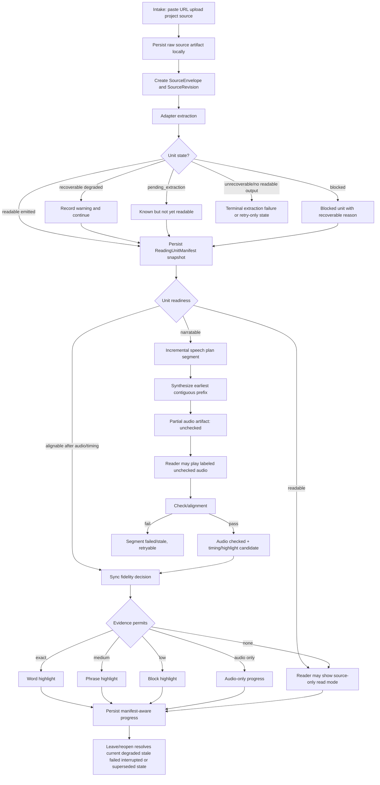
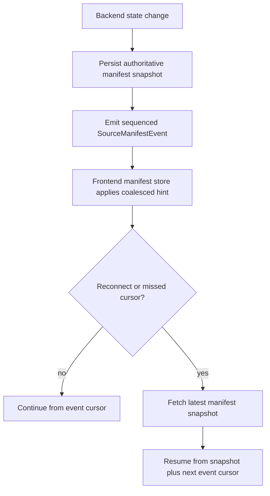
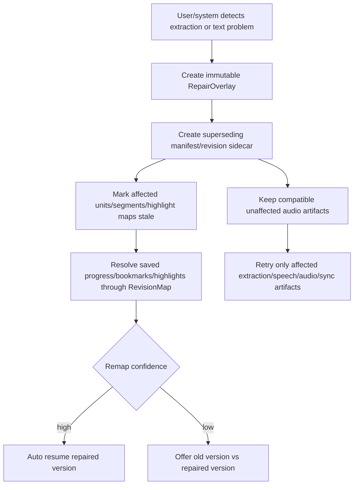
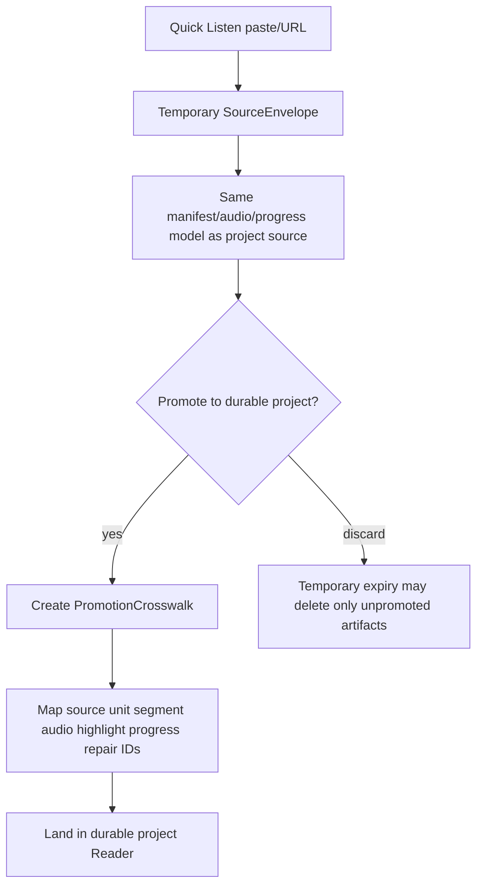
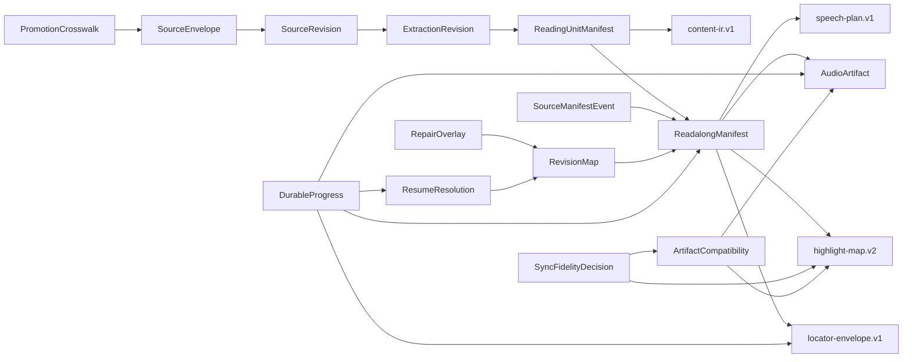

# Source Reader Flow, Invariants, and Contract Map

Status: agreed with ChatGPT; ready for Linear seeding  
Updated: 2026-07-07 11:27 CEST

## Purpose

This document is the repo-local operating map for the first TTS-Research / Voice Studio batch. It turns the ChatGPT architecture agreement into a concrete flowchart, contract boundary map, and invariant checklist before Linear issues are created.

## Agreement record

- Product/architecture thread: `docs/reviews/chatgpt/001-product-market-fit.response.md` through `docs/reviews/chatgpt/007-linear-issue-batch.response.md`
- Atomic flow agreement: `docs/reviews/chatgpt/008-atomic-flow-linear-batch.response.md`
- Agreement marker: `AGREED ATOMIC FLOW AND LINEAR BATCH`

## Validated existing contracts

Validated 2026-07-07 with:

```bash
mise exec -- pnpm generate:contracts
mise exec -- pnpm validate:ir
mise exec -- pnpm test:adapters
```

Result:

- generated schema/type bundles successfully;
- validated 4 Content IR fixtures, 22 public contract fixtures, and 3 adapter files;
- adapter tests passed: Markdown/HTML/EPUB/DOCX Node tests 10/10; PDF unittest 8 passed, 1 skipped.

Existing contract coverage:

- `docs/contracts/content-ir.md` — stable finalized node/content contract.
- `docs/contracts/locators.md` — resume/bookmark/highlight locator envelope.
- `docs/contracts/speech-plan.md` — speech segment plan contract.
- `backend/internal/contentir/schema/highlight-map.v2.schema.json` — highlight-map v2 source schema.
- `packages/schema/schemas/highlight-map.v2.schema.json` — generated highlight-map v2 package schema.

Current gap before first batch:

- no durable source lifecycle envelope contract;
- no source/extraction/readalong manifest revision contract;
- no partial artifact compatibility/staleness contract;
- no repair overlay/revision remap/promotion crosswalk contract;
- no event contract for source/manifest progress;
- no manifest-aware durable progress resolver contract.

## Product flowchart



## Source/manifest event recovery flow



## Repair and supersession flow



## Quick Listen promotion flow



## Architecture invariants

1. Raw source is persisted locally before adapter extraction for URL/upload/paste sources where bytes are available.
2. Source identity is not job identity. Jobs may create artifacts; sources/manifests own durable reading state.
3. Content IR v1 remains the finalized node contract; lifecycle/readiness/staleness live in sidecar contracts.
4. Reading unit IDs are stable across compatible revisions; insertion/reorder uses sparse order keys and revision maps.
5. Readable, narratable, alignable, pending, and blocked are separate states.
6. Recoverable degraded extraction may still emit readable units and manifest snapshots.
7. Earliest contiguous narratable prefix may synthesize before full extraction completes.
8. Unchecked audio may be playable only when explicitly labeled and replaceable.
9. Exact word highlight is forbidden unless source revision, text mapping, timing confidence, and low-resource gates all pass.
10. Fallback sync is honest: phrase, block, audio-only, or source-only must be visible as such.
11. Backend/local storage is authoritative; frontend caches are narrow, keyed, and disposable.
12. Source/manifest events are advisory and sequenced; persisted manifest snapshots are authoritative for reconnect/recovery.
13. Browser localStorage stores only reopen/layout hints, never canonical progress or artifact state.
14. Backend restart cannot leave active work pretending to run; orphaned active work becomes `interrupted_retriable` for the first batch.
15. Retry is artifact/segment scoped whenever source compatibility permits.
16. Repairs do not mutate running manifests; they fork/supersede with overlays and crosswalks.
17. Stale/superseded progress, bookmarks, and highlights resolve through RevisionMap before auto-resume or old-vs-repaired choice.
18. Promotion from Quick Listen to project source keeps progress/bookmarks/artifacts/repair history by default.
19. UI responsiveness beats fidelity: low-resource mode may downgrade exact sync to phrase/block.
20. The `Design for the Real World` source/project is the canonical product proof fixture; Kappa remains adapter/smoke evidence.
21. Linear is the live PM source; ChatGPT threads are architecture/review records; repo docs are durable design records.

## Contract map



## First-batch contract status

| Contract | Existing? | First-batch action |
| --- | --- | --- |
| `content-ir.v1` | yes | keep stable; adapter backfills must validate |
| `locator-envelope.v1` | yes | use for progress/bookmarks/highlights; add source/manifest binding in sidecars if needed |
| `speech-plan.v1` | yes | link segments to source/revision/manifest/unit identity through sidecars or compatible metadata |
| `highlight-map.v2` | yes: `backend/internal/contentir/schema/highlight-map.v2.schema.json` and `packages/schema/schemas/highlight-map.v2.schema.json` | reuse timing/highlight shape; stale/fidelity gates live in sidecars |
| `SourceEnvelope` | partial temporary-source docs | formalize source-neutral contract |
| `SourceRevision` / `ExtractionRevision` | no | add sidecar contract |
| `ReadingUnitManifest` / `ReadalongManifest` | no | add sidecar contract and snapshots |
| `AudioArtifact` | partial pipeline state | formalize checked/unchecked/stale/replaced/failed/retryable state shape |
| `ArtifactCompatibility` | no | add source/audio/highlight staleness/reuse contract |
| `RevisionMap` | no | add remap sidecar for repairs/extraction correction |
| `RepairOverlay` | no | add immutable minimal overlay contract |
| `PromotionCrosswalk` | partial temporary-source docs | formalize temporary-to-project identity map |
| `SourceManifestEvent` | no | add sequenced event + snapshot fallback contract |
| `DurableProgress` / `ResumeResolution` | partial progress/locator docs | add canonical durable progress + deterministic reopen/resume contract |
| `SyncFidelityDecision` | partial highlight-map/degraded fixtures | add explicit decision record unless fully covered by highlight-map v2 plus artifact compatibility sidecars |

## Linear seeding gate

Linear issue creation may proceed only from `docs/project-management/linear/tts-research-first-batch.draft.manifest.json` after it contains the ChatGPT-agreed 19-issue batch and `do_not_create_duplicate_quick_listen_issue: true`.
