# Application and UX flow contracts

Application shell, projects, intake, review, policy, preview, and Teleprompt contracts.

Generated from `manifest.json` by `pnpm validate:flows`; do not hand-edit.

## APP-BOOT-001 — Application boot and local HTTP readiness

- Primary owner: `runtime-platform`
- Architecture family: `startup`
- Shared subgraphs: `classified-failure-retry`, `cancellable-cleanup`
- Secondary owners: `experience`
- Shared concerns: `RECOVERY`, `LOCAL_ORIGIN_AUTH`, `SUBPROCESS`, `ACCESSIBILITY`, `PERFORMANCE_TELEMETRY`, `OPERATIONAL_STATUS`

### Route ownership

- none

### State contract

| State | Label | Kind | Authority | UI observable |
| --- | --- | --- | --- | --- |
| `APP_BOOT_001_REQUESTCAPTURED` | launch requested | `stable` | `frontend` | UI shows launch requested |
| `APP_BOOT_001_PRECONDITIONSCHECKED` | port and launch contract checked | `stable` | `backend` | UI shows validation progress for local launch |
| `APP_BOOT_001_DOMAINWORKACTIVE` | frontend and API starting | `transient` | `backend` | UI shows frontend and API starting |
| `APP_BOOT_001_DURABLEEFFECTRECORDED` | health response accepted | `stable` | `backend` | UI shows committed local launch state |
| `APP_BOOT_001_FLOWCOMPLETED` | usable local shell rendered | `terminal-success` | `shared` | UI shows usable local shell rendered |
| `APP_BOOT_001_CLASSIFIEDFAILURE` | startup classified as unavailable | `stable-failure` | `backend` | UI explains startup classified as unavailable |
| `APP_BOOT_001_CLEANUPINPROGRESS` | process tree stopping | `transient` | `backend` | UI shows process tree stopping |
| `APP_BOOT_001_CANCELEDCLEAN` | all launch descendants stopped | `terminal-canceled` | `shared` | UI shows all launch descendants stopped |
| `APP_BOOT_001_RECOVERYCONTEXTREADY` | startup diagnostics offered | `stable` | `shared` | UI offers startup diagnostics offered |
| `APP_BOOT_001_PORTSRESERVED` | Requested ports reserved or actionable bind conflict | `stable` | `backend` | Requested ports reserved or actionable bind conflict; the UI exposes this state or an actionable non-visual status. |
| `APP_BOOT_001_APIREADY` | API health accepted on the exact requested port | `stable` | `backend` | API health accepted on the exact requested port; the UI exposes this state or an actionable non-visual status. |
| `APP_BOOT_001_SHELLREADY` | Usable local shell rendered against the requested API base | `stable` | `frontend` | Usable local shell rendered against the requested API base; the UI exposes this state or an actionable non-visual status. |

### Semantic roles

- `requestCaptured` → `APP_BOOT_001_REQUESTCAPTURED`
- `preconditionsChecked` → `APP_BOOT_001_PRECONDITIONSCHECKED`
- `domainWorkActive` → `APP_BOOT_001_DOMAINWORKACTIVE`
- `durableEffectRecorded` → `APP_BOOT_001_DURABLEEFFECTRECORDED`
- `flowCompleted` → `APP_BOOT_001_FLOWCOMPLETED`
- `classifiedFailure` → `APP_BOOT_001_CLASSIFIEDFAILURE`
- `cleanupInProgress` → `APP_BOOT_001_CLEANUPINPROGRESS`
- `canceledClean` → `APP_BOOT_001_CANCELEDCLEAN`
- `recoveryContextReady` → `APP_BOOT_001_RECOVERYCONTEXTREADY`
- `apiReady` → `APP_BOOT_001_APIREADY`
- `shellReady` → `APP_BOOT_001_SHELLREADY`
- `portBindDecision` → `APP_BOOT_001_PORTSRESERVED`

### Required decisions

- **bind-conflict-cancel** at `APP_BOOT_001_PORTSRESERVED`: `bind` → `APP-BOOT-001:T04:success`, `conflict` → `APP-BOOT-001:T20:failure`, `cancel` → `APP-BOOT-001:T13:cancel`

### Family and flow invariants

- Every startup flow exposes its required roles as canonical states.
- Every startup decision has named outgoing outcomes bound to transition IDs.
- APP-BOOT-001 commit is not reached until health response accepted
- APP-BOOT-001 cancellation phases equal ordinary cancel-edge sources exactly.
- Frozen BIC-01 planned-evidence ownership is provenance; responsive replacement ownership RSP-12/RSP-14 is planned only and is not covered or implemented.

### Transitions

| ID | From | To | Event | Guard | Branch |
| --- | --- | --- | --- | --- | --- |
| `APP-BOOT-001:T01:entry` | `APP_BOOT_001_REQUESTCAPTURED` | `APP_BOOT_001_PRECONDITIONSCHECKED` | capture request | required input and ownership context are present | `entry` |
| `APP-BOOT-001:T02:entry` | `APP_BOOT_001_PRECONDITIONSCHECKED` | `APP_BOOT_001_DOMAINWORKACTIVE` | start domain work | preconditions and trust-boundary checks pass | `entry` |
| `APP-BOOT-001:T03:success` | `APP_BOOT_001_DOMAINWORKACTIVE` | `APP_BOOT_001_PORTSRESERVED` | advance from domainWorkActive to portsReserved | domainWorkActive produced the evidence required by portsReserved | `success` |
| `APP-BOOT-001:T04:success` | `APP_BOOT_001_PORTSRESERVED` | `APP_BOOT_001_APIREADY` | advance from portsReserved to apiReady | portsReserved produced the evidence required by apiReady | `success` |
| `APP-BOOT-001:T05:success` | `APP_BOOT_001_APIREADY` | `APP_BOOT_001_SHELLREADY` | advance from apiReady to shellReady | apiReady produced the evidence required by shellReady | `success` |
| `APP-BOOT-001:T06:success` | `APP_BOOT_001_SHELLREADY` | `APP_BOOT_001_DURABLEEFFECTRECORDED` | advance from shellReady to durableEffectRecorded | shellReady produced the evidence required by durableEffectRecorded | `success` |
| `APP-BOOT-001:T07:success` | `APP_BOOT_001_DURABLEEFFECTRECORDED` | `APP_BOOT_001_FLOWCOMPLETED` | advance from durableEffectRecorded to flowCompleted | durableEffectRecorded produced the evidence required by flowCompleted | `success` |
| `APP-BOOT-001:T08:failure` | `APP_BOOT_001_PRECONDITIONSCHECKED` | `APP_BOOT_001_CLASSIFIEDFAILURE` | classify preconditionsChecked failure | preconditionsChecked produced a domain-classified error | `failure` |
| `APP-BOOT-001:T09:failure` | `APP_BOOT_001_DOMAINWORKACTIVE` | `APP_BOOT_001_CLASSIFIEDFAILURE` | classify domainWorkActive failure | domainWorkActive produced a domain-classified error | `failure` |
| `APP-BOOT-001:T10:recovery` | `APP_BOOT_001_CLASSIFIEDFAILURE` | `APP_BOOT_001_RECOVERYCONTEXTREADY` | prepare bounded recovery | failure is retryable and identity is preserved | `recovery` |
| `APP-BOOT-001:T11:retry` | `APP_BOOT_001_RECOVERYCONTEXTREADY` | `APP_BOOT_001_DOMAINWORKACTIVE` | retry owned work | retry budget remains and committed effects are compatible | `retry` |
| `APP-BOOT-001:T12:cancel` | `APP_BOOT_001_DOMAINWORKACTIVE` | `APP_BOOT_001_CLEANUPINPROGRESS` | cancel while domainWorkActive | the flow remains in a declared cancellable phase | `cancel` |
| `APP-BOOT-001:T13:cancel` | `APP_BOOT_001_PORTSRESERVED` | `APP_BOOT_001_CLEANUPINPROGRESS` | cancel while portsReserved | the flow remains in a declared cancellable phase | `cancel` |
| `APP-BOOT-001:T14:cancel` | `APP_BOOT_001_APIREADY` | `APP_BOOT_001_CLEANUPINPROGRESS` | cancel while apiReady | the flow remains in a declared cancellable phase | `cancel` |
| `APP-BOOT-001:T15:cancel` | `APP_BOOT_001_SHELLREADY` | `APP_BOOT_001_CLEANUPINPROGRESS` | cancel while shellReady | the flow remains in a declared cancellable phase | `cancel` |
| `APP-BOOT-001:T16:cleanup` | `APP_BOOT_001_CLEANUPINPROGRESS` | `APP_BOOT_001_CANCELEDCLEAN` | finish owned cleanup | owned transient work and descendants are gone or quarantined | `cleanup` |
| `APP-BOOT-001:T20:failure` | `APP_BOOT_001_PORTSRESERVED` | `APP_BOOT_001_CLASSIFIEDFAILURE` | report actionable bind conflict | the exact requested port cannot be reserved without substitution | `failure` |

### Evidence

- `scripts/start-port-env.test.mjs` — Executable source anchors only; no transition closure is claimed without a FLOW_ASSERT marker.
  - `API_PORT and PORT aliases resolve the exact custom-port contract` — transitions: none (source anchor only)
  - `invalid ports fail before service launch` — transitions: none (source anchor only)

### Planned transition evidence

- `APP-BOOT-001:T01:entry`, `APP-BOOT-001:T02:entry`, `APP-BOOT-001:T03:success`, `APP-BOOT-001:T04:success`, `APP-BOOT-001:T05:success`, `APP-BOOT-001:T06:success`, `APP-BOOT-001:T07:success`, `APP-BOOT-001:T08:failure`, `APP-BOOT-001:T09:failure`, `APP-BOOT-001:T10:recovery`, `APP-BOOT-001:T11:retry`, `APP-BOOT-001:T12:cancel`, `APP-BOOT-001:T13:cancel`, `APP-BOOT-001:T14:cancel`, `APP-BOOT-001:T15:cancel`, `APP-BOOT-001:T16:cleanup`, `APP-BOOT-001:T20:failure` → `BIC-01`; verify with `node --test scripts/start-port-env.test.mjs` — Owner issue must add transition-specific executable FLOW_ASSERT markers and assertions before closeout.

### Mermaid

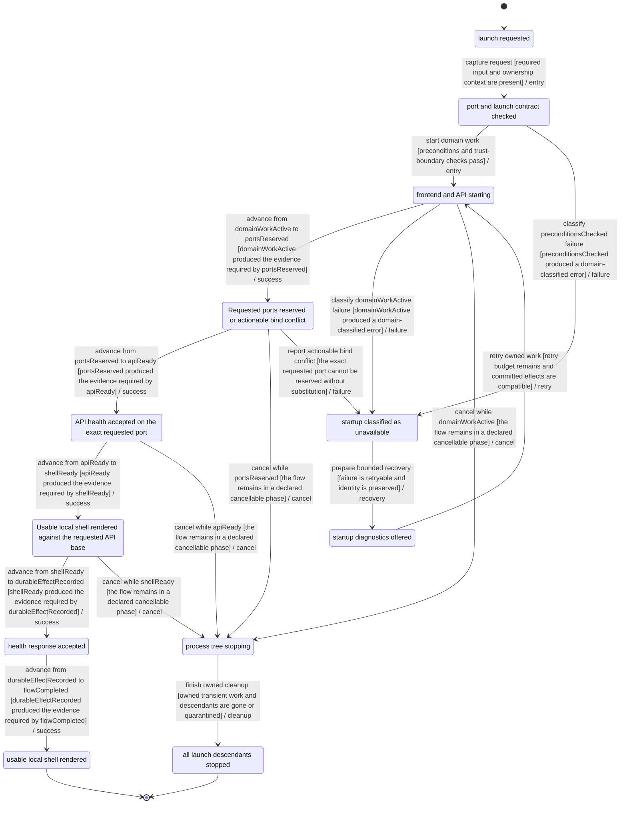
```mermaid
stateDiagram-v2
  state "launch requested" as APP_BOOT_001_REQUESTCAPTURED
  state "port and launch contract checked" as APP_BOOT_001_PRECONDITIONSCHECKED
  state "frontend and API starting" as APP_BOOT_001_DOMAINWORKACTIVE
  state "health response accepted" as APP_BOOT_001_DURABLEEFFECTRECORDED
  state "usable local shell rendered" as APP_BOOT_001_FLOWCOMPLETED
  state "startup classified as unavailable" as APP_BOOT_001_CLASSIFIEDFAILURE
  state "process tree stopping" as APP_BOOT_001_CLEANUPINPROGRESS
  state "all launch descendants stopped" as APP_BOOT_001_CANCELEDCLEAN
  state "startup diagnostics offered" as APP_BOOT_001_RECOVERYCONTEXTREADY
  state "Requested ports reserved or actionable bind conflict" as APP_BOOT_001_PORTSRESERVED
  state "API health accepted on the exact requested port" as APP_BOOT_001_APIREADY
  state "Usable local shell rendered against the requested API base" as APP_BOOT_001_SHELLREADY
  [*] --> APP_BOOT_001_REQUESTCAPTURED
  APP_BOOT_001_REQUESTCAPTURED --> APP_BOOT_001_PRECONDITIONSCHECKED: capture request [required input and ownership context are present] / entry
  APP_BOOT_001_PRECONDITIONSCHECKED --> APP_BOOT_001_DOMAINWORKACTIVE: start domain work [preconditions and trust-boundary checks pass] / entry
  APP_BOOT_001_DOMAINWORKACTIVE --> APP_BOOT_001_PORTSRESERVED: advance from domainWorkActive to portsReserved [domainWorkActive produced the evidence required by portsReserved] / success
  APP_BOOT_001_PORTSRESERVED --> APP_BOOT_001_APIREADY: advance from portsReserved to apiReady [portsReserved produced the evidence required by apiReady] / success
  APP_BOOT_001_APIREADY --> APP_BOOT_001_SHELLREADY: advance from apiReady to shellReady [apiReady produced the evidence required by shellReady] / success
  APP_BOOT_001_SHELLREADY --> APP_BOOT_001_DURABLEEFFECTRECORDED: advance from shellReady to durableEffectRecorded [shellReady produced the evidence required by durableEffectRecorded] / success
  APP_BOOT_001_DURABLEEFFECTRECORDED --> APP_BOOT_001_FLOWCOMPLETED: advance from durableEffectRecorded to flowCompleted [durableEffectRecorded produced the evidence required by flowCompleted] / success
  APP_BOOT_001_PRECONDITIONSCHECKED --> APP_BOOT_001_CLASSIFIEDFAILURE: classify preconditionsChecked failure [preconditionsChecked produced a domain-classified error] / failure
  APP_BOOT_001_DOMAINWORKACTIVE --> APP_BOOT_001_CLASSIFIEDFAILURE: classify domainWorkActive failure [domainWorkActive produced a domain-classified error] / failure
  APP_BOOT_001_CLASSIFIEDFAILURE --> APP_BOOT_001_RECOVERYCONTEXTREADY: prepare bounded recovery [failure is retryable and identity is preserved] / recovery
  APP_BOOT_001_RECOVERYCONTEXTREADY --> APP_BOOT_001_DOMAINWORKACTIVE: retry owned work [retry budget remains and committed effects are compatible] / retry
  APP_BOOT_001_DOMAINWORKACTIVE --> APP_BOOT_001_CLEANUPINPROGRESS: cancel while domainWorkActive [the flow remains in a declared cancellable phase] / cancel
  APP_BOOT_001_PORTSRESERVED --> APP_BOOT_001_CLEANUPINPROGRESS: cancel while portsReserved [the flow remains in a declared cancellable phase] / cancel
  APP_BOOT_001_APIREADY --> APP_BOOT_001_CLEANUPINPROGRESS: cancel while apiReady [the flow remains in a declared cancellable phase] / cancel
  APP_BOOT_001_SHELLREADY --> APP_BOOT_001_CLEANUPINPROGRESS: cancel while shellReady [the flow remains in a declared cancellable phase] / cancel
  APP_BOOT_001_CLEANUPINPROGRESS --> APP_BOOT_001_CANCELEDCLEAN: finish owned cleanup [owned transient work and descendants are gone or quarantined] / cleanup
  APP_BOOT_001_PORTSRESERVED --> APP_BOOT_001_CLASSIFIEDFAILURE: report actionable bind conflict [the exact requested port cannot be reserved without substitution] / failure
  APP_BOOT_001_FLOWCOMPLETED --> [*]
  APP_BOOT_001_CANCELEDCLEAN --> [*]
```
## APP-FIRST-RUN-001 — First-run progressive listen journey

- Primary owner: `experience`
- Architecture family: `guided-journey`
- Shared subgraphs: `classified-failure-retry`, `cancellable-cleanup`
- Secondary owners: none
- Shared concerns: `RECOVERY`, `ACCESSIBILITY`, `PRIVACY`, `I18N`, `OPERATIONAL_STATUS`

### Route ownership

- none

### State contract

| State | Label | Kind | Authority | UI observable |
| --- | --- | --- | --- | --- |
| `APP_FIRST_RUN_001_REQUESTCAPTURED` | first launch detected | `stable` | `frontend` | UI shows first launch detected |
| `APP_FIRST_RUN_001_PRECONDITIONSCHECKED` | first-run memory inspected | `stable` | `backend` | UI shows validation progress for first-run journey |
| `APP_FIRST_RUN_001_DOMAINWORKACTIVE` | sample or intake choice presented | `transient` | `backend` | UI shows sample or intake choice presented |
| `APP_FIRST_RUN_001_DURABLEEFFECTRECORDED` | first source choice recorded | `stable` | `backend` | UI shows committed first-run journey state |
| `APP_FIRST_RUN_001_FLOWCOMPLETED` | first playable prefix reached | `terminal-success` | `shared` | UI shows first playable prefix reached |
| `APP_FIRST_RUN_001_CLASSIFIEDFAILURE` | sample or intake path unavailable | `stable-failure` | `backend` | UI explains sample or intake path unavailable |
| `APP_FIRST_RUN_001_CLEANUPINPROGRESS` | guided journey closing | `transient` | `backend` | UI shows guided journey closing |
| `APP_FIRST_RUN_001_CANCELEDCLEAN` | library remains available | `terminal-canceled` | `shared` | UI shows library remains available |
| `APP_FIRST_RUN_001_RECOVERYCONTEXTREADY` | alternate intake path selected | `stable` | `shared` | UI offers alternate intake path selected |
| `APP_FIRST_RUN_001_FIRSTREADABLE` | First readable content milestone reached | `stable` | `frontend` | First readable content milestone reached; the UI exposes this state or an actionable non-visual status. |
| `APP_FIRST_RUN_001_AUDIOCHOICE` | Generate, change, or skip audio decision visible | `stable` | `frontend` | Generate, change, or skip audio decision visible; the UI exposes this state or an actionable non-visual status. |
| `APP_FIRST_RUN_001_FIRSTPLAYABLE` | First playable audio prefix reached | `stable` | `shared` | First playable audio prefix reached; the UI exposes this state or an actionable non-visual status. |
| `APP_FIRST_RUN_001_AUDIOSKIPPED` | Reading continues explicitly without generated audio | `terminal-success` | `frontend` | Reading continues explicitly without generated audio; the UI exposes this state or an actionable non-visual status. |

### Semantic roles

- `requestCaptured` → `APP_FIRST_RUN_001_REQUESTCAPTURED`
- `preconditionsChecked` → `APP_FIRST_RUN_001_PRECONDITIONSCHECKED`
- `domainWorkActive` → `APP_FIRST_RUN_001_DOMAINWORKACTIVE`
- `durableEffectRecorded` → `APP_FIRST_RUN_001_DURABLEEFFECTRECORDED`
- `flowCompleted` → `APP_FIRST_RUN_001_FLOWCOMPLETED`
- `classifiedFailure` → `APP_FIRST_RUN_001_CLASSIFIEDFAILURE`
- `cleanupInProgress` → `APP_FIRST_RUN_001_CLEANUPINPROGRESS`
- `canceledClean` → `APP_FIRST_RUN_001_CANCELEDCLEAN`
- `recoveryContextReady` → `APP_FIRST_RUN_001_RECOVERYCONTEXTREADY`
- `firstReadable` → `APP_FIRST_RUN_001_FIRSTREADABLE`
- `audioChoice` → `APP_FIRST_RUN_001_AUDIOCHOICE`
- `firstPlayable` → `APP_FIRST_RUN_001_FIRSTPLAYABLE`
- `audioSkipped` → `APP_FIRST_RUN_001_AUDIOSKIPPED`

### Required decisions

- **generate-change-skip** at `APP_FIRST_RUN_001_AUDIOCHOICE`: `generate` → `APP-FIRST-RUN-001:T05:success`, `change` → `APP-FIRST-RUN-001:T07:retry`, `skip` → `APP-FIRST-RUN-001:T06:success`

### Family and flow invariants

- Every guided-journey flow exposes its required roles as canonical states.
- Every guided-journey decision has named outgoing outcomes bound to transition IDs.
- APP-FIRST-RUN-001 commit is not reached until first source choice recorded
- APP-FIRST-RUN-001 cancellation phases equal ordinary cancel-edge sources exactly.

### Transitions

| ID | From | To | Event | Guard | Branch |
| --- | --- | --- | --- | --- | --- |
| `APP-FIRST-RUN-001:T01:entry` | `APP_FIRST_RUN_001_REQUESTCAPTURED` | `APP_FIRST_RUN_001_PRECONDITIONSCHECKED` | record first source choice | a source or explicit skip intent is present | `entry` |
| `APP-FIRST-RUN-001:T02:entry` | `APP_FIRST_RUN_001_PRECONDITIONSCHECKED` | `APP_FIRST_RUN_001_DOMAINWORKACTIVE` | prepare readable content | source safety and parsing preconditions pass | `entry` |
| `APP-FIRST-RUN-001:T03:success` | `APP_FIRST_RUN_001_DOMAINWORKACTIVE` | `APP_FIRST_RUN_001_FIRSTREADABLE` | publish first readable content | a readable prefix is stable without requiring audio | `success` |
| `APP-FIRST-RUN-001:T04:success` | `APP_FIRST_RUN_001_FIRSTREADABLE` | `APP_FIRST_RUN_001_AUDIOCHOICE` | offer audio choice | readable content is visible before audio selection | `success` |
| `APP-FIRST-RUN-001:T05:success` | `APP_FIRST_RUN_001_AUDIOCHOICE` | `APP_FIRST_RUN_001_FIRSTPLAYABLE` | generate first playable prefix | the user requests audio generation | `success` |
| `APP-FIRST-RUN-001:T06:success` | `APP_FIRST_RUN_001_AUDIOCHOICE` | `APP_FIRST_RUN_001_AUDIOSKIPPED` | skip audio and continue reading | the user explicitly chooses reading without audio | `success` |
| `APP-FIRST-RUN-001:T07:retry` | `APP_FIRST_RUN_001_AUDIOCHOICE` | `APP_FIRST_RUN_001_PRECONDITIONSCHECKED` | change source or voice choice | the user revises first-run inputs | `retry` |
| `APP-FIRST-RUN-001:T08:success` | `APP_FIRST_RUN_001_FIRSTPLAYABLE` | `APP_FIRST_RUN_001_DURABLEEFFECTRECORDED` | commit first playable experience | audio locator and readable text share a stable project identity | `success` |
| `APP-FIRST-RUN-001:T09:success` | `APP_FIRST_RUN_001_DURABLEEFFECTRECORDED` | `APP_FIRST_RUN_001_FLOWCOMPLETED` | enter normal workspace | first-run completion is durable and resumable | `success` |
| `APP-FIRST-RUN-001:T10:failure` | `APP_FIRST_RUN_001_PRECONDITIONSCHECKED` | `APP_FIRST_RUN_001_CLASSIFIEDFAILURE` | classify preconditionsChecked failure | preconditionsChecked cannot produce a safe readable milestone | `failure` |
| `APP-FIRST-RUN-001:T11:failure` | `APP_FIRST_RUN_001_DOMAINWORKACTIVE` | `APP_FIRST_RUN_001_CLASSIFIEDFAILURE` | classify domainWorkActive failure | domainWorkActive cannot produce a safe readable milestone | `failure` |
| `APP-FIRST-RUN-001:T12:failure` | `APP_FIRST_RUN_001_FIRSTREADABLE` | `APP_FIRST_RUN_001_CLASSIFIEDFAILURE` | classify firstReadable failure | firstReadable cannot produce a safe readable milestone | `failure` |
| `APP-FIRST-RUN-001:T13:recovery` | `APP_FIRST_RUN_001_CLASSIFIEDFAILURE` | `APP_FIRST_RUN_001_RECOVERYCONTEXTREADY` | offer actionable first-run recovery | source choice and readable progress are preserved | `recovery` |
| `APP-FIRST-RUN-001:T14:retry` | `APP_FIRST_RUN_001_RECOVERYCONTEXTREADY` | `APP_FIRST_RUN_001_PRECONDITIONSCHECKED` | retry first-run preparation | revised input is available | `retry` |
| `APP-FIRST-RUN-001:T15:cancel` | `APP_FIRST_RUN_001_DOMAINWORKACTIVE` | `APP_FIRST_RUN_001_CLEANUPINPROGRESS` | cancel first-run at domainWorkActive | normal-workspace commit has not occurred | `cancel` |
| `APP-FIRST-RUN-001:T16:cancel` | `APP_FIRST_RUN_001_FIRSTREADABLE` | `APP_FIRST_RUN_001_CLEANUPINPROGRESS` | cancel first-run at firstReadable | normal-workspace commit has not occurred | `cancel` |
| `APP-FIRST-RUN-001:T17:cancel` | `APP_FIRST_RUN_001_AUDIOCHOICE` | `APP_FIRST_RUN_001_CLEANUPINPROGRESS` | cancel first-run at audioChoice | normal-workspace commit has not occurred | `cancel` |
| `APP-FIRST-RUN-001:T18:cancel` | `APP_FIRST_RUN_001_FIRSTPLAYABLE` | `APP_FIRST_RUN_001_CLEANUPINPROGRESS` | cancel first-run at firstPlayable | normal-workspace commit has not occurred | `cancel` |
| `APP-FIRST-RUN-001:T19:cleanup` | `APP_FIRST_RUN_001_CLEANUPINPROGRESS` | `APP_FIRST_RUN_001_CANCELEDCLEAN` | clear transient first-run work | temporary work is removed and source choice remains explicit | `cleanup` |

### Evidence

- `frontend/src/features/intake/intakeWizardModel.test.ts` — Executable source anchors only; no transition closure is claimed without a FLOW_ASSERT marker.
  - `blocks missing source inputs with a recovery step` — transitions: none (source anchor only)
  - `keeps existing source reuse ready when the selected source is reusable` — transitions: none (source anchor only)
  - `requires correction for low-confidence detection until the source type is edited` — transitions: none (source anchor only)
  - `routes book-capable sources to book import unless corrected` — transitions: none (source anchor only)

### Planned transition evidence

- `APP-FIRST-RUN-001:T01:entry`, `APP-FIRST-RUN-001:T02:entry`, `APP-FIRST-RUN-001:T03:success`, `APP-FIRST-RUN-001:T04:success`, `APP-FIRST-RUN-001:T05:success`, `APP-FIRST-RUN-001:T06:success`, `APP-FIRST-RUN-001:T07:retry`, `APP-FIRST-RUN-001:T08:success`, `APP-FIRST-RUN-001:T09:success`, `APP-FIRST-RUN-001:T10:failure`, `APP-FIRST-RUN-001:T11:failure`, `APP-FIRST-RUN-001:T12:failure`, `APP-FIRST-RUN-001:T13:recovery`, `APP-FIRST-RUN-001:T14:retry`, `APP-FIRST-RUN-001:T15:cancel`, `APP-FIRST-RUN-001:T16:cancel`, `APP-FIRST-RUN-001:T17:cancel`, `APP-FIRST-RUN-001:T18:cancel`, `APP-FIRST-RUN-001:T19:cleanup` → `BIC-04`; verify with `mise exec -- pnpm --dir frontend exec vitest run frontend/src/features/intake/intakeWizardModel.test.ts` — Owner issue must add transition-specific executable FLOW_ASSERT markers and assertions before closeout.

### Mermaid

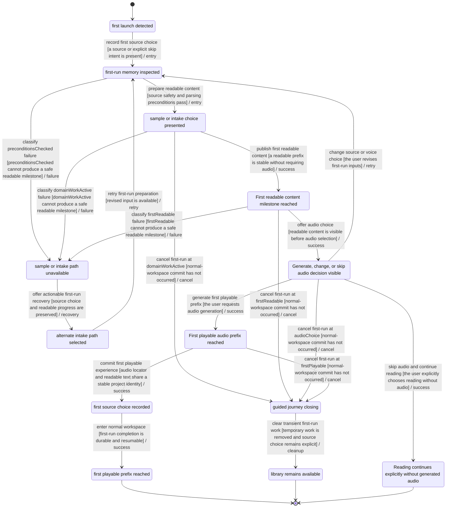
```mermaid
stateDiagram-v2
  state "first launch detected" as APP_FIRST_RUN_001_REQUESTCAPTURED
  state "first-run memory inspected" as APP_FIRST_RUN_001_PRECONDITIONSCHECKED
  state "sample or intake choice presented" as APP_FIRST_RUN_001_DOMAINWORKACTIVE
  state "first source choice recorded" as APP_FIRST_RUN_001_DURABLEEFFECTRECORDED
  state "first playable prefix reached" as APP_FIRST_RUN_001_FLOWCOMPLETED
  state "sample or intake path unavailable" as APP_FIRST_RUN_001_CLASSIFIEDFAILURE
  state "guided journey closing" as APP_FIRST_RUN_001_CLEANUPINPROGRESS
  state "library remains available" as APP_FIRST_RUN_001_CANCELEDCLEAN
  state "alternate intake path selected" as APP_FIRST_RUN_001_RECOVERYCONTEXTREADY
  state "First readable content milestone reached" as APP_FIRST_RUN_001_FIRSTREADABLE
  state "Generate, change, or skip audio decision visible" as APP_FIRST_RUN_001_AUDIOCHOICE
  state "First playable audio prefix reached" as APP_FIRST_RUN_001_FIRSTPLAYABLE
  state "Reading continues explicitly without generated audio" as APP_FIRST_RUN_001_AUDIOSKIPPED
  [*] --> APP_FIRST_RUN_001_REQUESTCAPTURED
  APP_FIRST_RUN_001_REQUESTCAPTURED --> APP_FIRST_RUN_001_PRECONDITIONSCHECKED: record first source choice [a source or explicit skip intent is present] / entry
  APP_FIRST_RUN_001_PRECONDITIONSCHECKED --> APP_FIRST_RUN_001_DOMAINWORKACTIVE: prepare readable content [source safety and parsing preconditions pass] / entry
  APP_FIRST_RUN_001_DOMAINWORKACTIVE --> APP_FIRST_RUN_001_FIRSTREADABLE: publish first readable content [a readable prefix is stable without requiring audio] / success
  APP_FIRST_RUN_001_FIRSTREADABLE --> APP_FIRST_RUN_001_AUDIOCHOICE: offer audio choice [readable content is visible before audio selection] / success
  APP_FIRST_RUN_001_AUDIOCHOICE --> APP_FIRST_RUN_001_FIRSTPLAYABLE: generate first playable prefix [the user requests audio generation] / success
  APP_FIRST_RUN_001_AUDIOCHOICE --> APP_FIRST_RUN_001_AUDIOSKIPPED: skip audio and continue reading [the user explicitly chooses reading without audio] / success
  APP_FIRST_RUN_001_AUDIOCHOICE --> APP_FIRST_RUN_001_PRECONDITIONSCHECKED: change source or voice choice [the user revises first-run inputs] / retry
  APP_FIRST_RUN_001_FIRSTPLAYABLE --> APP_FIRST_RUN_001_DURABLEEFFECTRECORDED: commit first playable experience [audio locator and readable text share a stable project identity] / success
  APP_FIRST_RUN_001_DURABLEEFFECTRECORDED --> APP_FIRST_RUN_001_FLOWCOMPLETED: enter normal workspace [first-run completion is durable and resumable] / success
  APP_FIRST_RUN_001_PRECONDITIONSCHECKED --> APP_FIRST_RUN_001_CLASSIFIEDFAILURE: classify preconditionsChecked failure [preconditionsChecked cannot produce a safe readable milestone] / failure
  APP_FIRST_RUN_001_DOMAINWORKACTIVE --> APP_FIRST_RUN_001_CLASSIFIEDFAILURE: classify domainWorkActive failure [domainWorkActive cannot produce a safe readable milestone] / failure
  APP_FIRST_RUN_001_FIRSTREADABLE --> APP_FIRST_RUN_001_CLASSIFIEDFAILURE: classify firstReadable failure [firstReadable cannot produce a safe readable milestone] / failure
  APP_FIRST_RUN_001_CLASSIFIEDFAILURE --> APP_FIRST_RUN_001_RECOVERYCONTEXTREADY: offer actionable first-run recovery [source choice and readable progress are preserved] / recovery
  APP_FIRST_RUN_001_RECOVERYCONTEXTREADY --> APP_FIRST_RUN_001_PRECONDITIONSCHECKED: retry first-run preparation [revised input is available] / retry
  APP_FIRST_RUN_001_DOMAINWORKACTIVE --> APP_FIRST_RUN_001_CLEANUPINPROGRESS: cancel first-run at domainWorkActive [normal-workspace commit has not occurred] / cancel
  APP_FIRST_RUN_001_FIRSTREADABLE --> APP_FIRST_RUN_001_CLEANUPINPROGRESS: cancel first-run at firstReadable [normal-workspace commit has not occurred] / cancel
  APP_FIRST_RUN_001_AUDIOCHOICE --> APP_FIRST_RUN_001_CLEANUPINPROGRESS: cancel first-run at audioChoice [normal-workspace commit has not occurred] / cancel
  APP_FIRST_RUN_001_FIRSTPLAYABLE --> APP_FIRST_RUN_001_CLEANUPINPROGRESS: cancel first-run at firstPlayable [normal-workspace commit has not occurred] / cancel
  APP_FIRST_RUN_001_CLEANUPINPROGRESS --> APP_FIRST_RUN_001_CANCELEDCLEAN: clear transient first-run work [temporary work is removed and source choice remains explicit] / cleanup
  APP_FIRST_RUN_001_FLOWCOMPLETED --> [*]
  APP_FIRST_RUN_001_CANCELEDCLEAN --> [*]
  APP_FIRST_RUN_001_AUDIOSKIPPED --> [*]
```
## APP-NAV-001 — Navigation and guarded workspace stages

- Primary owner: `experience`
- Architecture family: `guarded-ui-command`
- Shared subgraphs: `classified-failure-retry`, `cancellable-cleanup`
- Secondary owners: none
- Shared concerns: `RECOVERY`, `ACCESSIBILITY`, `I18N`, `OPERATIONAL_STATUS`

### Route ownership

- none

### State contract

| State | Label | Kind | Authority | UI observable |
| --- | --- | --- | --- | --- |
| `APP_NAV_001_REQUESTCAPTURED` | navigation intent received | `stable` | `frontend` | UI shows navigation intent received |
| `APP_NAV_001_PRECONDITIONSCHECKED` | route context resolved | `stable` | `backend` | UI shows validation progress for workspace navigation |
| `APP_NAV_001_DOMAINWORKACTIVE` | target stage loading | `transient` | `backend` | UI shows target stage loading |
| `APP_NAV_001_DURABLEEFFECTRECORDED` | valid target route selected | `stable` | `backend` | UI shows committed workspace navigation state |
| `APP_NAV_001_FLOWCOMPLETED` | target surface focused | `terminal-success` | `shared` | UI shows target surface focused |
| `APP_NAV_001_CLASSIFIEDFAILURE` | stale or blocked context shown | `stable-failure` | `backend` | UI explains stale or blocked context shown |
| `APP_NAV_001_CLEANUPINPROGRESS` | navigation superseded | `transient` | `backend` | UI shows navigation superseded |
| `APP_NAV_001_CANCELEDCLEAN` | prior surface retained | `terminal-canceled` | `shared` | UI shows prior surface retained |
| `APP_NAV_001_RECOVERYCONTEXTREADY` | safe library fallback selected | `stable` | `shared` | UI offers safe library fallback selected |
| `APP_NAV_001_GUARDDECISION` | Navigation or command guard decision evaluated | `stable` | `frontend` | Navigation or command guard decision evaluated; the UI exposes this state or an actionable non-visual status. |
| `APP_NAV_001_FOCUSRESTORED` | Stable focus and route state restored | `stable` | `frontend` | Stable focus and route state restored; the UI exposes this state or an actionable non-visual status. |

### Semantic roles

- `requestCaptured` → `APP_NAV_001_REQUESTCAPTURED`
- `preconditionsChecked` → `APP_NAV_001_PRECONDITIONSCHECKED`
- `domainWorkActive` → `APP_NAV_001_DOMAINWORKACTIVE`
- `durableEffectRecorded` → `APP_NAV_001_DURABLEEFFECTRECORDED`
- `flowCompleted` → `APP_NAV_001_FLOWCOMPLETED`
- `classifiedFailure` → `APP_NAV_001_CLASSIFIEDFAILURE`
- `cleanupInProgress` → `APP_NAV_001_CLEANUPINPROGRESS`
- `canceledClean` → `APP_NAV_001_CANCELEDCLEAN`
- `recoveryContextReady` → `APP_NAV_001_RECOVERYCONTEXTREADY`
- `guardDecision` → `APP_NAV_001_GUARDDECISION`
- `focusRestored` → `APP_NAV_001_FOCUSRESTORED`

### Required decisions

- **guardDecision** at `APP_NAV_001_GUARDDECISION`: `continue` → `APP-NAV-001:T04:success`, `reject` → `APP-NAV-001:T09:failure`, `cancel` → `APP-NAV-001:T13:cancel`

### Family and flow invariants

- Every guarded-ui-command flow exposes its required roles as canonical states.
- Every guarded-ui-command decision has named outgoing outcomes bound to transition IDs.
- APP-NAV-001 commit is not reached until valid target route selected
- APP-NAV-001 cancellation phases equal ordinary cancel-edge sources exactly.
- Frozen BIC-04 planned-evidence ownership is provenance; responsive replacement ownership RSP-12/RSP-13 is planned only and is not covered or implemented.

### Transitions

| ID | From | To | Event | Guard | Branch |
| --- | --- | --- | --- | --- | --- |
| `APP-NAV-001:T01:entry` | `APP_NAV_001_REQUESTCAPTURED` | `APP_NAV_001_PRECONDITIONSCHECKED` | capture request | required input and ownership context are present | `entry` |
| `APP-NAV-001:T02:entry` | `APP_NAV_001_PRECONDITIONSCHECKED` | `APP_NAV_001_DOMAINWORKACTIVE` | start domain work | preconditions and trust-boundary checks pass | `entry` |
| `APP-NAV-001:T03:success` | `APP_NAV_001_DOMAINWORKACTIVE` | `APP_NAV_001_GUARDDECISION` | advance from domainWorkActive to guardDecision | domainWorkActive produced the evidence required by guardDecision | `success` |
| `APP-NAV-001:T04:success` | `APP_NAV_001_GUARDDECISION` | `APP_NAV_001_FOCUSRESTORED` | advance from guardDecision to focusRestored | guardDecision produced the evidence required by focusRestored | `success` |
| `APP-NAV-001:T05:success` | `APP_NAV_001_FOCUSRESTORED` | `APP_NAV_001_DURABLEEFFECTRECORDED` | advance from focusRestored to durableEffectRecorded | focusRestored produced the evidence required by durableEffectRecorded | `success` |
| `APP-NAV-001:T06:success` | `APP_NAV_001_DURABLEEFFECTRECORDED` | `APP_NAV_001_FLOWCOMPLETED` | advance from durableEffectRecorded to flowCompleted | durableEffectRecorded produced the evidence required by flowCompleted | `success` |
| `APP-NAV-001:T07:failure` | `APP_NAV_001_PRECONDITIONSCHECKED` | `APP_NAV_001_CLASSIFIEDFAILURE` | classify preconditionsChecked failure | preconditionsChecked produced a domain-classified error | `failure` |
| `APP-NAV-001:T08:failure` | `APP_NAV_001_DOMAINWORKACTIVE` | `APP_NAV_001_CLASSIFIEDFAILURE` | classify domainWorkActive failure | domainWorkActive produced a domain-classified error | `failure` |
| `APP-NAV-001:T09:failure` | `APP_NAV_001_GUARDDECISION` | `APP_NAV_001_CLASSIFIEDFAILURE` | classify guardDecision failure | guardDecision produced a domain-classified error | `failure` |
| `APP-NAV-001:T10:recovery` | `APP_NAV_001_CLASSIFIEDFAILURE` | `APP_NAV_001_RECOVERYCONTEXTREADY` | prepare bounded recovery | failure is retryable and identity is preserved | `recovery` |
| `APP-NAV-001:T11:retry` | `APP_NAV_001_RECOVERYCONTEXTREADY` | `APP_NAV_001_DOMAINWORKACTIVE` | retry owned work | retry budget remains and committed effects are compatible | `retry` |
| `APP-NAV-001:T12:cancel` | `APP_NAV_001_DOMAINWORKACTIVE` | `APP_NAV_001_CLEANUPINPROGRESS` | cancel while domainWorkActive | the flow remains in a declared cancellable phase | `cancel` |
| `APP-NAV-001:T13:cancel` | `APP_NAV_001_GUARDDECISION` | `APP_NAV_001_CLEANUPINPROGRESS` | cancel while guardDecision | the flow remains in a declared cancellable phase | `cancel` |
| `APP-NAV-001:T14:cancel` | `APP_NAV_001_FOCUSRESTORED` | `APP_NAV_001_CLEANUPINPROGRESS` | cancel while focusRestored | the flow remains in a declared cancellable phase | `cancel` |
| `APP-NAV-001:T15:cleanup` | `APP_NAV_001_CLEANUPINPROGRESS` | `APP_NAV_001_CANCELEDCLEAN` | finish owned cleanup | owned transient work and descendants are gone or quarantined | `cleanup` |

### Evidence

- `frontend/src/features/navigation/model.test.ts` — Executable source anchors only; no transition closure is claimed without a FLOW_ASSERT marker.
  - `treats blocked command availability as disabled with a visible reason` — transitions: none (source anchor only)
  - `generates settings commands from groups, fields, and scopes` — transitions: none (source anchor only)
  - `generates workspace and cinema commands from shared metadata` — transitions: none (source anchor only)

### Planned transition evidence

- `APP-NAV-001:T01:entry`, `APP-NAV-001:T02:entry`, `APP-NAV-001:T03:success`, `APP-NAV-001:T04:success`, `APP-NAV-001:T05:success`, `APP-NAV-001:T06:success`, `APP-NAV-001:T07:failure`, `APP-NAV-001:T08:failure`, `APP-NAV-001:T09:failure`, `APP-NAV-001:T10:recovery`, `APP-NAV-001:T11:retry`, `APP-NAV-001:T12:cancel`, `APP-NAV-001:T13:cancel`, `APP-NAV-001:T14:cancel`, `APP-NAV-001:T15:cleanup` → `BIC-04`; verify with `mise exec -- pnpm --dir frontend exec vitest run frontend/src/features/navigation/model.test.ts` — Owner issue must add transition-specific executable FLOW_ASSERT markers and assertions before closeout.

### Mermaid

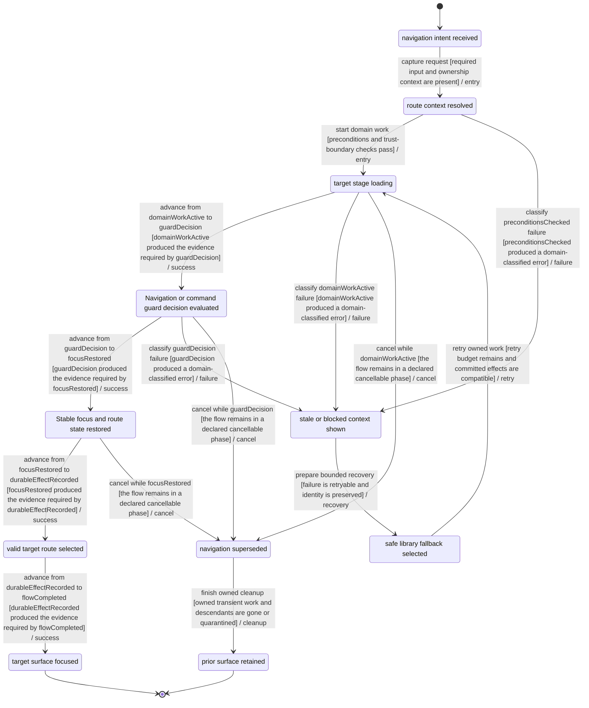
```mermaid
stateDiagram-v2
  state "navigation intent received" as APP_NAV_001_REQUESTCAPTURED
  state "route context resolved" as APP_NAV_001_PRECONDITIONSCHECKED
  state "target stage loading" as APP_NAV_001_DOMAINWORKACTIVE
  state "valid target route selected" as APP_NAV_001_DURABLEEFFECTRECORDED
  state "target surface focused" as APP_NAV_001_FLOWCOMPLETED
  state "stale or blocked context shown" as APP_NAV_001_CLASSIFIEDFAILURE
  state "navigation superseded" as APP_NAV_001_CLEANUPINPROGRESS
  state "prior surface retained" as APP_NAV_001_CANCELEDCLEAN
  state "safe library fallback selected" as APP_NAV_001_RECOVERYCONTEXTREADY
  state "Navigation or command guard decision evaluated" as APP_NAV_001_GUARDDECISION
  state "Stable focus and route state restored" as APP_NAV_001_FOCUSRESTORED
  [*] --> APP_NAV_001_REQUESTCAPTURED
  APP_NAV_001_REQUESTCAPTURED --> APP_NAV_001_PRECONDITIONSCHECKED: capture request [required input and ownership context are present] / entry
  APP_NAV_001_PRECONDITIONSCHECKED --> APP_NAV_001_DOMAINWORKACTIVE: start domain work [preconditions and trust-boundary checks pass] / entry
  APP_NAV_001_DOMAINWORKACTIVE --> APP_NAV_001_GUARDDECISION: advance from domainWorkActive to guardDecision [domainWorkActive produced the evidence required by guardDecision] / success
  APP_NAV_001_GUARDDECISION --> APP_NAV_001_FOCUSRESTORED: advance from guardDecision to focusRestored [guardDecision produced the evidence required by focusRestored] / success
  APP_NAV_001_FOCUSRESTORED --> APP_NAV_001_DURABLEEFFECTRECORDED: advance from focusRestored to durableEffectRecorded [focusRestored produced the evidence required by durableEffectRecorded] / success
  APP_NAV_001_DURABLEEFFECTRECORDED --> APP_NAV_001_FLOWCOMPLETED: advance from durableEffectRecorded to flowCompleted [durableEffectRecorded produced the evidence required by flowCompleted] / success
  APP_NAV_001_PRECONDITIONSCHECKED --> APP_NAV_001_CLASSIFIEDFAILURE: classify preconditionsChecked failure [preconditionsChecked produced a domain-classified error] / failure
  APP_NAV_001_DOMAINWORKACTIVE --> APP_NAV_001_CLASSIFIEDFAILURE: classify domainWorkActive failure [domainWorkActive produced a domain-classified error] / failure
  APP_NAV_001_GUARDDECISION --> APP_NAV_001_CLASSIFIEDFAILURE: classify guardDecision failure [guardDecision produced a domain-classified error] / failure
  APP_NAV_001_CLASSIFIEDFAILURE --> APP_NAV_001_RECOVERYCONTEXTREADY: prepare bounded recovery [failure is retryable and identity is preserved] / recovery
  APP_NAV_001_RECOVERYCONTEXTREADY --> APP_NAV_001_DOMAINWORKACTIVE: retry owned work [retry budget remains and committed effects are compatible] / retry
  APP_NAV_001_DOMAINWORKACTIVE --> APP_NAV_001_CLEANUPINPROGRESS: cancel while domainWorkActive [the flow remains in a declared cancellable phase] / cancel
  APP_NAV_001_GUARDDECISION --> APP_NAV_001_CLEANUPINPROGRESS: cancel while guardDecision [the flow remains in a declared cancellable phase] / cancel
  APP_NAV_001_FOCUSRESTORED --> APP_NAV_001_CLEANUPINPROGRESS: cancel while focusRestored [the flow remains in a declared cancellable phase] / cancel
  APP_NAV_001_CLEANUPINPROGRESS --> APP_NAV_001_CANCELEDCLEAN: finish owned cleanup [owned transient work and descendants are gone or quarantined] / cleanup
  APP_NAV_001_FLOWCOMPLETED --> [*]
  APP_NAV_001_CANCELEDCLEAN --> [*]
```
## APP-COMMAND-001 — Command palette, shortcut, and visible-action parity

- Primary owner: `experience`
- Architecture family: `guarded-ui-command`
- Shared subgraphs: `classified-failure-retry`, `cancellable-cleanup`
- Secondary owners: none
- Shared concerns: `RECOVERY`, `ACCESSIBILITY`, `I18N`, `OPERATIONAL_STATUS`

### Route ownership

- none

### State contract

| State | Label | Kind | Authority | UI observable |
| --- | --- | --- | --- | --- |
| `APP_COMMAND_001_REQUESTCAPTURED` | command intent received | `stable` | `frontend` | UI shows command intent received |
| `APP_COMMAND_001_PRECONDITIONSCHECKED` | command availability evaluated | `stable` | `backend` | UI shows validation progress for command action |
| `APP_COMMAND_001_DOMAINWORKACTIVE` | shared domain action invoked | `transient` | `backend` | UI shows shared domain action invoked |
| `APP_COMMAND_001_DURABLEEFFECTRECORDED` | domain action accepted | `stable` | `backend` | UI shows committed command action state |
| `APP_COMMAND_001_FLOWCOMPLETED` | command result announced | `terminal-success` | `shared` | UI shows command result announced |
| `APP_COMMAND_001_CLASSIFIEDFAILURE` | disabled command reason retained | `stable-failure` | `backend` | UI explains disabled command reason retained |
| `APP_COMMAND_001_CLEANUPINPROGRESS` | command invocation withdrawn | `transient` | `backend` | UI shows command invocation withdrawn |
| `APP_COMMAND_001_CANCELEDCLEAN` | focus restored to invoker | `terminal-canceled` | `shared` | UI shows focus restored to invoker |
| `APP_COMMAND_001_RECOVERYCONTEXTREADY` | valid alternative action offered | `stable` | `shared` | UI offers valid alternative action offered |
| `APP_COMMAND_001_GUARDDECISION` | Navigation or command guard decision evaluated | `stable` | `frontend` | Navigation or command guard decision evaluated; the UI exposes this state or an actionable non-visual status. |
| `APP_COMMAND_001_FOCUSRESTORED` | Stable focus and route state restored | `stable` | `frontend` | Stable focus and route state restored; the UI exposes this state or an actionable non-visual status. |

### Semantic roles

- `requestCaptured` → `APP_COMMAND_001_REQUESTCAPTURED`
- `preconditionsChecked` → `APP_COMMAND_001_PRECONDITIONSCHECKED`
- `domainWorkActive` → `APP_COMMAND_001_DOMAINWORKACTIVE`
- `durableEffectRecorded` → `APP_COMMAND_001_DURABLEEFFECTRECORDED`
- `flowCompleted` → `APP_COMMAND_001_FLOWCOMPLETED`
- `classifiedFailure` → `APP_COMMAND_001_CLASSIFIEDFAILURE`
- `cleanupInProgress` → `APP_COMMAND_001_CLEANUPINPROGRESS`
- `canceledClean` → `APP_COMMAND_001_CANCELEDCLEAN`
- `recoveryContextReady` → `APP_COMMAND_001_RECOVERYCONTEXTREADY`
- `guardDecision` → `APP_COMMAND_001_GUARDDECISION`
- `focusRestored` → `APP_COMMAND_001_FOCUSRESTORED`

### Required decisions

- **guardDecision** at `APP_COMMAND_001_GUARDDECISION`: `continue` → `APP-COMMAND-001:T04:success`, `reject` → `APP-COMMAND-001:T09:failure`, `cancel` → `APP-COMMAND-001:T13:cancel`

### Family and flow invariants

- Every guarded-ui-command flow exposes its required roles as canonical states.
- Every guarded-ui-command decision has named outgoing outcomes bound to transition IDs.
- APP-COMMAND-001 commit is not reached until domain action accepted
- APP-COMMAND-001 cancellation phases equal ordinary cancel-edge sources exactly.

### Transitions

| ID | From | To | Event | Guard | Branch |
| --- | --- | --- | --- | --- | --- |
| `APP-COMMAND-001:T01:entry` | `APP_COMMAND_001_REQUESTCAPTURED` | `APP_COMMAND_001_PRECONDITIONSCHECKED` | capture request | required input and ownership context are present | `entry` |
| `APP-COMMAND-001:T02:entry` | `APP_COMMAND_001_PRECONDITIONSCHECKED` | `APP_COMMAND_001_DOMAINWORKACTIVE` | start domain work | preconditions and trust-boundary checks pass | `entry` |
| `APP-COMMAND-001:T03:success` | `APP_COMMAND_001_DOMAINWORKACTIVE` | `APP_COMMAND_001_GUARDDECISION` | advance from domainWorkActive to guardDecision | domainWorkActive produced the evidence required by guardDecision | `success` |
| `APP-COMMAND-001:T04:success` | `APP_COMMAND_001_GUARDDECISION` | `APP_COMMAND_001_FOCUSRESTORED` | advance from guardDecision to focusRestored | guardDecision produced the evidence required by focusRestored | `success` |
| `APP-COMMAND-001:T05:success` | `APP_COMMAND_001_FOCUSRESTORED` | `APP_COMMAND_001_DURABLEEFFECTRECORDED` | advance from focusRestored to durableEffectRecorded | focusRestored produced the evidence required by durableEffectRecorded | `success` |
| `APP-COMMAND-001:T06:success` | `APP_COMMAND_001_DURABLEEFFECTRECORDED` | `APP_COMMAND_001_FLOWCOMPLETED` | advance from durableEffectRecorded to flowCompleted | durableEffectRecorded produced the evidence required by flowCompleted | `success` |
| `APP-COMMAND-001:T07:failure` | `APP_COMMAND_001_PRECONDITIONSCHECKED` | `APP_COMMAND_001_CLASSIFIEDFAILURE` | classify preconditionsChecked failure | preconditionsChecked produced a domain-classified error | `failure` |
| `APP-COMMAND-001:T08:failure` | `APP_COMMAND_001_DOMAINWORKACTIVE` | `APP_COMMAND_001_CLASSIFIEDFAILURE` | classify domainWorkActive failure | domainWorkActive produced a domain-classified error | `failure` |
| `APP-COMMAND-001:T09:failure` | `APP_COMMAND_001_GUARDDECISION` | `APP_COMMAND_001_CLASSIFIEDFAILURE` | classify guardDecision failure | guardDecision produced a domain-classified error | `failure` |
| `APP-COMMAND-001:T10:recovery` | `APP_COMMAND_001_CLASSIFIEDFAILURE` | `APP_COMMAND_001_RECOVERYCONTEXTREADY` | prepare bounded recovery | failure is retryable and identity is preserved | `recovery` |
| `APP-COMMAND-001:T11:retry` | `APP_COMMAND_001_RECOVERYCONTEXTREADY` | `APP_COMMAND_001_DOMAINWORKACTIVE` | retry owned work | retry budget remains and committed effects are compatible | `retry` |
| `APP-COMMAND-001:T12:cancel` | `APP_COMMAND_001_DOMAINWORKACTIVE` | `APP_COMMAND_001_CLEANUPINPROGRESS` | cancel while domainWorkActive | the flow remains in a declared cancellable phase | `cancel` |
| `APP-COMMAND-001:T13:cancel` | `APP_COMMAND_001_GUARDDECISION` | `APP_COMMAND_001_CLEANUPINPROGRESS` | cancel while guardDecision | the flow remains in a declared cancellable phase | `cancel` |
| `APP-COMMAND-001:T14:cancel` | `APP_COMMAND_001_FOCUSRESTORED` | `APP_COMMAND_001_CLEANUPINPROGRESS` | cancel while focusRestored | the flow remains in a declared cancellable phase | `cancel` |
| `APP-COMMAND-001:T15:cleanup` | `APP_COMMAND_001_CLEANUPINPROGRESS` | `APP_COMMAND_001_CANCELEDCLEAN` | finish owned cleanup | owned transient work and descendants are gone or quarantined | `cleanup` |

### Evidence

- `frontend/src/features/command-palette/commandPaletteHelpers.test.ts` — Executable source anchors only; no transition closure is claimed without a FLOW_ASSERT marker.
  - `exposes Command Center routes and bundle operations` — transitions: none (source anchor only)
  - `exposes temporary source commands with ownership and disabled reasons` — transitions: none (source anchor only)
  - `routes temporary commands through the same handler contract as visible actions` — transitions: none (source anchor only)
  - `hides Quick Listen commands when temporarySources.quickListen is disabled` — transitions: none (source anchor only)
  - `hides Temporary Work management commands when temporarySources.premiumSurfaces is disabled` — transitions: none (source anchor only)
  - `keeps promotion visible but disabled when temporarySources.promotion is disabled` — transitions: none (source anchor only)
  - `labels recent temporary sources and makes them searchable by expert terms` — transitions: none (source anchor only)
  - `exposes settings deep links for temporary source behavior` — transitions: none (source anchor only)

### Planned transition evidence

- `APP-COMMAND-001:T01:entry`, `APP-COMMAND-001:T02:entry`, `APP-COMMAND-001:T03:success`, `APP-COMMAND-001:T04:success`, `APP-COMMAND-001:T05:success`, `APP-COMMAND-001:T06:success`, `APP-COMMAND-001:T07:failure`, `APP-COMMAND-001:T08:failure`, `APP-COMMAND-001:T09:failure`, `APP-COMMAND-001:T10:recovery`, `APP-COMMAND-001:T11:retry`, `APP-COMMAND-001:T12:cancel`, `APP-COMMAND-001:T13:cancel`, `APP-COMMAND-001:T14:cancel`, `APP-COMMAND-001:T15:cleanup` → `BIC-04`; verify with `mise exec -- pnpm --dir frontend exec vitest run frontend/src/features/command-palette/commandPaletteHelpers.test.ts` — Owner issue must add transition-specific executable FLOW_ASSERT markers and assertions before closeout.

### Mermaid

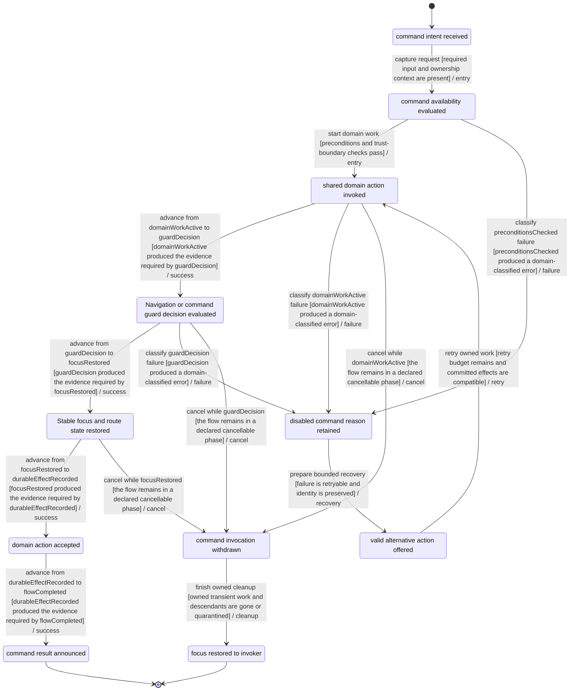
```mermaid
stateDiagram-v2
  state "command intent received" as APP_COMMAND_001_REQUESTCAPTURED
  state "command availability evaluated" as APP_COMMAND_001_PRECONDITIONSCHECKED
  state "shared domain action invoked" as APP_COMMAND_001_DOMAINWORKACTIVE
  state "domain action accepted" as APP_COMMAND_001_DURABLEEFFECTRECORDED
  state "command result announced" as APP_COMMAND_001_FLOWCOMPLETED
  state "disabled command reason retained" as APP_COMMAND_001_CLASSIFIEDFAILURE
  state "command invocation withdrawn" as APP_COMMAND_001_CLEANUPINPROGRESS
  state "focus restored to invoker" as APP_COMMAND_001_CANCELEDCLEAN
  state "valid alternative action offered" as APP_COMMAND_001_RECOVERYCONTEXTREADY
  state "Navigation or command guard decision evaluated" as APP_COMMAND_001_GUARDDECISION
  state "Stable focus and route state restored" as APP_COMMAND_001_FOCUSRESTORED
  [*] --> APP_COMMAND_001_REQUESTCAPTURED
  APP_COMMAND_001_REQUESTCAPTURED --> APP_COMMAND_001_PRECONDITIONSCHECKED: capture request [required input and ownership context are present] / entry
  APP_COMMAND_001_PRECONDITIONSCHECKED --> APP_COMMAND_001_DOMAINWORKACTIVE: start domain work [preconditions and trust-boundary checks pass] / entry
  APP_COMMAND_001_DOMAINWORKACTIVE --> APP_COMMAND_001_GUARDDECISION: advance from domainWorkActive to guardDecision [domainWorkActive produced the evidence required by guardDecision] / success
  APP_COMMAND_001_GUARDDECISION --> APP_COMMAND_001_FOCUSRESTORED: advance from guardDecision to focusRestored [guardDecision produced the evidence required by focusRestored] / success
  APP_COMMAND_001_FOCUSRESTORED --> APP_COMMAND_001_DURABLEEFFECTRECORDED: advance from focusRestored to durableEffectRecorded [focusRestored produced the evidence required by durableEffectRecorded] / success
  APP_COMMAND_001_DURABLEEFFECTRECORDED --> APP_COMMAND_001_FLOWCOMPLETED: advance from durableEffectRecorded to flowCompleted [durableEffectRecorded produced the evidence required by flowCompleted] / success
  APP_COMMAND_001_PRECONDITIONSCHECKED --> APP_COMMAND_001_CLASSIFIEDFAILURE: classify preconditionsChecked failure [preconditionsChecked produced a domain-classified error] / failure
  APP_COMMAND_001_DOMAINWORKACTIVE --> APP_COMMAND_001_CLASSIFIEDFAILURE: classify domainWorkActive failure [domainWorkActive produced a domain-classified error] / failure
  APP_COMMAND_001_GUARDDECISION --> APP_COMMAND_001_CLASSIFIEDFAILURE: classify guardDecision failure [guardDecision produced a domain-classified error] / failure
  APP_COMMAND_001_CLASSIFIEDFAILURE --> APP_COMMAND_001_RECOVERYCONTEXTREADY: prepare bounded recovery [failure is retryable and identity is preserved] / recovery
  APP_COMMAND_001_RECOVERYCONTEXTREADY --> APP_COMMAND_001_DOMAINWORKACTIVE: retry owned work [retry budget remains and committed effects are compatible] / retry
  APP_COMMAND_001_DOMAINWORKACTIVE --> APP_COMMAND_001_CLEANUPINPROGRESS: cancel while domainWorkActive [the flow remains in a declared cancellable phase] / cancel
  APP_COMMAND_001_GUARDDECISION --> APP_COMMAND_001_CLEANUPINPROGRESS: cancel while guardDecision [the flow remains in a declared cancellable phase] / cancel
  APP_COMMAND_001_FOCUSRESTORED --> APP_COMMAND_001_CLEANUPINPROGRESS: cancel while focusRestored [the flow remains in a declared cancellable phase] / cancel
  APP_COMMAND_001_CLEANUPINPROGRESS --> APP_COMMAND_001_CANCELEDCLEAN: finish owned cleanup [owned transient work and descendants are gone or quarantined] / cleanup
  APP_COMMAND_001_FLOWCOMPLETED --> [*]
  APP_COMMAND_001_CANCELEDCLEAN --> [*]
```
## PRJ-LIFE-001 — Project create, list, open, and rename

- Primary owner: `project-data`
- Architecture family: `durable-crud`
- Shared subgraphs: `classified-failure-retry`, `cancellable-cleanup`
- Secondary owners: none
- Shared concerns: `RECOVERY`, `LOCAL_ORIGIN_AUTH`, `FILESYSTEM`, `PRIVACY`, `ACCESSIBILITY`, `OPERATIONAL_STATUS`

### Route ownership

- `GET /api/projects`
- `GET /api/projects/:id/storage`
- `PATCH /api/projects/:id`
- `POST /api/projects`

### State contract

| State | Label | Kind | Authority | UI observable |
| --- | --- | --- | --- | --- |
| `PRJ_LIFE_001_REQUESTCAPTURED` | project create or selection intent | `stable` | `frontend` | UI shows project create or selection intent |
| `PRJ_LIFE_001_PRECONDITIONSCHECKED` | project name and identity checked | `stable` | `backend` | UI shows validation progress for project metadata change |
| `PRJ_LIFE_001_DOMAINWORKACTIVE` | project metadata writing | `transient` | `backend` | UI shows project metadata writing |
| `PRJ_LIFE_001_DURABLEEFFECTRECORDED` | project metadata atomically replaced | `stable` | `backend` | UI shows committed project metadata change state |
| `PRJ_LIFE_001_FLOWCOMPLETED` | durable active project visible | `terminal-success` | `shared` | UI shows durable active project visible |
| `PRJ_LIFE_001_CLASSIFIEDFAILURE` | project validation or write failed | `stable-failure` | `backend` | UI explains project validation or write failed |
| `PRJ_LIFE_001_CLEANUPINPROGRESS` | project edit abandoned | `transient` | `backend` | UI shows project edit abandoned |
| `PRJ_LIFE_001_CANCELEDCLEAN` | prior project selection retained | `terminal-canceled` | `shared` | UI shows prior project selection retained |
| `PRJ_LIFE_001_RECOVERYCONTEXTREADY` | project list reloaded | `stable` | `shared` | UI offers project list reloaded |
| `PRJ_LIFE_001_WRITEPRECONDITIONS` | Write preconditions and revision token checked | `stable` | `backend` | Write preconditions and revision token checked; the UI exposes this state or an actionable non-visual status. |
| `PRJ_LIFE_001_CONFLICTDECISION` | Persist, reload, or reject conflict decision made | `stable` | `shared` | Persist, reload, or reject conflict decision made; the UI exposes this state or an actionable non-visual status. |
| `PRJ_LIFE_001_DURABLEREADBACK` | Committed record read back from durable storage | `stable` | `backend` | Committed record read back from durable storage; the UI exposes this state or an actionable non-visual status. |

### Semantic roles

- `requestCaptured` → `PRJ_LIFE_001_REQUESTCAPTURED`
- `preconditionsChecked` → `PRJ_LIFE_001_PRECONDITIONSCHECKED`
- `domainWorkActive` → `PRJ_LIFE_001_DOMAINWORKACTIVE`
- `durableEffectRecorded` → `PRJ_LIFE_001_DURABLEEFFECTRECORDED`
- `flowCompleted` → `PRJ_LIFE_001_FLOWCOMPLETED`
- `classifiedFailure` → `PRJ_LIFE_001_CLASSIFIEDFAILURE`
- `cleanupInProgress` → `PRJ_LIFE_001_CLEANUPINPROGRESS`
- `canceledClean` → `PRJ_LIFE_001_CANCELEDCLEAN`
- `recoveryContextReady` → `PRJ_LIFE_001_RECOVERYCONTEXTREADY`
- `writePreconditions` → `PRJ_LIFE_001_WRITEPRECONDITIONS`
- `conflictDecision` → `PRJ_LIFE_001_CONFLICTDECISION`
- `durableReadback` → `PRJ_LIFE_001_DURABLEREADBACK`

### Required decisions

- **conflictDecision** at `PRJ_LIFE_001_CONFLICTDECISION`: `continue` → `PRJ-LIFE-001:T05:success`, `reject` → `PRJ-LIFE-001:T10:failure`, `cancel` → `PRJ-LIFE-001:T15:cancel`

### Family and flow invariants

- Every durable-crud flow exposes its required roles as canonical states.
- Every durable-crud decision has named outgoing outcomes bound to transition IDs.
- PRJ-LIFE-001 commit is not reached until project metadata atomically replaced
- PRJ-LIFE-001 cancellation phases equal ordinary cancel-edge sources exactly.

### Transitions

| ID | From | To | Event | Guard | Branch |
| --- | --- | --- | --- | --- | --- |
| `PRJ-LIFE-001:T01:entry` | `PRJ_LIFE_001_REQUESTCAPTURED` | `PRJ_LIFE_001_PRECONDITIONSCHECKED` | capture request | required input and ownership context are present | `entry` |
| `PRJ-LIFE-001:T02:entry` | `PRJ_LIFE_001_PRECONDITIONSCHECKED` | `PRJ_LIFE_001_DOMAINWORKACTIVE` | start domain work | preconditions and trust-boundary checks pass | `entry` |
| `PRJ-LIFE-001:T03:success` | `PRJ_LIFE_001_DOMAINWORKACTIVE` | `PRJ_LIFE_001_WRITEPRECONDITIONS` | advance from domainWorkActive to writePreconditions | domainWorkActive produced the evidence required by writePreconditions | `success` |
| `PRJ-LIFE-001:T04:success` | `PRJ_LIFE_001_WRITEPRECONDITIONS` | `PRJ_LIFE_001_CONFLICTDECISION` | advance from writePreconditions to conflictDecision | writePreconditions produced the evidence required by conflictDecision | `success` |
| `PRJ-LIFE-001:T05:success` | `PRJ_LIFE_001_CONFLICTDECISION` | `PRJ_LIFE_001_DURABLEREADBACK` | advance from conflictDecision to durableReadback | conflictDecision produced the evidence required by durableReadback | `success` |
| `PRJ-LIFE-001:T06:success` | `PRJ_LIFE_001_DURABLEREADBACK` | `PRJ_LIFE_001_DURABLEEFFECTRECORDED` | advance from durableReadback to durableEffectRecorded | durableReadback produced the evidence required by durableEffectRecorded | `success` |
| `PRJ-LIFE-001:T07:success` | `PRJ_LIFE_001_DURABLEEFFECTRECORDED` | `PRJ_LIFE_001_FLOWCOMPLETED` | advance from durableEffectRecorded to flowCompleted | durableEffectRecorded produced the evidence required by flowCompleted | `success` |
| `PRJ-LIFE-001:T08:failure` | `PRJ_LIFE_001_PRECONDITIONSCHECKED` | `PRJ_LIFE_001_CLASSIFIEDFAILURE` | classify preconditionsChecked failure | preconditionsChecked produced a domain-classified error | `failure` |
| `PRJ-LIFE-001:T09:failure` | `PRJ_LIFE_001_DOMAINWORKACTIVE` | `PRJ_LIFE_001_CLASSIFIEDFAILURE` | classify domainWorkActive failure | domainWorkActive produced a domain-classified error | `failure` |
| `PRJ-LIFE-001:T10:failure` | `PRJ_LIFE_001_CONFLICTDECISION` | `PRJ_LIFE_001_CLASSIFIEDFAILURE` | classify conflictDecision failure | conflictDecision produced a domain-classified error | `failure` |
| `PRJ-LIFE-001:T11:recovery` | `PRJ_LIFE_001_CLASSIFIEDFAILURE` | `PRJ_LIFE_001_RECOVERYCONTEXTREADY` | prepare bounded recovery | failure is retryable and identity is preserved | `recovery` |
| `PRJ-LIFE-001:T12:retry` | `PRJ_LIFE_001_RECOVERYCONTEXTREADY` | `PRJ_LIFE_001_DOMAINWORKACTIVE` | retry owned work | retry budget remains and committed effects are compatible | `retry` |
| `PRJ-LIFE-001:T13:cancel` | `PRJ_LIFE_001_DOMAINWORKACTIVE` | `PRJ_LIFE_001_CLEANUPINPROGRESS` | cancel while domainWorkActive | the flow remains in a declared cancellable phase | `cancel` |
| `PRJ-LIFE-001:T14:cancel` | `PRJ_LIFE_001_WRITEPRECONDITIONS` | `PRJ_LIFE_001_CLEANUPINPROGRESS` | cancel while writePreconditions | the flow remains in a declared cancellable phase | `cancel` |
| `PRJ-LIFE-001:T15:cancel` | `PRJ_LIFE_001_CONFLICTDECISION` | `PRJ_LIFE_001_CLEANUPINPROGRESS` | cancel while conflictDecision | the flow remains in a declared cancellable phase | `cancel` |
| `PRJ-LIFE-001:T16:cancel` | `PRJ_LIFE_001_DURABLEREADBACK` | `PRJ_LIFE_001_CLEANUPINPROGRESS` | cancel while durableReadback | the flow remains in a declared cancellable phase | `cancel` |
| `PRJ-LIFE-001:T17:cleanup` | `PRJ_LIFE_001_CLEANUPINPROGRESS` | `PRJ_LIFE_001_CANCELEDCLEAN` | finish owned cleanup | owned transient work and descendants are gone or quarantined | `cleanup` |

### Evidence

- `backend/internal/httpapi/router_test.go` — Executable source anchors only; no transition closure is claimed without a FLOW_ASSERT marker.
  - `TestProjectEndpointsCreateRenameAndListJobs` — transitions: none (source anchor only)

### Planned transition evidence

- `PRJ-LIFE-001:T01:entry`, `PRJ-LIFE-001:T02:entry`, `PRJ-LIFE-001:T03:success`, `PRJ-LIFE-001:T04:success`, `PRJ-LIFE-001:T05:success`, `PRJ-LIFE-001:T06:success`, `PRJ-LIFE-001:T07:success`, `PRJ-LIFE-001:T08:failure`, `PRJ-LIFE-001:T09:failure`, `PRJ-LIFE-001:T10:failure`, `PRJ-LIFE-001:T11:recovery`, `PRJ-LIFE-001:T12:retry`, `PRJ-LIFE-001:T13:cancel`, `PRJ-LIFE-001:T14:cancel`, `PRJ-LIFE-001:T15:cancel`, `PRJ-LIFE-001:T16:cancel`, `PRJ-LIFE-001:T17:cleanup` → `BIC-04`; verify with `cd backend && go test ./...` — Owner issue must add transition-specific executable FLOW_ASSERT markers and assertions before closeout.

### Mermaid

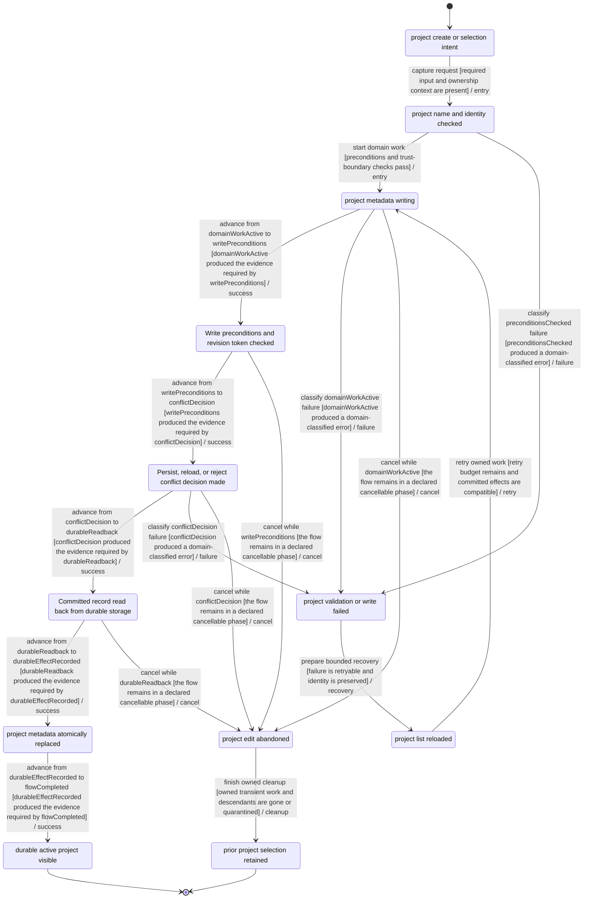
```mermaid
stateDiagram-v2
  state "project create or selection intent" as PRJ_LIFE_001_REQUESTCAPTURED
  state "project name and identity checked" as PRJ_LIFE_001_PRECONDITIONSCHECKED
  state "project metadata writing" as PRJ_LIFE_001_DOMAINWORKACTIVE
  state "project metadata atomically replaced" as PRJ_LIFE_001_DURABLEEFFECTRECORDED
  state "durable active project visible" as PRJ_LIFE_001_FLOWCOMPLETED
  state "project validation or write failed" as PRJ_LIFE_001_CLASSIFIEDFAILURE
  state "project edit abandoned" as PRJ_LIFE_001_CLEANUPINPROGRESS
  state "prior project selection retained" as PRJ_LIFE_001_CANCELEDCLEAN
  state "project list reloaded" as PRJ_LIFE_001_RECOVERYCONTEXTREADY
  state "Write preconditions and revision token checked" as PRJ_LIFE_001_WRITEPRECONDITIONS
  state "Persist, reload, or reject conflict decision made" as PRJ_LIFE_001_CONFLICTDECISION
  state "Committed record read back from durable storage" as PRJ_LIFE_001_DURABLEREADBACK
  [*] --> PRJ_LIFE_001_REQUESTCAPTURED
  PRJ_LIFE_001_REQUESTCAPTURED --> PRJ_LIFE_001_PRECONDITIONSCHECKED: capture request [required input and ownership context are present] / entry
  PRJ_LIFE_001_PRECONDITIONSCHECKED --> PRJ_LIFE_001_DOMAINWORKACTIVE: start domain work [preconditions and trust-boundary checks pass] / entry
  PRJ_LIFE_001_DOMAINWORKACTIVE --> PRJ_LIFE_001_WRITEPRECONDITIONS: advance from domainWorkActive to writePreconditions [domainWorkActive produced the evidence required by writePreconditions] / success
  PRJ_LIFE_001_WRITEPRECONDITIONS --> PRJ_LIFE_001_CONFLICTDECISION: advance from writePreconditions to conflictDecision [writePreconditions produced the evidence required by conflictDecision] / success
  PRJ_LIFE_001_CONFLICTDECISION --> PRJ_LIFE_001_DURABLEREADBACK: advance from conflictDecision to durableReadback [conflictDecision produced the evidence required by durableReadback] / success
  PRJ_LIFE_001_DURABLEREADBACK --> PRJ_LIFE_001_DURABLEEFFECTRECORDED: advance from durableReadback to durableEffectRecorded [durableReadback produced the evidence required by durableEffectRecorded] / success
  PRJ_LIFE_001_DURABLEEFFECTRECORDED --> PRJ_LIFE_001_FLOWCOMPLETED: advance from durableEffectRecorded to flowCompleted [durableEffectRecorded produced the evidence required by flowCompleted] / success
  PRJ_LIFE_001_PRECONDITIONSCHECKED --> PRJ_LIFE_001_CLASSIFIEDFAILURE: classify preconditionsChecked failure [preconditionsChecked produced a domain-classified error] / failure
  PRJ_LIFE_001_DOMAINWORKACTIVE --> PRJ_LIFE_001_CLASSIFIEDFAILURE: classify domainWorkActive failure [domainWorkActive produced a domain-classified error] / failure
  PRJ_LIFE_001_CONFLICTDECISION --> PRJ_LIFE_001_CLASSIFIEDFAILURE: classify conflictDecision failure [conflictDecision produced a domain-classified error] / failure
  PRJ_LIFE_001_CLASSIFIEDFAILURE --> PRJ_LIFE_001_RECOVERYCONTEXTREADY: prepare bounded recovery [failure is retryable and identity is preserved] / recovery
  PRJ_LIFE_001_RECOVERYCONTEXTREADY --> PRJ_LIFE_001_DOMAINWORKACTIVE: retry owned work [retry budget remains and committed effects are compatible] / retry
  PRJ_LIFE_001_DOMAINWORKACTIVE --> PRJ_LIFE_001_CLEANUPINPROGRESS: cancel while domainWorkActive [the flow remains in a declared cancellable phase] / cancel
  PRJ_LIFE_001_WRITEPRECONDITIONS --> PRJ_LIFE_001_CLEANUPINPROGRESS: cancel while writePreconditions [the flow remains in a declared cancellable phase] / cancel
  PRJ_LIFE_001_CONFLICTDECISION --> PRJ_LIFE_001_CLEANUPINPROGRESS: cancel while conflictDecision [the flow remains in a declared cancellable phase] / cancel
  PRJ_LIFE_001_DURABLEREADBACK --> PRJ_LIFE_001_CLEANUPINPROGRESS: cancel while durableReadback [the flow remains in a declared cancellable phase] / cancel
  PRJ_LIFE_001_CLEANUPINPROGRESS --> PRJ_LIFE_001_CANCELEDCLEAN: finish owned cleanup [owned transient work and descendants are gone or quarantined] / cleanup
  PRJ_LIFE_001_FLOWCOMPLETED --> [*]
  PRJ_LIFE_001_CANCELEDCLEAN --> [*]
```
## PRJ-DELETE-001 — Project destructive delete with explicit restore path

- Primary owner: `project-data`
- Architecture family: `destructive-reset`
- Shared subgraphs: `classified-failure-retry`, `cancellable-cleanup`
- Secondary owners: `runtime-platform`
- Shared concerns: `RECOVERY`, `LOCAL_ORIGIN_AUTH`, `FILESYSTEM`, `PRIVACY`, `ACCESSIBILITY`, `OPERATIONAL_STATUS`

### Route ownership

- `DELETE /api/projects/:id`

### State contract

| State | Label | Kind | Authority | UI observable |
| --- | --- | --- | --- | --- |
| `PRJ_DELETE_001_REQUESTCAPTURED` | confirmed project delete requested | `stable` | `frontend` | UI shows confirmed project delete requested |
| `PRJ_DELETE_001_PRECONDITIONSCHECKED` | delete target and confirmation checked | `stable` | `backend` | UI shows validation progress for project deletion |
| `PRJ_DELETE_001_DOMAINWORKACTIVE` | project tree quarantining | `transient` | `backend` | UI shows project tree quarantining |
| `PRJ_DELETE_001_DURABLEEFFECTRECORDED` | project tree removed from active index | `stable` | `backend` | UI shows committed project deletion state |
| `PRJ_DELETE_001_FLOWCOMPLETED` | deleted project absent from library | `terminal-success` | `shared` | UI shows deleted project absent from library |
| `PRJ_DELETE_001_CLASSIFIEDFAILURE` | project deletion partially failed | `stable-failure` | `backend` | UI explains project deletion partially failed |
| `PRJ_DELETE_001_CLEANUPINPROGRESS` | pre-delete removal stopping | `transient` | `backend` | UI shows pre-delete removal stopping |
| `PRJ_DELETE_001_CANCELEDCLEAN` | active project remains unchanged | `terminal-canceled` | `shared` | UI shows active project remains unchanged |
| `PRJ_DELETE_001_RECOVERYCONTEXTREADY` | bundle restore or cleanup guidance offered | `stable` | `shared` | UI offers bundle restore or cleanup guidance offered |
| `PRJ_DELETE_001_CONFIRMATIONDECISION` | Destructive intent confirmed or declined | `stable` | `frontend` | Destructive intent confirmed or declined; the UI exposes this state or an actionable non-visual status. |
| `PRJ_DELETE_001_DEPENDENTCLEANUP` | Owned dependent artifacts reconciled | `transient` | `backend` | Owned dependent artifacts reconciled; the UI exposes this state or an actionable non-visual status. |

### Semantic roles

- `requestCaptured` → `PRJ_DELETE_001_REQUESTCAPTURED`
- `preconditionsChecked` → `PRJ_DELETE_001_PRECONDITIONSCHECKED`
- `domainWorkActive` → `PRJ_DELETE_001_DOMAINWORKACTIVE`
- `durableEffectRecorded` → `PRJ_DELETE_001_DURABLEEFFECTRECORDED`
- `flowCompleted` → `PRJ_DELETE_001_FLOWCOMPLETED`
- `classifiedFailure` → `PRJ_DELETE_001_CLASSIFIEDFAILURE`
- `cleanupInProgress` → `PRJ_DELETE_001_CLEANUPINPROGRESS`
- `canceledClean` → `PRJ_DELETE_001_CANCELEDCLEAN`
- `recoveryContextReady` → `PRJ_DELETE_001_RECOVERYCONTEXTREADY`
- `confirmationDecision` → `PRJ_DELETE_001_CONFIRMATIONDECISION`
- `dependentCleanup` → `PRJ_DELETE_001_DEPENDENTCLEANUP`

### Required decisions

- **confirmationDecision** at `PRJ_DELETE_001_CONFIRMATIONDECISION`: `continue` → `PRJ-DELETE-001:T04:success`, `reject` → `PRJ-DELETE-001:T09:failure`, `cancel` → `PRJ-DELETE-001:T13:cancel`

### Family and flow invariants

- Every destructive-reset flow exposes its required roles as canonical states.
- Every destructive-reset decision has named outgoing outcomes bound to transition IDs.
- PRJ-DELETE-001 commit is not reached until project tree removed from active index
- PRJ-DELETE-001 cancellation phases equal ordinary cancel-edge sources exactly.

### Transitions

| ID | From | To | Event | Guard | Branch |
| --- | --- | --- | --- | --- | --- |
| `PRJ-DELETE-001:T01:entry` | `PRJ_DELETE_001_REQUESTCAPTURED` | `PRJ_DELETE_001_PRECONDITIONSCHECKED` | capture request | required input and ownership context are present | `entry` |
| `PRJ-DELETE-001:T02:entry` | `PRJ_DELETE_001_PRECONDITIONSCHECKED` | `PRJ_DELETE_001_DOMAINWORKACTIVE` | start domain work | preconditions and trust-boundary checks pass | `entry` |
| `PRJ-DELETE-001:T03:success` | `PRJ_DELETE_001_DOMAINWORKACTIVE` | `PRJ_DELETE_001_CONFIRMATIONDECISION` | advance from domainWorkActive to confirmationDecision | domainWorkActive produced the evidence required by confirmationDecision | `success` |
| `PRJ-DELETE-001:T04:success` | `PRJ_DELETE_001_CONFIRMATIONDECISION` | `PRJ_DELETE_001_DEPENDENTCLEANUP` | advance from confirmationDecision to dependentCleanup | confirmationDecision produced the evidence required by dependentCleanup | `success` |
| `PRJ-DELETE-001:T05:success` | `PRJ_DELETE_001_DEPENDENTCLEANUP` | `PRJ_DELETE_001_DURABLEEFFECTRECORDED` | advance from dependentCleanup to durableEffectRecorded | dependentCleanup produced the evidence required by durableEffectRecorded | `success` |
| `PRJ-DELETE-001:T06:success` | `PRJ_DELETE_001_DURABLEEFFECTRECORDED` | `PRJ_DELETE_001_FLOWCOMPLETED` | advance from durableEffectRecorded to flowCompleted | durableEffectRecorded produced the evidence required by flowCompleted | `success` |
| `PRJ-DELETE-001:T07:failure` | `PRJ_DELETE_001_PRECONDITIONSCHECKED` | `PRJ_DELETE_001_CLASSIFIEDFAILURE` | classify preconditionsChecked failure | preconditionsChecked produced a domain-classified error | `failure` |
| `PRJ-DELETE-001:T08:failure` | `PRJ_DELETE_001_DOMAINWORKACTIVE` | `PRJ_DELETE_001_CLASSIFIEDFAILURE` | classify domainWorkActive failure | domainWorkActive produced a domain-classified error | `failure` |
| `PRJ-DELETE-001:T09:failure` | `PRJ_DELETE_001_CONFIRMATIONDECISION` | `PRJ_DELETE_001_CLASSIFIEDFAILURE` | classify confirmationDecision failure | confirmationDecision produced a domain-classified error | `failure` |
| `PRJ-DELETE-001:T10:recovery` | `PRJ_DELETE_001_CLASSIFIEDFAILURE` | `PRJ_DELETE_001_RECOVERYCONTEXTREADY` | prepare bounded recovery | failure is retryable and identity is preserved | `recovery` |
| `PRJ-DELETE-001:T11:retry` | `PRJ_DELETE_001_RECOVERYCONTEXTREADY` | `PRJ_DELETE_001_DOMAINWORKACTIVE` | retry owned work | retry budget remains and committed effects are compatible | `retry` |
| `PRJ-DELETE-001:T12:cancel` | `PRJ_DELETE_001_DOMAINWORKACTIVE` | `PRJ_DELETE_001_CLEANUPINPROGRESS` | cancel while domainWorkActive | the flow remains in a declared cancellable phase | `cancel` |
| `PRJ-DELETE-001:T13:cancel` | `PRJ_DELETE_001_CONFIRMATIONDECISION` | `PRJ_DELETE_001_CLEANUPINPROGRESS` | cancel while confirmationDecision | the flow remains in a declared cancellable phase | `cancel` |
| `PRJ-DELETE-001:T14:cancel` | `PRJ_DELETE_001_DEPENDENTCLEANUP` | `PRJ_DELETE_001_CLEANUPINPROGRESS` | cancel while dependentCleanup | the flow remains in a declared cancellable phase | `cancel` |
| `PRJ-DELETE-001:T15:cleanup` | `PRJ_DELETE_001_CLEANUPINPROGRESS` | `PRJ_DELETE_001_CANCELEDCLEAN` | finish owned cleanup | owned transient work and descendants are gone or quarantined | `cleanup` |

### Evidence

- `backend/internal/httpapi/router_test.go` — Executable source anchors only; no transition closure is claimed without a FLOW_ASSERT marker.
  - `TestDeleteVoiceJobEndpoint` — transitions: none (source anchor only)
  - `TestDeleteVoiceJobEndpointRejectsActiveJob` — transitions: none (source anchor only)
  - `TestProjectEndpointsCreateRenameAndListJobs` — transitions: none (source anchor only)
  - `TestAssetEndpointsRenameAndDelete` — transitions: none (source anchor only)

### Planned transition evidence

- `PRJ-DELETE-001:T01:entry`, `PRJ-DELETE-001:T02:entry`, `PRJ-DELETE-001:T03:success`, `PRJ-DELETE-001:T04:success`, `PRJ-DELETE-001:T05:success`, `PRJ-DELETE-001:T06:success`, `PRJ-DELETE-001:T07:failure`, `PRJ-DELETE-001:T08:failure`, `PRJ-DELETE-001:T09:failure`, `PRJ-DELETE-001:T10:recovery`, `PRJ-DELETE-001:T11:retry`, `PRJ-DELETE-001:T12:cancel`, `PRJ-DELETE-001:T13:cancel`, `PRJ-DELETE-001:T14:cancel`, `PRJ-DELETE-001:T15:cleanup` → `BIC-04`; verify with `cd backend && go test ./...` — Owner issue must add transition-specific executable FLOW_ASSERT markers and assertions before closeout.

### Mermaid

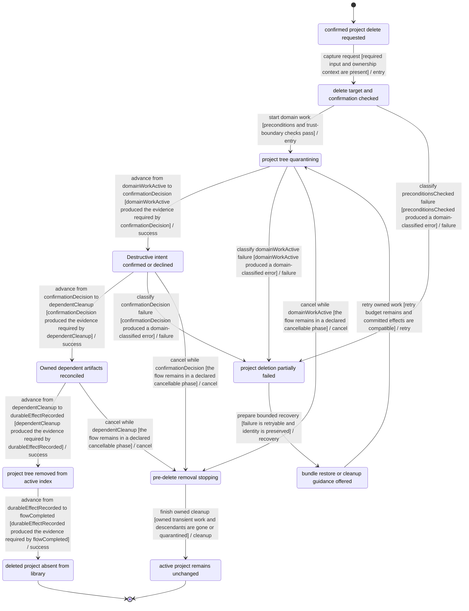
```mermaid
stateDiagram-v2
  state "confirmed project delete requested" as PRJ_DELETE_001_REQUESTCAPTURED
  state "delete target and confirmation checked" as PRJ_DELETE_001_PRECONDITIONSCHECKED
  state "project tree quarantining" as PRJ_DELETE_001_DOMAINWORKACTIVE
  state "project tree removed from active index" as PRJ_DELETE_001_DURABLEEFFECTRECORDED
  state "deleted project absent from library" as PRJ_DELETE_001_FLOWCOMPLETED
  state "project deletion partially failed" as PRJ_DELETE_001_CLASSIFIEDFAILURE
  state "pre-delete removal stopping" as PRJ_DELETE_001_CLEANUPINPROGRESS
  state "active project remains unchanged" as PRJ_DELETE_001_CANCELEDCLEAN
  state "bundle restore or cleanup guidance offered" as PRJ_DELETE_001_RECOVERYCONTEXTREADY
  state "Destructive intent confirmed or declined" as PRJ_DELETE_001_CONFIRMATIONDECISION
  state "Owned dependent artifacts reconciled" as PRJ_DELETE_001_DEPENDENTCLEANUP
  [*] --> PRJ_DELETE_001_REQUESTCAPTURED
  PRJ_DELETE_001_REQUESTCAPTURED --> PRJ_DELETE_001_PRECONDITIONSCHECKED: capture request [required input and ownership context are present] / entry
  PRJ_DELETE_001_PRECONDITIONSCHECKED --> PRJ_DELETE_001_DOMAINWORKACTIVE: start domain work [preconditions and trust-boundary checks pass] / entry
  PRJ_DELETE_001_DOMAINWORKACTIVE --> PRJ_DELETE_001_CONFIRMATIONDECISION: advance from domainWorkActive to confirmationDecision [domainWorkActive produced the evidence required by confirmationDecision] / success
  PRJ_DELETE_001_CONFIRMATIONDECISION --> PRJ_DELETE_001_DEPENDENTCLEANUP: advance from confirmationDecision to dependentCleanup [confirmationDecision produced the evidence required by dependentCleanup] / success
  PRJ_DELETE_001_DEPENDENTCLEANUP --> PRJ_DELETE_001_DURABLEEFFECTRECORDED: advance from dependentCleanup to durableEffectRecorded [dependentCleanup produced the evidence required by durableEffectRecorded] / success
  PRJ_DELETE_001_DURABLEEFFECTRECORDED --> PRJ_DELETE_001_FLOWCOMPLETED: advance from durableEffectRecorded to flowCompleted [durableEffectRecorded produced the evidence required by flowCompleted] / success
  PRJ_DELETE_001_PRECONDITIONSCHECKED --> PRJ_DELETE_001_CLASSIFIEDFAILURE: classify preconditionsChecked failure [preconditionsChecked produced a domain-classified error] / failure
  PRJ_DELETE_001_DOMAINWORKACTIVE --> PRJ_DELETE_001_CLASSIFIEDFAILURE: classify domainWorkActive failure [domainWorkActive produced a domain-classified error] / failure
  PRJ_DELETE_001_CONFIRMATIONDECISION --> PRJ_DELETE_001_CLASSIFIEDFAILURE: classify confirmationDecision failure [confirmationDecision produced a domain-classified error] / failure
  PRJ_DELETE_001_CLASSIFIEDFAILURE --> PRJ_DELETE_001_RECOVERYCONTEXTREADY: prepare bounded recovery [failure is retryable and identity is preserved] / recovery
  PRJ_DELETE_001_RECOVERYCONTEXTREADY --> PRJ_DELETE_001_DOMAINWORKACTIVE: retry owned work [retry budget remains and committed effects are compatible] / retry
  PRJ_DELETE_001_DOMAINWORKACTIVE --> PRJ_DELETE_001_CLEANUPINPROGRESS: cancel while domainWorkActive [the flow remains in a declared cancellable phase] / cancel
  PRJ_DELETE_001_CONFIRMATIONDECISION --> PRJ_DELETE_001_CLEANUPINPROGRESS: cancel while confirmationDecision [the flow remains in a declared cancellable phase] / cancel
  PRJ_DELETE_001_DEPENDENTCLEANUP --> PRJ_DELETE_001_CLEANUPINPROGRESS: cancel while dependentCleanup [the flow remains in a declared cancellable phase] / cancel
  PRJ_DELETE_001_CLEANUPINPROGRESS --> PRJ_DELETE_001_CANCELEDCLEAN: finish owned cleanup [owned transient work and descendants are gone or quarantined] / cleanup
  PRJ_DELETE_001_FLOWCOMPLETED --> [*]
  PRJ_DELETE_001_CANCELEDCLEAN --> [*]
```
## SRC-DURABLE-001 — Durable file, paste, and document intake

- Primary owner: `source-data`
- Architecture family: `source-ingestion`
- Shared subgraphs: `classified-failure-retry`, `cancellable-cleanup`
- Secondary owners: none
- Shared concerns: `RECOVERY`, `LOCAL_ORIGIN_AUTH`, `FILESYSTEM`, `SUBPROCESS`, `PRIVACY`, `I18N`, `ACCESSIBILITY`, `OPERATIONAL_STATUS`

### Route ownership

- `DELETE /api/book-sources/:id`
- `DELETE /api/source-preps/:id`
- `GET /api/book-sources/:id`
- `GET /api/content-ir/:id`
- `GET /api/projects/:id/book-sources`
- `GET /api/projects/:id/source-preps`
- `GET /api/source-preps/:id`
- `GET /api/source-preps/:id/blocks/:blockId`
- `PATCH /api/book-sources/:id`
- `PATCH /api/source-preps/:id`
- `POST /api/projects/:id/book-sources`
- `POST /api/projects/:id/source-preps`
- `POST /api/source-preps/:id/transcript`

### State contract

| State | Label | Kind | Authority | UI observable |
| --- | --- | --- | --- | --- |
| `SRC_DURABLE_001_REQUESTCAPTURED` | durable source submitted | `stable` | `frontend` | UI shows durable source submitted |
| `SRC_DURABLE_001_PRECONDITIONSCHECKED` | media type and size checked | `stable` | `backend` | UI shows validation progress for durable source import |
| `SRC_DURABLE_001_DOMAINWORKACTIVE` | source extraction and normalization running | `transient` | `backend` | UI shows source extraction and normalization running |
| `SRC_DURABLE_001_DURABLEEFFECTRECORDED` | source revision and content IR written | `stable` | `backend` | UI shows committed durable source import state |
| `SRC_DURABLE_001_FLOWCOMPLETED` | reviewable durable source visible | `terminal-success` | `shared` | UI shows reviewable durable source visible |
| `SRC_DURABLE_001_CLASSIFIEDFAILURE` | source extraction classified as failed | `stable-failure` | `backend` | UI explains source extraction classified as failed |
| `SRC_DURABLE_001_CLEANUPINPROGRESS` | extractor process stopping | `transient` | `backend` | UI shows extractor process stopping |
| `SRC_DURABLE_001_CANCELEDCLEAN` | uncommitted source files removed | `terminal-canceled` | `shared` | UI shows uncommitted source files removed |
| `SRC_DURABLE_001_RECOVERYCONTEXTREADY` | repair or supported re-import offered | `stable` | `shared` | UI offers repair or supported re-import offered |
| `SRC_DURABLE_001_BYTESCAPTURED` | Source bytes or reference captured durably | `stable` | `backend` | Source bytes or reference captured durably; the UI exposes this state or an actionable non-visual status. |
| `SRC_DURABLE_001_READABLEPREFIX` | Readable prefix and provenance available | `stable` | `shared` | Readable prefix and provenance available; the UI exposes this state or an actionable non-visual status. |
| `SRC_DURABLE_001_SAFETYDECISION` | Source safety and promotion policy decided | `stable` | `shared` | Source safety and promotion policy decided; the UI exposes this state or an actionable non-visual status. |

### Semantic roles

- `requestCaptured` → `SRC_DURABLE_001_REQUESTCAPTURED`
- `preconditionsChecked` → `SRC_DURABLE_001_PRECONDITIONSCHECKED`
- `domainWorkActive` → `SRC_DURABLE_001_DOMAINWORKACTIVE`
- `durableEffectRecorded` → `SRC_DURABLE_001_DURABLEEFFECTRECORDED`
- `flowCompleted` → `SRC_DURABLE_001_FLOWCOMPLETED`
- `classifiedFailure` → `SRC_DURABLE_001_CLASSIFIEDFAILURE`
- `cleanupInProgress` → `SRC_DURABLE_001_CLEANUPINPROGRESS`
- `canceledClean` → `SRC_DURABLE_001_CANCELEDCLEAN`
- `recoveryContextReady` → `SRC_DURABLE_001_RECOVERYCONTEXTREADY`
- `bytesCaptured` → `SRC_DURABLE_001_BYTESCAPTURED`
- `readablePrefix` → `SRC_DURABLE_001_READABLEPREFIX`
- `safetyDecision` → `SRC_DURABLE_001_SAFETYDECISION`

### Required decisions

- **safetyDecision** at `SRC_DURABLE_001_SAFETYDECISION`: `continue` → `SRC-DURABLE-001:T06:success`, `reject` → `SRC-DURABLE-001:T10:failure`, `cancel` → `SRC-DURABLE-001:T16:cancel`

### Family and flow invariants

- Every source-ingestion flow exposes its required roles as canonical states.
- Every source-ingestion decision has named outgoing outcomes bound to transition IDs.
- SRC-DURABLE-001 commit is not reached until source revision and content IR written
- SRC-DURABLE-001 cancellation phases equal ordinary cancel-edge sources exactly.
- Frozen BIC-05 planned-evidence ownership is provenance; responsive replacement ownership RSP-02/RSP-03 is planned only and is not covered or implemented.

### Transitions

| ID | From | To | Event | Guard | Branch |
| --- | --- | --- | --- | --- | --- |
| `SRC-DURABLE-001:T01:entry` | `SRC_DURABLE_001_REQUESTCAPTURED` | `SRC_DURABLE_001_PRECONDITIONSCHECKED` | capture request | required input and ownership context are present | `entry` |
| `SRC-DURABLE-001:T02:entry` | `SRC_DURABLE_001_PRECONDITIONSCHECKED` | `SRC_DURABLE_001_DOMAINWORKACTIVE` | start domain work | preconditions and trust-boundary checks pass | `entry` |
| `SRC-DURABLE-001:T03:success` | `SRC_DURABLE_001_DOMAINWORKACTIVE` | `SRC_DURABLE_001_BYTESCAPTURED` | advance from domainWorkActive to bytesCaptured | domainWorkActive produced the evidence required by bytesCaptured | `success` |
| `SRC-DURABLE-001:T04:success` | `SRC_DURABLE_001_BYTESCAPTURED` | `SRC_DURABLE_001_READABLEPREFIX` | advance from bytesCaptured to readablePrefix | bytesCaptured produced the evidence required by readablePrefix | `success` |
| `SRC-DURABLE-001:T05:success` | `SRC_DURABLE_001_READABLEPREFIX` | `SRC_DURABLE_001_SAFETYDECISION` | advance from readablePrefix to safetyDecision | readablePrefix produced the evidence required by safetyDecision | `success` |
| `SRC-DURABLE-001:T06:success` | `SRC_DURABLE_001_SAFETYDECISION` | `SRC_DURABLE_001_DURABLEEFFECTRECORDED` | advance from safetyDecision to durableEffectRecorded | safetyDecision produced the evidence required by durableEffectRecorded | `success` |
| `SRC-DURABLE-001:T07:success` | `SRC_DURABLE_001_DURABLEEFFECTRECORDED` | `SRC_DURABLE_001_FLOWCOMPLETED` | advance from durableEffectRecorded to flowCompleted | durableEffectRecorded produced the evidence required by flowCompleted | `success` |
| `SRC-DURABLE-001:T08:failure` | `SRC_DURABLE_001_PRECONDITIONSCHECKED` | `SRC_DURABLE_001_CLASSIFIEDFAILURE` | classify preconditionsChecked failure | preconditionsChecked produced a domain-classified error | `failure` |
| `SRC-DURABLE-001:T09:failure` | `SRC_DURABLE_001_DOMAINWORKACTIVE` | `SRC_DURABLE_001_CLASSIFIEDFAILURE` | classify domainWorkActive failure | domainWorkActive produced a domain-classified error | `failure` |
| `SRC-DURABLE-001:T10:failure` | `SRC_DURABLE_001_SAFETYDECISION` | `SRC_DURABLE_001_CLASSIFIEDFAILURE` | classify safetyDecision failure | safetyDecision produced a domain-classified error | `failure` |
| `SRC-DURABLE-001:T11:recovery` | `SRC_DURABLE_001_CLASSIFIEDFAILURE` | `SRC_DURABLE_001_RECOVERYCONTEXTREADY` | prepare bounded recovery | failure is retryable and identity is preserved | `recovery` |
| `SRC-DURABLE-001:T12:retry` | `SRC_DURABLE_001_RECOVERYCONTEXTREADY` | `SRC_DURABLE_001_DOMAINWORKACTIVE` | retry owned work | retry budget remains and committed effects are compatible | `retry` |
| `SRC-DURABLE-001:T13:cancel` | `SRC_DURABLE_001_DOMAINWORKACTIVE` | `SRC_DURABLE_001_CLEANUPINPROGRESS` | cancel while domainWorkActive | the flow remains in a declared cancellable phase | `cancel` |
| `SRC-DURABLE-001:T14:cancel` | `SRC_DURABLE_001_BYTESCAPTURED` | `SRC_DURABLE_001_CLEANUPINPROGRESS` | cancel while bytesCaptured | the flow remains in a declared cancellable phase | `cancel` |
| `SRC-DURABLE-001:T15:cancel` | `SRC_DURABLE_001_READABLEPREFIX` | `SRC_DURABLE_001_CLEANUPINPROGRESS` | cancel while readablePrefix | the flow remains in a declared cancellable phase | `cancel` |
| `SRC-DURABLE-001:T16:cancel` | `SRC_DURABLE_001_SAFETYDECISION` | `SRC_DURABLE_001_CLEANUPINPROGRESS` | cancel while safetyDecision | the flow remains in a declared cancellable phase | `cancel` |
| `SRC-DURABLE-001:T17:cleanup` | `SRC_DURABLE_001_CLEANUPINPROGRESS` | `SRC_DURABLE_001_CANCELEDCLEAN` | finish owned cleanup | owned transient work and descendants are gone or quarantined | `cleanup` |

### Evidence

- `backend/internal/pipeline/source_lifecycle_test.go` — Executable source anchors only; no transition closure is claimed without a FLOW_ASSERT marker.
  - `TestPersistSourceLifecycleStoresEnvelopeRevisionAndRawArtifact` — transitions: none (source anchor only)
  - `TestSourceLifecycleStartupMarksOnlyActiveWorkInterrupted` — transitions: none (source anchor only)
  - `TestCreatePreparedSourcePersistsSourceLifecycle` — transitions: none (source anchor only)
  - `TestPersistSourceLifecycleRollsBackNewRevisionWhenEnvelopeWriteFails` — transitions: none (source anchor only)
  - `TestPersistSourceLifecycleRollsBackEnvelopeWhenPreviousRevisionWriteFails` — transitions: none (source anchor only)
  - `TestUpdateSourceLifecycleWorkStatusWriteFailureKeepsMemoryAndDiskStatus` — transitions: none (source anchor only)

### Planned transition evidence

- `SRC-DURABLE-001:T01:entry`, `SRC-DURABLE-001:T02:entry`, `SRC-DURABLE-001:T03:success`, `SRC-DURABLE-001:T04:success`, `SRC-DURABLE-001:T05:success`, `SRC-DURABLE-001:T06:success`, `SRC-DURABLE-001:T07:success`, `SRC-DURABLE-001:T08:failure`, `SRC-DURABLE-001:T09:failure`, `SRC-DURABLE-001:T10:failure`, `SRC-DURABLE-001:T11:recovery`, `SRC-DURABLE-001:T12:retry`, `SRC-DURABLE-001:T13:cancel`, `SRC-DURABLE-001:T14:cancel`, `SRC-DURABLE-001:T15:cancel`, `SRC-DURABLE-001:T16:cancel`, `SRC-DURABLE-001:T17:cleanup` → `BIC-05`; verify with `cd backend && go test ./...` — Owner issue must add transition-specific executable FLOW_ASSERT markers and assertions before closeout.

### Mermaid

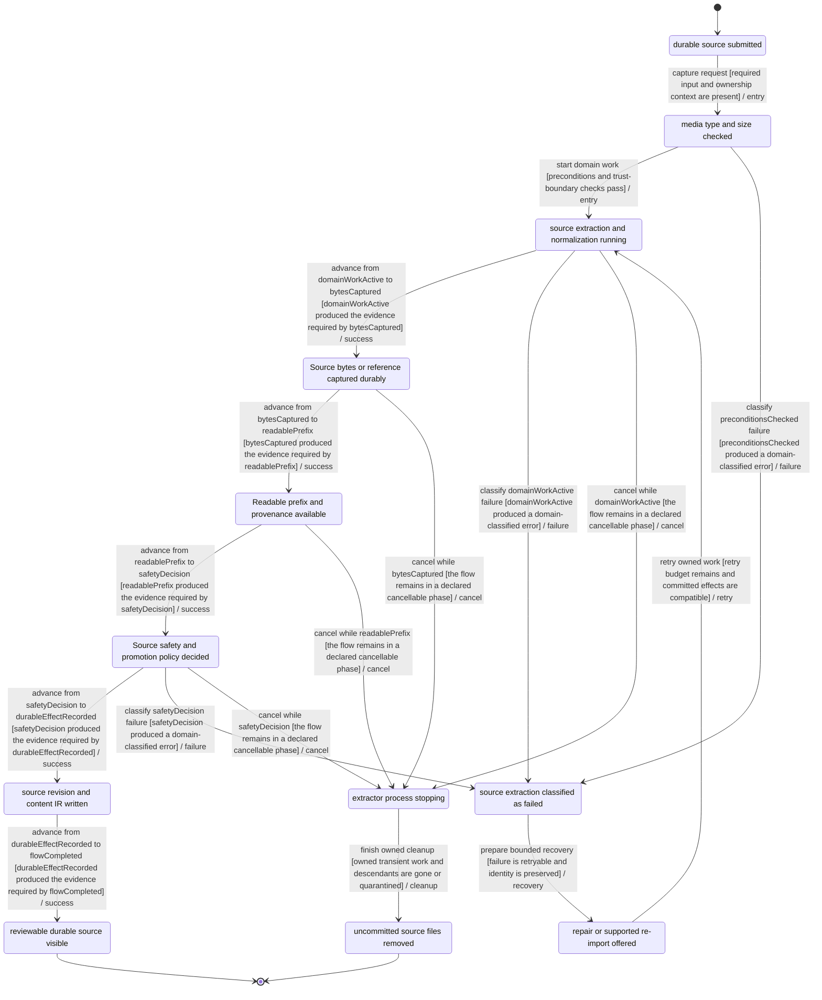
```mermaid
stateDiagram-v2
  state "durable source submitted" as SRC_DURABLE_001_REQUESTCAPTURED
  state "media type and size checked" as SRC_DURABLE_001_PRECONDITIONSCHECKED
  state "source extraction and normalization running" as SRC_DURABLE_001_DOMAINWORKACTIVE
  state "source revision and content IR written" as SRC_DURABLE_001_DURABLEEFFECTRECORDED
  state "reviewable durable source visible" as SRC_DURABLE_001_FLOWCOMPLETED
  state "source extraction classified as failed" as SRC_DURABLE_001_CLASSIFIEDFAILURE
  state "extractor process stopping" as SRC_DURABLE_001_CLEANUPINPROGRESS
  state "uncommitted source files removed" as SRC_DURABLE_001_CANCELEDCLEAN
  state "repair or supported re-import offered" as SRC_DURABLE_001_RECOVERYCONTEXTREADY
  state "Source bytes or reference captured durably" as SRC_DURABLE_001_BYTESCAPTURED
  state "Readable prefix and provenance available" as SRC_DURABLE_001_READABLEPREFIX
  state "Source safety and promotion policy decided" as SRC_DURABLE_001_SAFETYDECISION
  [*] --> SRC_DURABLE_001_REQUESTCAPTURED
  SRC_DURABLE_001_REQUESTCAPTURED --> SRC_DURABLE_001_PRECONDITIONSCHECKED: capture request [required input and ownership context are present] / entry
  SRC_DURABLE_001_PRECONDITIONSCHECKED --> SRC_DURABLE_001_DOMAINWORKACTIVE: start domain work [preconditions and trust-boundary checks pass] / entry
  SRC_DURABLE_001_DOMAINWORKACTIVE --> SRC_DURABLE_001_BYTESCAPTURED: advance from domainWorkActive to bytesCaptured [domainWorkActive produced the evidence required by bytesCaptured] / success
  SRC_DURABLE_001_BYTESCAPTURED --> SRC_DURABLE_001_READABLEPREFIX: advance from bytesCaptured to readablePrefix [bytesCaptured produced the evidence required by readablePrefix] / success
  SRC_DURABLE_001_READABLEPREFIX --> SRC_DURABLE_001_SAFETYDECISION: advance from readablePrefix to safetyDecision [readablePrefix produced the evidence required by safetyDecision] / success
  SRC_DURABLE_001_SAFETYDECISION --> SRC_DURABLE_001_DURABLEEFFECTRECORDED: advance from safetyDecision to durableEffectRecorded [safetyDecision produced the evidence required by durableEffectRecorded] / success
  SRC_DURABLE_001_DURABLEEFFECTRECORDED --> SRC_DURABLE_001_FLOWCOMPLETED: advance from durableEffectRecorded to flowCompleted [durableEffectRecorded produced the evidence required by flowCompleted] / success
  SRC_DURABLE_001_PRECONDITIONSCHECKED --> SRC_DURABLE_001_CLASSIFIEDFAILURE: classify preconditionsChecked failure [preconditionsChecked produced a domain-classified error] / failure
  SRC_DURABLE_001_DOMAINWORKACTIVE --> SRC_DURABLE_001_CLASSIFIEDFAILURE: classify domainWorkActive failure [domainWorkActive produced a domain-classified error] / failure
  SRC_DURABLE_001_SAFETYDECISION --> SRC_DURABLE_001_CLASSIFIEDFAILURE: classify safetyDecision failure [safetyDecision produced a domain-classified error] / failure
  SRC_DURABLE_001_CLASSIFIEDFAILURE --> SRC_DURABLE_001_RECOVERYCONTEXTREADY: prepare bounded recovery [failure is retryable and identity is preserved] / recovery
  SRC_DURABLE_001_RECOVERYCONTEXTREADY --> SRC_DURABLE_001_DOMAINWORKACTIVE: retry owned work [retry budget remains and committed effects are compatible] / retry
  SRC_DURABLE_001_DOMAINWORKACTIVE --> SRC_DURABLE_001_CLEANUPINPROGRESS: cancel while domainWorkActive [the flow remains in a declared cancellable phase] / cancel
  SRC_DURABLE_001_BYTESCAPTURED --> SRC_DURABLE_001_CLEANUPINPROGRESS: cancel while bytesCaptured [the flow remains in a declared cancellable phase] / cancel
  SRC_DURABLE_001_READABLEPREFIX --> SRC_DURABLE_001_CLEANUPINPROGRESS: cancel while readablePrefix [the flow remains in a declared cancellable phase] / cancel
  SRC_DURABLE_001_SAFETYDECISION --> SRC_DURABLE_001_CLEANUPINPROGRESS: cancel while safetyDecision [the flow remains in a declared cancellable phase] / cancel
  SRC_DURABLE_001_CLEANUPINPROGRESS --> SRC_DURABLE_001_CANCELEDCLEAN: finish owned cleanup [owned transient work and descendants are gone or quarantined] / cleanup
  SRC_DURABLE_001_FLOWCOMPLETED --> [*]
  SRC_DURABLE_001_CANCELEDCLEAN --> [*]
```
## SRC-URL-001 — URL safety, bounded fetch, redirects, and extraction

- Primary owner: `source-data`
- Architecture family: `source-ingestion`
- Shared subgraphs: `classified-failure-retry`, `cancellable-cleanup`
- Secondary owners: none
- Shared concerns: `RECOVERY`, `NETWORK_EGRESS`, `FILESYSTEM`, `SUBPROCESS`, `PRIVACY`, `I18N`, `ACCESSIBILITY`, `OPERATIONAL_STATUS`

### Route ownership

- none

### State contract

| State | Label | Kind | Authority | UI observable |
| --- | --- | --- | --- | --- |
| `SRC_URL_001_REQUESTCAPTURED` | URL source submitted | `stable` | `frontend` | UI shows URL source submitted |
| `SRC_URL_001_PRECONDITIONSCHECKED` | scheme host and redirect policy checked | `stable` | `backend` | UI shows validation progress for URL ingestion |
| `SRC_URL_001_DOMAINWORKACTIVE` | bounded remote document fetch running | `transient` | `backend` | UI shows bounded remote document fetch running |
| `SRC_URL_001_DURABLEEFFECTRECORDED` | fetched bytes stored as local source revision | `stable` | `backend` | UI shows committed URL ingestion state |
| `SRC_URL_001_FLOWCOMPLETED` | reviewable local URL source visible | `terminal-success` | `shared` | UI shows reviewable local URL source visible |
| `SRC_URL_001_CLASSIFIEDFAILURE` | unsafe target or fetch failure classified | `stable-failure` | `backend` | UI explains unsafe target or fetch failure classified |
| `SRC_URL_001_CLEANUPINPROGRESS` | HTTP request and extractor stopping | `transient` | `backend` | UI shows HTTP request and extractor stopping |
| `SRC_URL_001_CANCELEDCLEAN` | partial response and temp files removed | `terminal-canceled` | `shared` | UI shows partial response and temp files removed |
| `SRC_URL_001_RECOVERYCONTEXTREADY` | corrected URL or local file intake offered | `stable` | `shared` | UI offers corrected URL or local file intake offered |
| `SRC_URL_001_BYTESCAPTURED` | Source bytes or reference captured durably | `stable` | `backend` | Source bytes or reference captured durably; the UI exposes this state or an actionable non-visual status. |
| `SRC_URL_001_READABLEPREFIX` | Readable prefix and provenance available | `stable` | `shared` | Readable prefix and provenance available; the UI exposes this state or an actionable non-visual status. |
| `SRC_URL_001_SAFETYDECISION` | Source safety and promotion policy decided | `stable` | `shared` | Source safety and promotion policy decided; the UI exposes this state or an actionable non-visual status. |

### Semantic roles

- `requestCaptured` → `SRC_URL_001_REQUESTCAPTURED`
- `preconditionsChecked` → `SRC_URL_001_PRECONDITIONSCHECKED`
- `domainWorkActive` → `SRC_URL_001_DOMAINWORKACTIVE`
- `durableEffectRecorded` → `SRC_URL_001_DURABLEEFFECTRECORDED`
- `flowCompleted` → `SRC_URL_001_FLOWCOMPLETED`
- `classifiedFailure` → `SRC_URL_001_CLASSIFIEDFAILURE`
- `cleanupInProgress` → `SRC_URL_001_CLEANUPINPROGRESS`
- `canceledClean` → `SRC_URL_001_CANCELEDCLEAN`
- `recoveryContextReady` → `SRC_URL_001_RECOVERYCONTEXTREADY`
- `bytesCaptured` → `SRC_URL_001_BYTESCAPTURED`
- `readablePrefix` → `SRC_URL_001_READABLEPREFIX`
- `safetyDecision` → `SRC_URL_001_SAFETYDECISION`

### Required decisions

- **safetyDecision** at `SRC_URL_001_SAFETYDECISION`: `continue` → `SRC-URL-001:T06:success`, `reject` → `SRC-URL-001:T10:failure`, `cancel` → `SRC-URL-001:T16:cancel`

### Family and flow invariants

- Every source-ingestion flow exposes its required roles as canonical states.
- Every source-ingestion decision has named outgoing outcomes bound to transition IDs.
- SRC-URL-001 commit is not reached until fetched bytes stored as local source revision
- SRC-URL-001 cancellation phases equal ordinary cancel-edge sources exactly.

### Transitions

| ID | From | To | Event | Guard | Branch |
| --- | --- | --- | --- | --- | --- |
| `SRC-URL-001:T01:entry` | `SRC_URL_001_REQUESTCAPTURED` | `SRC_URL_001_PRECONDITIONSCHECKED` | capture request | required input and ownership context are present | `entry` |
| `SRC-URL-001:T02:entry` | `SRC_URL_001_PRECONDITIONSCHECKED` | `SRC_URL_001_DOMAINWORKACTIVE` | start domain work | preconditions and trust-boundary checks pass | `entry` |
| `SRC-URL-001:T03:success` | `SRC_URL_001_DOMAINWORKACTIVE` | `SRC_URL_001_BYTESCAPTURED` | advance from domainWorkActive to bytesCaptured | domainWorkActive produced the evidence required by bytesCaptured | `success` |
| `SRC-URL-001:T04:success` | `SRC_URL_001_BYTESCAPTURED` | `SRC_URL_001_READABLEPREFIX` | advance from bytesCaptured to readablePrefix | bytesCaptured produced the evidence required by readablePrefix | `success` |
| `SRC-URL-001:T05:success` | `SRC_URL_001_READABLEPREFIX` | `SRC_URL_001_SAFETYDECISION` | advance from readablePrefix to safetyDecision | readablePrefix produced the evidence required by safetyDecision | `success` |
| `SRC-URL-001:T06:success` | `SRC_URL_001_SAFETYDECISION` | `SRC_URL_001_DURABLEEFFECTRECORDED` | advance from safetyDecision to durableEffectRecorded | safetyDecision produced the evidence required by durableEffectRecorded | `success` |
| `SRC-URL-001:T07:success` | `SRC_URL_001_DURABLEEFFECTRECORDED` | `SRC_URL_001_FLOWCOMPLETED` | advance from durableEffectRecorded to flowCompleted | durableEffectRecorded produced the evidence required by flowCompleted | `success` |
| `SRC-URL-001:T08:failure` | `SRC_URL_001_PRECONDITIONSCHECKED` | `SRC_URL_001_CLASSIFIEDFAILURE` | classify preconditionsChecked failure | preconditionsChecked produced a domain-classified error | `failure` |
| `SRC-URL-001:T09:failure` | `SRC_URL_001_DOMAINWORKACTIVE` | `SRC_URL_001_CLASSIFIEDFAILURE` | classify domainWorkActive failure | domainWorkActive produced a domain-classified error | `failure` |
| `SRC-URL-001:T10:failure` | `SRC_URL_001_SAFETYDECISION` | `SRC_URL_001_CLASSIFIEDFAILURE` | classify safetyDecision failure | safetyDecision produced a domain-classified error | `failure` |
| `SRC-URL-001:T11:recovery` | `SRC_URL_001_CLASSIFIEDFAILURE` | `SRC_URL_001_RECOVERYCONTEXTREADY` | prepare bounded recovery | failure is retryable and identity is preserved | `recovery` |
| `SRC-URL-001:T12:retry` | `SRC_URL_001_RECOVERYCONTEXTREADY` | `SRC_URL_001_DOMAINWORKACTIVE` | retry owned work | retry budget remains and committed effects are compatible | `retry` |
| `SRC-URL-001:T13:cancel` | `SRC_URL_001_DOMAINWORKACTIVE` | `SRC_URL_001_CLEANUPINPROGRESS` | cancel while domainWorkActive | the flow remains in a declared cancellable phase | `cancel` |
| `SRC-URL-001:T14:cancel` | `SRC_URL_001_BYTESCAPTURED` | `SRC_URL_001_CLEANUPINPROGRESS` | cancel while bytesCaptured | the flow remains in a declared cancellable phase | `cancel` |
| `SRC-URL-001:T15:cancel` | `SRC_URL_001_READABLEPREFIX` | `SRC_URL_001_CLEANUPINPROGRESS` | cancel while readablePrefix | the flow remains in a declared cancellable phase | `cancel` |
| `SRC-URL-001:T16:cancel` | `SRC_URL_001_SAFETYDECISION` | `SRC_URL_001_CLEANUPINPROGRESS` | cancel while safetyDecision | the flow remains in a declared cancellable phase | `cancel` |
| `SRC-URL-001:T17:cleanup` | `SRC_URL_001_CLEANUPINPROGRESS` | `SRC_URL_001_CANCELEDCLEAN` | finish owned cleanup | owned transient work and descendants are gone or quarantined | `cleanup` |

### Evidence

- `backend/internal/pipeline/service_test.go` — Executable source anchors only; no transition closure is claimed without a FLOW_ASSERT marker.
  - `TestPreparedSourceURLIngestHonorsPrivateNetworkDefault` — transitions: none (source anchor only)
  - `TestCreateBookSourceFromURLUsesHTMLContentType` — transitions: none (source anchor only)

### Planned transition evidence

- `SRC-URL-001:T01:entry`, `SRC-URL-001:T02:entry`, `SRC-URL-001:T03:success`, `SRC-URL-001:T04:success`, `SRC-URL-001:T05:success`, `SRC-URL-001:T06:success`, `SRC-URL-001:T07:success`, `SRC-URL-001:T08:failure`, `SRC-URL-001:T09:failure`, `SRC-URL-001:T10:failure`, `SRC-URL-001:T11:recovery`, `SRC-URL-001:T12:retry`, `SRC-URL-001:T13:cancel`, `SRC-URL-001:T14:cancel`, `SRC-URL-001:T15:cancel`, `SRC-URL-001:T16:cancel`, `SRC-URL-001:T17:cleanup` → `BIC-05`; verify with `cd backend && go test ./...` — Owner issue must add transition-specific executable FLOW_ASSERT markers and assertions before closeout.

### Mermaid

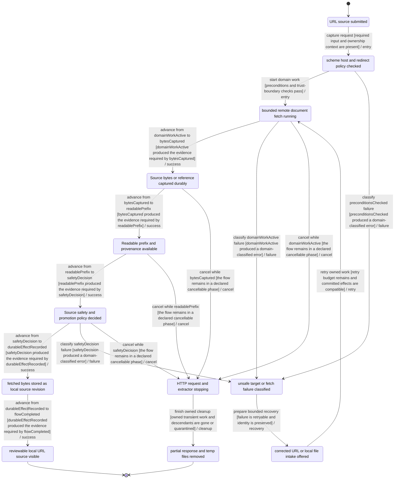
```mermaid
stateDiagram-v2
  state "URL source submitted" as SRC_URL_001_REQUESTCAPTURED
  state "scheme host and redirect policy checked" as SRC_URL_001_PRECONDITIONSCHECKED
  state "bounded remote document fetch running" as SRC_URL_001_DOMAINWORKACTIVE
  state "fetched bytes stored as local source revision" as SRC_URL_001_DURABLEEFFECTRECORDED
  state "reviewable local URL source visible" as SRC_URL_001_FLOWCOMPLETED
  state "unsafe target or fetch failure classified" as SRC_URL_001_CLASSIFIEDFAILURE
  state "HTTP request and extractor stopping" as SRC_URL_001_CLEANUPINPROGRESS
  state "partial response and temp files removed" as SRC_URL_001_CANCELEDCLEAN
  state "corrected URL or local file intake offered" as SRC_URL_001_RECOVERYCONTEXTREADY
  state "Source bytes or reference captured durably" as SRC_URL_001_BYTESCAPTURED
  state "Readable prefix and provenance available" as SRC_URL_001_READABLEPREFIX
  state "Source safety and promotion policy decided" as SRC_URL_001_SAFETYDECISION
  [*] --> SRC_URL_001_REQUESTCAPTURED
  SRC_URL_001_REQUESTCAPTURED --> SRC_URL_001_PRECONDITIONSCHECKED: capture request [required input and ownership context are present] / entry
  SRC_URL_001_PRECONDITIONSCHECKED --> SRC_URL_001_DOMAINWORKACTIVE: start domain work [preconditions and trust-boundary checks pass] / entry
  SRC_URL_001_DOMAINWORKACTIVE --> SRC_URL_001_BYTESCAPTURED: advance from domainWorkActive to bytesCaptured [domainWorkActive produced the evidence required by bytesCaptured] / success
  SRC_URL_001_BYTESCAPTURED --> SRC_URL_001_READABLEPREFIX: advance from bytesCaptured to readablePrefix [bytesCaptured produced the evidence required by readablePrefix] / success
  SRC_URL_001_READABLEPREFIX --> SRC_URL_001_SAFETYDECISION: advance from readablePrefix to safetyDecision [readablePrefix produced the evidence required by safetyDecision] / success
  SRC_URL_001_SAFETYDECISION --> SRC_URL_001_DURABLEEFFECTRECORDED: advance from safetyDecision to durableEffectRecorded [safetyDecision produced the evidence required by durableEffectRecorded] / success
  SRC_URL_001_DURABLEEFFECTRECORDED --> SRC_URL_001_FLOWCOMPLETED: advance from durableEffectRecorded to flowCompleted [durableEffectRecorded produced the evidence required by flowCompleted] / success
  SRC_URL_001_PRECONDITIONSCHECKED --> SRC_URL_001_CLASSIFIEDFAILURE: classify preconditionsChecked failure [preconditionsChecked produced a domain-classified error] / failure
  SRC_URL_001_DOMAINWORKACTIVE --> SRC_URL_001_CLASSIFIEDFAILURE: classify domainWorkActive failure [domainWorkActive produced a domain-classified error] / failure
  SRC_URL_001_SAFETYDECISION --> SRC_URL_001_CLASSIFIEDFAILURE: classify safetyDecision failure [safetyDecision produced a domain-classified error] / failure
  SRC_URL_001_CLASSIFIEDFAILURE --> SRC_URL_001_RECOVERYCONTEXTREADY: prepare bounded recovery [failure is retryable and identity is preserved] / recovery
  SRC_URL_001_RECOVERYCONTEXTREADY --> SRC_URL_001_DOMAINWORKACTIVE: retry owned work [retry budget remains and committed effects are compatible] / retry
  SRC_URL_001_DOMAINWORKACTIVE --> SRC_URL_001_CLEANUPINPROGRESS: cancel while domainWorkActive [the flow remains in a declared cancellable phase] / cancel
  SRC_URL_001_BYTESCAPTURED --> SRC_URL_001_CLEANUPINPROGRESS: cancel while bytesCaptured [the flow remains in a declared cancellable phase] / cancel
  SRC_URL_001_READABLEPREFIX --> SRC_URL_001_CLEANUPINPROGRESS: cancel while readablePrefix [the flow remains in a declared cancellable phase] / cancel
  SRC_URL_001_SAFETYDECISION --> SRC_URL_001_CLEANUPINPROGRESS: cancel while safetyDecision [the flow remains in a declared cancellable phase] / cancel
  SRC_URL_001_CLEANUPINPROGRESS --> SRC_URL_001_CANCELEDCLEAN: finish owned cleanup [owned transient work and descendants are gone or quarantined] / cleanup
  SRC_URL_001_FLOWCOMPLETED --> [*]
  SRC_URL_001_CANCELEDCLEAN --> [*]
```
## SRC-TEMP-001 — Quick Listen temporary source lifecycle

- Primary owner: `source-data`
- Architecture family: `source-ingestion`
- Shared subgraphs: `classified-failure-retry`, `cancellable-cleanup`
- Secondary owners: none
- Shared concerns: `RECOVERY`, `LOCAL_ORIGIN_AUTH`, `FILESYSTEM`, `PRIVACY`, `ACCESSIBILITY`, `OPERATIONAL_STATUS`

### Route ownership

- `DELETE /api/temporary-sources/:id`
- `GET /api/temporary-sources`
- `GET /api/temporary-sources/:id`
- `GET /api/temporary-sources/jobs`
- `GET /api/temporary-sources/storage/summary`
- `PATCH /api/temporary-sources/:id/readiness/confirm`
- `POST /api/temporary-sources`
- `POST /api/temporary-sources/:id/cleanup`
- `POST /api/temporary-sources/:id/reopen`
- `POST /api/temporary-sources/cleanup-expired`
- `POST /api/temporary-sources/clear`

### State contract

| State | Label | Kind | Authority | UI observable |
| --- | --- | --- | --- | --- |
| `SRC_TEMP_001_REQUESTCAPTURED` | temporary source submitted or reopened | `stable` | `frontend` | UI shows temporary source submitted or reopened |
| `SRC_TEMP_001_PRECONDITIONSCHECKED` | temporary quota and expiry checked | `stable` | `backend` | UI shows validation progress for temporary source session |
| `SRC_TEMP_001_DOMAINWORKACTIVE` | temporary extraction running | `transient` | `backend` | UI shows temporary extraction running |
| `SRC_TEMP_001_DURABLEEFFECTRECORDED` | temporary session metadata written | `stable` | `backend` | UI shows committed temporary source session state |
| `SRC_TEMP_001_FLOWCOMPLETED` | temporary source reviewable or playable | `terminal-success` | `shared` | UI shows temporary source reviewable or playable |
| `SRC_TEMP_001_CLASSIFIEDFAILURE` | temporary import failed | `stable-failure` | `backend` | UI explains temporary import failed |
| `SRC_TEMP_001_CLEANUPINPROGRESS` | temporary work stopping | `transient` | `backend` | UI shows temporary work stopping |
| `SRC_TEMP_001_CANCELEDCLEAN` | session discarded or expired normally | `terminal-canceled` | `shared` | UI shows session discarded or expired normally |
| `SRC_TEMP_001_RECOVERYCONTEXTREADY` | reopen extend or re-import selected | `stable` | `shared` | UI offers reopen extend or re-import selected |
| `SRC_TEMP_001_BYTESCAPTURED` | Source bytes or reference captured durably | `stable` | `backend` | Source bytes or reference captured durably; the UI exposes this state or an actionable non-visual status. |
| `SRC_TEMP_001_READABLEPREFIX` | Readable prefix and provenance available | `stable` | `shared` | Readable prefix and provenance available; the UI exposes this state or an actionable non-visual status. |
| `SRC_TEMP_001_SAFETYDECISION` | Source safety and promotion policy decided | `stable` | `shared` | Source safety and promotion policy decided; the UI exposes this state or an actionable non-visual status. |

### Semantic roles

- `requestCaptured` → `SRC_TEMP_001_REQUESTCAPTURED`
- `preconditionsChecked` → `SRC_TEMP_001_PRECONDITIONSCHECKED`
- `domainWorkActive` → `SRC_TEMP_001_DOMAINWORKACTIVE`
- `durableEffectRecorded` → `SRC_TEMP_001_DURABLEEFFECTRECORDED`
- `flowCompleted` → `SRC_TEMP_001_FLOWCOMPLETED`
- `classifiedFailure` → `SRC_TEMP_001_CLASSIFIEDFAILURE`
- `cleanupInProgress` → `SRC_TEMP_001_CLEANUPINPROGRESS`
- `canceledClean` → `SRC_TEMP_001_CANCELEDCLEAN`
- `recoveryContextReady` → `SRC_TEMP_001_RECOVERYCONTEXTREADY`
- `bytesCaptured` → `SRC_TEMP_001_BYTESCAPTURED`
- `readablePrefix` → `SRC_TEMP_001_READABLEPREFIX`
- `safetyDecision` → `SRC_TEMP_001_SAFETYDECISION`

### Required decisions

- **safetyDecision** at `SRC_TEMP_001_SAFETYDECISION`: `continue` → `SRC-TEMP-001:T06:success`, `reject` → `SRC-TEMP-001:T10:failure`, `cancel` → `SRC-TEMP-001:T16:cancel`

### Family and flow invariants

- Every source-ingestion flow exposes its required roles as canonical states.
- Every source-ingestion decision has named outgoing outcomes bound to transition IDs.
- SRC-TEMP-001 commit is not reached until temporary session metadata written
- SRC-TEMP-001 cancellation phases equal ordinary cancel-edge sources exactly.

### Transitions

| ID | From | To | Event | Guard | Branch |
| --- | --- | --- | --- | --- | --- |
| `SRC-TEMP-001:T01:entry` | `SRC_TEMP_001_REQUESTCAPTURED` | `SRC_TEMP_001_PRECONDITIONSCHECKED` | capture request | required input and ownership context are present | `entry` |
| `SRC-TEMP-001:T02:entry` | `SRC_TEMP_001_PRECONDITIONSCHECKED` | `SRC_TEMP_001_DOMAINWORKACTIVE` | start domain work | preconditions and trust-boundary checks pass | `entry` |
| `SRC-TEMP-001:T03:success` | `SRC_TEMP_001_DOMAINWORKACTIVE` | `SRC_TEMP_001_BYTESCAPTURED` | advance from domainWorkActive to bytesCaptured | domainWorkActive produced the evidence required by bytesCaptured | `success` |
| `SRC-TEMP-001:T04:success` | `SRC_TEMP_001_BYTESCAPTURED` | `SRC_TEMP_001_READABLEPREFIX` | advance from bytesCaptured to readablePrefix | bytesCaptured produced the evidence required by readablePrefix | `success` |
| `SRC-TEMP-001:T05:success` | `SRC_TEMP_001_READABLEPREFIX` | `SRC_TEMP_001_SAFETYDECISION` | advance from readablePrefix to safetyDecision | readablePrefix produced the evidence required by safetyDecision | `success` |
| `SRC-TEMP-001:T06:success` | `SRC_TEMP_001_SAFETYDECISION` | `SRC_TEMP_001_DURABLEEFFECTRECORDED` | advance from safetyDecision to durableEffectRecorded | safetyDecision produced the evidence required by durableEffectRecorded | `success` |
| `SRC-TEMP-001:T07:success` | `SRC_TEMP_001_DURABLEEFFECTRECORDED` | `SRC_TEMP_001_FLOWCOMPLETED` | advance from durableEffectRecorded to flowCompleted | durableEffectRecorded produced the evidence required by flowCompleted | `success` |
| `SRC-TEMP-001:T08:failure` | `SRC_TEMP_001_PRECONDITIONSCHECKED` | `SRC_TEMP_001_CLASSIFIEDFAILURE` | classify preconditionsChecked failure | preconditionsChecked produced a domain-classified error | `failure` |
| `SRC-TEMP-001:T09:failure` | `SRC_TEMP_001_DOMAINWORKACTIVE` | `SRC_TEMP_001_CLASSIFIEDFAILURE` | classify domainWorkActive failure | domainWorkActive produced a domain-classified error | `failure` |
| `SRC-TEMP-001:T10:failure` | `SRC_TEMP_001_SAFETYDECISION` | `SRC_TEMP_001_CLASSIFIEDFAILURE` | classify safetyDecision failure | safetyDecision produced a domain-classified error | `failure` |
| `SRC-TEMP-001:T11:recovery` | `SRC_TEMP_001_CLASSIFIEDFAILURE` | `SRC_TEMP_001_RECOVERYCONTEXTREADY` | prepare bounded recovery | failure is retryable and identity is preserved | `recovery` |
| `SRC-TEMP-001:T12:retry` | `SRC_TEMP_001_RECOVERYCONTEXTREADY` | `SRC_TEMP_001_DOMAINWORKACTIVE` | retry owned work | retry budget remains and committed effects are compatible | `retry` |
| `SRC-TEMP-001:T13:cancel` | `SRC_TEMP_001_DOMAINWORKACTIVE` | `SRC_TEMP_001_CLEANUPINPROGRESS` | cancel while domainWorkActive | the flow remains in a declared cancellable phase | `cancel` |
| `SRC-TEMP-001:T14:cancel` | `SRC_TEMP_001_BYTESCAPTURED` | `SRC_TEMP_001_CLEANUPINPROGRESS` | cancel while bytesCaptured | the flow remains in a declared cancellable phase | `cancel` |
| `SRC-TEMP-001:T15:cancel` | `SRC_TEMP_001_READABLEPREFIX` | `SRC_TEMP_001_CLEANUPINPROGRESS` | cancel while readablePrefix | the flow remains in a declared cancellable phase | `cancel` |
| `SRC-TEMP-001:T16:cancel` | `SRC_TEMP_001_SAFETYDECISION` | `SRC_TEMP_001_CLEANUPINPROGRESS` | cancel while safetyDecision | the flow remains in a declared cancellable phase | `cancel` |
| `SRC-TEMP-001:T17:cleanup` | `SRC_TEMP_001_CLEANUPINPROGRESS` | `SRC_TEMP_001_CANCELEDCLEAN` | finish owned cleanup | owned transient work and descendants are gone or quarantined | `cleanup` |

### Evidence

- `backend/internal/httpapi/temporary_source_routes_test.go` — Executable source anchors only; no transition closure is claimed without a FLOW_ASSERT marker.
  - `TestTemporarySourceRoutesCreateGenerateArtifactsAndPromote` — transitions: none (source anchor only)
  - `TestTemporarySourceRouteAcceptsMultipartFile` — transitions: none (source anchor only)
  - `TestTemporarySourceRouteQuickListenURLCapturesAndNarratesWithoutProject` — transitions: none (source anchor only)
  - `TestTemporarySourceRouteClearDeletesTemporarySourcesOnly` — transitions: none (source anchor only)
  - `TestTemporarySourceRouteRejectsUnsupportedMultipartFileWithoutProjectArtifacts` — transitions: none (source anchor only)
  - `TestTemporarySourceRouteReturnsTypedTemporaryFailureCopy` — transitions: none (source anchor only)

### Planned transition evidence

- `SRC-TEMP-001:T01:entry`, `SRC-TEMP-001:T02:entry`, `SRC-TEMP-001:T03:success`, `SRC-TEMP-001:T04:success`, `SRC-TEMP-001:T05:success`, `SRC-TEMP-001:T06:success`, `SRC-TEMP-001:T07:success`, `SRC-TEMP-001:T08:failure`, `SRC-TEMP-001:T09:failure`, `SRC-TEMP-001:T10:failure`, `SRC-TEMP-001:T11:recovery`, `SRC-TEMP-001:T12:retry`, `SRC-TEMP-001:T13:cancel`, `SRC-TEMP-001:T14:cancel`, `SRC-TEMP-001:T15:cancel`, `SRC-TEMP-001:T16:cancel`, `SRC-TEMP-001:T17:cleanup` → `BIC-05`; verify with `cd backend && go test ./...` — Owner issue must add transition-specific executable FLOW_ASSERT markers and assertions before closeout.

### Mermaid

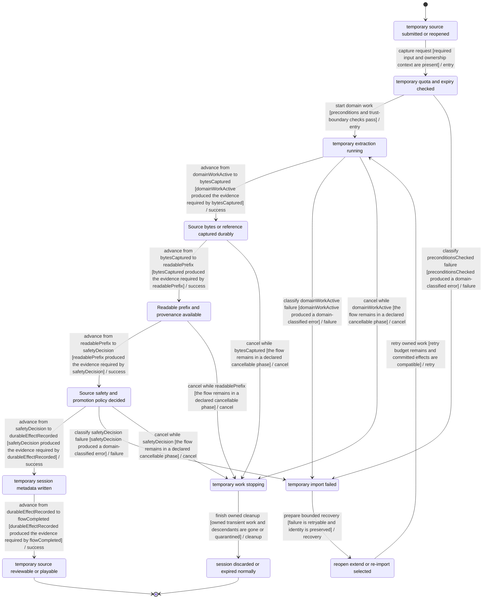
```mermaid
stateDiagram-v2
  state "temporary source submitted or reopened" as SRC_TEMP_001_REQUESTCAPTURED
  state "temporary quota and expiry checked" as SRC_TEMP_001_PRECONDITIONSCHECKED
  state "temporary extraction running" as SRC_TEMP_001_DOMAINWORKACTIVE
  state "temporary session metadata written" as SRC_TEMP_001_DURABLEEFFECTRECORDED
  state "temporary source reviewable or playable" as SRC_TEMP_001_FLOWCOMPLETED
  state "temporary import failed" as SRC_TEMP_001_CLASSIFIEDFAILURE
  state "temporary work stopping" as SRC_TEMP_001_CLEANUPINPROGRESS
  state "session discarded or expired normally" as SRC_TEMP_001_CANCELEDCLEAN
  state "reopen extend or re-import selected" as SRC_TEMP_001_RECOVERYCONTEXTREADY
  state "Source bytes or reference captured durably" as SRC_TEMP_001_BYTESCAPTURED
  state "Readable prefix and provenance available" as SRC_TEMP_001_READABLEPREFIX
  state "Source safety and promotion policy decided" as SRC_TEMP_001_SAFETYDECISION
  [*] --> SRC_TEMP_001_REQUESTCAPTURED
  SRC_TEMP_001_REQUESTCAPTURED --> SRC_TEMP_001_PRECONDITIONSCHECKED: capture request [required input and ownership context are present] / entry
  SRC_TEMP_001_PRECONDITIONSCHECKED --> SRC_TEMP_001_DOMAINWORKACTIVE: start domain work [preconditions and trust-boundary checks pass] / entry
  SRC_TEMP_001_DOMAINWORKACTIVE --> SRC_TEMP_001_BYTESCAPTURED: advance from domainWorkActive to bytesCaptured [domainWorkActive produced the evidence required by bytesCaptured] / success
  SRC_TEMP_001_BYTESCAPTURED --> SRC_TEMP_001_READABLEPREFIX: advance from bytesCaptured to readablePrefix [bytesCaptured produced the evidence required by readablePrefix] / success
  SRC_TEMP_001_READABLEPREFIX --> SRC_TEMP_001_SAFETYDECISION: advance from readablePrefix to safetyDecision [readablePrefix produced the evidence required by safetyDecision] / success
  SRC_TEMP_001_SAFETYDECISION --> SRC_TEMP_001_DURABLEEFFECTRECORDED: advance from safetyDecision to durableEffectRecorded [safetyDecision produced the evidence required by durableEffectRecorded] / success
  SRC_TEMP_001_DURABLEEFFECTRECORDED --> SRC_TEMP_001_FLOWCOMPLETED: advance from durableEffectRecorded to flowCompleted [durableEffectRecorded produced the evidence required by flowCompleted] / success
  SRC_TEMP_001_PRECONDITIONSCHECKED --> SRC_TEMP_001_CLASSIFIEDFAILURE: classify preconditionsChecked failure [preconditionsChecked produced a domain-classified error] / failure
  SRC_TEMP_001_DOMAINWORKACTIVE --> SRC_TEMP_001_CLASSIFIEDFAILURE: classify domainWorkActive failure [domainWorkActive produced a domain-classified error] / failure
  SRC_TEMP_001_SAFETYDECISION --> SRC_TEMP_001_CLASSIFIEDFAILURE: classify safetyDecision failure [safetyDecision produced a domain-classified error] / failure
  SRC_TEMP_001_CLASSIFIEDFAILURE --> SRC_TEMP_001_RECOVERYCONTEXTREADY: prepare bounded recovery [failure is retryable and identity is preserved] / recovery
  SRC_TEMP_001_RECOVERYCONTEXTREADY --> SRC_TEMP_001_DOMAINWORKACTIVE: retry owned work [retry budget remains and committed effects are compatible] / retry
  SRC_TEMP_001_DOMAINWORKACTIVE --> SRC_TEMP_001_CLEANUPINPROGRESS: cancel while domainWorkActive [the flow remains in a declared cancellable phase] / cancel
  SRC_TEMP_001_BYTESCAPTURED --> SRC_TEMP_001_CLEANUPINPROGRESS: cancel while bytesCaptured [the flow remains in a declared cancellable phase] / cancel
  SRC_TEMP_001_READABLEPREFIX --> SRC_TEMP_001_CLEANUPINPROGRESS: cancel while readablePrefix [the flow remains in a declared cancellable phase] / cancel
  SRC_TEMP_001_SAFETYDECISION --> SRC_TEMP_001_CLEANUPINPROGRESS: cancel while safetyDecision [the flow remains in a declared cancellable phase] / cancel
  SRC_TEMP_001_CLEANUPINPROGRESS --> SRC_TEMP_001_CANCELEDCLEAN: finish owned cleanup [owned transient work and descendants are gone or quarantined] / cleanup
  SRC_TEMP_001_FLOWCOMPLETED --> [*]
  SRC_TEMP_001_CANCELEDCLEAN --> [*]
```
## SRC-PROMOTE-001 — Temporary-to-durable source promotion

- Primary owner: `project-data`
- Architecture family: `destructive-reset`
- Shared subgraphs: `classified-failure-retry`, `cancellable-cleanup`
- Secondary owners: `source-data`
- Shared concerns: `RECOVERY`, `LOCAL_ORIGIN_AUTH`, `FILESYSTEM`, `PRIVACY`, `ACCESSIBILITY`, `OPERATIONAL_STATUS`

### Route ownership

- `POST /api/temporary-sources/:id/promote`

### State contract

| State | Label | Kind | Authority | UI observable |
| --- | --- | --- | --- | --- |
| `SRC_PROMOTE_001_REQUESTCAPTURED` | keep temporary source requested | `stable` | `frontend` | UI shows keep temporary source requested |
| `SRC_PROMOTE_001_PRECONDITIONSCHECKED` | source project and crosswalk checked | `stable` | `backend` | UI shows validation progress for source promotion |
| `SRC_PROMOTE_001_DOMAINWORKACTIVE` | durable copy and reference remap running | `transient` | `backend` | UI shows durable copy and reference remap running |
| `SRC_PROMOTE_001_DURABLEEFFECTRECORDED` | durable source metadata and crosswalk committed | `stable` | `backend` | UI shows committed source promotion state |
| `SRC_PROMOTE_001_FLOWCOMPLETED` | durable source selected with compatible artifacts | `terminal-success` | `shared` | UI shows durable source selected with compatible artifacts |
| `SRC_PROMOTE_001_CLASSIFIEDFAILURE` | promotion conflict or partial copy quarantined | `stable-failure` | `backend` | UI explains promotion conflict or partial copy quarantined |
| `SRC_PROMOTE_001_CLEANUPINPROGRESS` | pre-commit promotion stopping | `transient` | `backend` | UI shows pre-commit promotion stopping |
| `SRC_PROMOTE_001_CANCELEDCLEAN` | temporary source remains usable | `terminal-canceled` | `shared` | UI shows temporary source remains usable |
| `SRC_PROMOTE_001_RECOVERYCONTEXTREADY` | quarantine cleanup and retry offered | `stable` | `shared` | UI offers quarantine cleanup and retry offered |
| `SRC_PROMOTE_001_CONFIRMATIONDECISION` | Destructive intent confirmed or declined | `stable` | `frontend` | Destructive intent confirmed or declined; the UI exposes this state or an actionable non-visual status. |
| `SRC_PROMOTE_001_DEPENDENTCLEANUP` | Owned dependent artifacts reconciled | `transient` | `backend` | Owned dependent artifacts reconciled; the UI exposes this state or an actionable non-visual status. |

### Semantic roles

- `requestCaptured` → `SRC_PROMOTE_001_REQUESTCAPTURED`
- `preconditionsChecked` → `SRC_PROMOTE_001_PRECONDITIONSCHECKED`
- `domainWorkActive` → `SRC_PROMOTE_001_DOMAINWORKACTIVE`
- `durableEffectRecorded` → `SRC_PROMOTE_001_DURABLEEFFECTRECORDED`
- `flowCompleted` → `SRC_PROMOTE_001_FLOWCOMPLETED`
- `classifiedFailure` → `SRC_PROMOTE_001_CLASSIFIEDFAILURE`
- `cleanupInProgress` → `SRC_PROMOTE_001_CLEANUPINPROGRESS`
- `canceledClean` → `SRC_PROMOTE_001_CANCELEDCLEAN`
- `recoveryContextReady` → `SRC_PROMOTE_001_RECOVERYCONTEXTREADY`
- `confirmationDecision` → `SRC_PROMOTE_001_CONFIRMATIONDECISION`
- `dependentCleanup` → `SRC_PROMOTE_001_DEPENDENTCLEANUP`

### Required decisions

- **confirmationDecision** at `SRC_PROMOTE_001_CONFIRMATIONDECISION`: `continue` → `SRC-PROMOTE-001:T04:success`, `reject` → `SRC-PROMOTE-001:T09:failure`, `cancel` → `SRC-PROMOTE-001:T13:cancel`

### Family and flow invariants

- Every destructive-reset flow exposes its required roles as canonical states.
- Every destructive-reset decision has named outgoing outcomes bound to transition IDs.
- SRC-PROMOTE-001 commit is not reached until durable source metadata and crosswalk committed
- SRC-PROMOTE-001 cancellation phases equal ordinary cancel-edge sources exactly.

### Transitions

| ID | From | To | Event | Guard | Branch |
| --- | --- | --- | --- | --- | --- |
| `SRC-PROMOTE-001:T01:entry` | `SRC_PROMOTE_001_REQUESTCAPTURED` | `SRC_PROMOTE_001_PRECONDITIONSCHECKED` | capture request | required input and ownership context are present | `entry` |
| `SRC-PROMOTE-001:T02:entry` | `SRC_PROMOTE_001_PRECONDITIONSCHECKED` | `SRC_PROMOTE_001_DOMAINWORKACTIVE` | start domain work | preconditions and trust-boundary checks pass | `entry` |
| `SRC-PROMOTE-001:T03:success` | `SRC_PROMOTE_001_DOMAINWORKACTIVE` | `SRC_PROMOTE_001_CONFIRMATIONDECISION` | advance from domainWorkActive to confirmationDecision | domainWorkActive produced the evidence required by confirmationDecision | `success` |
| `SRC-PROMOTE-001:T04:success` | `SRC_PROMOTE_001_CONFIRMATIONDECISION` | `SRC_PROMOTE_001_DEPENDENTCLEANUP` | advance from confirmationDecision to dependentCleanup | confirmationDecision produced the evidence required by dependentCleanup | `success` |
| `SRC-PROMOTE-001:T05:success` | `SRC_PROMOTE_001_DEPENDENTCLEANUP` | `SRC_PROMOTE_001_DURABLEEFFECTRECORDED` | advance from dependentCleanup to durableEffectRecorded | dependentCleanup produced the evidence required by durableEffectRecorded | `success` |
| `SRC-PROMOTE-001:T06:success` | `SRC_PROMOTE_001_DURABLEEFFECTRECORDED` | `SRC_PROMOTE_001_FLOWCOMPLETED` | advance from durableEffectRecorded to flowCompleted | durableEffectRecorded produced the evidence required by flowCompleted | `success` |
| `SRC-PROMOTE-001:T07:failure` | `SRC_PROMOTE_001_PRECONDITIONSCHECKED` | `SRC_PROMOTE_001_CLASSIFIEDFAILURE` | classify preconditionsChecked failure | preconditionsChecked produced a domain-classified error | `failure` |
| `SRC-PROMOTE-001:T08:failure` | `SRC_PROMOTE_001_DOMAINWORKACTIVE` | `SRC_PROMOTE_001_CLASSIFIEDFAILURE` | classify domainWorkActive failure | domainWorkActive produced a domain-classified error | `failure` |
| `SRC-PROMOTE-001:T09:failure` | `SRC_PROMOTE_001_CONFIRMATIONDECISION` | `SRC_PROMOTE_001_CLASSIFIEDFAILURE` | classify confirmationDecision failure | confirmationDecision produced a domain-classified error | `failure` |
| `SRC-PROMOTE-001:T10:recovery` | `SRC_PROMOTE_001_CLASSIFIEDFAILURE` | `SRC_PROMOTE_001_RECOVERYCONTEXTREADY` | prepare bounded recovery | failure is retryable and identity is preserved | `recovery` |
| `SRC-PROMOTE-001:T11:retry` | `SRC_PROMOTE_001_RECOVERYCONTEXTREADY` | `SRC_PROMOTE_001_DOMAINWORKACTIVE` | retry owned work | retry budget remains and committed effects are compatible | `retry` |
| `SRC-PROMOTE-001:T12:cancel` | `SRC_PROMOTE_001_DOMAINWORKACTIVE` | `SRC_PROMOTE_001_CLEANUPINPROGRESS` | cancel while domainWorkActive | the flow remains in a declared cancellable phase | `cancel` |
| `SRC-PROMOTE-001:T13:cancel` | `SRC_PROMOTE_001_CONFIRMATIONDECISION` | `SRC_PROMOTE_001_CLEANUPINPROGRESS` | cancel while confirmationDecision | the flow remains in a declared cancellable phase | `cancel` |
| `SRC-PROMOTE-001:T14:cancel` | `SRC_PROMOTE_001_DEPENDENTCLEANUP` | `SRC_PROMOTE_001_CLEANUPINPROGRESS` | cancel while dependentCleanup | the flow remains in a declared cancellable phase | `cancel` |
| `SRC-PROMOTE-001:T15:cleanup` | `SRC_PROMOTE_001_CLEANUPINPROGRESS` | `SRC_PROMOTE_001_CANCELEDCLEAN` | finish owned cleanup | owned transient work and descendants are gone or quarantined | `cleanup` |

### Evidence

- `backend/internal/httpapi/temporary_source_routes_test.go` — Executable source anchors only; no transition closure is claimed without a FLOW_ASSERT marker.
  - `TestTemporarySourceRoutesCreateGenerateArtifactsAndPromote` — transitions: none (source anchor only)
  - `TestTemporarySourceRouteAcceptsMultipartFile` — transitions: none (source anchor only)
  - `TestTemporarySourceRouteQuickListenURLCapturesAndNarratesWithoutProject` — transitions: none (source anchor only)
  - `TestTemporarySourceRouteClearDeletesTemporarySourcesOnly` — transitions: none (source anchor only)
  - `TestTemporarySourceRouteRejectsUnsupportedMultipartFileWithoutProjectArtifacts` — transitions: none (source anchor only)
  - `TestTemporarySourceRouteReturnsTypedTemporaryFailureCopy` — transitions: none (source anchor only)
  - `TestTemporarySourceRoutesFailClosedWhenFeatureDisabled` — transitions: none (source anchor only)

### Planned transition evidence

- `SRC-PROMOTE-001:T01:entry`, `SRC-PROMOTE-001:T02:entry`, `SRC-PROMOTE-001:T03:success`, `SRC-PROMOTE-001:T04:success`, `SRC-PROMOTE-001:T05:success`, `SRC-PROMOTE-001:T06:success`, `SRC-PROMOTE-001:T07:failure`, `SRC-PROMOTE-001:T08:failure`, `SRC-PROMOTE-001:T09:failure`, `SRC-PROMOTE-001:T10:recovery`, `SRC-PROMOTE-001:T11:retry`, `SRC-PROMOTE-001:T12:cancel`, `SRC-PROMOTE-001:T13:cancel`, `SRC-PROMOTE-001:T14:cancel`, `SRC-PROMOTE-001:T15:cleanup` → `BIC-05`; verify with `cd backend && go test ./...` — Owner issue must add transition-specific executable FLOW_ASSERT markers and assertions before closeout.

### Mermaid

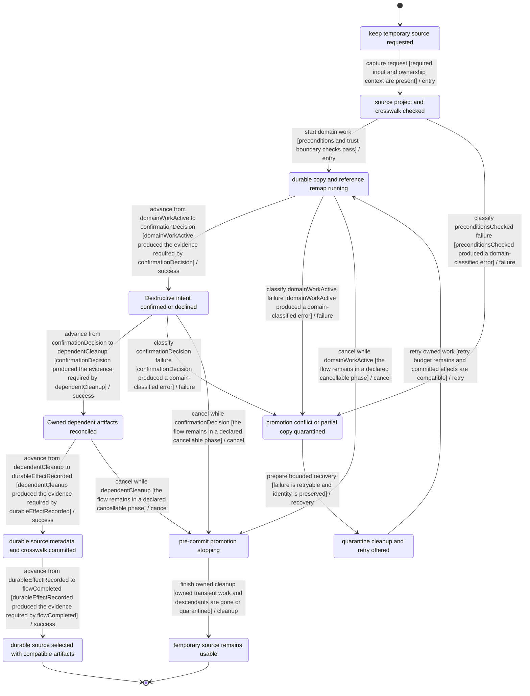
```mermaid
stateDiagram-v2
  state "keep temporary source requested" as SRC_PROMOTE_001_REQUESTCAPTURED
  state "source project and crosswalk checked" as SRC_PROMOTE_001_PRECONDITIONSCHECKED
  state "durable copy and reference remap running" as SRC_PROMOTE_001_DOMAINWORKACTIVE
  state "durable source metadata and crosswalk committed" as SRC_PROMOTE_001_DURABLEEFFECTRECORDED
  state "durable source selected with compatible artifacts" as SRC_PROMOTE_001_FLOWCOMPLETED
  state "promotion conflict or partial copy quarantined" as SRC_PROMOTE_001_CLASSIFIEDFAILURE
  state "pre-commit promotion stopping" as SRC_PROMOTE_001_CLEANUPINPROGRESS
  state "temporary source remains usable" as SRC_PROMOTE_001_CANCELEDCLEAN
  state "quarantine cleanup and retry offered" as SRC_PROMOTE_001_RECOVERYCONTEXTREADY
  state "Destructive intent confirmed or declined" as SRC_PROMOTE_001_CONFIRMATIONDECISION
  state "Owned dependent artifacts reconciled" as SRC_PROMOTE_001_DEPENDENTCLEANUP
  [*] --> SRC_PROMOTE_001_REQUESTCAPTURED
  SRC_PROMOTE_001_REQUESTCAPTURED --> SRC_PROMOTE_001_PRECONDITIONSCHECKED: capture request [required input and ownership context are present] / entry
  SRC_PROMOTE_001_PRECONDITIONSCHECKED --> SRC_PROMOTE_001_DOMAINWORKACTIVE: start domain work [preconditions and trust-boundary checks pass] / entry
  SRC_PROMOTE_001_DOMAINWORKACTIVE --> SRC_PROMOTE_001_CONFIRMATIONDECISION: advance from domainWorkActive to confirmationDecision [domainWorkActive produced the evidence required by confirmationDecision] / success
  SRC_PROMOTE_001_CONFIRMATIONDECISION --> SRC_PROMOTE_001_DEPENDENTCLEANUP: advance from confirmationDecision to dependentCleanup [confirmationDecision produced the evidence required by dependentCleanup] / success
  SRC_PROMOTE_001_DEPENDENTCLEANUP --> SRC_PROMOTE_001_DURABLEEFFECTRECORDED: advance from dependentCleanup to durableEffectRecorded [dependentCleanup produced the evidence required by durableEffectRecorded] / success
  SRC_PROMOTE_001_DURABLEEFFECTRECORDED --> SRC_PROMOTE_001_FLOWCOMPLETED: advance from durableEffectRecorded to flowCompleted [durableEffectRecorded produced the evidence required by flowCompleted] / success
  SRC_PROMOTE_001_PRECONDITIONSCHECKED --> SRC_PROMOTE_001_CLASSIFIEDFAILURE: classify preconditionsChecked failure [preconditionsChecked produced a domain-classified error] / failure
  SRC_PROMOTE_001_DOMAINWORKACTIVE --> SRC_PROMOTE_001_CLASSIFIEDFAILURE: classify domainWorkActive failure [domainWorkActive produced a domain-classified error] / failure
  SRC_PROMOTE_001_CONFIRMATIONDECISION --> SRC_PROMOTE_001_CLASSIFIEDFAILURE: classify confirmationDecision failure [confirmationDecision produced a domain-classified error] / failure
  SRC_PROMOTE_001_CLASSIFIEDFAILURE --> SRC_PROMOTE_001_RECOVERYCONTEXTREADY: prepare bounded recovery [failure is retryable and identity is preserved] / recovery
  SRC_PROMOTE_001_RECOVERYCONTEXTREADY --> SRC_PROMOTE_001_DOMAINWORKACTIVE: retry owned work [retry budget remains and committed effects are compatible] / retry
  SRC_PROMOTE_001_DOMAINWORKACTIVE --> SRC_PROMOTE_001_CLEANUPINPROGRESS: cancel while domainWorkActive [the flow remains in a declared cancellable phase] / cancel
  SRC_PROMOTE_001_CONFIRMATIONDECISION --> SRC_PROMOTE_001_CLEANUPINPROGRESS: cancel while confirmationDecision [the flow remains in a declared cancellable phase] / cancel
  SRC_PROMOTE_001_DEPENDENTCLEANUP --> SRC_PROMOTE_001_CLEANUPINPROGRESS: cancel while dependentCleanup [the flow remains in a declared cancellable phase] / cancel
  SRC_PROMOTE_001_CLEANUPINPROGRESS --> SRC_PROMOTE_001_CANCELEDCLEAN: finish owned cleanup [owned transient work and descendants are gone or quarantined] / cleanup
  SRC_PROMOTE_001_FLOWCOMPLETED --> [*]
  SRC_PROMOTE_001_CANCELEDCLEAN --> [*]
```
## SRC-REVIEW-001 — Source review, scope, metadata, and readiness

- Primary owner: `experience`
- Architecture family: `review-decision`
- Shared subgraphs: `classified-failure-retry`, `cancellable-cleanup`
- Secondary owners: `source-data`
- Shared concerns: `RECOVERY`, `ACCESSIBILITY`, `PRIVACY`, `I18N`, `OPERATIONAL_STATUS`

### Route ownership

- `GET /api/book-sources/:id/scope`
- `POST /api/book-sources/:id/readiness/confirm`
- `POST /api/source-preps/:id/readiness/confirm`

### State contract

| State | Label | Kind | Authority | UI observable |
| --- | --- | --- | --- | --- |
| `SRC_REVIEW_001_REQUESTCAPTURED` | reviewable source opened | `stable` | `frontend` | UI shows reviewable source opened |
| `SRC_REVIEW_001_PRECONDITIONSCHECKED` | revision and readiness loaded | `stable` | `backend` | UI shows validation progress for source review |
| `SRC_REVIEW_001_DOMAINWORKACTIVE` | scope and metadata edits evaluated | `transient` | `backend` | UI shows scope and metadata edits evaluated |
| `SRC_REVIEW_001_DURABLEEFFECTRECORDED` | readiness confirmation persisted | `stable` | `backend` | UI shows committed source review state |
| `SRC_REVIEW_001_FLOWCOMPLETED` | approved narratable scope visible | `terminal-success` | `shared` | UI shows approved narratable scope visible |
| `SRC_REVIEW_001_CLASSIFIEDFAILURE` | stale revision or blocked content shown | `stable-failure` | `backend` | UI explains stale revision or blocked content shown |
| `SRC_REVIEW_001_CLEANUPINPROGRESS` | unconfirmed edits discarded | `transient` | `backend` | UI shows unconfirmed edits discarded |
| `SRC_REVIEW_001_CANCELEDCLEAN` | last confirmed readiness retained | `terminal-canceled` | `shared` | UI shows last confirmed readiness retained |
| `SRC_REVIEW_001_RECOVERYCONTEXTREADY` | repair or intake return chosen | `stable` | `shared` | UI offers repair or intake return chosen |
| `SRC_REVIEW_001_AUDITIONREADY` | Review or audition material ready | `stable` | `shared` | Review or audition material ready; the UI exposes this state or an actionable non-visual status. |
| `SRC_REVIEW_001_REVIEWDECISION` | Accept, change, or skip decision visible | `stable` | `frontend` | Accept, change, or skip decision visible; the UI exposes this state or an actionable non-visual status. |
| `SRC_REVIEW_001_CHANGEREQUESTED` | Requested change returned to active preparation | `transient` | `shared` | Requested change returned to active preparation; the UI exposes this state or an actionable non-visual status. |

### Semantic roles

- `requestCaptured` → `SRC_REVIEW_001_REQUESTCAPTURED`
- `preconditionsChecked` → `SRC_REVIEW_001_PRECONDITIONSCHECKED`
- `domainWorkActive` → `SRC_REVIEW_001_DOMAINWORKACTIVE`
- `durableEffectRecorded` → `SRC_REVIEW_001_DURABLEEFFECTRECORDED`
- `flowCompleted` → `SRC_REVIEW_001_FLOWCOMPLETED`
- `classifiedFailure` → `SRC_REVIEW_001_CLASSIFIEDFAILURE`
- `cleanupInProgress` → `SRC_REVIEW_001_CLEANUPINPROGRESS`
- `canceledClean` → `SRC_REVIEW_001_CANCELEDCLEAN`
- `recoveryContextReady` → `SRC_REVIEW_001_RECOVERYCONTEXTREADY`
- `auditionReady` → `SRC_REVIEW_001_AUDITIONREADY`
- `reviewDecision` → `SRC_REVIEW_001_REVIEWDECISION`
- `changeRequested` → `SRC_REVIEW_001_CHANGEREQUESTED`

### Required decisions

- **reviewDecision** at `SRC_REVIEW_001_REVIEWDECISION`: `continue` → `SRC-REVIEW-001:T05:success`, `reject` → `SRC-REVIEW-001:T10:failure`, `cancel` → `SRC-REVIEW-001:T15:cancel`

### Family and flow invariants

- Every review-decision flow exposes its required roles as canonical states.
- Every review-decision decision has named outgoing outcomes bound to transition IDs.
- SRC-REVIEW-001 commit is not reached until readiness confirmation persisted
- SRC-REVIEW-001 cancellation phases equal ordinary cancel-edge sources exactly.
- Frozen BIC-05 planned-evidence ownership is provenance; responsive replacement ownership RSP-02/RSP-03 is planned only and is not covered or implemented.

### Transitions

| ID | From | To | Event | Guard | Branch |
| --- | --- | --- | --- | --- | --- |
| `SRC-REVIEW-001:T01:entry` | `SRC_REVIEW_001_REQUESTCAPTURED` | `SRC_REVIEW_001_PRECONDITIONSCHECKED` | capture request | required input and ownership context are present | `entry` |
| `SRC-REVIEW-001:T02:entry` | `SRC_REVIEW_001_PRECONDITIONSCHECKED` | `SRC_REVIEW_001_DOMAINWORKACTIVE` | start domain work | preconditions and trust-boundary checks pass | `entry` |
| `SRC-REVIEW-001:T03:success` | `SRC_REVIEW_001_DOMAINWORKACTIVE` | `SRC_REVIEW_001_AUDITIONREADY` | advance from domainWorkActive to auditionReady | domainWorkActive produced the evidence required by auditionReady | `success` |
| `SRC-REVIEW-001:T04:success` | `SRC_REVIEW_001_AUDITIONREADY` | `SRC_REVIEW_001_REVIEWDECISION` | advance from auditionReady to reviewDecision | auditionReady produced the evidence required by reviewDecision | `success` |
| `SRC-REVIEW-001:T05:success` | `SRC_REVIEW_001_REVIEWDECISION` | `SRC_REVIEW_001_CHANGEREQUESTED` | advance from reviewDecision to changeRequested | reviewDecision produced the evidence required by changeRequested | `success` |
| `SRC-REVIEW-001:T06:success` | `SRC_REVIEW_001_CHANGEREQUESTED` | `SRC_REVIEW_001_DURABLEEFFECTRECORDED` | advance from changeRequested to durableEffectRecorded | changeRequested produced the evidence required by durableEffectRecorded | `success` |
| `SRC-REVIEW-001:T07:success` | `SRC_REVIEW_001_DURABLEEFFECTRECORDED` | `SRC_REVIEW_001_FLOWCOMPLETED` | advance from durableEffectRecorded to flowCompleted | durableEffectRecorded produced the evidence required by flowCompleted | `success` |
| `SRC-REVIEW-001:T08:failure` | `SRC_REVIEW_001_PRECONDITIONSCHECKED` | `SRC_REVIEW_001_CLASSIFIEDFAILURE` | classify preconditionsChecked failure | preconditionsChecked produced a domain-classified error | `failure` |
| `SRC-REVIEW-001:T09:failure` | `SRC_REVIEW_001_DOMAINWORKACTIVE` | `SRC_REVIEW_001_CLASSIFIEDFAILURE` | classify domainWorkActive failure | domainWorkActive produced a domain-classified error | `failure` |
| `SRC-REVIEW-001:T10:failure` | `SRC_REVIEW_001_REVIEWDECISION` | `SRC_REVIEW_001_CLASSIFIEDFAILURE` | classify reviewDecision failure | reviewDecision produced a domain-classified error | `failure` |
| `SRC-REVIEW-001:T11:recovery` | `SRC_REVIEW_001_CLASSIFIEDFAILURE` | `SRC_REVIEW_001_RECOVERYCONTEXTREADY` | prepare bounded recovery | failure is retryable and identity is preserved | `recovery` |
| `SRC-REVIEW-001:T12:retry` | `SRC_REVIEW_001_RECOVERYCONTEXTREADY` | `SRC_REVIEW_001_DOMAINWORKACTIVE` | retry owned work | retry budget remains and committed effects are compatible | `retry` |
| `SRC-REVIEW-001:T13:cancel` | `SRC_REVIEW_001_DOMAINWORKACTIVE` | `SRC_REVIEW_001_CLEANUPINPROGRESS` | cancel while domainWorkActive | the flow remains in a declared cancellable phase | `cancel` |
| `SRC-REVIEW-001:T14:cancel` | `SRC_REVIEW_001_AUDITIONREADY` | `SRC_REVIEW_001_CLEANUPINPROGRESS` | cancel while auditionReady | the flow remains in a declared cancellable phase | `cancel` |
| `SRC-REVIEW-001:T15:cancel` | `SRC_REVIEW_001_REVIEWDECISION` | `SRC_REVIEW_001_CLEANUPINPROGRESS` | cancel while reviewDecision | the flow remains in a declared cancellable phase | `cancel` |
| `SRC-REVIEW-001:T16:cancel` | `SRC_REVIEW_001_CHANGEREQUESTED` | `SRC_REVIEW_001_CLEANUPINPROGRESS` | cancel while changeRequested | the flow remains in a declared cancellable phase | `cancel` |
| `SRC-REVIEW-001:T17:cleanup` | `SRC_REVIEW_001_CLEANUPINPROGRESS` | `SRC_REVIEW_001_CANCELEDCLEAN` | finish owned cleanup | owned transient work and descendants are gone or quarantined | `cleanup` |

### Evidence

- `frontend/src/features/review/model.test.tsx` — Executable source anchors only; no transition closure is claimed without a FLOW_ASSERT marker.
  - `defaults temporary review to quick mode and durable review to full mode` — transitions: none (source anchor only)
  - `adapts temporary review state with session-scoped promotion mapping` — transitions: none (source anchor only)
  - `filters quick review to blockers, skipped content, suspicious blocks, and pronunciation warnings` — transitions: none (source anchor only)

### Planned transition evidence

- `SRC-REVIEW-001:T01:entry`, `SRC-REVIEW-001:T02:entry`, `SRC-REVIEW-001:T03:success`, `SRC-REVIEW-001:T04:success`, `SRC-REVIEW-001:T05:success`, `SRC-REVIEW-001:T06:success`, `SRC-REVIEW-001:T07:success`, `SRC-REVIEW-001:T08:failure`, `SRC-REVIEW-001:T09:failure`, `SRC-REVIEW-001:T10:failure`, `SRC-REVIEW-001:T11:recovery`, `SRC-REVIEW-001:T12:retry`, `SRC-REVIEW-001:T13:cancel`, `SRC-REVIEW-001:T14:cancel`, `SRC-REVIEW-001:T15:cancel`, `SRC-REVIEW-001:T16:cancel`, `SRC-REVIEW-001:T17:cleanup` → `BIC-05`; verify with `mise exec -- pnpm --dir frontend exec vitest run frontend/src/features/review/model.test.tsx` — Owner issue must add transition-specific executable FLOW_ASSERT markers and assertions before closeout.

### Mermaid

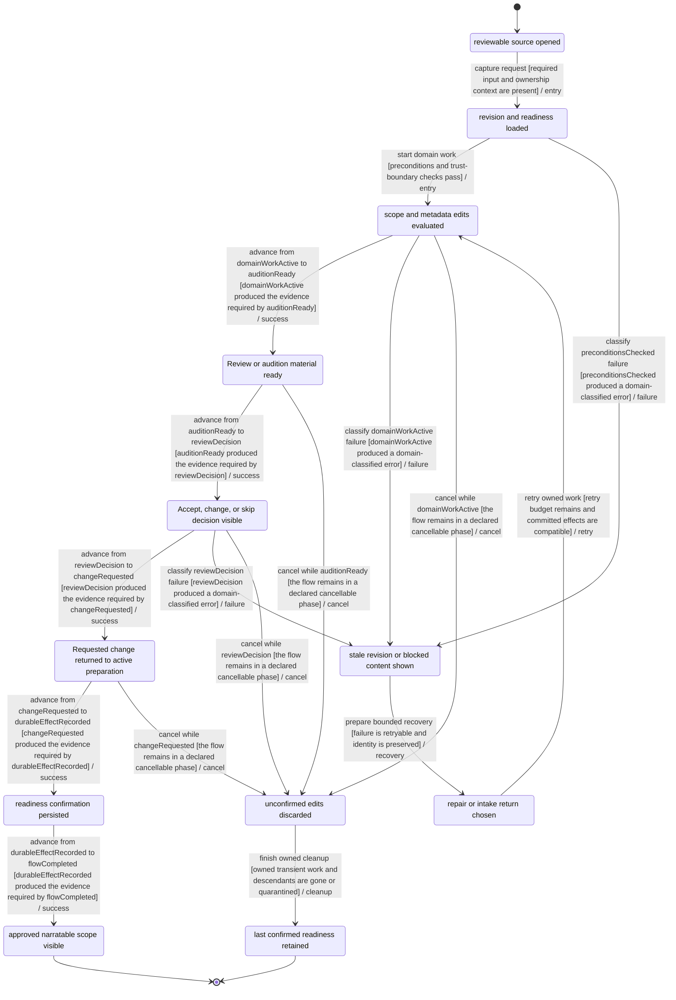
```mermaid
stateDiagram-v2
  state "reviewable source opened" as SRC_REVIEW_001_REQUESTCAPTURED
  state "revision and readiness loaded" as SRC_REVIEW_001_PRECONDITIONSCHECKED
  state "scope and metadata edits evaluated" as SRC_REVIEW_001_DOMAINWORKACTIVE
  state "readiness confirmation persisted" as SRC_REVIEW_001_DURABLEEFFECTRECORDED
  state "approved narratable scope visible" as SRC_REVIEW_001_FLOWCOMPLETED
  state "stale revision or blocked content shown" as SRC_REVIEW_001_CLASSIFIEDFAILURE
  state "unconfirmed edits discarded" as SRC_REVIEW_001_CLEANUPINPROGRESS
  state "last confirmed readiness retained" as SRC_REVIEW_001_CANCELEDCLEAN
  state "repair or intake return chosen" as SRC_REVIEW_001_RECOVERYCONTEXTREADY
  state "Review or audition material ready" as SRC_REVIEW_001_AUDITIONREADY
  state "Accept, change, or skip decision visible" as SRC_REVIEW_001_REVIEWDECISION
  state "Requested change returned to active preparation" as SRC_REVIEW_001_CHANGEREQUESTED
  [*] --> SRC_REVIEW_001_REQUESTCAPTURED
  SRC_REVIEW_001_REQUESTCAPTURED --> SRC_REVIEW_001_PRECONDITIONSCHECKED: capture request [required input and ownership context are present] / entry
  SRC_REVIEW_001_PRECONDITIONSCHECKED --> SRC_REVIEW_001_DOMAINWORKACTIVE: start domain work [preconditions and trust-boundary checks pass] / entry
  SRC_REVIEW_001_DOMAINWORKACTIVE --> SRC_REVIEW_001_AUDITIONREADY: advance from domainWorkActive to auditionReady [domainWorkActive produced the evidence required by auditionReady] / success
  SRC_REVIEW_001_AUDITIONREADY --> SRC_REVIEW_001_REVIEWDECISION: advance from auditionReady to reviewDecision [auditionReady produced the evidence required by reviewDecision] / success
  SRC_REVIEW_001_REVIEWDECISION --> SRC_REVIEW_001_CHANGEREQUESTED: advance from reviewDecision to changeRequested [reviewDecision produced the evidence required by changeRequested] / success
  SRC_REVIEW_001_CHANGEREQUESTED --> SRC_REVIEW_001_DURABLEEFFECTRECORDED: advance from changeRequested to durableEffectRecorded [changeRequested produced the evidence required by durableEffectRecorded] / success
  SRC_REVIEW_001_DURABLEEFFECTRECORDED --> SRC_REVIEW_001_FLOWCOMPLETED: advance from durableEffectRecorded to flowCompleted [durableEffectRecorded produced the evidence required by flowCompleted] / success
  SRC_REVIEW_001_PRECONDITIONSCHECKED --> SRC_REVIEW_001_CLASSIFIEDFAILURE: classify preconditionsChecked failure [preconditionsChecked produced a domain-classified error] / failure
  SRC_REVIEW_001_DOMAINWORKACTIVE --> SRC_REVIEW_001_CLASSIFIEDFAILURE: classify domainWorkActive failure [domainWorkActive produced a domain-classified error] / failure
  SRC_REVIEW_001_REVIEWDECISION --> SRC_REVIEW_001_CLASSIFIEDFAILURE: classify reviewDecision failure [reviewDecision produced a domain-classified error] / failure
  SRC_REVIEW_001_CLASSIFIEDFAILURE --> SRC_REVIEW_001_RECOVERYCONTEXTREADY: prepare bounded recovery [failure is retryable and identity is preserved] / recovery
  SRC_REVIEW_001_RECOVERYCONTEXTREADY --> SRC_REVIEW_001_DOMAINWORKACTIVE: retry owned work [retry budget remains and committed effects are compatible] / retry
  SRC_REVIEW_001_DOMAINWORKACTIVE --> SRC_REVIEW_001_CLEANUPINPROGRESS: cancel while domainWorkActive [the flow remains in a declared cancellable phase] / cancel
  SRC_REVIEW_001_AUDITIONREADY --> SRC_REVIEW_001_CLEANUPINPROGRESS: cancel while auditionReady [the flow remains in a declared cancellable phase] / cancel
  SRC_REVIEW_001_REVIEWDECISION --> SRC_REVIEW_001_CLEANUPINPROGRESS: cancel while reviewDecision [the flow remains in a declared cancellable phase] / cancel
  SRC_REVIEW_001_CHANGEREQUESTED --> SRC_REVIEW_001_CLEANUPINPROGRESS: cancel while changeRequested [the flow remains in a declared cancellable phase] / cancel
  SRC_REVIEW_001_CLEANUPINPROGRESS --> SRC_REVIEW_001_CANCELEDCLEAN: finish owned cleanup [owned transient work and descendants are gone or quarantined] / cleanup
  SRC_REVIEW_001_FLOWCOMPLETED --> [*]
  SRC_REVIEW_001_CANCELEDCLEAN --> [*]
```
## SRC-MANIFEST-001 — Source-manifest snapshot, event replay, and reconnect recovery

- Primary owner: `source-data`
- Architecture family: `event-stream`
- Shared subgraphs: `classified-failure-retry`, `cancellable-cleanup`
- Secondary owners: none
- Shared concerns: `RECOVERY`, `LOCAL_ORIGIN_AUTH`, `PRIVACY`, `ACCESSIBILITY`, `PERFORMANCE_TELEMETRY`, `OPERATIONAL_STATUS`

### Route ownership

- `GET /api/source-manifest/events`
- `GET /api/source-manifest/events/stream`
- `GET /api/source-manifest/snapshot`

### State contract

| State | Label | Kind | Authority | UI observable |
| --- | --- | --- | --- | --- |
| `SRC_MANIFEST_001_REQUESTCAPTURED` | source manifest subscription requested | `stable` | `frontend` | UI shows source manifest subscription requested |
| `SRC_MANIFEST_001_PRECONDITIONSCHECKED` | source identity and cursor checked | `stable` | `backend` | UI shows validation progress for source manifest synchronization |
| `SRC_MANIFEST_001_DOMAINWORKACTIVE` | snapshot or event replay loading | `transient` | `backend` | UI shows snapshot or event replay loading |
| `SRC_MANIFEST_001_DURABLEEFFECTRECORDED` | snapshot sequence adopted as authoritative | `stable` | `backend` | UI shows committed source manifest synchronization state |
| `SRC_MANIFEST_001_FLOWCOMPLETED` | live manifest stream current | `terminal-success` | `shared` | UI shows live manifest stream current |
| `SRC_MANIFEST_001_CLASSIFIEDFAILURE` | gap disconnect or stale cursor detected | `stable-failure` | `backend` | UI explains gap disconnect or stale cursor detected |
| `SRC_MANIFEST_001_CLEANUPINPROGRESS` | event stream closing | `transient` | `backend` | UI shows event stream closing |
| `SRC_MANIFEST_001_CANCELEDCLEAN` | last authoritative snapshot retained | `terminal-canceled` | `shared` | UI shows last authoritative snapshot retained |
| `SRC_MANIFEST_001_RECOVERYCONTEXTREADY` | fresh snapshot requested before resubscribe | `stable` | `shared` | UI offers fresh snapshot requested before resubscribe |
| `SRC_MANIFEST_001_CURSORREPLAYED` | Durable cursor replay completed | `stable` | `backend` | Durable cursor replay completed; the UI exposes this state or an actionable non-visual status. |
| `SRC_MANIFEST_001_GAPDECISION` | Gap, duplicate, or stale event decision made | `stable` | `shared` | Gap, duplicate, or stale event decision made; the UI exposes this state or an actionable non-visual status. |
| `SRC_MANIFEST_001_SNAPSHOTRECONCILED` | Canonical snapshot and stream cursor agree | `stable` | `shared` | Canonical snapshot and stream cursor agree; the UI exposes this state or an actionable non-visual status. |

### Semantic roles

- `requestCaptured` → `SRC_MANIFEST_001_REQUESTCAPTURED`
- `preconditionsChecked` → `SRC_MANIFEST_001_PRECONDITIONSCHECKED`
- `domainWorkActive` → `SRC_MANIFEST_001_DOMAINWORKACTIVE`
- `durableEffectRecorded` → `SRC_MANIFEST_001_DURABLEEFFECTRECORDED`
- `flowCompleted` → `SRC_MANIFEST_001_FLOWCOMPLETED`
- `classifiedFailure` → `SRC_MANIFEST_001_CLASSIFIEDFAILURE`
- `cleanupInProgress` → `SRC_MANIFEST_001_CLEANUPINPROGRESS`
- `canceledClean` → `SRC_MANIFEST_001_CANCELEDCLEAN`
- `recoveryContextReady` → `SRC_MANIFEST_001_RECOVERYCONTEXTREADY`
- `cursorReplayed` → `SRC_MANIFEST_001_CURSORREPLAYED`
- `gapDecision` → `SRC_MANIFEST_001_GAPDECISION`
- `snapshotReconciled` → `SRC_MANIFEST_001_SNAPSHOTRECONCILED`

### Required decisions

- **gapDecision** at `SRC_MANIFEST_001_GAPDECISION`: `continue` → `SRC-MANIFEST-001:T05:success`, `reject` → `SRC-MANIFEST-001:T10:failure`, `cancel` → `SRC-MANIFEST-001:T15:cancel`

### Family and flow invariants

- Every event-stream flow exposes its required roles as canonical states.
- Every event-stream decision has named outgoing outcomes bound to transition IDs.
- SRC-MANIFEST-001 commit is not reached until snapshot sequence adopted as authoritative
- SRC-MANIFEST-001 cancellation phases equal ordinary cancel-edge sources exactly.
- Frozen BIC-06 planned-evidence ownership is provenance; responsive replacement ownership RSP-03/RSP-05 is planned only and is not covered or implemented.

### Transitions

| ID | From | To | Event | Guard | Branch |
| --- | --- | --- | --- | --- | --- |
| `SRC-MANIFEST-001:T01:entry` | `SRC_MANIFEST_001_REQUESTCAPTURED` | `SRC_MANIFEST_001_PRECONDITIONSCHECKED` | capture request | required input and ownership context are present | `entry` |
| `SRC-MANIFEST-001:T02:entry` | `SRC_MANIFEST_001_PRECONDITIONSCHECKED` | `SRC_MANIFEST_001_DOMAINWORKACTIVE` | start domain work | preconditions and trust-boundary checks pass | `entry` |
| `SRC-MANIFEST-001:T03:success` | `SRC_MANIFEST_001_DOMAINWORKACTIVE` | `SRC_MANIFEST_001_CURSORREPLAYED` | advance from domainWorkActive to cursorReplayed | domainWorkActive produced the evidence required by cursorReplayed | `success` |
| `SRC-MANIFEST-001:T04:success` | `SRC_MANIFEST_001_CURSORREPLAYED` | `SRC_MANIFEST_001_GAPDECISION` | advance from cursorReplayed to gapDecision | cursorReplayed produced the evidence required by gapDecision | `success` |
| `SRC-MANIFEST-001:T05:success` | `SRC_MANIFEST_001_GAPDECISION` | `SRC_MANIFEST_001_SNAPSHOTRECONCILED` | advance from gapDecision to snapshotReconciled | gapDecision produced the evidence required by snapshotReconciled | `success` |
| `SRC-MANIFEST-001:T06:success` | `SRC_MANIFEST_001_SNAPSHOTRECONCILED` | `SRC_MANIFEST_001_DURABLEEFFECTRECORDED` | advance from snapshotReconciled to durableEffectRecorded | snapshotReconciled produced the evidence required by durableEffectRecorded | `success` |
| `SRC-MANIFEST-001:T07:success` | `SRC_MANIFEST_001_DURABLEEFFECTRECORDED` | `SRC_MANIFEST_001_FLOWCOMPLETED` | advance from durableEffectRecorded to flowCompleted | durableEffectRecorded produced the evidence required by flowCompleted | `success` |
| `SRC-MANIFEST-001:T08:failure` | `SRC_MANIFEST_001_PRECONDITIONSCHECKED` | `SRC_MANIFEST_001_CLASSIFIEDFAILURE` | classify preconditionsChecked failure | preconditionsChecked produced a domain-classified error | `failure` |
| `SRC-MANIFEST-001:T09:failure` | `SRC_MANIFEST_001_DOMAINWORKACTIVE` | `SRC_MANIFEST_001_CLASSIFIEDFAILURE` | classify domainWorkActive failure | domainWorkActive produced a domain-classified error | `failure` |
| `SRC-MANIFEST-001:T10:failure` | `SRC_MANIFEST_001_GAPDECISION` | `SRC_MANIFEST_001_CLASSIFIEDFAILURE` | classify gapDecision failure | gapDecision produced a domain-classified error | `failure` |
| `SRC-MANIFEST-001:T11:recovery` | `SRC_MANIFEST_001_CLASSIFIEDFAILURE` | `SRC_MANIFEST_001_RECOVERYCONTEXTREADY` | prepare bounded recovery | failure is retryable and identity is preserved | `recovery` |
| `SRC-MANIFEST-001:T12:retry` | `SRC_MANIFEST_001_RECOVERYCONTEXTREADY` | `SRC_MANIFEST_001_DOMAINWORKACTIVE` | retry owned work | retry budget remains and committed effects are compatible | `retry` |
| `SRC-MANIFEST-001:T13:cancel` | `SRC_MANIFEST_001_DOMAINWORKACTIVE` | `SRC_MANIFEST_001_CLEANUPINPROGRESS` | cancel while domainWorkActive | the flow remains in a declared cancellable phase | `cancel` |
| `SRC-MANIFEST-001:T14:cancel` | `SRC_MANIFEST_001_CURSORREPLAYED` | `SRC_MANIFEST_001_CLEANUPINPROGRESS` | cancel while cursorReplayed | the flow remains in a declared cancellable phase | `cancel` |
| `SRC-MANIFEST-001:T15:cancel` | `SRC_MANIFEST_001_GAPDECISION` | `SRC_MANIFEST_001_CLEANUPINPROGRESS` | cancel while gapDecision | the flow remains in a declared cancellable phase | `cancel` |
| `SRC-MANIFEST-001:T16:cancel` | `SRC_MANIFEST_001_SNAPSHOTRECONCILED` | `SRC_MANIFEST_001_CLEANUPINPROGRESS` | cancel while snapshotReconciled | the flow remains in a declared cancellable phase | `cancel` |
| `SRC-MANIFEST-001:T17:cleanup` | `SRC_MANIFEST_001_CLEANUPINPROGRESS` | `SRC_MANIFEST_001_CANCELEDCLEAN` | finish owned cleanup | owned transient work and descendants are gone or quarantined | `cleanup` |

### Evidence

- `frontend/src/features/source-manifest/sourceManifestStore.test.ts` — Executable source anchors only; no transition closure is claimed without a FLOW_ASSERT marker.
  - `keys cache entries by full source/revision/manifest identity` — transitions: none (source anchor only)
- `backend/internal/httpapi/source_manifest_routes_test.go` — Executable source anchors only; no transition closure is claimed without a FLOW_ASSERT marker.
  - `TestSourceManifestEventReplayAndSnapshotRoutes` — transitions: none (source anchor only)
  - `TestSourceManifestStreamRouteReplaysEventsOnceWithoutGap` — transitions: none (source anchor only)
  - `TestSourceManifestStreamRouteSignalsGapWhenReplayLimitTruncatesBacklog` — transitions: none (source anchor only)
  - `TestSourceManifestRoutesValidateBadRequestsAndMissingSnapshot` — transitions: none (source anchor only)

### Planned transition evidence

- `SRC-MANIFEST-001:T01:entry`, `SRC-MANIFEST-001:T02:entry`, `SRC-MANIFEST-001:T03:success`, `SRC-MANIFEST-001:T04:success`, `SRC-MANIFEST-001:T05:success`, `SRC-MANIFEST-001:T06:success`, `SRC-MANIFEST-001:T07:success`, `SRC-MANIFEST-001:T08:failure`, `SRC-MANIFEST-001:T09:failure`, `SRC-MANIFEST-001:T10:failure`, `SRC-MANIFEST-001:T11:recovery`, `SRC-MANIFEST-001:T12:retry`, `SRC-MANIFEST-001:T13:cancel`, `SRC-MANIFEST-001:T14:cancel`, `SRC-MANIFEST-001:T15:cancel`, `SRC-MANIFEST-001:T16:cancel`, `SRC-MANIFEST-001:T17:cleanup` → `BIC-06`; verify with `mise exec -- pnpm --dir frontend exec vitest run frontend/src/features/source-manifest/sourceManifestStore.test.ts` — Owner issue must add transition-specific executable FLOW_ASSERT markers and assertions before closeout.

### Mermaid

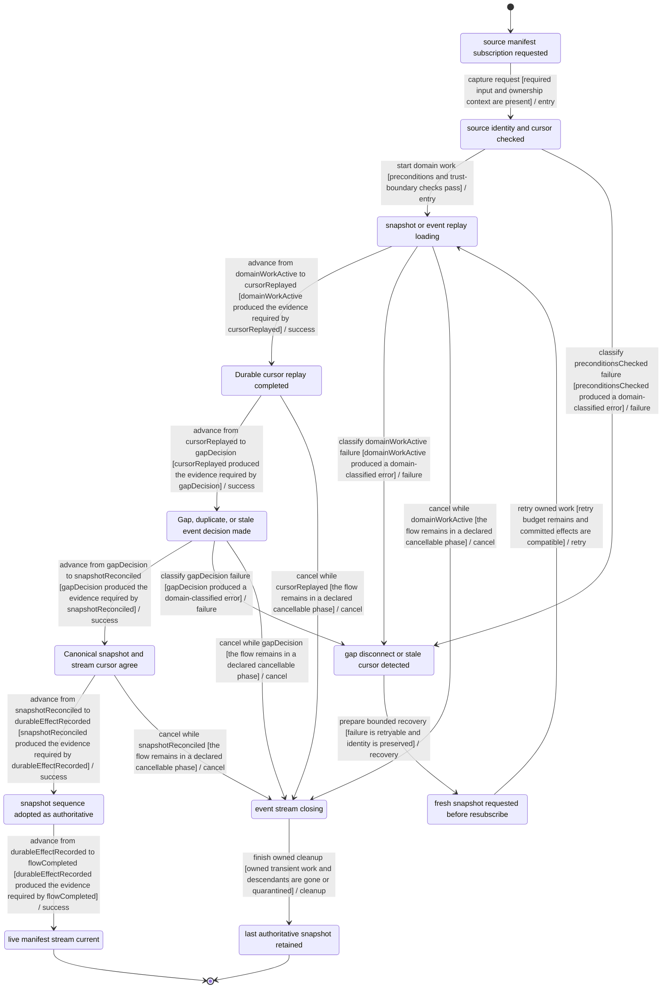
```mermaid
stateDiagram-v2
  state "source manifest subscription requested" as SRC_MANIFEST_001_REQUESTCAPTURED
  state "source identity and cursor checked" as SRC_MANIFEST_001_PRECONDITIONSCHECKED
  state "snapshot or event replay loading" as SRC_MANIFEST_001_DOMAINWORKACTIVE
  state "snapshot sequence adopted as authoritative" as SRC_MANIFEST_001_DURABLEEFFECTRECORDED
  state "live manifest stream current" as SRC_MANIFEST_001_FLOWCOMPLETED
  state "gap disconnect or stale cursor detected" as SRC_MANIFEST_001_CLASSIFIEDFAILURE
  state "event stream closing" as SRC_MANIFEST_001_CLEANUPINPROGRESS
  state "last authoritative snapshot retained" as SRC_MANIFEST_001_CANCELEDCLEAN
  state "fresh snapshot requested before resubscribe" as SRC_MANIFEST_001_RECOVERYCONTEXTREADY
  state "Durable cursor replay completed" as SRC_MANIFEST_001_CURSORREPLAYED
  state "Gap, duplicate, or stale event decision made" as SRC_MANIFEST_001_GAPDECISION
  state "Canonical snapshot and stream cursor agree" as SRC_MANIFEST_001_SNAPSHOTRECONCILED
  [*] --> SRC_MANIFEST_001_REQUESTCAPTURED
  SRC_MANIFEST_001_REQUESTCAPTURED --> SRC_MANIFEST_001_PRECONDITIONSCHECKED: capture request [required input and ownership context are present] / entry
  SRC_MANIFEST_001_PRECONDITIONSCHECKED --> SRC_MANIFEST_001_DOMAINWORKACTIVE: start domain work [preconditions and trust-boundary checks pass] / entry
  SRC_MANIFEST_001_DOMAINWORKACTIVE --> SRC_MANIFEST_001_CURSORREPLAYED: advance from domainWorkActive to cursorReplayed [domainWorkActive produced the evidence required by cursorReplayed] / success
  SRC_MANIFEST_001_CURSORREPLAYED --> SRC_MANIFEST_001_GAPDECISION: advance from cursorReplayed to gapDecision [cursorReplayed produced the evidence required by gapDecision] / success
  SRC_MANIFEST_001_GAPDECISION --> SRC_MANIFEST_001_SNAPSHOTRECONCILED: advance from gapDecision to snapshotReconciled [gapDecision produced the evidence required by snapshotReconciled] / success
  SRC_MANIFEST_001_SNAPSHOTRECONCILED --> SRC_MANIFEST_001_DURABLEEFFECTRECORDED: advance from snapshotReconciled to durableEffectRecorded [snapshotReconciled produced the evidence required by durableEffectRecorded] / success
  SRC_MANIFEST_001_DURABLEEFFECTRECORDED --> SRC_MANIFEST_001_FLOWCOMPLETED: advance from durableEffectRecorded to flowCompleted [durableEffectRecorded produced the evidence required by flowCompleted] / success
  SRC_MANIFEST_001_PRECONDITIONSCHECKED --> SRC_MANIFEST_001_CLASSIFIEDFAILURE: classify preconditionsChecked failure [preconditionsChecked produced a domain-classified error] / failure
  SRC_MANIFEST_001_DOMAINWORKACTIVE --> SRC_MANIFEST_001_CLASSIFIEDFAILURE: classify domainWorkActive failure [domainWorkActive produced a domain-classified error] / failure
  SRC_MANIFEST_001_GAPDECISION --> SRC_MANIFEST_001_CLASSIFIEDFAILURE: classify gapDecision failure [gapDecision produced a domain-classified error] / failure
  SRC_MANIFEST_001_CLASSIFIEDFAILURE --> SRC_MANIFEST_001_RECOVERYCONTEXTREADY: prepare bounded recovery [failure is retryable and identity is preserved] / recovery
  SRC_MANIFEST_001_RECOVERYCONTEXTREADY --> SRC_MANIFEST_001_DOMAINWORKACTIVE: retry owned work [retry budget remains and committed effects are compatible] / retry
  SRC_MANIFEST_001_DOMAINWORKACTIVE --> SRC_MANIFEST_001_CLEANUPINPROGRESS: cancel while domainWorkActive [the flow remains in a declared cancellable phase] / cancel
  SRC_MANIFEST_001_CURSORREPLAYED --> SRC_MANIFEST_001_CLEANUPINPROGRESS: cancel while cursorReplayed [the flow remains in a declared cancellable phase] / cancel
  SRC_MANIFEST_001_GAPDECISION --> SRC_MANIFEST_001_CLEANUPINPROGRESS: cancel while gapDecision [the flow remains in a declared cancellable phase] / cancel
  SRC_MANIFEST_001_SNAPSHOTRECONCILED --> SRC_MANIFEST_001_CLEANUPINPROGRESS: cancel while snapshotReconciled [the flow remains in a declared cancellable phase] / cancel
  SRC_MANIFEST_001_CLEANUPINPROGRESS --> SRC_MANIFEST_001_CANCELEDCLEAN: finish owned cleanup [owned transient work and descendants are gone or quarantined] / cleanup
  SRC_MANIFEST_001_FLOWCOMPLETED --> [*]
  SRC_MANIFEST_001_CANCELEDCLEAN --> [*]
```
## POLICY-RESOLVE-001 — Speech-policy precedence and effective decisions

- Primary owner: `speech-audio`
- Architecture family: `planning-policy`
- Shared subgraphs: `classified-failure-retry`, `cancellable-cleanup`
- Secondary owners: none
- Shared concerns: `RECOVERY`, `PRIVACY`, `I18N`, `ACCESSIBILITY`, `OPERATIONAL_STATUS`

### Route ownership

- `DELETE /api/projects/:id/speech-policy/profiles/:profileId`
- `GET /api/policies/definition`
- `GET /api/policies/profiles`
- `GET /api/projects/:id/speech-policy`
- `PATCH /api/book-sources/:id/speech-policy`
- `PATCH /api/projects/:id/speech-policy`
- `PATCH /api/projects/:id/speech-policy/profiles/:profileId`
- `PATCH /api/source-preps/:id/speech-policy`
- `POST /api/book-sources/:id/scope/speech-policy/preview`
- `POST /api/content-ir/:id/speech-policy/preview`
- `POST /api/math/preview`
- `POST /api/projects/:id/speech-policy/profiles`
- `POST /api/source-preps/:id/speech-policy/preview`

### State contract

| State | Label | Kind | Authority | UI observable |
| --- | --- | --- | --- | --- |
| `POLICY_RESOLVE_001_REQUESTCAPTURED` | speech policy requested or edited | `stable` | `frontend` | UI shows speech policy requested or edited |
| `POLICY_RESOLVE_001_PRECONDITIONSCHECKED` | profile and overrides normalized | `stable` | `backend` | UI shows validation progress for speech policy resolution |
| `POLICY_RESOLVE_001_DOMAINWORKACTIVE` | project source and session precedence resolving | `transient` | `backend` | UI shows project source and session precedence resolving |
| `POLICY_RESOLVE_001_DURABLEEFFECTRECORDED` | effective policy settings accepted | `stable` | `backend` | UI shows committed speech policy resolution state |
| `POLICY_RESOLVE_001_FLOWCOMPLETED` | explainable effective policy visible | `terminal-success` | `shared` | UI shows explainable effective policy visible |
| `POLICY_RESOLVE_001_CLASSIFIEDFAILURE` | invalid profile or unsupported mode shown | `stable-failure` | `backend` | UI explains invalid profile or unsupported mode shown |
| `POLICY_RESOLVE_001_CLEANUPINPROGRESS` | policy preview abandoned | `transient` | `backend` | UI shows policy preview abandoned |
| `POLICY_RESOLVE_001_CANCELEDCLEAN` | last persisted policy remains active | `terminal-canceled` | `shared` | UI shows last persisted policy remains active |
| `POLICY_RESOLVE_001_RECOVERYCONTEXTREADY` | built-in fallback or corrected override selected | `stable` | `shared` | UI offers built-in fallback or corrected override selected |
| `POLICY_RESOLVE_001_PLANDRAFTED` | Deterministic plan draft materialized | `stable` | `backend` | Deterministic plan draft materialized; the UI exposes this state or an actionable non-visual status. |
| `POLICY_RESOLVE_001_POLICYDECISION` | Policy conflict, fallback, or acceptance decided | `stable` | `shared` | Policy conflict, fallback, or acceptance decided; the UI exposes this state or an actionable non-visual status. |

### Semantic roles

- `requestCaptured` → `POLICY_RESOLVE_001_REQUESTCAPTURED`
- `preconditionsChecked` → `POLICY_RESOLVE_001_PRECONDITIONSCHECKED`
- `domainWorkActive` → `POLICY_RESOLVE_001_DOMAINWORKACTIVE`
- `durableEffectRecorded` → `POLICY_RESOLVE_001_DURABLEEFFECTRECORDED`
- `flowCompleted` → `POLICY_RESOLVE_001_FLOWCOMPLETED`
- `classifiedFailure` → `POLICY_RESOLVE_001_CLASSIFIEDFAILURE`
- `cleanupInProgress` → `POLICY_RESOLVE_001_CLEANUPINPROGRESS`
- `canceledClean` → `POLICY_RESOLVE_001_CANCELEDCLEAN`
- `recoveryContextReady` → `POLICY_RESOLVE_001_RECOVERYCONTEXTREADY`
- `planDrafted` → `POLICY_RESOLVE_001_PLANDRAFTED`
- `policyDecision` → `POLICY_RESOLVE_001_POLICYDECISION`

### Required decisions

- **policyDecision** at `POLICY_RESOLVE_001_POLICYDECISION`: `continue` → `POLICY-RESOLVE-001:T05:success`, `reject` → `POLICY-RESOLVE-001:T09:failure`, `cancel` → `POLICY-RESOLVE-001:T14:cancel`

### Family and flow invariants

- Every planning-policy flow exposes its required roles as canonical states.
- Every planning-policy decision has named outgoing outcomes bound to transition IDs.
- POLICY-RESOLVE-001 commit is not reached until effective policy settings accepted
- POLICY-RESOLVE-001 cancellation phases equal ordinary cancel-edge sources exactly.

### Transitions

| ID | From | To | Event | Guard | Branch |
| --- | --- | --- | --- | --- | --- |
| `POLICY-RESOLVE-001:T01:entry` | `POLICY_RESOLVE_001_REQUESTCAPTURED` | `POLICY_RESOLVE_001_PRECONDITIONSCHECKED` | capture request | required input and ownership context are present | `entry` |
| `POLICY-RESOLVE-001:T02:entry` | `POLICY_RESOLVE_001_PRECONDITIONSCHECKED` | `POLICY_RESOLVE_001_DOMAINWORKACTIVE` | start domain work | preconditions and trust-boundary checks pass | `entry` |
| `POLICY-RESOLVE-001:T03:success` | `POLICY_RESOLVE_001_DOMAINWORKACTIVE` | `POLICY_RESOLVE_001_PLANDRAFTED` | advance from domainWorkActive to planDrafted | domainWorkActive produced the evidence required by planDrafted | `success` |
| `POLICY-RESOLVE-001:T04:success` | `POLICY_RESOLVE_001_PLANDRAFTED` | `POLICY_RESOLVE_001_POLICYDECISION` | advance from planDrafted to policyDecision | planDrafted produced the evidence required by policyDecision | `success` |
| `POLICY-RESOLVE-001:T05:success` | `POLICY_RESOLVE_001_POLICYDECISION` | `POLICY_RESOLVE_001_DURABLEEFFECTRECORDED` | advance from policyDecision to durableEffectRecorded | policyDecision produced the evidence required by durableEffectRecorded | `success` |
| `POLICY-RESOLVE-001:T06:success` | `POLICY_RESOLVE_001_DURABLEEFFECTRECORDED` | `POLICY_RESOLVE_001_FLOWCOMPLETED` | advance from durableEffectRecorded to flowCompleted | durableEffectRecorded produced the evidence required by flowCompleted | `success` |
| `POLICY-RESOLVE-001:T07:failure` | `POLICY_RESOLVE_001_PRECONDITIONSCHECKED` | `POLICY_RESOLVE_001_CLASSIFIEDFAILURE` | classify preconditionsChecked failure | preconditionsChecked produced a domain-classified error | `failure` |
| `POLICY-RESOLVE-001:T08:failure` | `POLICY_RESOLVE_001_DOMAINWORKACTIVE` | `POLICY_RESOLVE_001_CLASSIFIEDFAILURE` | classify domainWorkActive failure | domainWorkActive produced a domain-classified error | `failure` |
| `POLICY-RESOLVE-001:T09:failure` | `POLICY_RESOLVE_001_POLICYDECISION` | `POLICY_RESOLVE_001_CLASSIFIEDFAILURE` | classify policyDecision failure | policyDecision produced a domain-classified error | `failure` |
| `POLICY-RESOLVE-001:T10:recovery` | `POLICY_RESOLVE_001_CLASSIFIEDFAILURE` | `POLICY_RESOLVE_001_RECOVERYCONTEXTREADY` | prepare bounded recovery | failure is retryable and identity is preserved | `recovery` |
| `POLICY-RESOLVE-001:T11:retry` | `POLICY_RESOLVE_001_RECOVERYCONTEXTREADY` | `POLICY_RESOLVE_001_DOMAINWORKACTIVE` | retry owned work | retry budget remains and committed effects are compatible | `retry` |
| `POLICY-RESOLVE-001:T12:cancel` | `POLICY_RESOLVE_001_DOMAINWORKACTIVE` | `POLICY_RESOLVE_001_CLEANUPINPROGRESS` | cancel while domainWorkActive | the flow remains in a declared cancellable phase | `cancel` |
| `POLICY-RESOLVE-001:T13:cancel` | `POLICY_RESOLVE_001_PLANDRAFTED` | `POLICY_RESOLVE_001_CLEANUPINPROGRESS` | cancel while planDrafted | the flow remains in a declared cancellable phase | `cancel` |
| `POLICY-RESOLVE-001:T14:cancel` | `POLICY_RESOLVE_001_POLICYDECISION` | `POLICY_RESOLVE_001_CLEANUPINPROGRESS` | cancel while policyDecision | the flow remains in a declared cancellable phase | `cancel` |
| `POLICY-RESOLVE-001:T15:cleanup` | `POLICY_RESOLVE_001_CLEANUPINPROGRESS` | `POLICY_RESOLVE_001_CANCELEDCLEAN` | finish owned cleanup | owned transient work and descendants are gone or quarantined | `cleanup` |

### Evidence

- `backend/internal/policy/evaluator_test.go` — Executable source anchors only; no transition closure is claimed without a FLOW_ASSERT marker.
  - `TestProfileSnapshotsAcrossSharedCorpus` — transitions: none (source anchor only)
  - `TestBuiltInProfilesKeepReferencesOnDemandByDefault` — transitions: none (source anchor only)
  - `TestOverridePrecedenceIsDeterministic` — transitions: none (source anchor only)
  - `TestDefinitionExposesSharedPolicyFields` — transitions: none (source anchor only)

### Planned transition evidence

- `POLICY-RESOLVE-001:T01:entry`, `POLICY-RESOLVE-001:T02:entry`, `POLICY-RESOLVE-001:T03:success`, `POLICY-RESOLVE-001:T04:success`, `POLICY-RESOLVE-001:T05:success`, `POLICY-RESOLVE-001:T06:success`, `POLICY-RESOLVE-001:T07:failure`, `POLICY-RESOLVE-001:T08:failure`, `POLICY-RESOLVE-001:T09:failure`, `POLICY-RESOLVE-001:T10:recovery`, `POLICY-RESOLVE-001:T11:retry`, `POLICY-RESOLVE-001:T12:cancel`, `POLICY-RESOLVE-001:T13:cancel`, `POLICY-RESOLVE-001:T14:cancel`, `POLICY-RESOLVE-001:T15:cleanup` → `BIC-06`; verify with `cd backend && go test ./...` — Owner issue must add transition-specific executable FLOW_ASSERT markers and assertions before closeout.

### Mermaid

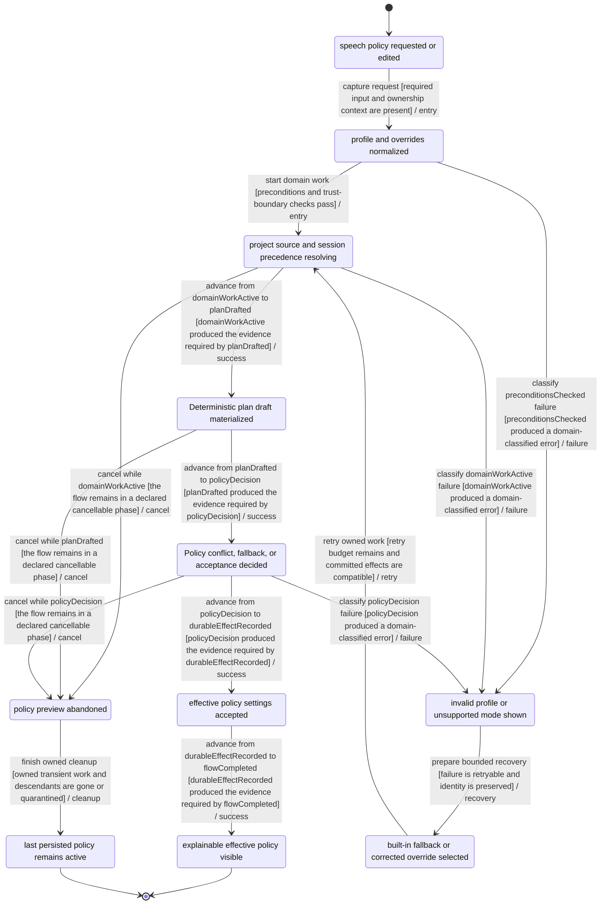
```mermaid
stateDiagram-v2
  state "speech policy requested or edited" as POLICY_RESOLVE_001_REQUESTCAPTURED
  state "profile and overrides normalized" as POLICY_RESOLVE_001_PRECONDITIONSCHECKED
  state "project source and session precedence resolving" as POLICY_RESOLVE_001_DOMAINWORKACTIVE
  state "effective policy settings accepted" as POLICY_RESOLVE_001_DURABLEEFFECTRECORDED
  state "explainable effective policy visible" as POLICY_RESOLVE_001_FLOWCOMPLETED
  state "invalid profile or unsupported mode shown" as POLICY_RESOLVE_001_CLASSIFIEDFAILURE
  state "policy preview abandoned" as POLICY_RESOLVE_001_CLEANUPINPROGRESS
  state "last persisted policy remains active" as POLICY_RESOLVE_001_CANCELEDCLEAN
  state "built-in fallback or corrected override selected" as POLICY_RESOLVE_001_RECOVERYCONTEXTREADY
  state "Deterministic plan draft materialized" as POLICY_RESOLVE_001_PLANDRAFTED
  state "Policy conflict, fallback, or acceptance decided" as POLICY_RESOLVE_001_POLICYDECISION
  [*] --> POLICY_RESOLVE_001_REQUESTCAPTURED
  POLICY_RESOLVE_001_REQUESTCAPTURED --> POLICY_RESOLVE_001_PRECONDITIONSCHECKED: capture request [required input and ownership context are present] / entry
  POLICY_RESOLVE_001_PRECONDITIONSCHECKED --> POLICY_RESOLVE_001_DOMAINWORKACTIVE: start domain work [preconditions and trust-boundary checks pass] / entry
  POLICY_RESOLVE_001_DOMAINWORKACTIVE --> POLICY_RESOLVE_001_PLANDRAFTED: advance from domainWorkActive to planDrafted [domainWorkActive produced the evidence required by planDrafted] / success
  POLICY_RESOLVE_001_PLANDRAFTED --> POLICY_RESOLVE_001_POLICYDECISION: advance from planDrafted to policyDecision [planDrafted produced the evidence required by policyDecision] / success
  POLICY_RESOLVE_001_POLICYDECISION --> POLICY_RESOLVE_001_DURABLEEFFECTRECORDED: advance from policyDecision to durableEffectRecorded [policyDecision produced the evidence required by durableEffectRecorded] / success
  POLICY_RESOLVE_001_DURABLEEFFECTRECORDED --> POLICY_RESOLVE_001_FLOWCOMPLETED: advance from durableEffectRecorded to flowCompleted [durableEffectRecorded produced the evidence required by flowCompleted] / success
  POLICY_RESOLVE_001_PRECONDITIONSCHECKED --> POLICY_RESOLVE_001_CLASSIFIEDFAILURE: classify preconditionsChecked failure [preconditionsChecked produced a domain-classified error] / failure
  POLICY_RESOLVE_001_DOMAINWORKACTIVE --> POLICY_RESOLVE_001_CLASSIFIEDFAILURE: classify domainWorkActive failure [domainWorkActive produced a domain-classified error] / failure
  POLICY_RESOLVE_001_POLICYDECISION --> POLICY_RESOLVE_001_CLASSIFIEDFAILURE: classify policyDecision failure [policyDecision produced a domain-classified error] / failure
  POLICY_RESOLVE_001_CLASSIFIEDFAILURE --> POLICY_RESOLVE_001_RECOVERYCONTEXTREADY: prepare bounded recovery [failure is retryable and identity is preserved] / recovery
  POLICY_RESOLVE_001_RECOVERYCONTEXTREADY --> POLICY_RESOLVE_001_DOMAINWORKACTIVE: retry owned work [retry budget remains and committed effects are compatible] / retry
  POLICY_RESOLVE_001_DOMAINWORKACTIVE --> POLICY_RESOLVE_001_CLEANUPINPROGRESS: cancel while domainWorkActive [the flow remains in a declared cancellable phase] / cancel
  POLICY_RESOLVE_001_PLANDRAFTED --> POLICY_RESOLVE_001_CLEANUPINPROGRESS: cancel while planDrafted [the flow remains in a declared cancellable phase] / cancel
  POLICY_RESOLVE_001_POLICYDECISION --> POLICY_RESOLVE_001_CLEANUPINPROGRESS: cancel while policyDecision [the flow remains in a declared cancellable phase] / cancel
  POLICY_RESOLVE_001_CLEANUPINPROGRESS --> POLICY_RESOLVE_001_CANCELEDCLEAN: finish owned cleanup [owned transient work and descendants are gone or quarantined] / cleanup
  POLICY_RESOLVE_001_FLOWCOMPLETED --> [*]
  POLICY_RESOLVE_001_CANCELEDCLEAN --> [*]
```
## SPEECH-PLAN-001 — Versioned speech-plan materialization and incremental segmentation

- Primary owner: `speech-audio`
- Architecture family: `planning-policy`
- Shared subgraphs: `classified-failure-retry`, `cancellable-cleanup`
- Secondary owners: none
- Shared concerns: `RECOVERY`, `FILESYSTEM`, `PRIVACY`, `I18N`, `ACCESSIBILITY`, `PERFORMANCE_TELEMETRY`, `OPERATIONAL_STATUS`

### Route ownership

- `GET /api/content-ir/:id/speech-plan`
- `GET /api/voice-jobs/:id/speech-plan`

### State contract

| State | Label | Kind | Authority | UI observable |
| --- | --- | --- | --- | --- |
| `SPEECH_PLAN_001_REQUESTCAPTURED` | narratable revision becomes available | `stable` | `frontend` | UI shows narratable revision becomes available |
| `SPEECH_PLAN_001_PRECONDITIONSCHECKED` | content IR policy and revision matched | `stable` | `backend` | UI shows validation progress for speech plan materialization |
| `SPEECH_PLAN_001_DOMAINWORKACTIVE` | earliest narratable prefix segmenting | `transient` | `backend` | UI shows earliest narratable prefix segmenting |
| `SPEECH_PLAN_001_DURABLEEFFECTRECORDED` | versioned speech plan persisted | `stable` | `backend` | UI shows committed speech plan materialization state |
| `SPEECH_PLAN_001_FLOWCOMPLETED` | current speech plan and playable prefix exposed | `terminal-success` | `shared` | UI shows current speech plan and playable prefix exposed |
| `SPEECH_PLAN_001_CLASSIFIEDFAILURE` | plan materialization failed or superseded | `stable-failure` | `backend` | UI explains plan materialization failed or superseded |
| `SPEECH_PLAN_001_CLEANUPINPROGRESS` | remaining segmentation stopping | `transient` | `backend` | UI shows remaining segmentation stopping |
| `SPEECH_PLAN_001_CANCELEDCLEAN` | compatible committed prefix retained | `terminal-canceled` | `shared` | UI shows compatible committed prefix retained |
| `SPEECH_PLAN_001_RECOVERYCONTEXTREADY` | rebuild affected plan suffix selected | `stable` | `shared` | UI offers rebuild affected plan suffix selected |
| `SPEECH_PLAN_001_PLANDRAFTED` | Deterministic plan draft materialized | `stable` | `backend` | Deterministic plan draft materialized; the UI exposes this state or an actionable non-visual status. |
| `SPEECH_PLAN_001_POLICYDECISION` | Policy conflict, fallback, or acceptance decided | `stable` | `shared` | Policy conflict, fallback, or acceptance decided; the UI exposes this state or an actionable non-visual status. |

### Semantic roles

- `requestCaptured` → `SPEECH_PLAN_001_REQUESTCAPTURED`
- `preconditionsChecked` → `SPEECH_PLAN_001_PRECONDITIONSCHECKED`
- `domainWorkActive` → `SPEECH_PLAN_001_DOMAINWORKACTIVE`
- `durableEffectRecorded` → `SPEECH_PLAN_001_DURABLEEFFECTRECORDED`
- `flowCompleted` → `SPEECH_PLAN_001_FLOWCOMPLETED`
- `classifiedFailure` → `SPEECH_PLAN_001_CLASSIFIEDFAILURE`
- `cleanupInProgress` → `SPEECH_PLAN_001_CLEANUPINPROGRESS`
- `canceledClean` → `SPEECH_PLAN_001_CANCELEDCLEAN`
- `recoveryContextReady` → `SPEECH_PLAN_001_RECOVERYCONTEXTREADY`
- `planDrafted` → `SPEECH_PLAN_001_PLANDRAFTED`
- `policyDecision` → `SPEECH_PLAN_001_POLICYDECISION`

### Required decisions

- **policyDecision** at `SPEECH_PLAN_001_POLICYDECISION`: `continue` → `SPEECH-PLAN-001:T05:success`, `reject` → `SPEECH-PLAN-001:T09:failure`, `cancel` → `SPEECH-PLAN-001:T14:cancel`

### Family and flow invariants

- Every planning-policy flow exposes its required roles as canonical states.
- Every planning-policy decision has named outgoing outcomes bound to transition IDs.
- SPEECH-PLAN-001 commit is not reached until versioned speech plan persisted
- SPEECH-PLAN-001 cancellation phases equal ordinary cancel-edge sources exactly.
- Frozen BIC-06 planned-evidence ownership is provenance; responsive replacement ownership RSP-04 is planned only and is not covered or implemented.

### Transitions

| ID | From | To | Event | Guard | Branch |
| --- | --- | --- | --- | --- | --- |
| `SPEECH-PLAN-001:T01:entry` | `SPEECH_PLAN_001_REQUESTCAPTURED` | `SPEECH_PLAN_001_PRECONDITIONSCHECKED` | capture request | required input and ownership context are present | `entry` |
| `SPEECH-PLAN-001:T02:entry` | `SPEECH_PLAN_001_PRECONDITIONSCHECKED` | `SPEECH_PLAN_001_DOMAINWORKACTIVE` | start domain work | preconditions and trust-boundary checks pass | `entry` |
| `SPEECH-PLAN-001:T03:success` | `SPEECH_PLAN_001_DOMAINWORKACTIVE` | `SPEECH_PLAN_001_PLANDRAFTED` | advance from domainWorkActive to planDrafted | domainWorkActive produced the evidence required by planDrafted | `success` |
| `SPEECH-PLAN-001:T04:success` | `SPEECH_PLAN_001_PLANDRAFTED` | `SPEECH_PLAN_001_POLICYDECISION` | advance from planDrafted to policyDecision | planDrafted produced the evidence required by policyDecision | `success` |
| `SPEECH-PLAN-001:T05:success` | `SPEECH_PLAN_001_POLICYDECISION` | `SPEECH_PLAN_001_DURABLEEFFECTRECORDED` | advance from policyDecision to durableEffectRecorded | policyDecision produced the evidence required by durableEffectRecorded | `success` |
| `SPEECH-PLAN-001:T06:success` | `SPEECH_PLAN_001_DURABLEEFFECTRECORDED` | `SPEECH_PLAN_001_FLOWCOMPLETED` | advance from durableEffectRecorded to flowCompleted | durableEffectRecorded produced the evidence required by flowCompleted | `success` |
| `SPEECH-PLAN-001:T07:failure` | `SPEECH_PLAN_001_PRECONDITIONSCHECKED` | `SPEECH_PLAN_001_CLASSIFIEDFAILURE` | classify preconditionsChecked failure | preconditionsChecked produced a domain-classified error | `failure` |
| `SPEECH-PLAN-001:T08:failure` | `SPEECH_PLAN_001_DOMAINWORKACTIVE` | `SPEECH_PLAN_001_CLASSIFIEDFAILURE` | classify domainWorkActive failure | domainWorkActive produced a domain-classified error | `failure` |
| `SPEECH-PLAN-001:T09:failure` | `SPEECH_PLAN_001_POLICYDECISION` | `SPEECH_PLAN_001_CLASSIFIEDFAILURE` | classify policyDecision failure | policyDecision produced a domain-classified error | `failure` |
| `SPEECH-PLAN-001:T10:recovery` | `SPEECH_PLAN_001_CLASSIFIEDFAILURE` | `SPEECH_PLAN_001_RECOVERYCONTEXTREADY` | prepare bounded recovery | failure is retryable and identity is preserved | `recovery` |
| `SPEECH-PLAN-001:T11:retry` | `SPEECH_PLAN_001_RECOVERYCONTEXTREADY` | `SPEECH_PLAN_001_DOMAINWORKACTIVE` | retry owned work | retry budget remains and committed effects are compatible | `retry` |
| `SPEECH-PLAN-001:T12:cancel` | `SPEECH_PLAN_001_DOMAINWORKACTIVE` | `SPEECH_PLAN_001_CLEANUPINPROGRESS` | cancel while domainWorkActive | the flow remains in a declared cancellable phase | `cancel` |
| `SPEECH-PLAN-001:T13:cancel` | `SPEECH_PLAN_001_PLANDRAFTED` | `SPEECH_PLAN_001_CLEANUPINPROGRESS` | cancel while planDrafted | the flow remains in a declared cancellable phase | `cancel` |
| `SPEECH-PLAN-001:T14:cancel` | `SPEECH_PLAN_001_POLICYDECISION` | `SPEECH_PLAN_001_CLEANUPINPROGRESS` | cancel while policyDecision | the flow remains in a declared cancellable phase | `cancel` |
| `SPEECH-PLAN-001:T15:cleanup` | `SPEECH_PLAN_001_CLEANUPINPROGRESS` | `SPEECH_PLAN_001_CANCELEDCLEAN` | finish owned cleanup | owned transient work and descendants are gone or quarantined | `cleanup` |

### Evidence

- `backend/internal/speechplan/speech_plan_test.go` — Executable source anchors only; no transition closure is claimed without a FLOW_ASSERT marker.
  - `TestBuildFromContentIRKeepsCitationFixturesSpeechSafe` — transitions: none (source anchor only)
  - `TestBuildFirstNarratablePrefixIncludesAvailablePrefixBeforeCompletion` — transitions: none (source anchor only)
  - `TestBuildFirstNarratablePrefixStopsAtGapAndExcludesLaterIsland` — transitions: none (source anchor only)
  - `TestBuildFirstNarratablePrefixKeepsSkippedUnitsOutOfSegments` — transitions: none (source anchor only)
  - `TestBuildFirstNarratablePrefixRejectsEmptyManifestIdentityIDs` — transitions: none (source anchor only)
  - `TestBuildFirstNarratablePrefixRejectsStaleManifestNodeID` — transitions: none (source anchor only)
  - `TestBuildFirstNarratablePrefixTreatsReadalongMembershipAsUnitIDsOnly` — transitions: none (source anchor only)
  - `TestBuildFirstNarratablePrefixRejectsNarratableUnitMissingContentIRNode` — transitions: none (source anchor only)
  - `TestBuildFirstNarratablePrefixRejectsDuplicateContentIRNodeIDs` — transitions: none (source anchor only)
  - `TestBuildFirstNarratablePrefixRejectsDuplicateManifestUnitIDs` — transitions: none (source anchor only)
  - `TestBuildFirstNarratablePrefixSegmentBindingsSurviveJSONRoundTrip` — transitions: none (source anchor only)
  - `TestBuildFirstNarratablePrefixUnknownOrCaseVariedReadinessStopsPrefix` — transitions: none (source anchor only)

### Planned transition evidence

- `SPEECH-PLAN-001:T01:entry`, `SPEECH-PLAN-001:T02:entry`, `SPEECH-PLAN-001:T03:success`, `SPEECH-PLAN-001:T04:success`, `SPEECH-PLAN-001:T05:success`, `SPEECH-PLAN-001:T06:success`, `SPEECH-PLAN-001:T07:failure`, `SPEECH-PLAN-001:T08:failure`, `SPEECH-PLAN-001:T09:failure`, `SPEECH-PLAN-001:T10:recovery`, `SPEECH-PLAN-001:T11:retry`, `SPEECH-PLAN-001:T12:cancel`, `SPEECH-PLAN-001:T13:cancel`, `SPEECH-PLAN-001:T14:cancel`, `SPEECH-PLAN-001:T15:cleanup` → `BIC-06`; verify with `cd backend && go test ./...` — Owner issue must add transition-specific executable FLOW_ASSERT markers and assertions before closeout.

### Mermaid

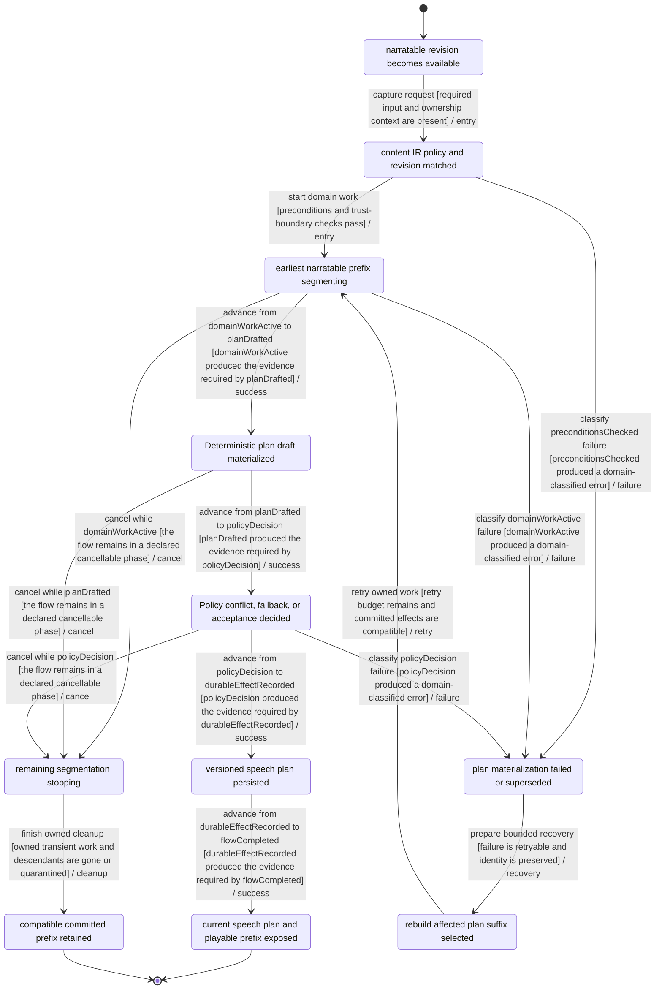
```mermaid
stateDiagram-v2
  state "narratable revision becomes available" as SPEECH_PLAN_001_REQUESTCAPTURED
  state "content IR policy and revision matched" as SPEECH_PLAN_001_PRECONDITIONSCHECKED
  state "earliest narratable prefix segmenting" as SPEECH_PLAN_001_DOMAINWORKACTIVE
  state "versioned speech plan persisted" as SPEECH_PLAN_001_DURABLEEFFECTRECORDED
  state "current speech plan and playable prefix exposed" as SPEECH_PLAN_001_FLOWCOMPLETED
  state "plan materialization failed or superseded" as SPEECH_PLAN_001_CLASSIFIEDFAILURE
  state "remaining segmentation stopping" as SPEECH_PLAN_001_CLEANUPINPROGRESS
  state "compatible committed prefix retained" as SPEECH_PLAN_001_CANCELEDCLEAN
  state "rebuild affected plan suffix selected" as SPEECH_PLAN_001_RECOVERYCONTEXTREADY
  state "Deterministic plan draft materialized" as SPEECH_PLAN_001_PLANDRAFTED
  state "Policy conflict, fallback, or acceptance decided" as SPEECH_PLAN_001_POLICYDECISION
  [*] --> SPEECH_PLAN_001_REQUESTCAPTURED
  SPEECH_PLAN_001_REQUESTCAPTURED --> SPEECH_PLAN_001_PRECONDITIONSCHECKED: capture request [required input and ownership context are present] / entry
  SPEECH_PLAN_001_PRECONDITIONSCHECKED --> SPEECH_PLAN_001_DOMAINWORKACTIVE: start domain work [preconditions and trust-boundary checks pass] / entry
  SPEECH_PLAN_001_DOMAINWORKACTIVE --> SPEECH_PLAN_001_PLANDRAFTED: advance from domainWorkActive to planDrafted [domainWorkActive produced the evidence required by planDrafted] / success
  SPEECH_PLAN_001_PLANDRAFTED --> SPEECH_PLAN_001_POLICYDECISION: advance from planDrafted to policyDecision [planDrafted produced the evidence required by policyDecision] / success
  SPEECH_PLAN_001_POLICYDECISION --> SPEECH_PLAN_001_DURABLEEFFECTRECORDED: advance from policyDecision to durableEffectRecorded [policyDecision produced the evidence required by durableEffectRecorded] / success
  SPEECH_PLAN_001_DURABLEEFFECTRECORDED --> SPEECH_PLAN_001_FLOWCOMPLETED: advance from durableEffectRecorded to flowCompleted [durableEffectRecorded produced the evidence required by flowCompleted] / success
  SPEECH_PLAN_001_PRECONDITIONSCHECKED --> SPEECH_PLAN_001_CLASSIFIEDFAILURE: classify preconditionsChecked failure [preconditionsChecked produced a domain-classified error] / failure
  SPEECH_PLAN_001_DOMAINWORKACTIVE --> SPEECH_PLAN_001_CLASSIFIEDFAILURE: classify domainWorkActive failure [domainWorkActive produced a domain-classified error] / failure
  SPEECH_PLAN_001_POLICYDECISION --> SPEECH_PLAN_001_CLASSIFIEDFAILURE: classify policyDecision failure [policyDecision produced a domain-classified error] / failure
  SPEECH_PLAN_001_CLASSIFIEDFAILURE --> SPEECH_PLAN_001_RECOVERYCONTEXTREADY: prepare bounded recovery [failure is retryable and identity is preserved] / recovery
  SPEECH_PLAN_001_RECOVERYCONTEXTREADY --> SPEECH_PLAN_001_DOMAINWORKACTIVE: retry owned work [retry budget remains and committed effects are compatible] / retry
  SPEECH_PLAN_001_DOMAINWORKACTIVE --> SPEECH_PLAN_001_CLEANUPINPROGRESS: cancel while domainWorkActive [the flow remains in a declared cancellable phase] / cancel
  SPEECH_PLAN_001_PLANDRAFTED --> SPEECH_PLAN_001_CLEANUPINPROGRESS: cancel while planDrafted [the flow remains in a declared cancellable phase] / cancel
  SPEECH_PLAN_001_POLICYDECISION --> SPEECH_PLAN_001_CLEANUPINPROGRESS: cancel while policyDecision [the flow remains in a declared cancellable phase] / cancel
  SPEECH_PLAN_001_CLEANUPINPROGRESS --> SPEECH_PLAN_001_CANCELEDCLEAN: finish owned cleanup [owned transient work and descendants are gone or quarantined] / cleanup
  SPEECH_PLAN_001_FLOWCOMPLETED --> [*]
  SPEECH_PLAN_001_CANCELEDCLEAN --> [*]
```
## LEXICON-001 — Pronunciation lexicon CRUD, precedence, import, and export

- Primary owner: `speech-audio`
- Architecture family: `durable-crud`
- Shared subgraphs: `classified-failure-retry`, `cancellable-cleanup`
- Secondary owners: none
- Shared concerns: `RECOVERY`, `LOCAL_ORIGIN_AUTH`, `FILESYSTEM`, `PRIVACY`, `I18N`, `ACCESSIBILITY`, `OPERATIONAL_STATUS`

### Route ownership

- `DELETE /api/projects/:id/lexicon/entries/:entryId`
- `DELETE /api/voice-profiles/:id/lexicon/entries/:entryId`
- `GET /api/projects/:id/lexicon`
- `GET /api/projects/:id/lexicon/export.pls`
- `GET /api/voice-profiles/:id/lexicon`
- `GET /api/voice-profiles/:id/lexicon/export.pls`
- `PATCH /api/projects/:id/lexicon/entries/:entryId`
- `PATCH /api/voice-profiles/:id/lexicon/entries/:entryId`
- `POST /api/projects/:id/lexicon`
- `POST /api/projects/:id/lexicon/import`
- `POST /api/voice-profiles/:id/lexicon`
- `POST /api/voice-profiles/:id/lexicon/import`

### State contract

| State | Label | Kind | Authority | UI observable |
| --- | --- | --- | --- | --- |
| `LEXICON_001_REQUESTCAPTURED` | lexicon view edit import or export requested | `stable` | `frontend` | UI shows lexicon view edit import or export requested |
| `LEXICON_001_PRECONDITIONSCHECKED` | scope entry syntax and PLS payload checked | `stable` | `backend` | UI shows validation progress for pronunciation lexicon change |
| `LEXICON_001_DOMAINWORKACTIVE` | lexicon precedence recomputing | `transient` | `backend` | UI shows lexicon precedence recomputing |
| `LEXICON_001_DURABLEEFFECTRECORDED` | scope lexicon atomically persisted | `stable` | `backend` | UI shows committed pronunciation lexicon change state |
| `LEXICON_001_FLOWCOMPLETED` | effective pronunciation entries visible | `terminal-success` | `shared` | UI shows effective pronunciation entries visible |
| `LEXICON_001_CLASSIFIEDFAILURE` | invalid conflict or import failure shown | `stable-failure` | `backend` | UI explains invalid conflict or import failure shown |
| `LEXICON_001_CLEANUPINPROGRESS` | lexicon import stopping | `transient` | `backend` | UI shows lexicon import stopping |
| `LEXICON_001_CANCELEDCLEAN` | prior lexicon remains authoritative | `terminal-canceled` | `shared` | UI shows prior lexicon remains authoritative |
| `LEXICON_001_RECOVERYCONTEXTREADY` | conflicting entries corrected or import retried | `stable` | `shared` | UI offers conflicting entries corrected or import retried |
| `LEXICON_001_WRITEPRECONDITIONS` | Write preconditions and revision token checked | `stable` | `backend` | Write preconditions and revision token checked; the UI exposes this state or an actionable non-visual status. |
| `LEXICON_001_CONFLICTDECISION` | Persist, reload, or reject conflict decision made | `stable` | `shared` | Persist, reload, or reject conflict decision made; the UI exposes this state or an actionable non-visual status. |
| `LEXICON_001_DURABLEREADBACK` | Committed record read back from durable storage | `stable` | `backend` | Committed record read back from durable storage; the UI exposes this state or an actionable non-visual status. |

### Semantic roles

- `requestCaptured` → `LEXICON_001_REQUESTCAPTURED`
- `preconditionsChecked` → `LEXICON_001_PRECONDITIONSCHECKED`
- `domainWorkActive` → `LEXICON_001_DOMAINWORKACTIVE`
- `durableEffectRecorded` → `LEXICON_001_DURABLEEFFECTRECORDED`
- `flowCompleted` → `LEXICON_001_FLOWCOMPLETED`
- `classifiedFailure` → `LEXICON_001_CLASSIFIEDFAILURE`
- `cleanupInProgress` → `LEXICON_001_CLEANUPINPROGRESS`
- `canceledClean` → `LEXICON_001_CANCELEDCLEAN`
- `recoveryContextReady` → `LEXICON_001_RECOVERYCONTEXTREADY`
- `writePreconditions` → `LEXICON_001_WRITEPRECONDITIONS`
- `conflictDecision` → `LEXICON_001_CONFLICTDECISION`
- `durableReadback` → `LEXICON_001_DURABLEREADBACK`

### Required decisions

- **conflictDecision** at `LEXICON_001_CONFLICTDECISION`: `continue` → `LEXICON-001:T05:success`, `reject` → `LEXICON-001:T10:failure`, `cancel` → `LEXICON-001:T15:cancel`

### Family and flow invariants

- Every durable-crud flow exposes its required roles as canonical states.
- Every durable-crud decision has named outgoing outcomes bound to transition IDs.
- LEXICON-001 commit is not reached until scope lexicon atomically persisted
- LEXICON-001 cancellation phases equal ordinary cancel-edge sources exactly.

### Transitions

| ID | From | To | Event | Guard | Branch |
| --- | --- | --- | --- | --- | --- |
| `LEXICON-001:T01:entry` | `LEXICON_001_REQUESTCAPTURED` | `LEXICON_001_PRECONDITIONSCHECKED` | capture request | required input and ownership context are present | `entry` |
| `LEXICON-001:T02:entry` | `LEXICON_001_PRECONDITIONSCHECKED` | `LEXICON_001_DOMAINWORKACTIVE` | start domain work | preconditions and trust-boundary checks pass | `entry` |
| `LEXICON-001:T03:success` | `LEXICON_001_DOMAINWORKACTIVE` | `LEXICON_001_WRITEPRECONDITIONS` | advance from domainWorkActive to writePreconditions | domainWorkActive produced the evidence required by writePreconditions | `success` |
| `LEXICON-001:T04:success` | `LEXICON_001_WRITEPRECONDITIONS` | `LEXICON_001_CONFLICTDECISION` | advance from writePreconditions to conflictDecision | writePreconditions produced the evidence required by conflictDecision | `success` |
| `LEXICON-001:T05:success` | `LEXICON_001_CONFLICTDECISION` | `LEXICON_001_DURABLEREADBACK` | advance from conflictDecision to durableReadback | conflictDecision produced the evidence required by durableReadback | `success` |
| `LEXICON-001:T06:success` | `LEXICON_001_DURABLEREADBACK` | `LEXICON_001_DURABLEEFFECTRECORDED` | advance from durableReadback to durableEffectRecorded | durableReadback produced the evidence required by durableEffectRecorded | `success` |
| `LEXICON-001:T07:success` | `LEXICON_001_DURABLEEFFECTRECORDED` | `LEXICON_001_FLOWCOMPLETED` | advance from durableEffectRecorded to flowCompleted | durableEffectRecorded produced the evidence required by flowCompleted | `success` |
| `LEXICON-001:T08:failure` | `LEXICON_001_PRECONDITIONSCHECKED` | `LEXICON_001_CLASSIFIEDFAILURE` | classify preconditionsChecked failure | preconditionsChecked produced a domain-classified error | `failure` |
| `LEXICON-001:T09:failure` | `LEXICON_001_DOMAINWORKACTIVE` | `LEXICON_001_CLASSIFIEDFAILURE` | classify domainWorkActive failure | domainWorkActive produced a domain-classified error | `failure` |
| `LEXICON-001:T10:failure` | `LEXICON_001_CONFLICTDECISION` | `LEXICON_001_CLASSIFIEDFAILURE` | classify conflictDecision failure | conflictDecision produced a domain-classified error | `failure` |
| `LEXICON-001:T11:recovery` | `LEXICON_001_CLASSIFIEDFAILURE` | `LEXICON_001_RECOVERYCONTEXTREADY` | prepare bounded recovery | failure is retryable and identity is preserved | `recovery` |
| `LEXICON-001:T12:retry` | `LEXICON_001_RECOVERYCONTEXTREADY` | `LEXICON_001_DOMAINWORKACTIVE` | retry owned work | retry budget remains and committed effects are compatible | `retry` |
| `LEXICON-001:T13:cancel` | `LEXICON_001_DOMAINWORKACTIVE` | `LEXICON_001_CLEANUPINPROGRESS` | cancel while domainWorkActive | the flow remains in a declared cancellable phase | `cancel` |
| `LEXICON-001:T14:cancel` | `LEXICON_001_WRITEPRECONDITIONS` | `LEXICON_001_CLEANUPINPROGRESS` | cancel while writePreconditions | the flow remains in a declared cancellable phase | `cancel` |
| `LEXICON-001:T15:cancel` | `LEXICON_001_CONFLICTDECISION` | `LEXICON_001_CLEANUPINPROGRESS` | cancel while conflictDecision | the flow remains in a declared cancellable phase | `cancel` |
| `LEXICON-001:T16:cancel` | `LEXICON_001_DURABLEREADBACK` | `LEXICON_001_CLEANUPINPROGRESS` | cancel while durableReadback | the flow remains in a declared cancellable phase | `cancel` |
| `LEXICON-001:T17:cleanup` | `LEXICON_001_CLEANUPINPROGRESS` | `LEXICON_001_CANCELEDCLEAN` | finish owned cleanup | owned transient work and descendants are gone or quarantined | `cleanup` |

### Evidence

- `frontend/src/api.test.ts` — Executable source anchors only; no transition closure is claimed without a FLOW_ASSERT marker.
  - `uses lexicon and maths preview endpoints` — transitions: none (source anchor only)

### Planned transition evidence

- `LEXICON-001:T01:entry`, `LEXICON-001:T02:entry`, `LEXICON-001:T03:success`, `LEXICON-001:T04:success`, `LEXICON-001:T05:success`, `LEXICON-001:T06:success`, `LEXICON-001:T07:success`, `LEXICON-001:T08:failure`, `LEXICON-001:T09:failure`, `LEXICON-001:T10:failure`, `LEXICON-001:T11:recovery`, `LEXICON-001:T12:retry`, `LEXICON-001:T13:cancel`, `LEXICON-001:T14:cancel`, `LEXICON-001:T15:cancel`, `LEXICON-001:T16:cancel`, `LEXICON-001:T17:cleanup` → `BIC-06`; verify with `mise exec -- pnpm --dir frontend exec vitest run frontend/src/api.test.ts` — Owner issue must add transition-specific executable FLOW_ASSERT markers and assertions before closeout.

### Mermaid

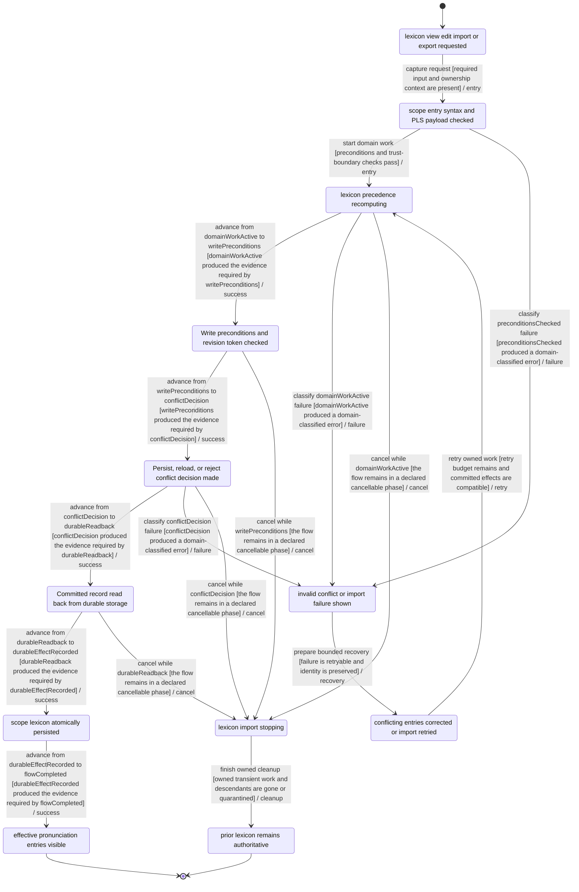
```mermaid
stateDiagram-v2
  state "lexicon view edit import or export requested" as LEXICON_001_REQUESTCAPTURED
  state "scope entry syntax and PLS payload checked" as LEXICON_001_PRECONDITIONSCHECKED
  state "lexicon precedence recomputing" as LEXICON_001_DOMAINWORKACTIVE
  state "scope lexicon atomically persisted" as LEXICON_001_DURABLEEFFECTRECORDED
  state "effective pronunciation entries visible" as LEXICON_001_FLOWCOMPLETED
  state "invalid conflict or import failure shown" as LEXICON_001_CLASSIFIEDFAILURE
  state "lexicon import stopping" as LEXICON_001_CLEANUPINPROGRESS
  state "prior lexicon remains authoritative" as LEXICON_001_CANCELEDCLEAN
  state "conflicting entries corrected or import retried" as LEXICON_001_RECOVERYCONTEXTREADY
  state "Write preconditions and revision token checked" as LEXICON_001_WRITEPRECONDITIONS
  state "Persist, reload, or reject conflict decision made" as LEXICON_001_CONFLICTDECISION
  state "Committed record read back from durable storage" as LEXICON_001_DURABLEREADBACK
  [*] --> LEXICON_001_REQUESTCAPTURED
  LEXICON_001_REQUESTCAPTURED --> LEXICON_001_PRECONDITIONSCHECKED: capture request [required input and ownership context are present] / entry
  LEXICON_001_PRECONDITIONSCHECKED --> LEXICON_001_DOMAINWORKACTIVE: start domain work [preconditions and trust-boundary checks pass] / entry
  LEXICON_001_DOMAINWORKACTIVE --> LEXICON_001_WRITEPRECONDITIONS: advance from domainWorkActive to writePreconditions [domainWorkActive produced the evidence required by writePreconditions] / success
  LEXICON_001_WRITEPRECONDITIONS --> LEXICON_001_CONFLICTDECISION: advance from writePreconditions to conflictDecision [writePreconditions produced the evidence required by conflictDecision] / success
  LEXICON_001_CONFLICTDECISION --> LEXICON_001_DURABLEREADBACK: advance from conflictDecision to durableReadback [conflictDecision produced the evidence required by durableReadback] / success
  LEXICON_001_DURABLEREADBACK --> LEXICON_001_DURABLEEFFECTRECORDED: advance from durableReadback to durableEffectRecorded [durableReadback produced the evidence required by durableEffectRecorded] / success
  LEXICON_001_DURABLEEFFECTRECORDED --> LEXICON_001_FLOWCOMPLETED: advance from durableEffectRecorded to flowCompleted [durableEffectRecorded produced the evidence required by flowCompleted] / success
  LEXICON_001_PRECONDITIONSCHECKED --> LEXICON_001_CLASSIFIEDFAILURE: classify preconditionsChecked failure [preconditionsChecked produced a domain-classified error] / failure
  LEXICON_001_DOMAINWORKACTIVE --> LEXICON_001_CLASSIFIEDFAILURE: classify domainWorkActive failure [domainWorkActive produced a domain-classified error] / failure
  LEXICON_001_CONFLICTDECISION --> LEXICON_001_CLASSIFIEDFAILURE: classify conflictDecision failure [conflictDecision produced a domain-classified error] / failure
  LEXICON_001_CLASSIFIEDFAILURE --> LEXICON_001_RECOVERYCONTEXTREADY: prepare bounded recovery [failure is retryable and identity is preserved] / recovery
  LEXICON_001_RECOVERYCONTEXTREADY --> LEXICON_001_DOMAINWORKACTIVE: retry owned work [retry budget remains and committed effects are compatible] / retry
  LEXICON_001_DOMAINWORKACTIVE --> LEXICON_001_CLEANUPINPROGRESS: cancel while domainWorkActive [the flow remains in a declared cancellable phase] / cancel
  LEXICON_001_WRITEPRECONDITIONS --> LEXICON_001_CLEANUPINPROGRESS: cancel while writePreconditions [the flow remains in a declared cancellable phase] / cancel
  LEXICON_001_CONFLICTDECISION --> LEXICON_001_CLEANUPINPROGRESS: cancel while conflictDecision [the flow remains in a declared cancellable phase] / cancel
  LEXICON_001_DURABLEREADBACK --> LEXICON_001_CLEANUPINPROGRESS: cancel while durableReadback [the flow remains in a declared cancellable phase] / cancel
  LEXICON_001_CLEANUPINPROGRESS --> LEXICON_001_CANCELEDCLEAN: finish owned cleanup [owned transient work and descendants are gone or quarantined] / cleanup
  LEXICON_001_FLOWCOMPLETED --> [*]
  LEXICON_001_CANCELEDCLEAN --> [*]
```
## PREVIEW-001 — Voice preview creation, playback, and user decision

- Primary owner: `speech-audio`
- Architecture family: `review-decision`
- Shared subgraphs: `classified-failure-retry`, `cancellable-cleanup`
- Secondary owners: none
- Shared concerns: `RECOVERY`, `SUBPROCESS`, `NETWORK_EGRESS`, `PRIVACY`, `I18N`, `ACCESSIBILITY`, `PERFORMANCE_TELEMETRY`, `OPERATIONAL_STATUS`

### Route ownership

- `POST /api/voice-previews`

### State contract

| State | Label | Kind | Authority | UI observable |
| --- | --- | --- | --- | --- |
| `PREVIEW_001_REQUESTCAPTURED` | audition requested | `stable` | `frontend` | UI shows audition requested |
| `PREVIEW_001_PRECONDITIONSCHECKED` | text voice engine and capability checked | `stable` | `backend` | UI shows validation progress for voice preview |
| `PREVIEW_001_DOMAINWORKACTIVE` | bounded preview synthesis running | `transient` | `backend` | UI shows bounded preview synthesis running |
| `PREVIEW_001_DURABLEEFFECTRECORDED` | preview audio artifact published | `stable` | `backend` | UI shows committed voice preview state |
| `PREVIEW_001_FLOWCOMPLETED` | preview playable with accept change and skip branches | `terminal-success` | `shared` | UI shows preview playable with accept change and skip branches |
| `PREVIEW_001_CLASSIFIEDFAILURE` | preview generation or media playback failed | `stable-failure` | `backend` | UI explains preview generation or media playback failed |
| `PREVIEW_001_CLEANUPINPROGRESS` | preview synthesis or playback stopping | `transient` | `backend` | UI shows preview synthesis or playback stopping |
| `PREVIEW_001_CANCELEDCLEAN` | preview decision remains unmade | `terminal-canceled` | `shared` | UI shows preview decision remains unmade |
| `PREVIEW_001_RECOVERYCONTEXTREADY` | change voice retry or skip chosen | `stable` | `shared` | UI offers change voice retry or skip chosen |
| `PREVIEW_001_AUDITIONREADY` | Review or audition material ready | `stable` | `shared` | Review or audition material ready; the UI exposes this state or an actionable non-visual status. |
| `PREVIEW_001_REVIEWDECISION` | Accept, change, or skip decision visible | `stable` | `frontend` | Accept, change, or skip decision visible; the UI exposes this state or an actionable non-visual status. |
| `PREVIEW_001_CHANGEREQUESTED` | Requested change returned to active preparation | `transient` | `shared` | Requested change returned to active preparation; the UI exposes this state or an actionable non-visual status. |

### Semantic roles

- `requestCaptured` → `PREVIEW_001_REQUESTCAPTURED`
- `preconditionsChecked` → `PREVIEW_001_PRECONDITIONSCHECKED`
- `domainWorkActive` → `PREVIEW_001_DOMAINWORKACTIVE`
- `durableEffectRecorded` → `PREVIEW_001_DURABLEEFFECTRECORDED`
- `flowCompleted` → `PREVIEW_001_FLOWCOMPLETED`
- `classifiedFailure` → `PREVIEW_001_CLASSIFIEDFAILURE`
- `cleanupInProgress` → `PREVIEW_001_CLEANUPINPROGRESS`
- `canceledClean` → `PREVIEW_001_CANCELEDCLEAN`
- `recoveryContextReady` → `PREVIEW_001_RECOVERYCONTEXTREADY`
- `auditionReady` → `PREVIEW_001_AUDITIONREADY`
- `reviewDecision` → `PREVIEW_001_REVIEWDECISION`
- `changeRequested` → `PREVIEW_001_CHANGEREQUESTED`

### Required decisions

- **accept-change-skip** at `PREVIEW_001_REVIEWDECISION`: `accept` → `PREVIEW-001:T05:success`, `change` → `PREVIEW-001:T06:recovery`, `skip` → `PREVIEW-001:T07:cancel`

### Family and flow invariants

- Every review-decision flow exposes its required roles as canonical states.
- Every review-decision decision has named outgoing outcomes bound to transition IDs.
- PREVIEW-001 commit is not reached until preview audio artifact published
- PREVIEW-001 cancellation phases equal ordinary cancel-edge sources exactly.
- Frozen BIC-07 planned-evidence ownership is provenance; responsive replacement ownership RSP-11 is planned only and is not covered or implemented.

### Transitions

| ID | From | To | Event | Guard | Branch |
| --- | --- | --- | --- | --- | --- |
| `PREVIEW-001:T01:entry` | `PREVIEW_001_REQUESTCAPTURED` | `PREVIEW_001_PRECONDITIONSCHECKED` | request bounded preview | voice, text, and provider are selected | `entry` |
| `PREVIEW-001:T02:entry` | `PREVIEW_001_PRECONDITIONSCHECKED` | `PREVIEW_001_DOMAINWORKACTIVE` | render preview | preview limits and capability checks pass | `entry` |
| `PREVIEW-001:T03:success` | `PREVIEW_001_DOMAINWORKACTIVE` | `PREVIEW_001_AUDITIONREADY` | publish audition | preview audio and provenance are available | `success` |
| `PREVIEW-001:T04:success` | `PREVIEW_001_AUDITIONREADY` | `PREVIEW_001_REVIEWDECISION` | request preview decision | audition completed or was explicitly stopped | `success` |
| `PREVIEW-001:T05:success` | `PREVIEW_001_REVIEWDECISION` | `PREVIEW_001_DURABLEEFFECTRECORDED` | accept preview settings | the user accepts voice and tuning | `success` |
| `PREVIEW-001:T06:recovery` | `PREVIEW_001_REVIEWDECISION` | `PREVIEW_001_CHANGEREQUESTED` | change preview inputs | the user requests a different voice, text, or tuning | `recovery` |
| `PREVIEW-001:T07:cancel` | `PREVIEW_001_REVIEWDECISION` | `PREVIEW_001_CANCELEDCLEAN` | skip preview | the user explicitly continues without preview acceptance | `cancel` |
| `PREVIEW-001:T08:retry` | `PREVIEW_001_CHANGEREQUESTED` | `PREVIEW_001_DOMAINWORKACTIVE` | rerender changed preview | changed inputs remain within preview limits | `retry` |
| `PREVIEW-001:T09:success` | `PREVIEW_001_DURABLEEFFECTRECORDED` | `PREVIEW_001_FLOWCOMPLETED` | persist accepted preview choice | accepted settings read back successfully | `success` |
| `PREVIEW-001:T10:failure` | `PREVIEW_001_PRECONDITIONSCHECKED` | `PREVIEW_001_CLASSIFIEDFAILURE` | classify preview failure at preconditionsChecked | preview cannot produce a usable audition | `failure` |
| `PREVIEW-001:T11:failure` | `PREVIEW_001_DOMAINWORKACTIVE` | `PREVIEW_001_CLASSIFIEDFAILURE` | classify preview failure at domainWorkActive | preview cannot produce a usable audition | `failure` |
| `PREVIEW-001:T12:failure` | `PREVIEW_001_AUDITIONREADY` | `PREVIEW_001_CLASSIFIEDFAILURE` | classify preview failure at auditionReady | preview cannot produce a usable audition | `failure` |
| `PREVIEW-001:T13:recovery` | `PREVIEW_001_CLASSIFIEDFAILURE` | `PREVIEW_001_RECOVERYCONTEXTREADY` | preserve preview inputs for retry | failure is retryable or has a fallback provider | `recovery` |
| `PREVIEW-001:T14:retry` | `PREVIEW_001_RECOVERYCONTEXTREADY` | `PREVIEW_001_DOMAINWORKACTIVE` | retry preview | retry budget and identity remain valid | `retry` |
| `PREVIEW-001:T15:cancel` | `PREVIEW_001_DOMAINWORKACTIVE` | `PREVIEW_001_CLEANUPINPROGRESS` | cancel preview at domainWorkActive | preview has not been accepted | `cancel` |
| `PREVIEW-001:T16:cancel` | `PREVIEW_001_AUDITIONREADY` | `PREVIEW_001_CLEANUPINPROGRESS` | cancel preview at auditionReady | preview has not been accepted | `cancel` |
| `PREVIEW-001:T17:cancel` | `PREVIEW_001_CHANGEREQUESTED` | `PREVIEW_001_CLEANUPINPROGRESS` | cancel preview at changeRequested | preview has not been accepted | `cancel` |
| `PREVIEW-001:T18:cleanup` | `PREVIEW_001_CLEANUPINPROGRESS` | `PREVIEW_001_CANCELEDCLEAN` | remove transient preview media | temporary media is gone and accepted settings are unchanged | `cleanup` |

### Evidence

- `frontend/src/features/preview/preview.test.ts` — Executable source anchors only; no transition closure is claimed without a FLOW_ASSERT marker.
  - `renders the active spoken preview in full transport mode` — transitions: none (source anchor only)
  - `marks stale lifecycle as audition-disabled for GlobalPreviewPlayer transport` — transitions: none (source anchor only)
  - `uses temporary-source blocked copy for disabled Preview actions` — transitions: none (source anchor only)
  - `disables temporary Teleprompt and Theatre actions when temporary cinema is rolled back` — transitions: none (source anchor only)
  - `surfaces Review warnings without blocking Preview generation` — transitions: none (source anchor only)
  - `keeps Review warnings non-blocking for audio generation pipeline actions` — transitions: none (source anchor only)
  - `distinguishes missing, generating, failed, stale, and ready audio transitions` — transitions: none (source anchor only)
  - `labels temporary generated audio as session-scoped` — transitions: none (source anchor only)
  - `requires rebuild when completed audio input differs from the current spoken plan` — transitions: none (source anchor only)
  - `renders temporary voice override selection without durable preference copy` — transitions: none (source anchor only)
  - `renders a compact generated-audio placeholder before playback is available` — transitions: none (source anchor only)
  - `renders generated temporary audio copy for temporary sources` — transitions: none (source anchor only)

### Planned transition evidence

- `PREVIEW-001:T01:entry`, `PREVIEW-001:T02:entry`, `PREVIEW-001:T03:success`, `PREVIEW-001:T04:success`, `PREVIEW-001:T05:success`, `PREVIEW-001:T06:recovery`, `PREVIEW-001:T07:cancel`, `PREVIEW-001:T08:retry`, `PREVIEW-001:T09:success`, `PREVIEW-001:T10:failure`, `PREVIEW-001:T11:failure`, `PREVIEW-001:T12:failure`, `PREVIEW-001:T13:recovery`, `PREVIEW-001:T14:retry`, `PREVIEW-001:T15:cancel`, `PREVIEW-001:T16:cancel`, `PREVIEW-001:T17:cancel`, `PREVIEW-001:T18:cleanup` → `BIC-07`; verify with `mise exec -- pnpm --dir frontend exec vitest run frontend/src/features/preview/preview.test.ts` — Owner issue must add transition-specific executable FLOW_ASSERT markers and assertions before closeout.

### Mermaid

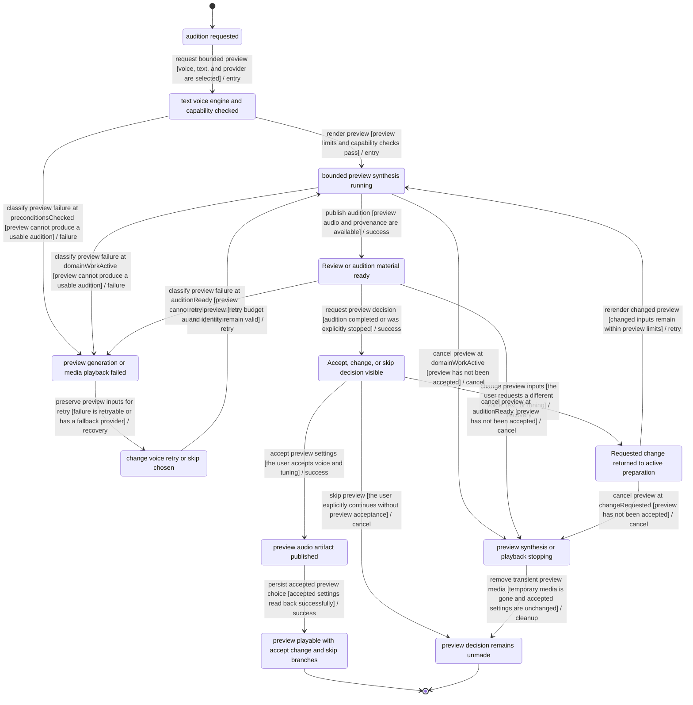
```mermaid
stateDiagram-v2
  state "audition requested" as PREVIEW_001_REQUESTCAPTURED
  state "text voice engine and capability checked" as PREVIEW_001_PRECONDITIONSCHECKED
  state "bounded preview synthesis running" as PREVIEW_001_DOMAINWORKACTIVE
  state "preview audio artifact published" as PREVIEW_001_DURABLEEFFECTRECORDED
  state "preview playable with accept change and skip branches" as PREVIEW_001_FLOWCOMPLETED
  state "preview generation or media playback failed" as PREVIEW_001_CLASSIFIEDFAILURE
  state "preview synthesis or playback stopping" as PREVIEW_001_CLEANUPINPROGRESS
  state "preview decision remains unmade" as PREVIEW_001_CANCELEDCLEAN
  state "change voice retry or skip chosen" as PREVIEW_001_RECOVERYCONTEXTREADY
  state "Review or audition material ready" as PREVIEW_001_AUDITIONREADY
  state "Accept, change, or skip decision visible" as PREVIEW_001_REVIEWDECISION
  state "Requested change returned to active preparation" as PREVIEW_001_CHANGEREQUESTED
  [*] --> PREVIEW_001_REQUESTCAPTURED
  PREVIEW_001_REQUESTCAPTURED --> PREVIEW_001_PRECONDITIONSCHECKED: request bounded preview [voice, text, and provider are selected] / entry
  PREVIEW_001_PRECONDITIONSCHECKED --> PREVIEW_001_DOMAINWORKACTIVE: render preview [preview limits and capability checks pass] / entry
  PREVIEW_001_DOMAINWORKACTIVE --> PREVIEW_001_AUDITIONREADY: publish audition [preview audio and provenance are available] / success
  PREVIEW_001_AUDITIONREADY --> PREVIEW_001_REVIEWDECISION: request preview decision [audition completed or was explicitly stopped] / success
  PREVIEW_001_REVIEWDECISION --> PREVIEW_001_DURABLEEFFECTRECORDED: accept preview settings [the user accepts voice and tuning] / success
  PREVIEW_001_REVIEWDECISION --> PREVIEW_001_CHANGEREQUESTED: change preview inputs [the user requests a different voice, text, or tuning] / recovery
  PREVIEW_001_REVIEWDECISION --> PREVIEW_001_CANCELEDCLEAN: skip preview [the user explicitly continues without preview acceptance] / cancel
  PREVIEW_001_CHANGEREQUESTED --> PREVIEW_001_DOMAINWORKACTIVE: rerender changed preview [changed inputs remain within preview limits] / retry
  PREVIEW_001_DURABLEEFFECTRECORDED --> PREVIEW_001_FLOWCOMPLETED: persist accepted preview choice [accepted settings read back successfully] / success
  PREVIEW_001_PRECONDITIONSCHECKED --> PREVIEW_001_CLASSIFIEDFAILURE: classify preview failure at preconditionsChecked [preview cannot produce a usable audition] / failure
  PREVIEW_001_DOMAINWORKACTIVE --> PREVIEW_001_CLASSIFIEDFAILURE: classify preview failure at domainWorkActive [preview cannot produce a usable audition] / failure
  PREVIEW_001_AUDITIONREADY --> PREVIEW_001_CLASSIFIEDFAILURE: classify preview failure at auditionReady [preview cannot produce a usable audition] / failure
  PREVIEW_001_CLASSIFIEDFAILURE --> PREVIEW_001_RECOVERYCONTEXTREADY: preserve preview inputs for retry [failure is retryable or has a fallback provider] / recovery
  PREVIEW_001_RECOVERYCONTEXTREADY --> PREVIEW_001_DOMAINWORKACTIVE: retry preview [retry budget and identity remain valid] / retry
  PREVIEW_001_DOMAINWORKACTIVE --> PREVIEW_001_CLEANUPINPROGRESS: cancel preview at domainWorkActive [preview has not been accepted] / cancel
  PREVIEW_001_AUDITIONREADY --> PREVIEW_001_CLEANUPINPROGRESS: cancel preview at auditionReady [preview has not been accepted] / cancel
  PREVIEW_001_CHANGEREQUESTED --> PREVIEW_001_CLEANUPINPROGRESS: cancel preview at changeRequested [preview has not been accepted] / cancel
  PREVIEW_001_CLEANUPINPROGRESS --> PREVIEW_001_CANCELEDCLEAN: remove transient preview media [temporary media is gone and accepted settings are unchanged] / cleanup
  PREVIEW_001_FLOWCOMPLETED --> [*]
  PREVIEW_001_CANCELEDCLEAN --> [*]
```
## TELEPROMPT-001 — Teleprompt rehearsal, cue control, and return

- Primary owner: `experience`
- Architecture family: `immersive-reading`
- Shared subgraphs: `classified-failure-retry`, `cancellable-cleanup`
- Secondary owners: none
- Shared concerns: `RECOVERY`, `ACCESSIBILITY`, `PRIVACY`, `I18N`, `PERFORMANCE_TELEMETRY`, `OPERATIONAL_STATUS`

### Route ownership

- none

### State contract

| State | Label | Kind | Authority | UI observable |
| --- | --- | --- | --- | --- |
| `TELEPROMPT_001_REQUESTCAPTURED` | Teleprompt opened from review or preview | `stable` | `frontend` | UI shows Teleprompt opened from review or preview |
| `TELEPROMPT_001_PRECONDITIONSCHECKED` | cue source return target and optional audio checked | `stable` | `backend` | UI shows validation progress for Teleprompt session |
| `TELEPROMPT_001_DOMAINWORKACTIVE` | Teleprompt rehearsal session active | `transient` | `backend` | UI shows Teleprompt rehearsal session active |
| `TELEPROMPT_001_DURABLEEFFECTRECORDED` | cue and return context saved | `stable` | `backend` | UI shows committed Teleprompt session state |
| `TELEPROMPT_001_FLOWCOMPLETED` | usable presenter session explicitly exited | `terminal-success` | `shared` | UI shows usable presenter session explicitly exited |
| `TELEPROMPT_001_CLASSIFIEDFAILURE` | cue timing fullscreen or audio unavailable | `stable-failure` | `backend` | UI explains cue timing fullscreen or audio unavailable |
| `TELEPROMPT_001_CLEANUPINPROGRESS` | Teleprompt session closing | `transient` | `backend` | UI shows Teleprompt session closing |
| `TELEPROMPT_001_CANCELEDCLEAN` | safe return target restored | `terminal-canceled` | `shared` | UI shows safe return target restored |
| `TELEPROMPT_001_RECOVERYCONTEXTREADY` | manual cue mode inline mode or return selected | `stable` | `shared` | UI offers manual cue mode inline mode or return selected |
| `TELEPROMPT_001_RENDERERLOADING` | Dedicated reading renderer is loading | `transient` | `frontend` | Dedicated reading renderer is loading; the UI exposes this state or an actionable non-visual status. |
| `TELEPROMPT_001_PRESENTING` | Dedicated surface is presenting synchronized content | `stable` | `frontend` | Dedicated surface is presenting synchronized content; the UI exposes this state or an actionable non-visual status. |
| `TELEPROMPT_001_PAUSED` | Dedicated surface is paused with context preserved | `stable` | `frontend` | Dedicated surface is paused with context preserved; the UI exposes this state or an actionable non-visual status. |
| `TELEPROMPT_001_FALLBACKDECISION` | Resume, fall back, or exit decision visible | `stable` | `frontend` | Resume, fall back, or exit decision visible; the UI exposes this state or an actionable non-visual status. |

### Semantic roles

- `requestCaptured` → `TELEPROMPT_001_REQUESTCAPTURED`
- `preconditionsChecked` → `TELEPROMPT_001_PRECONDITIONSCHECKED`
- `domainWorkActive` → `TELEPROMPT_001_DOMAINWORKACTIVE`
- `durableEffectRecorded` → `TELEPROMPT_001_DURABLEEFFECTRECORDED`
- `flowCompleted` → `TELEPROMPT_001_FLOWCOMPLETED`
- `classifiedFailure` → `TELEPROMPT_001_CLASSIFIEDFAILURE`
- `cleanupInProgress` → `TELEPROMPT_001_CLEANUPINPROGRESS`
- `canceledClean` → `TELEPROMPT_001_CANCELEDCLEAN`
- `recoveryContextReady` → `TELEPROMPT_001_RECOVERYCONTEXTREADY`
- `rendererLoading` → `TELEPROMPT_001_RENDERERLOADING`
- `presenting` → `TELEPROMPT_001_PRESENTING`
- `paused` → `TELEPROMPT_001_PAUSED`
- `fallbackDecision` → `TELEPROMPT_001_FALLBACKDECISION`

### Required decisions

- **fallbackDecision** at `TELEPROMPT_001_FALLBACKDECISION`: `continue` → `TELEPROMPT-001:T07:success`, `reject` → `TELEPROMPT-001:T11:failure`, `cancel` → `TELEPROMPT-001:T18:cancel`

### Family and flow invariants

- Every immersive-reading flow exposes its required roles as canonical states.
- Every immersive-reading decision has named outgoing outcomes bound to transition IDs.
- TELEPROMPT-001 commit is not reached until cue and return context saved
- TELEPROMPT-001 cancellation phases equal ordinary cancel-edge sources exactly.
- Frozen BIC-09 planned-evidence ownership is provenance; responsive replacement ownership RSP-08/RSP-13 is planned only and is not covered or implemented.

### Transitions

| ID | From | To | Event | Guard | Branch |
| --- | --- | --- | --- | --- | --- |
| `TELEPROMPT-001:T01:entry` | `TELEPROMPT_001_REQUESTCAPTURED` | `TELEPROMPT_001_PRECONDITIONSCHECKED` | capture request | required input and ownership context are present | `entry` |
| `TELEPROMPT-001:T02:entry` | `TELEPROMPT_001_PRECONDITIONSCHECKED` | `TELEPROMPT_001_DOMAINWORKACTIVE` | start domain work | preconditions and trust-boundary checks pass | `entry` |
| `TELEPROMPT-001:T03:success` | `TELEPROMPT_001_DOMAINWORKACTIVE` | `TELEPROMPT_001_RENDERERLOADING` | advance from domainWorkActive to rendererLoading | domainWorkActive produced the evidence required by rendererLoading | `success` |
| `TELEPROMPT-001:T04:success` | `TELEPROMPT_001_RENDERERLOADING` | `TELEPROMPT_001_PRESENTING` | advance from rendererLoading to presenting | rendererLoading produced the evidence required by presenting | `success` |
| `TELEPROMPT-001:T05:success` | `TELEPROMPT_001_PRESENTING` | `TELEPROMPT_001_PAUSED` | advance from presenting to paused | presenting produced the evidence required by paused | `success` |
| `TELEPROMPT-001:T06:success` | `TELEPROMPT_001_PAUSED` | `TELEPROMPT_001_FALLBACKDECISION` | advance from paused to fallbackDecision | paused produced the evidence required by fallbackDecision | `success` |
| `TELEPROMPT-001:T07:success` | `TELEPROMPT_001_FALLBACKDECISION` | `TELEPROMPT_001_DURABLEEFFECTRECORDED` | advance from fallbackDecision to durableEffectRecorded | fallbackDecision produced the evidence required by durableEffectRecorded | `success` |
| `TELEPROMPT-001:T08:success` | `TELEPROMPT_001_DURABLEEFFECTRECORDED` | `TELEPROMPT_001_FLOWCOMPLETED` | advance from durableEffectRecorded to flowCompleted | durableEffectRecorded produced the evidence required by flowCompleted | `success` |
| `TELEPROMPT-001:T09:failure` | `TELEPROMPT_001_PRECONDITIONSCHECKED` | `TELEPROMPT_001_CLASSIFIEDFAILURE` | classify preconditionsChecked failure | preconditionsChecked produced a domain-classified error | `failure` |
| `TELEPROMPT-001:T10:failure` | `TELEPROMPT_001_DOMAINWORKACTIVE` | `TELEPROMPT_001_CLASSIFIEDFAILURE` | classify domainWorkActive failure | domainWorkActive produced a domain-classified error | `failure` |
| `TELEPROMPT-001:T11:failure` | `TELEPROMPT_001_FALLBACKDECISION` | `TELEPROMPT_001_CLASSIFIEDFAILURE` | classify fallbackDecision failure | fallbackDecision produced a domain-classified error | `failure` |
| `TELEPROMPT-001:T12:recovery` | `TELEPROMPT_001_CLASSIFIEDFAILURE` | `TELEPROMPT_001_RECOVERYCONTEXTREADY` | prepare bounded recovery | failure is retryable and identity is preserved | `recovery` |
| `TELEPROMPT-001:T13:retry` | `TELEPROMPT_001_RECOVERYCONTEXTREADY` | `TELEPROMPT_001_DOMAINWORKACTIVE` | retry owned work | retry budget remains and committed effects are compatible | `retry` |
| `TELEPROMPT-001:T14:cancel` | `TELEPROMPT_001_DOMAINWORKACTIVE` | `TELEPROMPT_001_CLEANUPINPROGRESS` | cancel while domainWorkActive | the flow remains in a declared cancellable phase | `cancel` |
| `TELEPROMPT-001:T15:cancel` | `TELEPROMPT_001_RENDERERLOADING` | `TELEPROMPT_001_CLEANUPINPROGRESS` | cancel while rendererLoading | the flow remains in a declared cancellable phase | `cancel` |
| `TELEPROMPT-001:T16:cancel` | `TELEPROMPT_001_PRESENTING` | `TELEPROMPT_001_CLEANUPINPROGRESS` | cancel while presenting | the flow remains in a declared cancellable phase | `cancel` |
| `TELEPROMPT-001:T17:cancel` | `TELEPROMPT_001_PAUSED` | `TELEPROMPT_001_CLEANUPINPROGRESS` | cancel while paused | the flow remains in a declared cancellable phase | `cancel` |
| `TELEPROMPT-001:T18:cancel` | `TELEPROMPT_001_FALLBACKDECISION` | `TELEPROMPT_001_CLEANUPINPROGRESS` | cancel while fallbackDecision | the flow remains in a declared cancellable phase | `cancel` |
| `TELEPROMPT-001:T19:cleanup` | `TELEPROMPT_001_CLEANUPINPROGRESS` | `TELEPROMPT_001_CANCELEDCLEAN` | finish owned cleanup | owned transient work and descendants are gone or quarantined | `cleanup` |

### Evidence

- `frontend/src/features/teleprompt/teleprompt.test.ts` — Executable source anchors only; no transition closure is claimed without a FLOW_ASSERT marker.
  - `accepts shortcut preferences while resolving Teleprompt commands` — transitions: none (source anchor only)
  - `counts words, estimates time, and finds adjacent cues` — transitions: none (source anchor only)
  - `keeps skipped blocks visible but out of cue progression` — transitions: none (source anchor only)
  - `maps work modes onto cue-sync primitives` — transitions: none (source anchor only)
  - `renders one Theatre entry, a dominant current cue, and drawer context` — transitions: none (source anchor only)
  - `renders skipped script entries without making them active cues` — transitions: none (source anchor only)
  - `shows elapsed and remaining full-audio labels in Teleprompt playback` — transitions: none (source anchor only)
  - `maps cue timeline starts into active waveform markers` — transitions: none (source anchor only)
  - `builds cue timelines from speakable blocks only` — transitions: none (source anchor only)
  - `resolves presenter shortcuts before falling back to cue shortcuts` — transitions: none (source anchor only)
  - `summarizes presenter cue state and sync status` — transitions: none (source anchor only)
  - `keeps theatre cue paragraphs instead of flattening multiline text` — transitions: none (source anchor only)

### Planned transition evidence

- `TELEPROMPT-001:T01:entry`, `TELEPROMPT-001:T02:entry`, `TELEPROMPT-001:T03:success`, `TELEPROMPT-001:T04:success`, `TELEPROMPT-001:T05:success`, `TELEPROMPT-001:T06:success`, `TELEPROMPT-001:T07:success`, `TELEPROMPT-001:T08:success`, `TELEPROMPT-001:T09:failure`, `TELEPROMPT-001:T10:failure`, `TELEPROMPT-001:T11:failure`, `TELEPROMPT-001:T12:recovery`, `TELEPROMPT-001:T13:retry`, `TELEPROMPT-001:T14:cancel`, `TELEPROMPT-001:T15:cancel`, `TELEPROMPT-001:T16:cancel`, `TELEPROMPT-001:T17:cancel`, `TELEPROMPT-001:T18:cancel`, `TELEPROMPT-001:T19:cleanup` → `BIC-09`; verify with `mise exec -- pnpm --dir frontend exec vitest run frontend/src/features/teleprompt/teleprompt.test.ts` — Owner issue must add transition-specific executable FLOW_ASSERT markers and assertions before closeout.

### Mermaid

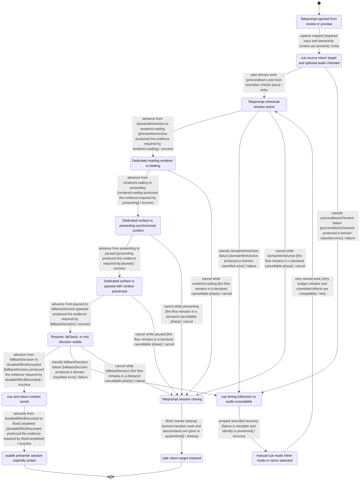
```mermaid
stateDiagram-v2
  state "Teleprompt opened from review or preview" as TELEPROMPT_001_REQUESTCAPTURED
  state "cue source return target and optional audio checked" as TELEPROMPT_001_PRECONDITIONSCHECKED
  state "Teleprompt rehearsal session active" as TELEPROMPT_001_DOMAINWORKACTIVE
  state "cue and return context saved" as TELEPROMPT_001_DURABLEEFFECTRECORDED
  state "usable presenter session explicitly exited" as TELEPROMPT_001_FLOWCOMPLETED
  state "cue timing fullscreen or audio unavailable" as TELEPROMPT_001_CLASSIFIEDFAILURE
  state "Teleprompt session closing" as TELEPROMPT_001_CLEANUPINPROGRESS
  state "safe return target restored" as TELEPROMPT_001_CANCELEDCLEAN
  state "manual cue mode inline mode or return selected" as TELEPROMPT_001_RECOVERYCONTEXTREADY
  state "Dedicated reading renderer is loading" as TELEPROMPT_001_RENDERERLOADING
  state "Dedicated surface is presenting synchronized content" as TELEPROMPT_001_PRESENTING
  state "Dedicated surface is paused with context preserved" as TELEPROMPT_001_PAUSED
  state "Resume, fall back, or exit decision visible" as TELEPROMPT_001_FALLBACKDECISION
  [*] --> TELEPROMPT_001_REQUESTCAPTURED
  TELEPROMPT_001_REQUESTCAPTURED --> TELEPROMPT_001_PRECONDITIONSCHECKED: capture request [required input and ownership context are present] / entry
  TELEPROMPT_001_PRECONDITIONSCHECKED --> TELEPROMPT_001_DOMAINWORKACTIVE: start domain work [preconditions and trust-boundary checks pass] / entry
  TELEPROMPT_001_DOMAINWORKACTIVE --> TELEPROMPT_001_RENDERERLOADING: advance from domainWorkActive to rendererLoading [domainWorkActive produced the evidence required by rendererLoading] / success
  TELEPROMPT_001_RENDERERLOADING --> TELEPROMPT_001_PRESENTING: advance from rendererLoading to presenting [rendererLoading produced the evidence required by presenting] / success
  TELEPROMPT_001_PRESENTING --> TELEPROMPT_001_PAUSED: advance from presenting to paused [presenting produced the evidence required by paused] / success
  TELEPROMPT_001_PAUSED --> TELEPROMPT_001_FALLBACKDECISION: advance from paused to fallbackDecision [paused produced the evidence required by fallbackDecision] / success
  TELEPROMPT_001_FALLBACKDECISION --> TELEPROMPT_001_DURABLEEFFECTRECORDED: advance from fallbackDecision to durableEffectRecorded [fallbackDecision produced the evidence required by durableEffectRecorded] / success
  TELEPROMPT_001_DURABLEEFFECTRECORDED --> TELEPROMPT_001_FLOWCOMPLETED: advance from durableEffectRecorded to flowCompleted [durableEffectRecorded produced the evidence required by flowCompleted] / success
  TELEPROMPT_001_PRECONDITIONSCHECKED --> TELEPROMPT_001_CLASSIFIEDFAILURE: classify preconditionsChecked failure [preconditionsChecked produced a domain-classified error] / failure
  TELEPROMPT_001_DOMAINWORKACTIVE --> TELEPROMPT_001_CLASSIFIEDFAILURE: classify domainWorkActive failure [domainWorkActive produced a domain-classified error] / failure
  TELEPROMPT_001_FALLBACKDECISION --> TELEPROMPT_001_CLASSIFIEDFAILURE: classify fallbackDecision failure [fallbackDecision produced a domain-classified error] / failure
  TELEPROMPT_001_CLASSIFIEDFAILURE --> TELEPROMPT_001_RECOVERYCONTEXTREADY: prepare bounded recovery [failure is retryable and identity is preserved] / recovery
  TELEPROMPT_001_RECOVERYCONTEXTREADY --> TELEPROMPT_001_DOMAINWORKACTIVE: retry owned work [retry budget remains and committed effects are compatible] / retry
  TELEPROMPT_001_DOMAINWORKACTIVE --> TELEPROMPT_001_CLEANUPINPROGRESS: cancel while domainWorkActive [the flow remains in a declared cancellable phase] / cancel
  TELEPROMPT_001_RENDERERLOADING --> TELEPROMPT_001_CLEANUPINPROGRESS: cancel while rendererLoading [the flow remains in a declared cancellable phase] / cancel
  TELEPROMPT_001_PRESENTING --> TELEPROMPT_001_CLEANUPINPROGRESS: cancel while presenting [the flow remains in a declared cancellable phase] / cancel
  TELEPROMPT_001_PAUSED --> TELEPROMPT_001_CLEANUPINPROGRESS: cancel while paused [the flow remains in a declared cancellable phase] / cancel
  TELEPROMPT_001_FALLBACKDECISION --> TELEPROMPT_001_CLEANUPINPROGRESS: cancel while fallbackDecision [the flow remains in a declared cancellable phase] / cancel
  TELEPROMPT_001_CLEANUPINPROGRESS --> TELEPROMPT_001_CANCELEDCLEAN: finish owned cleanup [owned transient work and descendants are gone or quarantined] / cleanup
  TELEPROMPT_001_FLOWCOMPLETED --> [*]
  TELEPROMPT_001_CANCELEDCLEAN --> [*]
```
