# Candidate application flows — Application Ux

Status: `candidate_pending_chatgpt`

Each diagram is architectural. Exact route/state ownership is gated by the proposed validator issue.

## APP-BOOT-001 — Application boot and local service readiness

Owner: `runtime`

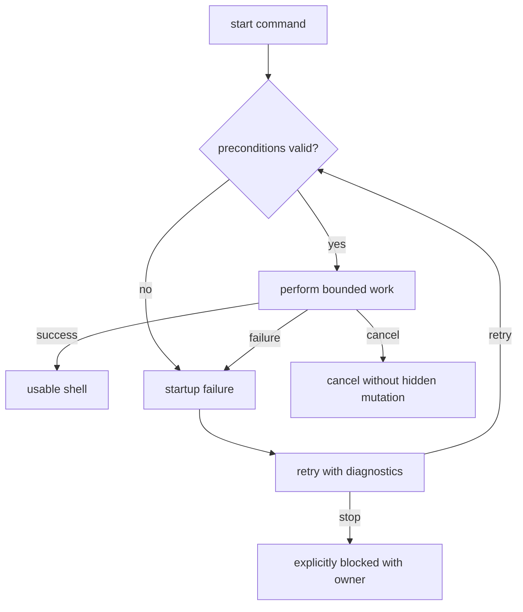

## APP-FIRST-RUN-001 — First-run guided listen journey

Owner: `product-shell`

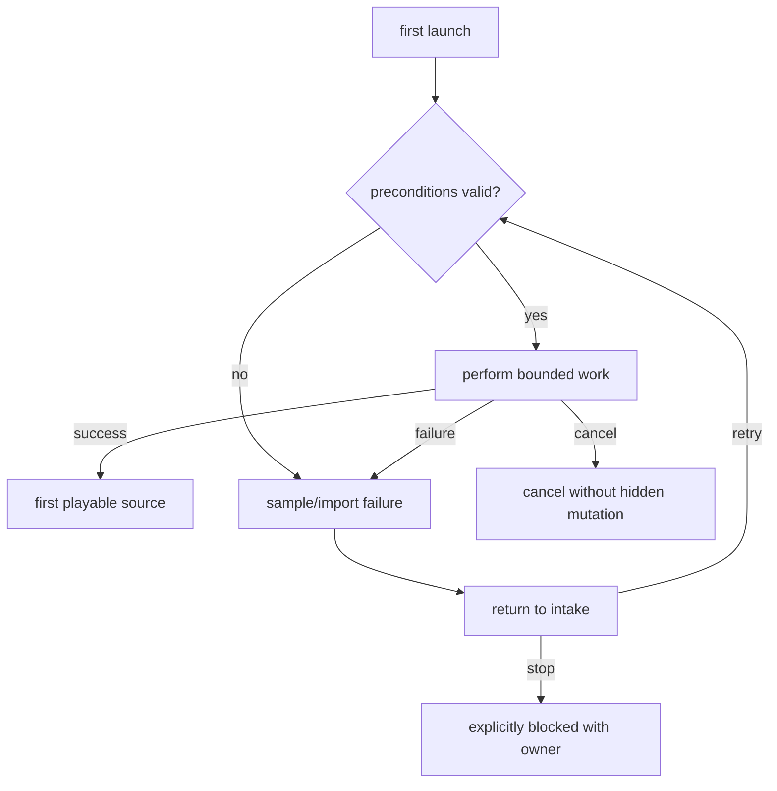

## APP-NAV-001 — Application navigation and guarded workspace stages

Owner: `frontend-shell`

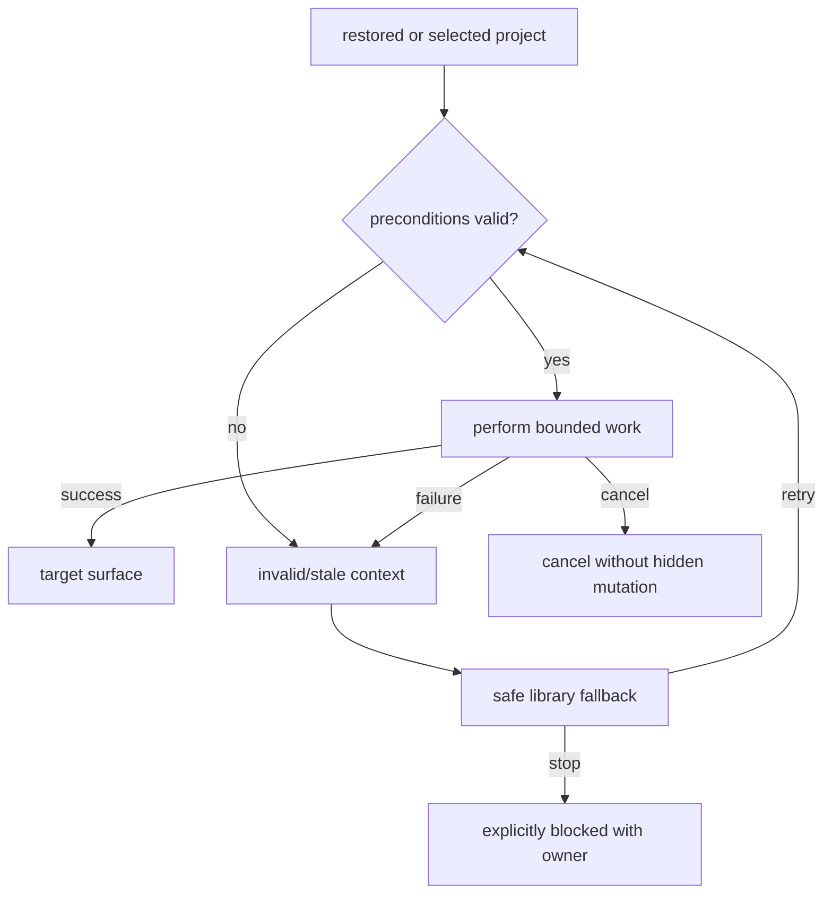

## APP-COMMAND-001 — Command palette, shortcut, and visible-action parity

Owner: `frontend-shell`

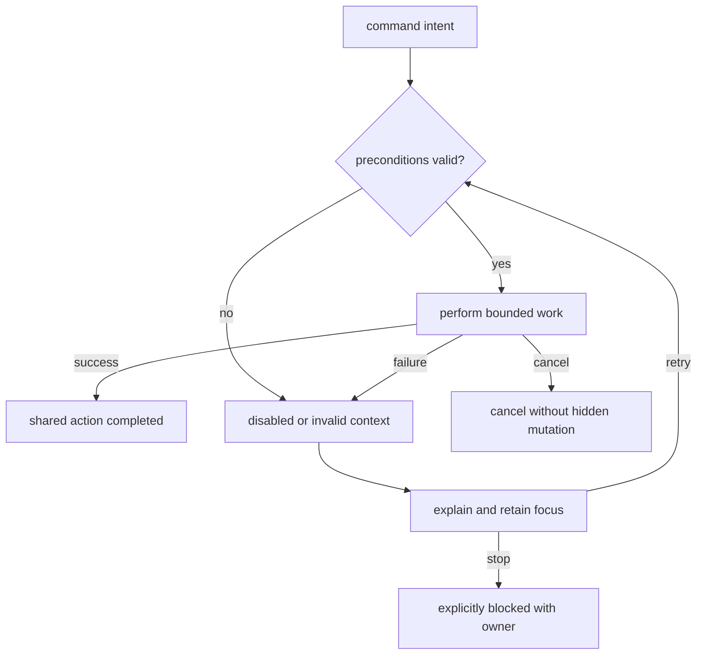

## PRJ-LIFE-001 — Project create, open, rename, delete, and restore

Owner: `project-data`

## SRC-DURABLE-001 — Durable file/paste/document intake

Owner: `source-ingestion`

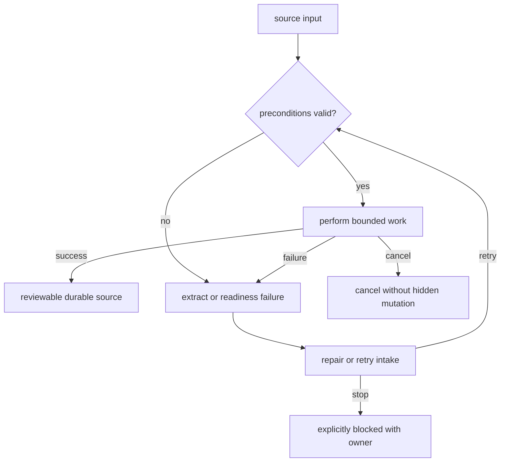

## SRC-URL-001 — URL safety, fetch, redirect, and extraction

Owner: `source-security`

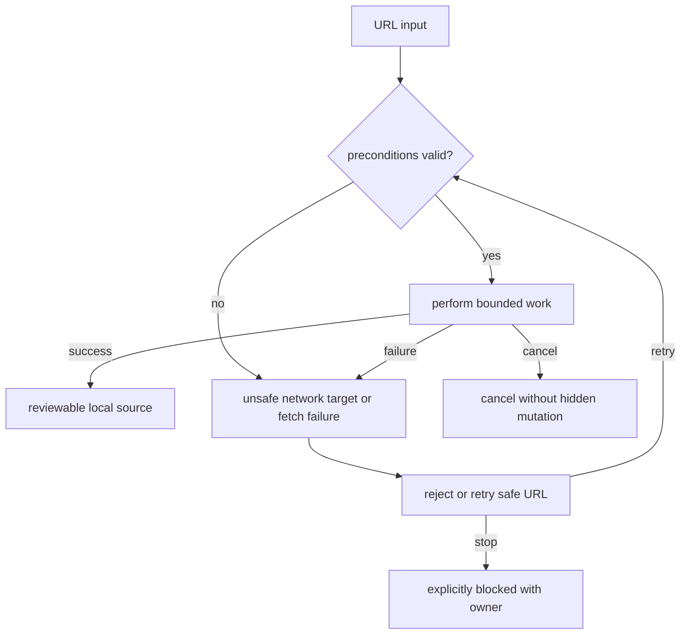

## SRC-TEMP-001 — Quick Listen temporary source lifecycle

Owner: `source-ingestion`

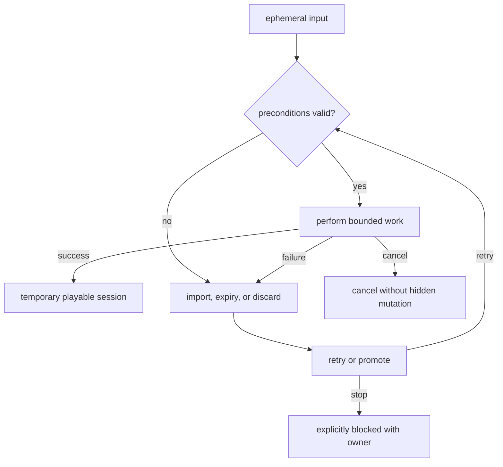

## SRC-PROMOTE-001 — Temporary-to-durable promotion

Owner: `source-project-data`

## SRC-REVIEW-001 — Source review, scope, and readiness

Owner: `workspace-review`

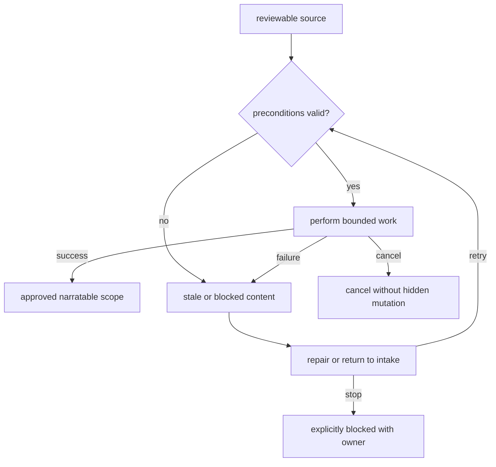

## POLICY-RESOLVE-001 — Speech policy precedence and effective plan

Owner: `speech-policy`

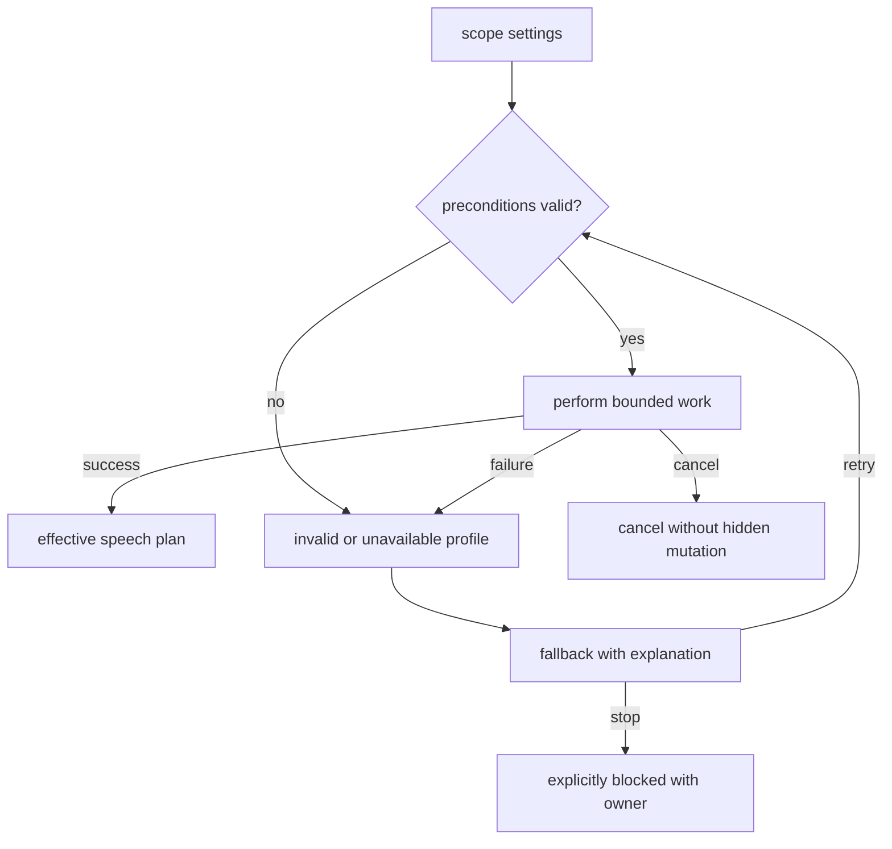

## PREVIEW-001 — Voice preview and audition

Owner: `preview-audio`

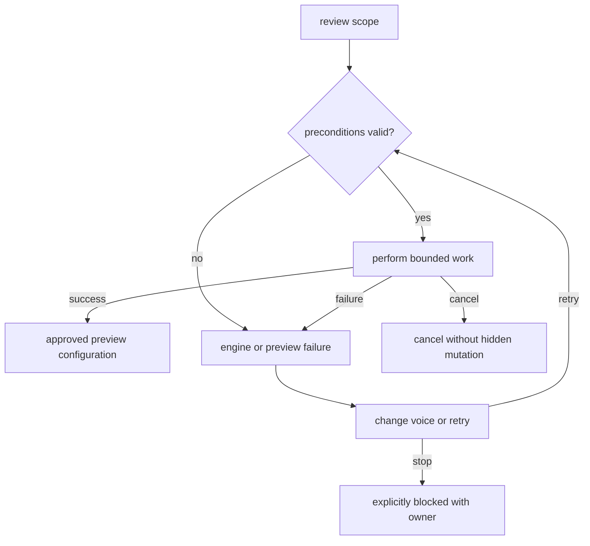

## TELEPROMPT-001 — Teleprompt entry, theatre handoff, and return

Owner: `reader-teleprompt`

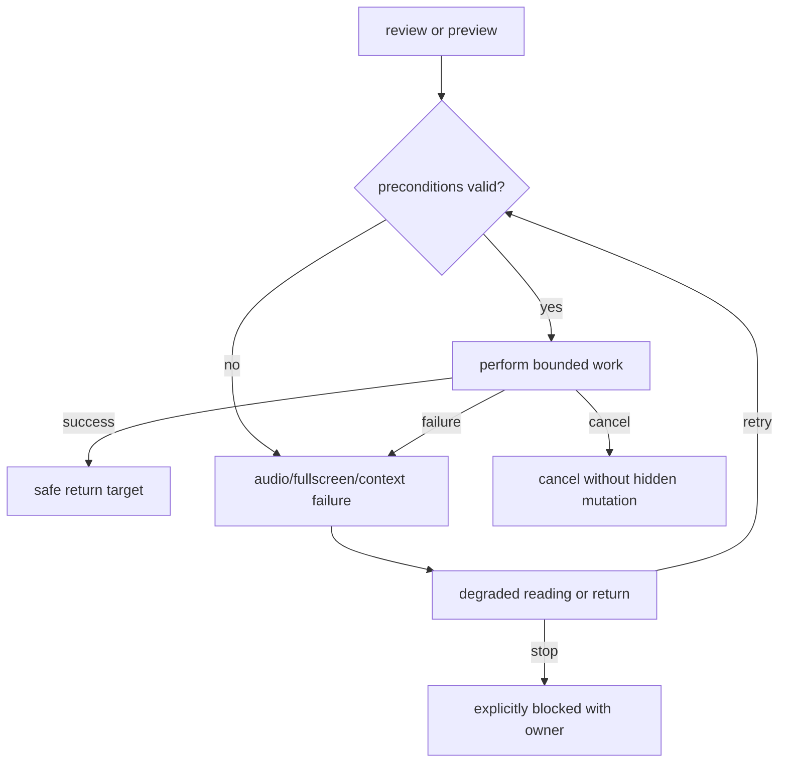
