# Content, audio, and Reader flow contracts

Voice, synthesis, persistence, artifacts, playback, reader-mode, progress, and repair contracts.

Generated from `manifest.json` by `pnpm validate:flows`; do not hand-edit.

## VOICE-SOURCE-001 — Voice source normalization, transcription, and candidate analysis

- Primary owner: `speech-audio`
- Architecture family: `voice-preparation`
- Shared subgraphs: `classified-failure-retry`, `cancellable-cleanup`
- Secondary owners: none
- Shared concerns: `RECOVERY`, `FILESYSTEM`, `SUBPROCESS`, `PRIVACY`, `I18N`, `ACCESSIBILITY`, `PERFORMANCE_TELEMETRY`, `OPERATIONAL_STATUS`

### Route ownership

- `GET /api/voice-profile-sources/:id`
- `GET /api/voice-profile-sources/:id/candidates/:candidateId/preview.wav`
- `POST /api/voice-profile-sources`
- `POST /api/voice-profile-sources/:id/cancel`
- `POST /api/voice-profile-sources/:id/candidates/:candidateId/transcript`
- `POST /api/voice-profile-sources/:id/transcript`

### State contract

| State | Label | Kind | Authority | UI observable |
| --- | --- | --- | --- | --- |
| `VOICE_SOURCE_001_REQUESTCAPTURED` | voice recording submitted | `stable` | `frontend` | UI shows voice recording submitted |
| `VOICE_SOURCE_001_PRECONDITIONSCHECKED` | audio provenance format and consent checked | `stable` | `backend` | UI shows validation progress for voice source analysis |
| `VOICE_SOURCE_001_DOMAINWORKACTIVE` | normalization transcription and scoring running | `transient` | `backend` | UI shows normalization transcription and scoring running |
| `VOICE_SOURCE_001_DURABLEEFFECTRECORDED` | voice source analysis metadata persisted | `stable` | `backend` | UI shows committed voice source analysis state |
| `VOICE_SOURCE_001_FLOWCOMPLETED` | scored voice candidates visible | `terminal-success` | `shared` | UI shows scored voice candidates visible |
| `VOICE_SOURCE_001_CLASSIFIEDFAILURE` | audio tool model or analysis failed | `stable-failure` | `backend` | UI explains audio tool model or analysis failed |
| `VOICE_SOURCE_001_CLEANUPINPROGRESS` | voice analysis process group terminating | `transient` | `backend` | UI shows voice analysis process group terminating |
| `VOICE_SOURCE_001_CANCELEDCLEAN` | source retained without incomplete candidates | `terminal-canceled` | `shared` | UI shows source retained without incomplete candidates |
| `VOICE_SOURCE_001_RECOVERYCONTEXTREADY` | retry failed analysis or replace recording | `stable` | `shared` | UI offers retry failed analysis or replace recording |
| `VOICE_SOURCE_001_REFERENCEANALYZED` | Reference analysis and provenance recorded | `stable` | `backend` | Reference analysis and provenance recorded; the UI exposes this state or an actionable non-visual status. |
| `VOICE_SOURCE_001_QUALITYDECISION` | Quality acceptance, retry, or fallback decided | `stable` | `shared` | Quality acceptance, retry, or fallback decided; the UI exposes this state or an actionable non-visual status. |
| `VOICE_SOURCE_001_TARGETREADY` | Voice target is usable by the next stage | `stable` | `shared` | Voice target is usable by the next stage; the UI exposes this state or an actionable non-visual status. |

### Semantic roles

- `requestCaptured` → `VOICE_SOURCE_001_REQUESTCAPTURED`
- `preconditionsChecked` → `VOICE_SOURCE_001_PRECONDITIONSCHECKED`
- `domainWorkActive` → `VOICE_SOURCE_001_DOMAINWORKACTIVE`
- `durableEffectRecorded` → `VOICE_SOURCE_001_DURABLEEFFECTRECORDED`
- `flowCompleted` → `VOICE_SOURCE_001_FLOWCOMPLETED`
- `classifiedFailure` → `VOICE_SOURCE_001_CLASSIFIEDFAILURE`
- `cleanupInProgress` → `VOICE_SOURCE_001_CLEANUPINPROGRESS`
- `canceledClean` → `VOICE_SOURCE_001_CANCELEDCLEAN`
- `recoveryContextReady` → `VOICE_SOURCE_001_RECOVERYCONTEXTREADY`
- `referenceAnalyzed` → `VOICE_SOURCE_001_REFERENCEANALYZED`
- `qualityDecision` → `VOICE_SOURCE_001_QUALITYDECISION`
- `targetReady` → `VOICE_SOURCE_001_TARGETREADY`

### Required decisions

- **qualityDecision** at `VOICE_SOURCE_001_QUALITYDECISION`: `continue` → `VOICE-SOURCE-001:T05:success`, `reject` → `VOICE-SOURCE-001:T10:failure`, `cancel` → `VOICE-SOURCE-001:T15:cancel`

### Family and flow invariants

- Every voice-preparation flow exposes its required roles as canonical states.
- Every voice-preparation decision has named outgoing outcomes bound to transition IDs.
- VOICE-SOURCE-001 commit is not reached until voice source analysis metadata persisted
- VOICE-SOURCE-001 cancellation phases equal ordinary cancel-edge sources exactly.

### Transitions

| ID | From | To | Event | Guard | Branch |
| --- | --- | --- | --- | --- | --- |
| `VOICE-SOURCE-001:T01:entry` | `VOICE_SOURCE_001_REQUESTCAPTURED` | `VOICE_SOURCE_001_PRECONDITIONSCHECKED` | capture request | required input and ownership context are present | `entry` |
| `VOICE-SOURCE-001:T02:entry` | `VOICE_SOURCE_001_PRECONDITIONSCHECKED` | `VOICE_SOURCE_001_DOMAINWORKACTIVE` | start domain work | preconditions and trust-boundary checks pass | `entry` |
| `VOICE-SOURCE-001:T03:success` | `VOICE_SOURCE_001_DOMAINWORKACTIVE` | `VOICE_SOURCE_001_REFERENCEANALYZED` | advance from domainWorkActive to referenceAnalyzed | domainWorkActive produced the evidence required by referenceAnalyzed | `success` |
| `VOICE-SOURCE-001:T04:success` | `VOICE_SOURCE_001_REFERENCEANALYZED` | `VOICE_SOURCE_001_QUALITYDECISION` | advance from referenceAnalyzed to qualityDecision | referenceAnalyzed produced the evidence required by qualityDecision | `success` |
| `VOICE-SOURCE-001:T05:success` | `VOICE_SOURCE_001_QUALITYDECISION` | `VOICE_SOURCE_001_TARGETREADY` | advance from qualityDecision to targetReady | qualityDecision produced the evidence required by targetReady | `success` |
| `VOICE-SOURCE-001:T06:success` | `VOICE_SOURCE_001_TARGETREADY` | `VOICE_SOURCE_001_DURABLEEFFECTRECORDED` | advance from targetReady to durableEffectRecorded | targetReady produced the evidence required by durableEffectRecorded | `success` |
| `VOICE-SOURCE-001:T07:success` | `VOICE_SOURCE_001_DURABLEEFFECTRECORDED` | `VOICE_SOURCE_001_FLOWCOMPLETED` | advance from durableEffectRecorded to flowCompleted | durableEffectRecorded produced the evidence required by flowCompleted | `success` |
| `VOICE-SOURCE-001:T08:failure` | `VOICE_SOURCE_001_PRECONDITIONSCHECKED` | `VOICE_SOURCE_001_CLASSIFIEDFAILURE` | classify preconditionsChecked failure | preconditionsChecked produced a domain-classified error | `failure` |
| `VOICE-SOURCE-001:T09:failure` | `VOICE_SOURCE_001_DOMAINWORKACTIVE` | `VOICE_SOURCE_001_CLASSIFIEDFAILURE` | classify domainWorkActive failure | domainWorkActive produced a domain-classified error | `failure` |
| `VOICE-SOURCE-001:T10:failure` | `VOICE_SOURCE_001_QUALITYDECISION` | `VOICE_SOURCE_001_CLASSIFIEDFAILURE` | classify qualityDecision failure | qualityDecision produced a domain-classified error | `failure` |
| `VOICE-SOURCE-001:T11:recovery` | `VOICE_SOURCE_001_CLASSIFIEDFAILURE` | `VOICE_SOURCE_001_RECOVERYCONTEXTREADY` | prepare bounded recovery | failure is retryable and identity is preserved | `recovery` |
| `VOICE-SOURCE-001:T12:retry` | `VOICE_SOURCE_001_RECOVERYCONTEXTREADY` | `VOICE_SOURCE_001_DOMAINWORKACTIVE` | retry owned work | retry budget remains and committed effects are compatible | `retry` |
| `VOICE-SOURCE-001:T13:cancel` | `VOICE_SOURCE_001_DOMAINWORKACTIVE` | `VOICE_SOURCE_001_CLEANUPINPROGRESS` | cancel while domainWorkActive | the flow remains in a declared cancellable phase | `cancel` |
| `VOICE-SOURCE-001:T14:cancel` | `VOICE_SOURCE_001_REFERENCEANALYZED` | `VOICE_SOURCE_001_CLEANUPINPROGRESS` | cancel while referenceAnalyzed | the flow remains in a declared cancellable phase | `cancel` |
| `VOICE-SOURCE-001:T15:cancel` | `VOICE_SOURCE_001_QUALITYDECISION` | `VOICE_SOURCE_001_CLEANUPINPROGRESS` | cancel while qualityDecision | the flow remains in a declared cancellable phase | `cancel` |
| `VOICE-SOURCE-001:T16:cancel` | `VOICE_SOURCE_001_TARGETREADY` | `VOICE_SOURCE_001_CLEANUPINPROGRESS` | cancel while targetReady | the flow remains in a declared cancellable phase | `cancel` |
| `VOICE-SOURCE-001:T17:cleanup` | `VOICE_SOURCE_001_CLEANUPINPROGRESS` | `VOICE_SOURCE_001_CANCELEDCLEAN` | finish owned cleanup | owned transient work and descendants are gone or quarantined | `cleanup` |

### Evidence

- `frontend/src/VoiceSourceAnalysisPanel.test.tsx` — Executable source anchors only; no transition closure is claimed without a FLOW_ASSERT marker.
  - `makes source media and provenance the first disabled intake reason` — transitions: none (source anchor only)

### Planned transition evidence

- `VOICE-SOURCE-001:T01:entry`, `VOICE-SOURCE-001:T02:entry`, `VOICE-SOURCE-001:T03:success`, `VOICE-SOURCE-001:T04:success`, `VOICE-SOURCE-001:T05:success`, `VOICE-SOURCE-001:T06:success`, `VOICE-SOURCE-001:T07:success`, `VOICE-SOURCE-001:T08:failure`, `VOICE-SOURCE-001:T09:failure`, `VOICE-SOURCE-001:T10:failure`, `VOICE-SOURCE-001:T11:recovery`, `VOICE-SOURCE-001:T12:retry`, `VOICE-SOURCE-001:T13:cancel`, `VOICE-SOURCE-001:T14:cancel`, `VOICE-SOURCE-001:T15:cancel`, `VOICE-SOURCE-001:T16:cancel`, `VOICE-SOURCE-001:T17:cleanup` → `BIC-07`; verify with `mise exec -- pnpm --dir frontend exec vitest run frontend/src/VoiceSourceAnalysisPanel.test.tsx` — Owner issue must add transition-specific executable FLOW_ASSERT markers and assertions before closeout.

### Mermaid

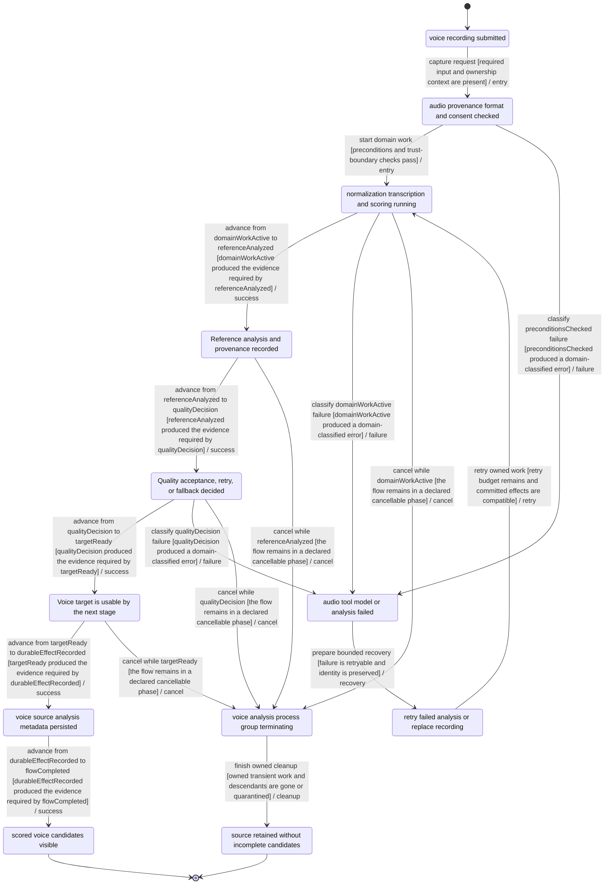
## VOICE-PROFILE-001 — Voice profile create, edit, readiness, and deletion

- Primary owner: `speech-audio`
- Architecture family: `durable-crud`
- Shared subgraphs: `classified-failure-retry`, `cancellable-cleanup`
- Secondary owners: none
- Shared concerns: `RECOVERY`, `LOCAL_ORIGIN_AUTH`, `FILESYSTEM`, `PRIVACY`, `I18N`, `ACCESSIBILITY`, `OPERATIONAL_STATUS`

### Route ownership

- `DELETE /api/voice-profiles/:id`
- `GET /api/voice-profiles`
- `GET /api/voice-profiles/:id`
- `GET /api/voices`
- `GET /api/voices/:id/reference-audio`
- `PATCH /api/voice-profiles/:id`
- `POST /api/voice-profile-sources/:id/candidates/:candidateId/profiles`
- `POST /api/voice-profiles`
- `POST /api/voices`

### State contract

| State | Label | Kind | Authority | UI observable |
| --- | --- | --- | --- | --- |
| `VOICE_PROFILE_001_REQUESTCAPTURED` | voice profile create or edit requested | `stable` | `frontend` | UI shows voice profile create or edit requested |
| `VOICE_PROFILE_001_PRECONDITIONSCHECKED` | source likeness metadata and name checked | `stable` | `backend` | UI shows validation progress for voice profile change |
| `VOICE_PROFILE_001_DOMAINWORKACTIVE` | profile metadata and references writing | `transient` | `backend` | UI shows profile metadata and references writing |
| `VOICE_PROFILE_001_DURABLEEFFECTRECORDED` | voice profile revision persisted | `stable` | `backend` | UI shows committed voice profile change state |
| `VOICE_PROFILE_001_FLOWCOMPLETED` | ready or explicitly pending profile visible | `terminal-success` | `shared` | UI shows ready or explicitly pending profile visible |
| `VOICE_PROFILE_001_CLASSIFIEDFAILURE` | likeness validation or storage failed | `stable-failure` | `backend` | UI explains likeness validation or storage failed |
| `VOICE_PROFILE_001_CLEANUPINPROGRESS` | profile creation stopping | `transient` | `backend` | UI shows profile creation stopping |
| `VOICE_PROFILE_001_CANCELEDCLEAN` | source remains available without new profile | `terminal-canceled` | `shared` | UI shows source remains available without new profile |
| `VOICE_PROFILE_001_RECOVERYCONTEXTREADY` | correct metadata or rebuild from retained source | `stable` | `shared` | UI offers correct metadata or rebuild from retained source |
| `VOICE_PROFILE_001_WRITEPRECONDITIONS` | Write preconditions and revision token checked | `stable` | `backend` | Write preconditions and revision token checked; the UI exposes this state or an actionable non-visual status. |
| `VOICE_PROFILE_001_CONFLICTDECISION` | Persist, reload, or reject conflict decision made | `stable` | `shared` | Persist, reload, or reject conflict decision made; the UI exposes this state or an actionable non-visual status. |
| `VOICE_PROFILE_001_DURABLEREADBACK` | Committed record read back from durable storage | `stable` | `backend` | Committed record read back from durable storage; the UI exposes this state or an actionable non-visual status. |

### Semantic roles

- `requestCaptured` → `VOICE_PROFILE_001_REQUESTCAPTURED`
- `preconditionsChecked` → `VOICE_PROFILE_001_PRECONDITIONSCHECKED`
- `domainWorkActive` → `VOICE_PROFILE_001_DOMAINWORKACTIVE`
- `durableEffectRecorded` → `VOICE_PROFILE_001_DURABLEEFFECTRECORDED`
- `flowCompleted` → `VOICE_PROFILE_001_FLOWCOMPLETED`
- `classifiedFailure` → `VOICE_PROFILE_001_CLASSIFIEDFAILURE`
- `cleanupInProgress` → `VOICE_PROFILE_001_CLEANUPINPROGRESS`
- `canceledClean` → `VOICE_PROFILE_001_CANCELEDCLEAN`
- `recoveryContextReady` → `VOICE_PROFILE_001_RECOVERYCONTEXTREADY`
- `writePreconditions` → `VOICE_PROFILE_001_WRITEPRECONDITIONS`
- `conflictDecision` → `VOICE_PROFILE_001_CONFLICTDECISION`
- `durableReadback` → `VOICE_PROFILE_001_DURABLEREADBACK`

### Required decisions

- **conflictDecision** at `VOICE_PROFILE_001_CONFLICTDECISION`: `continue` → `VOICE-PROFILE-001:T05:success`, `reject` → `VOICE-PROFILE-001:T10:failure`, `cancel` → `VOICE-PROFILE-001:T15:cancel`

### Family and flow invariants

- Every durable-crud flow exposes its required roles as canonical states.
- Every durable-crud decision has named outgoing outcomes bound to transition IDs.
- VOICE-PROFILE-001 commit is not reached until voice profile revision persisted
- VOICE-PROFILE-001 cancellation phases equal ordinary cancel-edge sources exactly.

### Transitions

| ID | From | To | Event | Guard | Branch |
| --- | --- | --- | --- | --- | --- |
| `VOICE-PROFILE-001:T01:entry` | `VOICE_PROFILE_001_REQUESTCAPTURED` | `VOICE_PROFILE_001_PRECONDITIONSCHECKED` | capture request | required input and ownership context are present | `entry` |
| `VOICE-PROFILE-001:T02:entry` | `VOICE_PROFILE_001_PRECONDITIONSCHECKED` | `VOICE_PROFILE_001_DOMAINWORKACTIVE` | start domain work | preconditions and trust-boundary checks pass | `entry` |
| `VOICE-PROFILE-001:T03:success` | `VOICE_PROFILE_001_DOMAINWORKACTIVE` | `VOICE_PROFILE_001_WRITEPRECONDITIONS` | advance from domainWorkActive to writePreconditions | domainWorkActive produced the evidence required by writePreconditions | `success` |
| `VOICE-PROFILE-001:T04:success` | `VOICE_PROFILE_001_WRITEPRECONDITIONS` | `VOICE_PROFILE_001_CONFLICTDECISION` | advance from writePreconditions to conflictDecision | writePreconditions produced the evidence required by conflictDecision | `success` |
| `VOICE-PROFILE-001:T05:success` | `VOICE_PROFILE_001_CONFLICTDECISION` | `VOICE_PROFILE_001_DURABLEREADBACK` | advance from conflictDecision to durableReadback | conflictDecision produced the evidence required by durableReadback | `success` |
| `VOICE-PROFILE-001:T06:success` | `VOICE_PROFILE_001_DURABLEREADBACK` | `VOICE_PROFILE_001_DURABLEEFFECTRECORDED` | advance from durableReadback to durableEffectRecorded | durableReadback produced the evidence required by durableEffectRecorded | `success` |
| `VOICE-PROFILE-001:T07:success` | `VOICE_PROFILE_001_DURABLEEFFECTRECORDED` | `VOICE_PROFILE_001_FLOWCOMPLETED` | advance from durableEffectRecorded to flowCompleted | durableEffectRecorded produced the evidence required by flowCompleted | `success` |
| `VOICE-PROFILE-001:T08:failure` | `VOICE_PROFILE_001_PRECONDITIONSCHECKED` | `VOICE_PROFILE_001_CLASSIFIEDFAILURE` | classify preconditionsChecked failure | preconditionsChecked produced a domain-classified error | `failure` |
| `VOICE-PROFILE-001:T09:failure` | `VOICE_PROFILE_001_DOMAINWORKACTIVE` | `VOICE_PROFILE_001_CLASSIFIEDFAILURE` | classify domainWorkActive failure | domainWorkActive produced a domain-classified error | `failure` |
| `VOICE-PROFILE-001:T10:failure` | `VOICE_PROFILE_001_CONFLICTDECISION` | `VOICE_PROFILE_001_CLASSIFIEDFAILURE` | classify conflictDecision failure | conflictDecision produced a domain-classified error | `failure` |
| `VOICE-PROFILE-001:T11:recovery` | `VOICE_PROFILE_001_CLASSIFIEDFAILURE` | `VOICE_PROFILE_001_RECOVERYCONTEXTREADY` | prepare bounded recovery | failure is retryable and identity is preserved | `recovery` |
| `VOICE-PROFILE-001:T12:retry` | `VOICE_PROFILE_001_RECOVERYCONTEXTREADY` | `VOICE_PROFILE_001_DOMAINWORKACTIVE` | retry owned work | retry budget remains and committed effects are compatible | `retry` |
| `VOICE-PROFILE-001:T13:cancel` | `VOICE_PROFILE_001_DOMAINWORKACTIVE` | `VOICE_PROFILE_001_CLEANUPINPROGRESS` | cancel while domainWorkActive | the flow remains in a declared cancellable phase | `cancel` |
| `VOICE-PROFILE-001:T14:cancel` | `VOICE_PROFILE_001_WRITEPRECONDITIONS` | `VOICE_PROFILE_001_CLEANUPINPROGRESS` | cancel while writePreconditions | the flow remains in a declared cancellable phase | `cancel` |
| `VOICE-PROFILE-001:T15:cancel` | `VOICE_PROFILE_001_CONFLICTDECISION` | `VOICE_PROFILE_001_CLEANUPINPROGRESS` | cancel while conflictDecision | the flow remains in a declared cancellable phase | `cancel` |
| `VOICE-PROFILE-001:T16:cancel` | `VOICE_PROFILE_001_DURABLEREADBACK` | `VOICE_PROFILE_001_CLEANUPINPROGRESS` | cancel while durableReadback | the flow remains in a declared cancellable phase | `cancel` |
| `VOICE-PROFILE-001:T17:cleanup` | `VOICE_PROFILE_001_CLEANUPINPROGRESS` | `VOICE_PROFILE_001_CANCELEDCLEAN` | finish owned cleanup | owned transient work and descendants are gone or quarantined | `cleanup` |

### Evidence

- `frontend/src/features/voices/voiceProfileModel.test.ts` — Executable source anchors only; no transition closure is claimed without a FLOW_ASSERT marker.
  - `surfaces provenance summaries for cloned profiles and active sources` — transitions: none (source anchor only)

### Planned transition evidence

- `VOICE-PROFILE-001:T01:entry`, `VOICE-PROFILE-001:T02:entry`, `VOICE-PROFILE-001:T03:success`, `VOICE-PROFILE-001:T04:success`, `VOICE-PROFILE-001:T05:success`, `VOICE-PROFILE-001:T06:success`, `VOICE-PROFILE-001:T07:success`, `VOICE-PROFILE-001:T08:failure`, `VOICE-PROFILE-001:T09:failure`, `VOICE-PROFILE-001:T10:failure`, `VOICE-PROFILE-001:T11:recovery`, `VOICE-PROFILE-001:T12:retry`, `VOICE-PROFILE-001:T13:cancel`, `VOICE-PROFILE-001:T14:cancel`, `VOICE-PROFILE-001:T15:cancel`, `VOICE-PROFILE-001:T16:cancel`, `VOICE-PROFILE-001:T17:cleanup` → `BIC-07`; verify with `mise exec -- pnpm --dir frontend exec vitest run frontend/src/features/voices/voiceProfileModel.test.ts` — Owner issue must add transition-specific executable FLOW_ASSERT markers and assertions before closeout.

### Mermaid

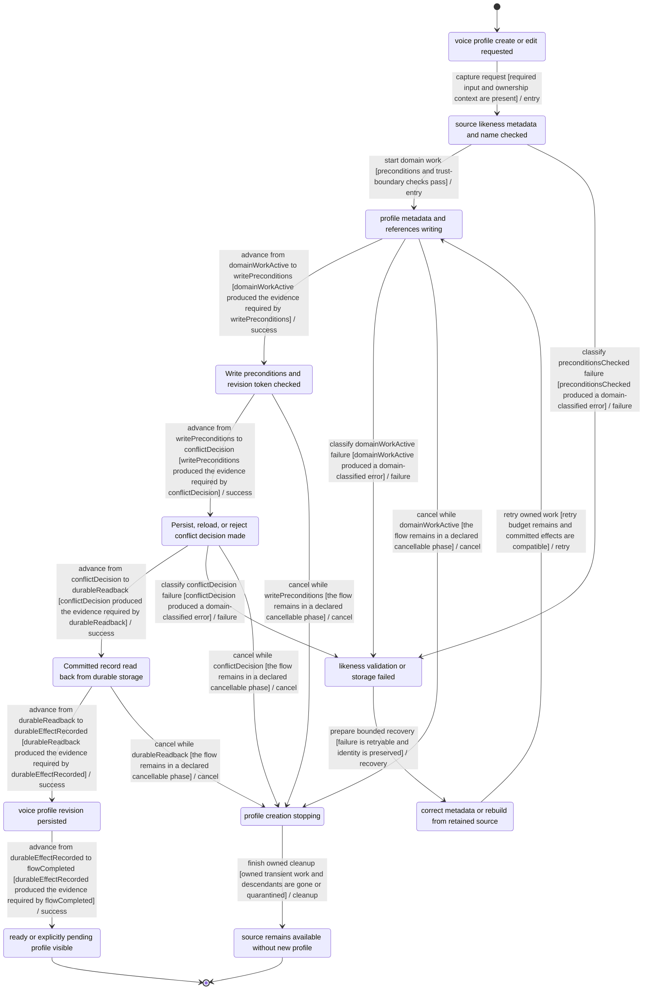
## VOICE-TARGET-001 — Voice target and clone artifact build lifecycle

- Primary owner: `speech-audio`
- Architecture family: `voice-preparation`
- Shared subgraphs: `classified-failure-retry`, `cancellable-cleanup`
- Secondary owners: none
- Shared concerns: `RECOVERY`, `FILESYSTEM`, `SUBPROCESS`, `NETWORK_EGRESS`, `PRIVACY`, `ACCESSIBILITY`, `PERFORMANCE_TELEMETRY`, `OPERATIONAL_STATUS`

### Route ownership

- `POST /api/voice-profiles/:id/artifacts/:moduleId`
- `POST /api/voice-profiles/:id/artifacts/:moduleId/cancel`
- `POST /api/voice-profiles/:id/targets/:targetId`
- `POST /api/voice-profiles/:id/targets/:targetId/cancel`

### State contract

| State | Label | Kind | Authority | UI observable |
| --- | --- | --- | --- | --- |
| `VOICE_TARGET_001_REQUESTCAPTURED` | voice target build requested | `stable` | `frontend` | UI shows voice target build requested |
| `VOICE_TARGET_001_PRECONDITIONSCHECKED` | profile module and target compatibility checked | `stable` | `backend` | UI shows validation progress for voice target build |
| `VOICE_TARGET_001_DOMAINWORKACTIVE` | target artifact process running | `transient` | `backend` | UI shows target artifact process running |
| `VOICE_TARGET_001_DURABLEEFFECTRECORDED` | validated target artifact promoted | `stable` | `backend` | UI shows committed voice target build state |
| `VOICE_TARGET_001_FLOWCOMPLETED` | ready inference target visible | `terminal-success` | `shared` | UI shows ready inference target visible |
| `VOICE_TARGET_001_CLASSIFIEDFAILURE` | unsupported build or validation failure persisted | `stable-failure` | `backend` | UI explains unsupported build or validation failure persisted |
| `VOICE_TARGET_001_CLEANUPINPROGRESS` | target process group terminating | `transient` | `backend` | UI shows target process group terminating |
| `VOICE_TARGET_001_CANCELEDCLEAN` | target marked canceled and prior ready artifact retained | `terminal-canceled` | `shared` | UI shows target marked canceled and prior ready artifact retained |
| `VOICE_TARGET_001_RECOVERYCONTEXTREADY` | requeue target or choose compatible engine | `stable` | `shared` | UI offers requeue target or choose compatible engine |
| `VOICE_TARGET_001_REFERENCEANALYZED` | Reference analysis and provenance recorded | `stable` | `backend` | Reference analysis and provenance recorded; the UI exposes this state or an actionable non-visual status. |
| `VOICE_TARGET_001_QUALITYDECISION` | Quality acceptance, retry, or fallback decided | `stable` | `shared` | Quality acceptance, retry, or fallback decided; the UI exposes this state or an actionable non-visual status. |
| `VOICE_TARGET_001_TARGETREADY` | Voice target is usable by the next stage | `stable` | `shared` | Voice target is usable by the next stage; the UI exposes this state or an actionable non-visual status. |

### Semantic roles

- `requestCaptured` → `VOICE_TARGET_001_REQUESTCAPTURED`
- `preconditionsChecked` → `VOICE_TARGET_001_PRECONDITIONSCHECKED`
- `domainWorkActive` → `VOICE_TARGET_001_DOMAINWORKACTIVE`
- `durableEffectRecorded` → `VOICE_TARGET_001_DURABLEEFFECTRECORDED`
- `flowCompleted` → `VOICE_TARGET_001_FLOWCOMPLETED`
- `classifiedFailure` → `VOICE_TARGET_001_CLASSIFIEDFAILURE`
- `cleanupInProgress` → `VOICE_TARGET_001_CLEANUPINPROGRESS`
- `canceledClean` → `VOICE_TARGET_001_CANCELEDCLEAN`
- `recoveryContextReady` → `VOICE_TARGET_001_RECOVERYCONTEXTREADY`
- `referenceAnalyzed` → `VOICE_TARGET_001_REFERENCEANALYZED`
- `qualityDecision` → `VOICE_TARGET_001_QUALITYDECISION`
- `targetReady` → `VOICE_TARGET_001_TARGETREADY`

### Required decisions

- **qualityDecision** at `VOICE_TARGET_001_QUALITYDECISION`: `continue` → `VOICE-TARGET-001:T05:success`, `reject` → `VOICE-TARGET-001:T10:failure`, `cancel` → `VOICE-TARGET-001:T15:cancel`

### Family and flow invariants

- Every voice-preparation flow exposes its required roles as canonical states.
- Every voice-preparation decision has named outgoing outcomes bound to transition IDs.
- VOICE-TARGET-001 commit is not reached until validated target artifact promoted
- VOICE-TARGET-001 cancellation phases equal ordinary cancel-edge sources exactly.

### Transitions

| ID | From | To | Event | Guard | Branch |
| --- | --- | --- | --- | --- | --- |
| `VOICE-TARGET-001:T01:entry` | `VOICE_TARGET_001_REQUESTCAPTURED` | `VOICE_TARGET_001_PRECONDITIONSCHECKED` | capture request | required input and ownership context are present | `entry` |
| `VOICE-TARGET-001:T02:entry` | `VOICE_TARGET_001_PRECONDITIONSCHECKED` | `VOICE_TARGET_001_DOMAINWORKACTIVE` | start domain work | preconditions and trust-boundary checks pass | `entry` |
| `VOICE-TARGET-001:T03:success` | `VOICE_TARGET_001_DOMAINWORKACTIVE` | `VOICE_TARGET_001_REFERENCEANALYZED` | advance from domainWorkActive to referenceAnalyzed | domainWorkActive produced the evidence required by referenceAnalyzed | `success` |
| `VOICE-TARGET-001:T04:success` | `VOICE_TARGET_001_REFERENCEANALYZED` | `VOICE_TARGET_001_QUALITYDECISION` | advance from referenceAnalyzed to qualityDecision | referenceAnalyzed produced the evidence required by qualityDecision | `success` |
| `VOICE-TARGET-001:T05:success` | `VOICE_TARGET_001_QUALITYDECISION` | `VOICE_TARGET_001_TARGETREADY` | advance from qualityDecision to targetReady | qualityDecision produced the evidence required by targetReady | `success` |
| `VOICE-TARGET-001:T06:success` | `VOICE_TARGET_001_TARGETREADY` | `VOICE_TARGET_001_DURABLEEFFECTRECORDED` | advance from targetReady to durableEffectRecorded | targetReady produced the evidence required by durableEffectRecorded | `success` |
| `VOICE-TARGET-001:T07:success` | `VOICE_TARGET_001_DURABLEEFFECTRECORDED` | `VOICE_TARGET_001_FLOWCOMPLETED` | advance from durableEffectRecorded to flowCompleted | durableEffectRecorded produced the evidence required by flowCompleted | `success` |
| `VOICE-TARGET-001:T08:failure` | `VOICE_TARGET_001_PRECONDITIONSCHECKED` | `VOICE_TARGET_001_CLASSIFIEDFAILURE` | classify preconditionsChecked failure | preconditionsChecked produced a domain-classified error | `failure` |
| `VOICE-TARGET-001:T09:failure` | `VOICE_TARGET_001_DOMAINWORKACTIVE` | `VOICE_TARGET_001_CLASSIFIEDFAILURE` | classify domainWorkActive failure | domainWorkActive produced a domain-classified error | `failure` |
| `VOICE-TARGET-001:T10:failure` | `VOICE_TARGET_001_QUALITYDECISION` | `VOICE_TARGET_001_CLASSIFIEDFAILURE` | classify qualityDecision failure | qualityDecision produced a domain-classified error | `failure` |
| `VOICE-TARGET-001:T11:recovery` | `VOICE_TARGET_001_CLASSIFIEDFAILURE` | `VOICE_TARGET_001_RECOVERYCONTEXTREADY` | prepare bounded recovery | failure is retryable and identity is preserved | `recovery` |
| `VOICE-TARGET-001:T12:retry` | `VOICE_TARGET_001_RECOVERYCONTEXTREADY` | `VOICE_TARGET_001_DOMAINWORKACTIVE` | retry owned work | retry budget remains and committed effects are compatible | `retry` |
| `VOICE-TARGET-001:T13:cancel` | `VOICE_TARGET_001_DOMAINWORKACTIVE` | `VOICE_TARGET_001_CLEANUPINPROGRESS` | cancel while domainWorkActive | the flow remains in a declared cancellable phase | `cancel` |
| `VOICE-TARGET-001:T14:cancel` | `VOICE_TARGET_001_REFERENCEANALYZED` | `VOICE_TARGET_001_CLEANUPINPROGRESS` | cancel while referenceAnalyzed | the flow remains in a declared cancellable phase | `cancel` |
| `VOICE-TARGET-001:T15:cancel` | `VOICE_TARGET_001_QUALITYDECISION` | `VOICE_TARGET_001_CLEANUPINPROGRESS` | cancel while qualityDecision | the flow remains in a declared cancellable phase | `cancel` |
| `VOICE-TARGET-001:T16:cancel` | `VOICE_TARGET_001_TARGETREADY` | `VOICE_TARGET_001_CLEANUPINPROGRESS` | cancel while targetReady | the flow remains in a declared cancellable phase | `cancel` |
| `VOICE-TARGET-001:T17:cleanup` | `VOICE_TARGET_001_CLEANUPINPROGRESS` | `VOICE_TARGET_001_CANCELEDCLEAN` | finish owned cleanup | owned transient work and descendants are gone or quarantined | `cleanup` |

### Evidence

- `frontend/src/profileTargets.test.ts` — Executable source anchors only; no transition closure is claimed without a FLOW_ASSERT marker.
  - `requires selected target readiness before enabling clone engines` — transitions: none (source anchor only)
  - `maps supertonic backend to supertonic-embed target` — transitions: none (source anchor only)
  - `requires supertonic target or artifact for profile-backed supertonic rendering` — transitions: none (source anchor only)
  - `treats an unselected target as unavailable on new targeted profiles` — transitions: none (source anchor only)
  - `keeps legacy artifact profiles usable when target state is absent` — transitions: none (source anchor only)
  - `treats cancelled targets as unavailable with retry copy` — transitions: none (source anchor only)
  - `describes backend target policy from a single descriptor` — transitions: none (source anchor only)

### Planned transition evidence

- `VOICE-TARGET-001:T01:entry`, `VOICE-TARGET-001:T02:entry`, `VOICE-TARGET-001:T03:success`, `VOICE-TARGET-001:T04:success`, `VOICE-TARGET-001:T05:success`, `VOICE-TARGET-001:T06:success`, `VOICE-TARGET-001:T07:success`, `VOICE-TARGET-001:T08:failure`, `VOICE-TARGET-001:T09:failure`, `VOICE-TARGET-001:T10:failure`, `VOICE-TARGET-001:T11:recovery`, `VOICE-TARGET-001:T12:retry`, `VOICE-TARGET-001:T13:cancel`, `VOICE-TARGET-001:T14:cancel`, `VOICE-TARGET-001:T15:cancel`, `VOICE-TARGET-001:T16:cancel`, `VOICE-TARGET-001:T17:cleanup` → `BIC-07`; verify with `mise exec -- pnpm --dir frontend exec vitest run frontend/src/profileTargets.test.ts` — Owner issue must add transition-specific executable FLOW_ASSERT markers and assertions before closeout.

### Mermaid

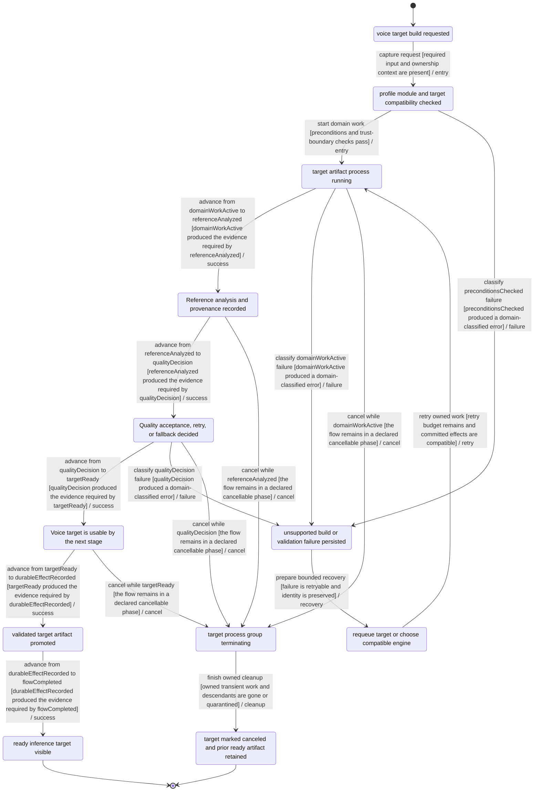
## JOB-CREATE-001 — Synthesis job validation and durable queueing

- Primary owner: `speech-audio`
- Architecture family: `voice-preparation`
- Shared subgraphs: `classified-failure-retry`, `cancellable-cleanup`
- Secondary owners: `source-data`
- Shared concerns: `RECOVERY`, `LOCAL_ORIGIN_AUTH`, `PRIVACY`, `I18N`, `ACCESSIBILITY`, `OPERATIONAL_STATUS`

### Route ownership

- `GET /api/projects/:id/jobs`
- `POST /api/book-sources/:id/voice-jobs`
- `POST /api/source-preps/:id/voice-jobs`
- `POST /api/temporary-sources/:id/voice-jobs`
- `POST /api/voice-jobs`

### State contract

| State | Label | Kind | Authority | UI observable |
| --- | --- | --- | --- | --- |
| `JOB_CREATE_001_REQUESTCAPTURED` | audio generation requested | `stable` | `frontend` | UI shows audio generation requested |
| `JOB_CREATE_001_PRECONDITIONSCHECKED` | source plan voice engine and identity checked | `stable` | `backend` | UI shows validation progress for job creation |
| `JOB_CREATE_001_DOMAINWORKACTIVE` | job request normalizing | `transient` | `backend` | UI shows job request normalizing |
| `JOB_CREATE_001_DURABLEEFFECTRECORDED` | queued job record persisted | `stable` | `backend` | UI shows committed job creation state |
| `JOB_CREATE_001_FLOWCOMPLETED` | queued job visible with stable id | `terminal-success` | `shared` | UI shows queued job visible with stable id |
| `JOB_CREATE_001_CLASSIFIEDFAILURE` | job validation rejected without queue mutation | `stable-failure` | `backend` | UI explains job validation rejected without queue mutation |
| `JOB_CREATE_001_CLEANUPINPROGRESS` | uncommitted job request withdrawn | `transient` | `backend` | UI shows uncommitted job request withdrawn |
| `JOB_CREATE_001_CANCELEDCLEAN` | no queued job created | `terminal-canceled` | `shared` | UI shows no queued job created |
| `JOB_CREATE_001_RECOVERYCONTEXTREADY` | invalid input corrected and resubmitted | `stable` | `shared` | UI offers invalid input corrected and resubmitted |
| `JOB_CREATE_001_REFERENCEANALYZED` | Reference analysis and provenance recorded | `stable` | `backend` | Reference analysis and provenance recorded; the UI exposes this state or an actionable non-visual status. |
| `JOB_CREATE_001_QUALITYDECISION` | Quality acceptance, retry, or fallback decided | `stable` | `shared` | Quality acceptance, retry, or fallback decided; the UI exposes this state or an actionable non-visual status. |
| `JOB_CREATE_001_TARGETREADY` | Voice target is usable by the next stage | `stable` | `shared` | Voice target is usable by the next stage; the UI exposes this state or an actionable non-visual status. |

### Semantic roles

- `requestCaptured` → `JOB_CREATE_001_REQUESTCAPTURED`
- `preconditionsChecked` → `JOB_CREATE_001_PRECONDITIONSCHECKED`
- `domainWorkActive` → `JOB_CREATE_001_DOMAINWORKACTIVE`
- `durableEffectRecorded` → `JOB_CREATE_001_DURABLEEFFECTRECORDED`
- `flowCompleted` → `JOB_CREATE_001_FLOWCOMPLETED`
- `classifiedFailure` → `JOB_CREATE_001_CLASSIFIEDFAILURE`
- `cleanupInProgress` → `JOB_CREATE_001_CLEANUPINPROGRESS`
- `canceledClean` → `JOB_CREATE_001_CANCELEDCLEAN`
- `recoveryContextReady` → `JOB_CREATE_001_RECOVERYCONTEXTREADY`
- `referenceAnalyzed` → `JOB_CREATE_001_REFERENCEANALYZED`
- `qualityDecision` → `JOB_CREATE_001_QUALITYDECISION`
- `targetReady` → `JOB_CREATE_001_TARGETREADY`

### Required decisions

- **qualityDecision** at `JOB_CREATE_001_QUALITYDECISION`: `continue` → `JOB-CREATE-001:T05:success`, `reject` → `JOB-CREATE-001:T10:failure`, `cancel` → `JOB-CREATE-001:T15:cancel`

### Family and flow invariants

- Every voice-preparation flow exposes its required roles as canonical states.
- Every voice-preparation decision has named outgoing outcomes bound to transition IDs.
- JOB-CREATE-001 commit is not reached until queued job record persisted
- JOB-CREATE-001 cancellation phases equal ordinary cancel-edge sources exactly.
- Frozen BIC-08 planned-evidence ownership is provenance; responsive replacement ownership RSP-05/RSP-06 is planned only and is not covered or implemented.

### Transitions

| ID | From | To | Event | Guard | Branch |
| --- | --- | --- | --- | --- | --- |
| `JOB-CREATE-001:T01:entry` | `JOB_CREATE_001_REQUESTCAPTURED` | `JOB_CREATE_001_PRECONDITIONSCHECKED` | capture request | required input and ownership context are present | `entry` |
| `JOB-CREATE-001:T02:entry` | `JOB_CREATE_001_PRECONDITIONSCHECKED` | `JOB_CREATE_001_DOMAINWORKACTIVE` | start domain work | preconditions and trust-boundary checks pass | `entry` |
| `JOB-CREATE-001:T03:success` | `JOB_CREATE_001_DOMAINWORKACTIVE` | `JOB_CREATE_001_REFERENCEANALYZED` | advance from domainWorkActive to referenceAnalyzed | domainWorkActive produced the evidence required by referenceAnalyzed | `success` |
| `JOB-CREATE-001:T04:success` | `JOB_CREATE_001_REFERENCEANALYZED` | `JOB_CREATE_001_QUALITYDECISION` | advance from referenceAnalyzed to qualityDecision | referenceAnalyzed produced the evidence required by qualityDecision | `success` |
| `JOB-CREATE-001:T05:success` | `JOB_CREATE_001_QUALITYDECISION` | `JOB_CREATE_001_TARGETREADY` | advance from qualityDecision to targetReady | qualityDecision produced the evidence required by targetReady | `success` |
| `JOB-CREATE-001:T06:success` | `JOB_CREATE_001_TARGETREADY` | `JOB_CREATE_001_DURABLEEFFECTRECORDED` | advance from targetReady to durableEffectRecorded | targetReady produced the evidence required by durableEffectRecorded | `success` |
| `JOB-CREATE-001:T07:success` | `JOB_CREATE_001_DURABLEEFFECTRECORDED` | `JOB_CREATE_001_FLOWCOMPLETED` | advance from durableEffectRecorded to flowCompleted | durableEffectRecorded produced the evidence required by flowCompleted | `success` |
| `JOB-CREATE-001:T08:failure` | `JOB_CREATE_001_PRECONDITIONSCHECKED` | `JOB_CREATE_001_CLASSIFIEDFAILURE` | classify preconditionsChecked failure | preconditionsChecked produced a domain-classified error | `failure` |
| `JOB-CREATE-001:T09:failure` | `JOB_CREATE_001_DOMAINWORKACTIVE` | `JOB_CREATE_001_CLASSIFIEDFAILURE` | classify domainWorkActive failure | domainWorkActive produced a domain-classified error | `failure` |
| `JOB-CREATE-001:T10:failure` | `JOB_CREATE_001_QUALITYDECISION` | `JOB_CREATE_001_CLASSIFIEDFAILURE` | classify qualityDecision failure | qualityDecision produced a domain-classified error | `failure` |
| `JOB-CREATE-001:T11:recovery` | `JOB_CREATE_001_CLASSIFIEDFAILURE` | `JOB_CREATE_001_RECOVERYCONTEXTREADY` | prepare bounded recovery | failure is retryable and identity is preserved | `recovery` |
| `JOB-CREATE-001:T12:retry` | `JOB_CREATE_001_RECOVERYCONTEXTREADY` | `JOB_CREATE_001_DOMAINWORKACTIVE` | retry owned work | retry budget remains and committed effects are compatible | `retry` |
| `JOB-CREATE-001:T13:cancel` | `JOB_CREATE_001_DOMAINWORKACTIVE` | `JOB_CREATE_001_CLEANUPINPROGRESS` | cancel while domainWorkActive | the flow remains in a declared cancellable phase | `cancel` |
| `JOB-CREATE-001:T14:cancel` | `JOB_CREATE_001_REFERENCEANALYZED` | `JOB_CREATE_001_CLEANUPINPROGRESS` | cancel while referenceAnalyzed | the flow remains in a declared cancellable phase | `cancel` |
| `JOB-CREATE-001:T15:cancel` | `JOB_CREATE_001_QUALITYDECISION` | `JOB_CREATE_001_CLEANUPINPROGRESS` | cancel while qualityDecision | the flow remains in a declared cancellable phase | `cancel` |
| `JOB-CREATE-001:T16:cancel` | `JOB_CREATE_001_TARGETREADY` | `JOB_CREATE_001_CLEANUPINPROGRESS` | cancel while targetReady | the flow remains in a declared cancellable phase | `cancel` |
| `JOB-CREATE-001:T17:cleanup` | `JOB_CREATE_001_CLEANUPINPROGRESS` | `JOB_CREATE_001_CANCELEDCLEAN` | finish owned cleanup | owned transient work and descendants are gone or quarantined | `cleanup` |

### Evidence

- `backend/internal/httpapi/router_test.go` — Executable source anchors only; no transition closure is claimed without a FLOW_ASSERT marker.
  - `TestHealthEndpoint` — transitions: none (source anchor only)
  - `TestTTSEnginesEndpoint` — transitions: none (source anchor only)
  - `TestResearchModuleClonePreflightAllowsLocalDevOrigins` — transitions: none (source anchor only)
  - `TestVoiceProfileCredentialsEndpointSavesStatusWithoutReturningToken` — transitions: none (source anchor only)
  - `TestAdapterCapabilityEndpoints` — transitions: none (source anchor only)
  - `TestBuildVoiceProfileArtifactEndpointRejectsInvalidTimeoutValues` — transitions: none (source anchor only)

### Planned transition evidence

- `JOB-CREATE-001:T01:entry`, `JOB-CREATE-001:T02:entry`, `JOB-CREATE-001:T03:success`, `JOB-CREATE-001:T04:success`, `JOB-CREATE-001:T05:success`, `JOB-CREATE-001:T06:success`, `JOB-CREATE-001:T07:success`, `JOB-CREATE-001:T08:failure`, `JOB-CREATE-001:T09:failure`, `JOB-CREATE-001:T10:failure`, `JOB-CREATE-001:T11:recovery`, `JOB-CREATE-001:T12:retry`, `JOB-CREATE-001:T13:cancel`, `JOB-CREATE-001:T14:cancel`, `JOB-CREATE-001:T15:cancel`, `JOB-CREATE-001:T16:cancel`, `JOB-CREATE-001:T17:cleanup` → `BIC-08`; verify with `cd backend && go test ./...` — Owner issue must add transition-specific executable FLOW_ASSERT markers and assertions before closeout.

### Mermaid

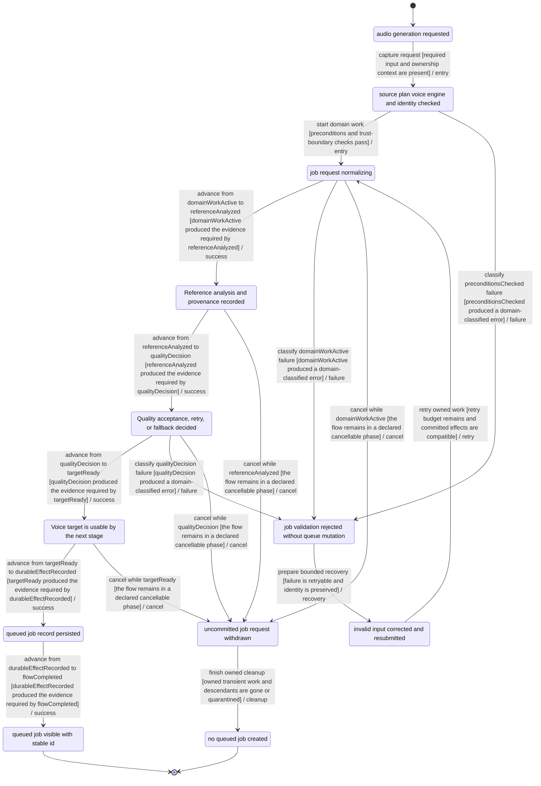
## JOB-RUN-001 — Synthesis, checking, retry, interruption, and cancellation

- Primary owner: `speech-audio`
- Architecture family: `job-recovery`
- Shared subgraphs: `classified-failure-retry`, `cancellable-cleanup`
- Secondary owners: none
- Shared concerns: `RECOVERY`, `FILESYSTEM`, `SUBPROCESS`, `NETWORK_EGRESS`, `PRIVACY`, `I18N`, `ACCESSIBILITY`, `PERFORMANCE_TELEMETRY`, `OPERATIONAL_STATUS`

### Route ownership

- `DELETE /api/voice-jobs/:id`
- `GET /api/voice-jobs/:id`
- `POST /api/voice-jobs/:id/cancel`
- `POST /api/voice-jobs/:id/retry`

### State contract

| State | Label | Kind | Authority | UI observable |
| --- | --- | --- | --- | --- |
| `JOB_RUN_001_REQUESTCAPTURED` | queued job dispatched | `stable` | `frontend` | UI shows queued job dispatched |
| `JOB_RUN_001_PRECONDITIONSCHECKED` | persisted request and capabilities rechecked | `stable` | `backend` | UI shows validation progress for synthesis job |
| `JOB_RUN_001_DOMAINWORKACTIVE` | segments optimizing synthesizing or checking | `transient` | `backend` | UI shows segments optimizing synthesizing or checking |
| `JOB_RUN_001_DURABLEEFFECTRECORDED` | checked segment artifact committed | `stable` | `backend` | UI shows committed synthesis job state |
| `JOB_RUN_001_FLOWCOMPLETED` | job completed with current checked artifacts | `terminal-success` | `shared` | UI shows job completed with current checked artifacts |
| `JOB_RUN_001_CLASSIFIEDFAILURE` | provider checker metadata or interruption persisted | `stable-failure` | `backend` | UI explains provider checker metadata or interruption persisted |
| `JOB_RUN_001_CLEANUPINPROGRESS` | provider and checker process groups terminating | `transient` | `backend` | UI shows provider and checker process groups terminating |
| `JOB_RUN_001_CANCELEDCLEAN` | job canceled with compatible committed segments retained | `terminal-canceled` | `shared` | UI shows job canceled with compatible committed segments retained |
| `JOB_RUN_001_RECOVERYCONTEXTREADY` | segment or job retry scheduled | `stable` | `shared` | UI offers segment or job retry scheduled |
| `JOB_RUN_001_CHECKPOINTLOADED` | Compatible checkpoint and committed prefix loaded | `stable` | `backend` | Compatible checkpoint and committed prefix loaded; the UI exposes this state or an actionable non-visual status. |
| `JOB_RUN_001_RETRYSCOPEDECISION` | Retry, resume, or repair scope decided | `stable` | `shared` | Retry, resume, or repair scope decided; the UI exposes this state or an actionable non-visual status. |
| `JOB_RUN_001_READYPREFIXREUSED` | Verified ready prefix reused without duplicate work | `stable` | `backend` | Verified ready prefix reused without duplicate work; the UI exposes this state or an actionable non-visual status. |

### Semantic roles

- `requestCaptured` → `JOB_RUN_001_REQUESTCAPTURED`
- `preconditionsChecked` → `JOB_RUN_001_PRECONDITIONSCHECKED`
- `domainWorkActive` → `JOB_RUN_001_DOMAINWORKACTIVE`
- `durableEffectRecorded` → `JOB_RUN_001_DURABLEEFFECTRECORDED`
- `flowCompleted` → `JOB_RUN_001_FLOWCOMPLETED`
- `classifiedFailure` → `JOB_RUN_001_CLASSIFIEDFAILURE`
- `cleanupInProgress` → `JOB_RUN_001_CLEANUPINPROGRESS`
- `canceledClean` → `JOB_RUN_001_CANCELEDCLEAN`
- `recoveryContextReady` → `JOB_RUN_001_RECOVERYCONTEXTREADY`
- `checkpointLoaded` → `JOB_RUN_001_CHECKPOINTLOADED`
- `retryScopeDecision` → `JOB_RUN_001_RETRYSCOPEDECISION`
- `readyPrefixReused` → `JOB_RUN_001_READYPREFIXREUSED`

### Required decisions

- **retryScopeDecision** at `JOB_RUN_001_RETRYSCOPEDECISION`: `continue` → `JOB-RUN-001:T05:success`, `reject` → `JOB-RUN-001:T10:failure`, `cancel` → `JOB-RUN-001:T15:cancel`

### Family and flow invariants

- Every job-recovery flow exposes its required roles as canonical states.
- Every job-recovery decision has named outgoing outcomes bound to transition IDs.
- JOB-RUN-001 commit is not reached until checked segment artifact committed
- JOB-RUN-001 cancellation phases equal ordinary cancel-edge sources exactly.
- Frozen BIC-08 planned-evidence ownership is provenance; responsive replacement ownership RSP-04/RSP-06/RSP-10 is planned only and is not covered or implemented.

### Transitions

| ID | From | To | Event | Guard | Branch |
| --- | --- | --- | --- | --- | --- |
| `JOB-RUN-001:T01:entry` | `JOB_RUN_001_REQUESTCAPTURED` | `JOB_RUN_001_PRECONDITIONSCHECKED` | capture request | required input and ownership context are present | `entry` |
| `JOB-RUN-001:T02:entry` | `JOB_RUN_001_PRECONDITIONSCHECKED` | `JOB_RUN_001_DOMAINWORKACTIVE` | start domain work | preconditions and trust-boundary checks pass | `entry` |
| `JOB-RUN-001:T03:success` | `JOB_RUN_001_DOMAINWORKACTIVE` | `JOB_RUN_001_CHECKPOINTLOADED` | advance from domainWorkActive to checkpointLoaded | domainWorkActive produced the evidence required by checkpointLoaded | `success` |
| `JOB-RUN-001:T04:success` | `JOB_RUN_001_CHECKPOINTLOADED` | `JOB_RUN_001_RETRYSCOPEDECISION` | advance from checkpointLoaded to retryScopeDecision | checkpointLoaded produced the evidence required by retryScopeDecision | `success` |
| `JOB-RUN-001:T05:success` | `JOB_RUN_001_RETRYSCOPEDECISION` | `JOB_RUN_001_READYPREFIXREUSED` | advance from retryScopeDecision to readyPrefixReused | retryScopeDecision produced the evidence required by readyPrefixReused | `success` |
| `JOB-RUN-001:T06:success` | `JOB_RUN_001_READYPREFIXREUSED` | `JOB_RUN_001_DURABLEEFFECTRECORDED` | advance from readyPrefixReused to durableEffectRecorded | readyPrefixReused produced the evidence required by durableEffectRecorded | `success` |
| `JOB-RUN-001:T07:success` | `JOB_RUN_001_DURABLEEFFECTRECORDED` | `JOB_RUN_001_FLOWCOMPLETED` | advance from durableEffectRecorded to flowCompleted | durableEffectRecorded produced the evidence required by flowCompleted | `success` |
| `JOB-RUN-001:T08:failure` | `JOB_RUN_001_PRECONDITIONSCHECKED` | `JOB_RUN_001_CLASSIFIEDFAILURE` | classify preconditionsChecked failure | preconditionsChecked produced a domain-classified error | `failure` |
| `JOB-RUN-001:T09:failure` | `JOB_RUN_001_DOMAINWORKACTIVE` | `JOB_RUN_001_CLASSIFIEDFAILURE` | classify domainWorkActive failure | domainWorkActive produced a domain-classified error | `failure` |
| `JOB-RUN-001:T10:failure` | `JOB_RUN_001_RETRYSCOPEDECISION` | `JOB_RUN_001_CLASSIFIEDFAILURE` | classify retryScopeDecision failure | retryScopeDecision produced a domain-classified error | `failure` |
| `JOB-RUN-001:T11:recovery` | `JOB_RUN_001_CLASSIFIEDFAILURE` | `JOB_RUN_001_RECOVERYCONTEXTREADY` | prepare bounded recovery | failure is retryable and identity is preserved | `recovery` |
| `JOB-RUN-001:T12:retry` | `JOB_RUN_001_RECOVERYCONTEXTREADY` | `JOB_RUN_001_DOMAINWORKACTIVE` | retry owned work | retry budget remains and committed effects are compatible | `retry` |
| `JOB-RUN-001:T13:cancel` | `JOB_RUN_001_DOMAINWORKACTIVE` | `JOB_RUN_001_CLEANUPINPROGRESS` | cancel while domainWorkActive | the flow remains in a declared cancellable phase | `cancel` |
| `JOB-RUN-001:T14:cancel` | `JOB_RUN_001_CHECKPOINTLOADED` | `JOB_RUN_001_CLEANUPINPROGRESS` | cancel while checkpointLoaded | the flow remains in a declared cancellable phase | `cancel` |
| `JOB-RUN-001:T15:cancel` | `JOB_RUN_001_RETRYSCOPEDECISION` | `JOB_RUN_001_CLEANUPINPROGRESS` | cancel while retryScopeDecision | the flow remains in a declared cancellable phase | `cancel` |
| `JOB-RUN-001:T16:cancel` | `JOB_RUN_001_READYPREFIXREUSED` | `JOB_RUN_001_CLEANUPINPROGRESS` | cancel while readyPrefixReused | the flow remains in a declared cancellable phase | `cancel` |
| `JOB-RUN-001:T17:cleanup` | `JOB_RUN_001_CLEANUPINPROGRESS` | `JOB_RUN_001_CANCELEDCLEAN` | finish owned cleanup | owned transient work and descendants are gone or quarantined | `cleanup` |

### Evidence

- `backend/internal/pipeline/service_test.go` — Executable source anchors only; no transition closure is claimed without a FLOW_ASSERT marker.
  - `TestCreateJobCompletesWithMockAgents` — transitions: none (source anchor only)
  - `TestCreateJobRoutesPlainAndSSMLEnginePaths` — transitions: none (source anchor only)
  - `TestPreparedSourceJobExcludesReferenceOnlyCueLeaks` — transitions: none (source anchor only)
  - `TestPreparedSourceJobTimingUsesPreparedSourceScope` — transitions: none (source anchor only)
  - `TestPreparedSourceJobDefensivelyExcludesOnDemandSelectedBlocks` — transitions: none (source anchor only)
  - `TestPreparedSourceJobIgnoresUnknownSelectionIDsAndExcludesSkippedBlocks` — transitions: none (source anchor only)
  - `TestPreparedSourceJobStoresAppliedSpeechPolicyMetadata` — transitions: none (source anchor only)
  - `TestPreparedSourceJobAllowsLongSentenceWithWarning` — transitions: none (source anchor only)
  - `TestCreateJobOutlivesRequestContextCancellation` — transitions: none (source anchor only)
  - `TestCancelJobMarksExplicitUserCancellation` — transitions: none (source anchor only)
  - `TestCreateJobCanSelectProviderVoice` — transitions: none (source anchor only)
  - `TestCreateJobCanSelectNativeVoiceID` — transitions: none (source anchor only)

### Planned transition evidence

- `JOB-RUN-001:T01:entry`, `JOB-RUN-001:T02:entry`, `JOB-RUN-001:T03:success`, `JOB-RUN-001:T04:success`, `JOB-RUN-001:T05:success`, `JOB-RUN-001:T06:success`, `JOB-RUN-001:T07:success`, `JOB-RUN-001:T08:failure`, `JOB-RUN-001:T09:failure`, `JOB-RUN-001:T10:failure`, `JOB-RUN-001:T11:recovery`, `JOB-RUN-001:T12:retry`, `JOB-RUN-001:T13:cancel`, `JOB-RUN-001:T14:cancel`, `JOB-RUN-001:T15:cancel`, `JOB-RUN-001:T16:cancel`, `JOB-RUN-001:T17:cleanup` → `BIC-08`; verify with `cd backend && go test ./...` — Owner issue must add transition-specific executable FLOW_ASSERT markers and assertions before closeout.

### Mermaid

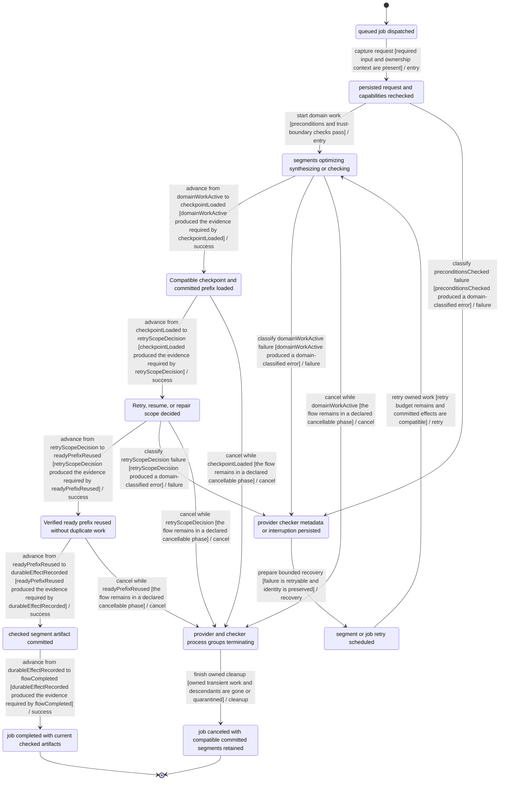
## JOB-EVENTS-001 — Job snapshot and event-stream recovery

- Primary owner: `speech-audio`
- Architecture family: `event-stream`
- Shared subgraphs: `classified-failure-retry`, `cancellable-cleanup`
- Secondary owners: none
- Shared concerns: `RECOVERY`, `LOCAL_ORIGIN_AUTH`, `PRIVACY`, `ACCESSIBILITY`, `PERFORMANCE_TELEMETRY`, `OPERATIONAL_STATUS`

### Route ownership

- `GET /api/voice-jobs/:id/events`

### State contract

| State | Label | Kind | Authority | UI observable |
| --- | --- | --- | --- | --- |
| `JOB_EVENTS_001_REQUESTCAPTURED` | job observation requested | `stable` | `frontend` | UI shows job observation requested |
| `JOB_EVENTS_001_PRECONDITIONSCHECKED` | job id and event cursor checked | `stable` | `backend` | UI shows validation progress for job event synchronization |
| `JOB_EVENTS_001_DOMAINWORKACTIVE` | job snapshot or event stream reading | `transient` | `backend` | UI shows job snapshot or event stream reading |
| `JOB_EVENTS_001_DURABLEEFFECTRECORDED` | newest job generation adopted | `stable` | `backend` | UI shows committed job event synchronization state |
| `JOB_EVENTS_001_FLOWCOMPLETED` | current job UI state visible | `terminal-success` | `shared` | UI shows current job UI state visible |
| `JOB_EVENTS_001_CLASSIFIEDFAILURE` | disconnect stale cursor or generation mismatch detected | `stable-failure` | `backend` | UI explains disconnect stale cursor or generation mismatch detected |
| `JOB_EVENTS_001_CLEANUPINPROGRESS` | job event stream closing | `transient` | `backend` | UI shows job event stream closing |
| `JOB_EVENTS_001_CANCELEDCLEAN` | last job snapshot retained | `terminal-canceled` | `shared` | UI shows last job snapshot retained |
| `JOB_EVENTS_001_RECOVERYCONTEXTREADY` | authoritative job snapshot fetched before reconnect | `stable` | `shared` | UI offers authoritative job snapshot fetched before reconnect |
| `JOB_EVENTS_001_CURSORREPLAYED` | Durable cursor replay completed | `stable` | `backend` | Durable cursor replay completed; the UI exposes this state or an actionable non-visual status. |
| `JOB_EVENTS_001_GAPDECISION` | Gap, duplicate, or stale event decision made | `stable` | `shared` | Gap, duplicate, or stale event decision made; the UI exposes this state or an actionable non-visual status. |
| `JOB_EVENTS_001_SNAPSHOTRECONCILED` | Canonical snapshot and stream cursor agree | `stable` | `shared` | Canonical snapshot and stream cursor agree; the UI exposes this state or an actionable non-visual status. |

### Semantic roles

- `requestCaptured` → `JOB_EVENTS_001_REQUESTCAPTURED`
- `preconditionsChecked` → `JOB_EVENTS_001_PRECONDITIONSCHECKED`
- `domainWorkActive` → `JOB_EVENTS_001_DOMAINWORKACTIVE`
- `durableEffectRecorded` → `JOB_EVENTS_001_DURABLEEFFECTRECORDED`
- `flowCompleted` → `JOB_EVENTS_001_FLOWCOMPLETED`
- `classifiedFailure` → `JOB_EVENTS_001_CLASSIFIEDFAILURE`
- `cleanupInProgress` → `JOB_EVENTS_001_CLEANUPINPROGRESS`
- `canceledClean` → `JOB_EVENTS_001_CANCELEDCLEAN`
- `recoveryContextReady` → `JOB_EVENTS_001_RECOVERYCONTEXTREADY`
- `cursorReplayed` → `JOB_EVENTS_001_CURSORREPLAYED`
- `gapDecision` → `JOB_EVENTS_001_GAPDECISION`
- `snapshotReconciled` → `JOB_EVENTS_001_SNAPSHOTRECONCILED`

### Required decisions

- **gapDecision** at `JOB_EVENTS_001_GAPDECISION`: `continue` → `JOB-EVENTS-001:T05:success`, `reject` → `JOB-EVENTS-001:T10:failure`, `cancel` → `JOB-EVENTS-001:T15:cancel`

### Family and flow invariants

- Every event-stream flow exposes its required roles as canonical states.
- Every event-stream decision has named outgoing outcomes bound to transition IDs.
- JOB-EVENTS-001 commit is not reached until newest job generation adopted
- JOB-EVENTS-001 cancellation phases equal ordinary cancel-edge sources exactly.
- Frozen BIC-08 planned-evidence ownership is provenance; responsive replacement ownership RSP-05/RSP-06/RSP-10 is planned only and is not covered or implemented.

### Transitions

| ID | From | To | Event | Guard | Branch |
| --- | --- | --- | --- | --- | --- |
| `JOB-EVENTS-001:T01:entry` | `JOB_EVENTS_001_REQUESTCAPTURED` | `JOB_EVENTS_001_PRECONDITIONSCHECKED` | capture request | required input and ownership context are present | `entry` |
| `JOB-EVENTS-001:T02:entry` | `JOB_EVENTS_001_PRECONDITIONSCHECKED` | `JOB_EVENTS_001_DOMAINWORKACTIVE` | start domain work | preconditions and trust-boundary checks pass | `entry` |
| `JOB-EVENTS-001:T03:success` | `JOB_EVENTS_001_DOMAINWORKACTIVE` | `JOB_EVENTS_001_CURSORREPLAYED` | advance from domainWorkActive to cursorReplayed | domainWorkActive produced the evidence required by cursorReplayed | `success` |
| `JOB-EVENTS-001:T04:success` | `JOB_EVENTS_001_CURSORREPLAYED` | `JOB_EVENTS_001_GAPDECISION` | advance from cursorReplayed to gapDecision | cursorReplayed produced the evidence required by gapDecision | `success` |
| `JOB-EVENTS-001:T05:success` | `JOB_EVENTS_001_GAPDECISION` | `JOB_EVENTS_001_SNAPSHOTRECONCILED` | advance from gapDecision to snapshotReconciled | gapDecision produced the evidence required by snapshotReconciled | `success` |
| `JOB-EVENTS-001:T06:success` | `JOB_EVENTS_001_SNAPSHOTRECONCILED` | `JOB_EVENTS_001_DURABLEEFFECTRECORDED` | advance from snapshotReconciled to durableEffectRecorded | snapshotReconciled produced the evidence required by durableEffectRecorded | `success` |
| `JOB-EVENTS-001:T07:success` | `JOB_EVENTS_001_DURABLEEFFECTRECORDED` | `JOB_EVENTS_001_FLOWCOMPLETED` | advance from durableEffectRecorded to flowCompleted | durableEffectRecorded produced the evidence required by flowCompleted | `success` |
| `JOB-EVENTS-001:T08:failure` | `JOB_EVENTS_001_PRECONDITIONSCHECKED` | `JOB_EVENTS_001_CLASSIFIEDFAILURE` | classify preconditionsChecked failure | preconditionsChecked produced a domain-classified error | `failure` |
| `JOB-EVENTS-001:T09:failure` | `JOB_EVENTS_001_DOMAINWORKACTIVE` | `JOB_EVENTS_001_CLASSIFIEDFAILURE` | classify domainWorkActive failure | domainWorkActive produced a domain-classified error | `failure` |
| `JOB-EVENTS-001:T10:failure` | `JOB_EVENTS_001_GAPDECISION` | `JOB_EVENTS_001_CLASSIFIEDFAILURE` | classify gapDecision failure | gapDecision produced a domain-classified error | `failure` |
| `JOB-EVENTS-001:T11:recovery` | `JOB_EVENTS_001_CLASSIFIEDFAILURE` | `JOB_EVENTS_001_RECOVERYCONTEXTREADY` | prepare bounded recovery | failure is retryable and identity is preserved | `recovery` |
| `JOB-EVENTS-001:T12:retry` | `JOB_EVENTS_001_RECOVERYCONTEXTREADY` | `JOB_EVENTS_001_DOMAINWORKACTIVE` | retry owned work | retry budget remains and committed effects are compatible | `retry` |
| `JOB-EVENTS-001:T13:cancel` | `JOB_EVENTS_001_DOMAINWORKACTIVE` | `JOB_EVENTS_001_CLEANUPINPROGRESS` | cancel while domainWorkActive | the flow remains in a declared cancellable phase | `cancel` |
| `JOB-EVENTS-001:T14:cancel` | `JOB_EVENTS_001_CURSORREPLAYED` | `JOB_EVENTS_001_CLEANUPINPROGRESS` | cancel while cursorReplayed | the flow remains in a declared cancellable phase | `cancel` |
| `JOB-EVENTS-001:T15:cancel` | `JOB_EVENTS_001_GAPDECISION` | `JOB_EVENTS_001_CLEANUPINPROGRESS` | cancel while gapDecision | the flow remains in a declared cancellable phase | `cancel` |
| `JOB-EVENTS-001:T16:cancel` | `JOB_EVENTS_001_SNAPSHOTRECONCILED` | `JOB_EVENTS_001_CLEANUPINPROGRESS` | cancel while snapshotReconciled | the flow remains in a declared cancellable phase | `cancel` |
| `JOB-EVENTS-001:T17:cleanup` | `JOB_EVENTS_001_CLEANUPINPROGRESS` | `JOB_EVENTS_001_CANCELEDCLEAN` | finish owned cleanup | owned transient work and descendants are gone or quarantined | `cleanup` |

### Evidence

- `frontend/src/api.test.ts` — Executable source anchors only; no transition closure is claimed without a FLOW_ASSERT marker.
  - `deletes generated narration jobs by id` — transitions: none (source anchor only)
  - `creates temporary source jobs through the temporary route` — transitions: none (source anchor only)
  - `lists recent temporary sources, reopens by id, lists jobs, and preserves storage byte maps` — transitions: none (source anchor only)
  - `falls back to polling when a voice job progress stream disconnects` — transitions: none (source anchor only)

### Planned transition evidence

- `JOB-EVENTS-001:T01:entry`, `JOB-EVENTS-001:T02:entry`, `JOB-EVENTS-001:T03:success`, `JOB-EVENTS-001:T04:success`, `JOB-EVENTS-001:T05:success`, `JOB-EVENTS-001:T06:success`, `JOB-EVENTS-001:T07:success`, `JOB-EVENTS-001:T08:failure`, `JOB-EVENTS-001:T09:failure`, `JOB-EVENTS-001:T10:failure`, `JOB-EVENTS-001:T11:recovery`, `JOB-EVENTS-001:T12:retry`, `JOB-EVENTS-001:T13:cancel`, `JOB-EVENTS-001:T14:cancel`, `JOB-EVENTS-001:T15:cancel`, `JOB-EVENTS-001:T16:cancel`, `JOB-EVENTS-001:T17:cleanup` → `BIC-08`; verify with `mise exec -- pnpm --dir frontend exec vitest run frontend/src/api.test.ts` — Owner issue must add transition-specific executable FLOW_ASSERT markers and assertions before closeout.

### Mermaid

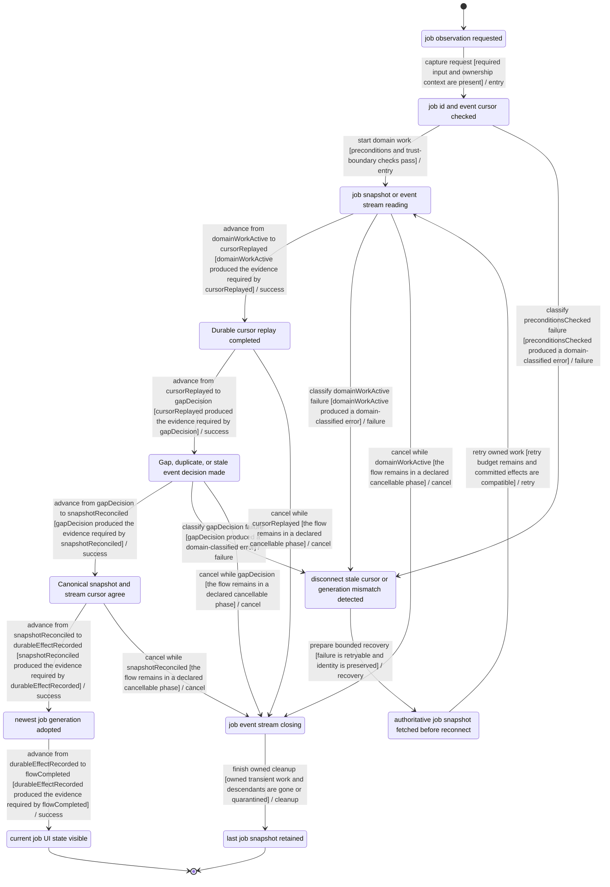
## PERSIST-RECOVER-001 — Persistence restart and orphan-work recovery

- Primary owner: `runtime-platform`
- Architecture family: `job-recovery`
- Shared subgraphs: `classified-failure-retry`, `cancellable-cleanup`
- Secondary owners: none
- Shared concerns: `RECOVERY`, `FILESYSTEM`, `PRIVACY`, `ACCESSIBILITY`, `PERFORMANCE_TELEMETRY`, `OPERATIONAL_STATUS`

### Route ownership

- none

### State contract

| State | Label | Kind | Authority | UI observable |
| --- | --- | --- | --- | --- |
| `PERSIST_RECOVER_001_REQUESTCAPTURED` | state write or process restart detected | `stable` | `frontend` | UI shows state write or process restart detected |
| `PERSIST_RECOVER_001_PRECONDITIONSCHECKED` | metadata generations and artifact hashes scanned | `stable` | `backend` | UI shows validation progress for persistence recovery |
| `PERSIST_RECOVER_001_DOMAINWORKACTIVE` | orphan and partial transaction reconciliation running | `transient` | `backend` | UI shows orphan and partial transaction reconciliation running |
| `PERSIST_RECOVER_001_DURABLEEFFECTRECORDED` | recovered metadata generation atomically selected | `stable` | `backend` | UI shows committed persistence recovery state |
| `PERSIST_RECOVER_001_FLOWCOMPLETED` | consistent recoverable state loaded | `terminal-success` | `shared` | UI shows consistent recoverable state loaded |
| `PERSIST_RECOVER_001_CLASSIFIEDFAILURE` | corrupt state quarantined with actionable reason | `stable-failure` | `backend` | UI explains corrupt state quarantined with actionable reason |
| `PERSIST_RECOVER_001_CLEANUPINPROGRESS` | recovery scan stopping at safe boundary | `transient` | `backend` | UI shows recovery scan stopping at safe boundary |
| `PERSIST_RECOVER_001_CANCELEDCLEAN` | last verified generation remains active | `terminal-canceled` | `shared` | UI shows last verified generation remains active |
| `PERSIST_RECOVER_001_RECOVERYCONTEXTREADY` | targeted repair or explicit discard selected | `stable` | `shared` | UI offers targeted repair or explicit discard selected |
| `PERSIST_RECOVER_001_CHECKPOINTLOADED` | Compatible checkpoint and committed prefix loaded | `stable` | `backend` | Compatible checkpoint and committed prefix loaded; the UI exposes this state or an actionable non-visual status. |
| `PERSIST_RECOVER_001_RETRYSCOPEDECISION` | Retry, resume, or repair scope decided | `stable` | `shared` | Retry, resume, or repair scope decided; the UI exposes this state or an actionable non-visual status. |
| `PERSIST_RECOVER_001_READYPREFIXREUSED` | Verified ready prefix reused without duplicate work | `stable` | `backend` | Verified ready prefix reused without duplicate work; the UI exposes this state or an actionable non-visual status. |

### Semantic roles

- `requestCaptured` → `PERSIST_RECOVER_001_REQUESTCAPTURED`
- `preconditionsChecked` → `PERSIST_RECOVER_001_PRECONDITIONSCHECKED`
- `domainWorkActive` → `PERSIST_RECOVER_001_DOMAINWORKACTIVE`
- `durableEffectRecorded` → `PERSIST_RECOVER_001_DURABLEEFFECTRECORDED`
- `flowCompleted` → `PERSIST_RECOVER_001_FLOWCOMPLETED`
- `classifiedFailure` → `PERSIST_RECOVER_001_CLASSIFIEDFAILURE`
- `cleanupInProgress` → `PERSIST_RECOVER_001_CLEANUPINPROGRESS`
- `canceledClean` → `PERSIST_RECOVER_001_CANCELEDCLEAN`
- `recoveryContextReady` → `PERSIST_RECOVER_001_RECOVERYCONTEXTREADY`
- `checkpointLoaded` → `PERSIST_RECOVER_001_CHECKPOINTLOADED`
- `retryScopeDecision` → `PERSIST_RECOVER_001_RETRYSCOPEDECISION`
- `readyPrefixReused` → `PERSIST_RECOVER_001_READYPREFIXREUSED`

### Required decisions

- **retryScopeDecision** at `PERSIST_RECOVER_001_RETRYSCOPEDECISION`: `continue` → `PERSIST-RECOVER-001:T05:success`, `reject` → `PERSIST-RECOVER-001:T10:failure`, `cancel` → `PERSIST-RECOVER-001:T15:cancel`

### Family and flow invariants

- Every job-recovery flow exposes its required roles as canonical states.
- Every job-recovery decision has named outgoing outcomes bound to transition IDs.
- PERSIST-RECOVER-001 commit is not reached until recovered metadata generation atomically selected
- PERSIST-RECOVER-001 cancellation phases equal ordinary cancel-edge sources exactly.

### Transitions

| ID | From | To | Event | Guard | Branch |
| --- | --- | --- | --- | --- | --- |
| `PERSIST-RECOVER-001:T01:entry` | `PERSIST_RECOVER_001_REQUESTCAPTURED` | `PERSIST_RECOVER_001_PRECONDITIONSCHECKED` | capture request | required input and ownership context are present | `entry` |
| `PERSIST-RECOVER-001:T02:entry` | `PERSIST_RECOVER_001_PRECONDITIONSCHECKED` | `PERSIST_RECOVER_001_DOMAINWORKACTIVE` | start domain work | preconditions and trust-boundary checks pass | `entry` |
| `PERSIST-RECOVER-001:T03:success` | `PERSIST_RECOVER_001_DOMAINWORKACTIVE` | `PERSIST_RECOVER_001_CHECKPOINTLOADED` | advance from domainWorkActive to checkpointLoaded | domainWorkActive produced the evidence required by checkpointLoaded | `success` |
| `PERSIST-RECOVER-001:T04:success` | `PERSIST_RECOVER_001_CHECKPOINTLOADED` | `PERSIST_RECOVER_001_RETRYSCOPEDECISION` | advance from checkpointLoaded to retryScopeDecision | checkpointLoaded produced the evidence required by retryScopeDecision | `success` |
| `PERSIST-RECOVER-001:T05:success` | `PERSIST_RECOVER_001_RETRYSCOPEDECISION` | `PERSIST_RECOVER_001_READYPREFIXREUSED` | advance from retryScopeDecision to readyPrefixReused | retryScopeDecision produced the evidence required by readyPrefixReused | `success` |
| `PERSIST-RECOVER-001:T06:success` | `PERSIST_RECOVER_001_READYPREFIXREUSED` | `PERSIST_RECOVER_001_DURABLEEFFECTRECORDED` | advance from readyPrefixReused to durableEffectRecorded | readyPrefixReused produced the evidence required by durableEffectRecorded | `success` |
| `PERSIST-RECOVER-001:T07:success` | `PERSIST_RECOVER_001_DURABLEEFFECTRECORDED` | `PERSIST_RECOVER_001_FLOWCOMPLETED` | advance from durableEffectRecorded to flowCompleted | durableEffectRecorded produced the evidence required by flowCompleted | `success` |
| `PERSIST-RECOVER-001:T08:failure` | `PERSIST_RECOVER_001_PRECONDITIONSCHECKED` | `PERSIST_RECOVER_001_CLASSIFIEDFAILURE` | classify preconditionsChecked failure | preconditionsChecked produced a domain-classified error | `failure` |
| `PERSIST-RECOVER-001:T09:failure` | `PERSIST_RECOVER_001_DOMAINWORKACTIVE` | `PERSIST_RECOVER_001_CLASSIFIEDFAILURE` | classify domainWorkActive failure | domainWorkActive produced a domain-classified error | `failure` |
| `PERSIST-RECOVER-001:T10:failure` | `PERSIST_RECOVER_001_RETRYSCOPEDECISION` | `PERSIST_RECOVER_001_CLASSIFIEDFAILURE` | classify retryScopeDecision failure | retryScopeDecision produced a domain-classified error | `failure` |
| `PERSIST-RECOVER-001:T11:recovery` | `PERSIST_RECOVER_001_CLASSIFIEDFAILURE` | `PERSIST_RECOVER_001_RECOVERYCONTEXTREADY` | prepare bounded recovery | failure is retryable and identity is preserved | `recovery` |
| `PERSIST-RECOVER-001:T12:retry` | `PERSIST_RECOVER_001_RECOVERYCONTEXTREADY` | `PERSIST_RECOVER_001_DOMAINWORKACTIVE` | retry owned work | retry budget remains and committed effects are compatible | `retry` |
| `PERSIST-RECOVER-001:T13:cancel` | `PERSIST_RECOVER_001_DOMAINWORKACTIVE` | `PERSIST_RECOVER_001_CLEANUPINPROGRESS` | cancel while domainWorkActive | the flow remains in a declared cancellable phase | `cancel` |
| `PERSIST-RECOVER-001:T14:cancel` | `PERSIST_RECOVER_001_CHECKPOINTLOADED` | `PERSIST_RECOVER_001_CLEANUPINPROGRESS` | cancel while checkpointLoaded | the flow remains in a declared cancellable phase | `cancel` |
| `PERSIST-RECOVER-001:T15:cancel` | `PERSIST_RECOVER_001_RETRYSCOPEDECISION` | `PERSIST_RECOVER_001_CLEANUPINPROGRESS` | cancel while retryScopeDecision | the flow remains in a declared cancellable phase | `cancel` |
| `PERSIST-RECOVER-001:T16:cancel` | `PERSIST_RECOVER_001_READYPREFIXREUSED` | `PERSIST_RECOVER_001_CLEANUPINPROGRESS` | cancel while readyPrefixReused | the flow remains in a declared cancellable phase | `cancel` |
| `PERSIST-RECOVER-001:T17:cleanup` | `PERSIST_RECOVER_001_CLEANUPINPROGRESS` | `PERSIST_RECOVER_001_CANCELEDCLEAN` | finish owned cleanup | owned transient work and descendants are gone or quarantined | `cleanup` |

### Evidence

- `backend/internal/pipeline/retry_interrupted_artifact_test.go` — Executable source anchors only; no transition closure is claimed without a FLOW_ASSERT marker.
  - `TestRestartAndCancelDoNotMarkReadyPrefixInterruptedWhenCurrentSegmentIsStale` — transitions: none (source anchor only)
  - `TestReloadJobsMarksActiveWorkInterruptedRetriable` — transitions: none (source anchor only)
  - `TestReloadJobsSurfacesInterruptedMetadataPersistenceFailure` — transitions: none (source anchor only)

### Planned transition evidence

- `PERSIST-RECOVER-001:T01:entry`, `PERSIST-RECOVER-001:T02:entry`, `PERSIST-RECOVER-001:T03:success`, `PERSIST-RECOVER-001:T04:success`, `PERSIST-RECOVER-001:T05:success`, `PERSIST-RECOVER-001:T06:success`, `PERSIST-RECOVER-001:T07:success`, `PERSIST-RECOVER-001:T08:failure`, `PERSIST-RECOVER-001:T09:failure`, `PERSIST-RECOVER-001:T10:failure`, `PERSIST-RECOVER-001:T11:recovery`, `PERSIST-RECOVER-001:T12:retry`, `PERSIST-RECOVER-001:T13:cancel`, `PERSIST-RECOVER-001:T14:cancel`, `PERSIST-RECOVER-001:T15:cancel`, `PERSIST-RECOVER-001:T16:cancel`, `PERSIST-RECOVER-001:T17:cleanup` → `BIC-08`; verify with `cd backend && go test ./...` — Owner issue must add transition-specific executable FLOW_ASSERT markers and assertions before closeout.

### Mermaid

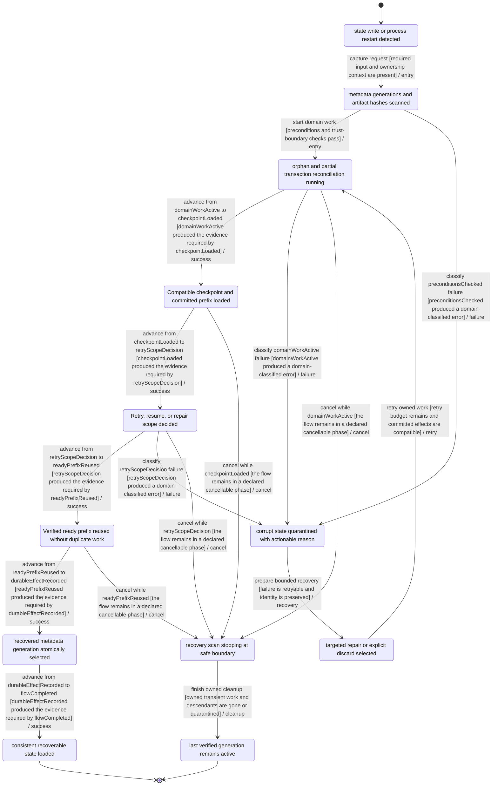
## ARTIFACT-001 — Audio artifact currentness and atomic replacement

- Primary owner: `speech-audio`
- Architecture family: `playback-session`
- Shared subgraphs: `classified-failure-retry`, `cancellable-cleanup`
- Secondary owners: none
- Shared concerns: `RECOVERY`, `LOCAL_ORIGIN_AUTH`, `FILESYSTEM`, `PRIVACY`, `ACCESSIBILITY`, `PERFORMANCE_TELEMETRY`, `OPERATIONAL_STATUS`

### Route ownership

- `GET /api/temporary-sources/:id/artifacts`
- `GET /api/voice-jobs/:id/audio`
- `GET /api/voice-jobs/:id/audio/partial`
- `GET /api/voice-jobs/:id/audio/segment/:index`

### State contract

| State | Label | Kind | Authority | UI observable |
| --- | --- | --- | --- | --- |
| `ARTIFACT_001_REQUESTCAPTURED` | generated artifact requested or produced | `stable` | `frontend` | UI shows generated artifact requested or produced |
| `ARTIFACT_001_PRECONDITIONSCHECKED` | job generation segment hash and compatibility checked | `stable` | `backend` | UI shows validation progress for audio artifact update |
| `ARTIFACT_001_DOMAINWORKACTIVE` | artifact verification and replacement running | `transient` | `backend` | UI shows artifact verification and replacement running |
| `ARTIFACT_001_DURABLEEFFECTRECORDED` | artifact current pointer atomically swapped | `stable` | `backend` | UI shows committed audio artifact update state |
| `ARTIFACT_001_FLOWCOMPLETED` | current playable artifact served | `terminal-success` | `shared` | UI shows current playable artifact served |
| `ARTIFACT_001_CLASSIFIEDFAILURE` | failed stale retryable or replaced artifact classified | `stable-failure` | `backend` | UI explains failed stale retryable or replaced artifact classified |
| `ARTIFACT_001_CLEANUPINPROGRESS` | artifact write stopping | `transient` | `backend` | UI shows artifact write stopping |
| `ARTIFACT_001_CANCELEDCLEAN` | prior current artifact retained | `terminal-canceled` | `shared` | UI shows prior current artifact retained |
| `ARTIFACT_001_RECOVERYCONTEXTREADY` | compatible reuse or scoped rebuild selected | `stable` | `shared` | UI offers compatible reuse or scoped rebuild selected |
| `ARTIFACT_001_MEDIALOADING` | Media and locator are loading | `transient` | `frontend` | Media and locator are loading; the UI exposes this state or an actionable non-visual status. |
| `ARTIFACT_001_PLAYING` | Playback is active at a synchronized locator | `stable` | `frontend` | Playback is active at a synchronized locator; the UI exposes this state or an actionable non-visual status. |
| `ARTIFACT_001_PAUSED` | Playback is paused with locator preserved | `stable` | `frontend` | Playback is paused with locator preserved; the UI exposes this state or an actionable non-visual status. |
| `ARTIFACT_001_INTERRUPTED` | Playback was interrupted with resumable context | `stable` | `shared` | Playback was interrupted with resumable context; the UI exposes this state or an actionable non-visual status. |
| `ARTIFACT_001_STALE` | Artifact or locator became stale | `stable` | `shared` | Artifact or locator became stale; the UI exposes this state or an actionable non-visual status. |
| `ARTIFACT_001_SUPERSEDED` | A newer playback session superseded this one | `terminal-canceled` | `frontend` | A newer playback session superseded this one; the UI exposes this state or an actionable non-visual status. |
| `ARTIFACT_001_RESUMEDECISION` | Resume, supersede, or fail decision visible | `stable` | `frontend` | Resume, supersede, or fail decision visible; the UI exposes this state or an actionable non-visual status. |

### Semantic roles

- `requestCaptured` → `ARTIFACT_001_REQUESTCAPTURED`
- `preconditionsChecked` → `ARTIFACT_001_PRECONDITIONSCHECKED`
- `domainWorkActive` → `ARTIFACT_001_DOMAINWORKACTIVE`
- `durableEffectRecorded` → `ARTIFACT_001_DURABLEEFFECTRECORDED`
- `flowCompleted` → `ARTIFACT_001_FLOWCOMPLETED`
- `classifiedFailure` → `ARTIFACT_001_CLASSIFIEDFAILURE`
- `cleanupInProgress` → `ARTIFACT_001_CLEANUPINPROGRESS`
- `canceledClean` → `ARTIFACT_001_CANCELEDCLEAN`
- `recoveryContextReady` → `ARTIFACT_001_RECOVERYCONTEXTREADY`
- `mediaLoading` → `ARTIFACT_001_MEDIALOADING`
- `playing` → `ARTIFACT_001_PLAYING`
- `paused` → `ARTIFACT_001_PAUSED`
- `interrupted` → `ARTIFACT_001_INTERRUPTED`
- `stale` → `ARTIFACT_001_STALE`
- `superseded` → `ARTIFACT_001_SUPERSEDED`
- `resumeDecision` → `ARTIFACT_001_RESUMEDECISION`

### Required decisions

- **resumeDecision** at `ARTIFACT_001_RESUMEDECISION`: `continue` → `ARTIFACT-001:T10:success`, `reject` → `ARTIFACT-001:T14:failure`, `cancel` → `ARTIFACT-001:T24:cancel`

### Family and flow invariants

- Every playback-session flow exposes its required roles as canonical states.
- Every playback-session decision has named outgoing outcomes bound to transition IDs.
- ARTIFACT-001 commit is not reached until artifact current pointer atomically swapped
- ARTIFACT-001 cancellation phases equal ordinary cancel-edge sources exactly.
- Frozen BIC-08 planned-evidence ownership is provenance; responsive replacement ownership RSP-04/RSP-06/RSP-07/RSP-10 is planned only and is not covered or implemented.

### Transitions

| ID | From | To | Event | Guard | Branch |
| --- | --- | --- | --- | --- | --- |
| `ARTIFACT-001:T01:entry` | `ARTIFACT_001_REQUESTCAPTURED` | `ARTIFACT_001_PRECONDITIONSCHECKED` | capture request | required input and ownership context are present | `entry` |
| `ARTIFACT-001:T02:entry` | `ARTIFACT_001_PRECONDITIONSCHECKED` | `ARTIFACT_001_DOMAINWORKACTIVE` | start domain work | preconditions and trust-boundary checks pass | `entry` |
| `ARTIFACT-001:T03:success` | `ARTIFACT_001_DOMAINWORKACTIVE` | `ARTIFACT_001_MEDIALOADING` | advance from domainWorkActive to mediaLoading | domainWorkActive produced the evidence required by mediaLoading | `success` |
| `ARTIFACT-001:T04:success` | `ARTIFACT_001_MEDIALOADING` | `ARTIFACT_001_PLAYING` | advance from mediaLoading to playing | mediaLoading produced the evidence required by playing | `success` |
| `ARTIFACT-001:T05:success` | `ARTIFACT_001_PLAYING` | `ARTIFACT_001_PAUSED` | advance from playing to paused | playing produced the evidence required by paused | `success` |
| `ARTIFACT-001:T06:success` | `ARTIFACT_001_PAUSED` | `ARTIFACT_001_INTERRUPTED` | advance from paused to interrupted | paused produced the evidence required by interrupted | `success` |
| `ARTIFACT-001:T07:success` | `ARTIFACT_001_INTERRUPTED` | `ARTIFACT_001_STALE` | advance from interrupted to stale | interrupted produced the evidence required by stale | `success` |
| `ARTIFACT-001:T08:success` | `ARTIFACT_001_STALE` | `ARTIFACT_001_SUPERSEDED` | advance from stale to superseded | stale produced the evidence required by superseded | `success` |
| `ARTIFACT-001:T09:success` | `ARTIFACT_001_SUPERSEDED` | `ARTIFACT_001_RESUMEDECISION` | advance from superseded to resumeDecision | superseded produced the evidence required by resumeDecision | `success` |
| `ARTIFACT-001:T10:success` | `ARTIFACT_001_RESUMEDECISION` | `ARTIFACT_001_DURABLEEFFECTRECORDED` | advance from resumeDecision to durableEffectRecorded | resumeDecision produced the evidence required by durableEffectRecorded | `success` |
| `ARTIFACT-001:T11:success` | `ARTIFACT_001_DURABLEEFFECTRECORDED` | `ARTIFACT_001_FLOWCOMPLETED` | advance from durableEffectRecorded to flowCompleted | durableEffectRecorded produced the evidence required by flowCompleted | `success` |
| `ARTIFACT-001:T12:failure` | `ARTIFACT_001_PRECONDITIONSCHECKED` | `ARTIFACT_001_CLASSIFIEDFAILURE` | classify preconditionsChecked failure | preconditionsChecked produced a domain-classified error | `failure` |
| `ARTIFACT-001:T13:failure` | `ARTIFACT_001_DOMAINWORKACTIVE` | `ARTIFACT_001_CLASSIFIEDFAILURE` | classify domainWorkActive failure | domainWorkActive produced a domain-classified error | `failure` |
| `ARTIFACT-001:T14:failure` | `ARTIFACT_001_RESUMEDECISION` | `ARTIFACT_001_CLASSIFIEDFAILURE` | classify resumeDecision failure | resumeDecision produced a domain-classified error | `failure` |
| `ARTIFACT-001:T15:recovery` | `ARTIFACT_001_CLASSIFIEDFAILURE` | `ARTIFACT_001_RECOVERYCONTEXTREADY` | prepare bounded recovery | failure is retryable and identity is preserved | `recovery` |
| `ARTIFACT-001:T16:retry` | `ARTIFACT_001_RECOVERYCONTEXTREADY` | `ARTIFACT_001_DOMAINWORKACTIVE` | retry owned work | retry budget remains and committed effects are compatible | `retry` |
| `ARTIFACT-001:T17:cancel` | `ARTIFACT_001_DOMAINWORKACTIVE` | `ARTIFACT_001_CLEANUPINPROGRESS` | cancel while domainWorkActive | the flow remains in a declared cancellable phase | `cancel` |
| `ARTIFACT-001:T18:cancel` | `ARTIFACT_001_MEDIALOADING` | `ARTIFACT_001_CLEANUPINPROGRESS` | cancel while mediaLoading | the flow remains in a declared cancellable phase | `cancel` |
| `ARTIFACT-001:T19:cancel` | `ARTIFACT_001_PLAYING` | `ARTIFACT_001_CLEANUPINPROGRESS` | cancel while playing | the flow remains in a declared cancellable phase | `cancel` |
| `ARTIFACT-001:T20:cancel` | `ARTIFACT_001_PAUSED` | `ARTIFACT_001_CLEANUPINPROGRESS` | cancel while paused | the flow remains in a declared cancellable phase | `cancel` |
| `ARTIFACT-001:T21:cancel` | `ARTIFACT_001_INTERRUPTED` | `ARTIFACT_001_CLEANUPINPROGRESS` | cancel while interrupted | the flow remains in a declared cancellable phase | `cancel` |
| `ARTIFACT-001:T22:cancel` | `ARTIFACT_001_STALE` | `ARTIFACT_001_CLEANUPINPROGRESS` | cancel while stale | the flow remains in a declared cancellable phase | `cancel` |
| `ARTIFACT-001:T23:cancel` | `ARTIFACT_001_SUPERSEDED` | `ARTIFACT_001_CLEANUPINPROGRESS` | cancel while superseded | the flow remains in a declared cancellable phase | `cancel` |
| `ARTIFACT-001:T24:cancel` | `ARTIFACT_001_RESUMEDECISION` | `ARTIFACT_001_CLEANUPINPROGRESS` | cancel while resumeDecision | the flow remains in a declared cancellable phase | `cancel` |
| `ARTIFACT-001:T25:cleanup` | `ARTIFACT_001_CLEANUPINPROGRESS` | `ARTIFACT_001_CANCELEDCLEAN` | finish owned cleanup | owned transient work and descendants are gone or quarantined | `cleanup` |

### Evidence

- `backend/internal/pipeline/retry_interrupted_artifact_test.go` — Executable source anchors only; no transition closure is claimed without a FLOW_ASSERT marker.
  - `TestRetryArtifactSemanticsMarkOnlyAffectedSegmentRetryable` — transitions: none (source anchor only)
  - `TestReusableAudioPrefixReusesOnlyCompatibleCheckedArtifacts` — transitions: none (source anchor only)
  - `TestResumeResolverFailsClosedForWrongRetryEvidenceAndNonCurrentArtifacts` — transitions: none (source anchor only)

### Planned transition evidence

- `ARTIFACT-001:T01:entry`, `ARTIFACT-001:T02:entry`, `ARTIFACT-001:T03:success`, `ARTIFACT-001:T04:success`, `ARTIFACT-001:T05:success`, `ARTIFACT-001:T06:success`, `ARTIFACT-001:T07:success`, `ARTIFACT-001:T08:success`, `ARTIFACT-001:T09:success`, `ARTIFACT-001:T10:success`, `ARTIFACT-001:T11:success`, `ARTIFACT-001:T12:failure`, `ARTIFACT-001:T13:failure`, `ARTIFACT-001:T14:failure`, `ARTIFACT-001:T15:recovery`, `ARTIFACT-001:T16:retry`, `ARTIFACT-001:T17:cancel`, `ARTIFACT-001:T18:cancel`, `ARTIFACT-001:T19:cancel`, `ARTIFACT-001:T20:cancel`, `ARTIFACT-001:T21:cancel`, `ARTIFACT-001:T22:cancel`, `ARTIFACT-001:T23:cancel`, `ARTIFACT-001:T24:cancel`, `ARTIFACT-001:T25:cleanup` → `BIC-08`; verify with `cd backend && go test ./...` — Owner issue must add transition-specific executable FLOW_ASSERT markers and assertions before closeout.

### Mermaid

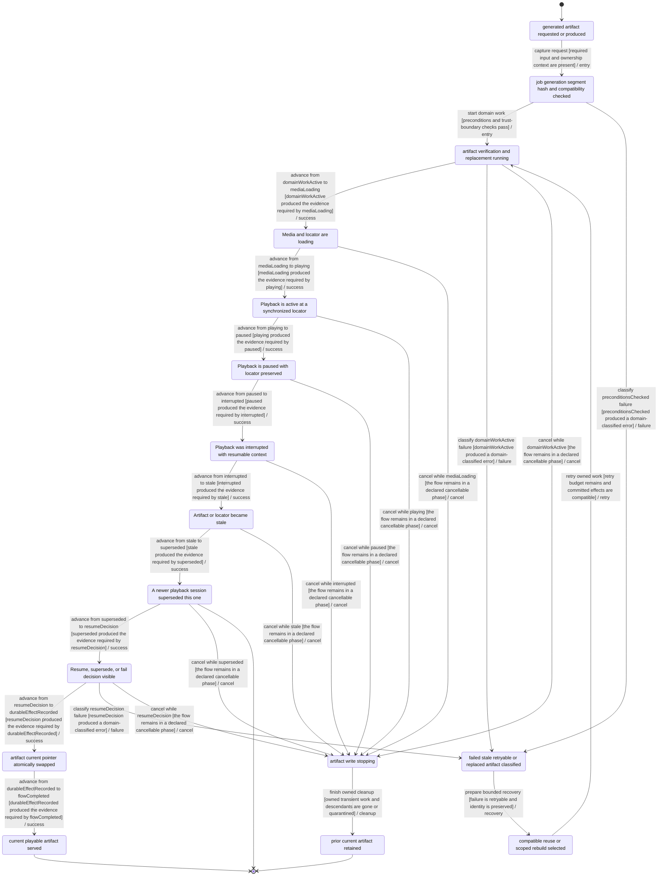
## PLAYBACK-001 — Playback queue, transport, partial arrival, and session closure

- Primary owner: `experience`
- Architecture family: `playback-session`
- Shared subgraphs: `classified-failure-retry`, `cancellable-cleanup`
- Secondary owners: none
- Shared concerns: `RECOVERY`, `ACCESSIBILITY`, `PRIVACY`, `I18N`, `PERFORMANCE_TELEMETRY`, `OPERATIONAL_STATUS`

### Route ownership

- `PATCH /api/playback-sessions/:id/sync`
- `POST /api/playback-sessions`
- `POST /api/playback-sessions/:id/close`

### State contract

| State | Label | Kind | Authority | UI observable |
| --- | --- | --- | --- | --- |
| `PLAYBACK_001_REQUESTCAPTURED` | play or resume requested | `stable` | `frontend` | UI shows play or resume requested |
| `PLAYBACK_001_PRECONDITIONSCHECKED` | current artifact and locator checked | `stable` | `backend` | UI shows validation progress for playback session |
| `PLAYBACK_001_DOMAINWORKACTIVE` | media loading or active playback | `transient` | `backend` | UI shows media loading or active playback |
| `PLAYBACK_001_DURABLEEFFECTRECORDED` | playback session locator synchronized | `stable` | `backend` | UI shows committed playback session state |
| `PLAYBACK_001_FLOWCOMPLETED` | playback completed or explicitly exited | `terminal-success` | `shared` | UI shows playback completed or explicitly exited |
| `PLAYBACK_001_CLASSIFIEDFAILURE` | media unavailable or session interrupted | `stable-failure` | `backend` | UI explains media unavailable or session interrupted |
| `PLAYBACK_001_CLEANUPINPROGRESS` | active media stopping | `transient` | `backend` | UI shows active media stopping |
| `PLAYBACK_001_CANCELEDCLEAN` | session closed with resume locator persisted | `terminal-canceled` | `shared` | UI shows session closed with resume locator persisted |
| `PLAYBACK_001_RECOVERYCONTEXTREADY` | wait for partial retry media or rebuild artifact | `stable` | `shared` | UI offers wait for partial retry media or rebuild artifact |
| `PLAYBACK_001_MEDIALOADING` | Media and locator are loading | `transient` | `frontend` | Media and locator are loading; the UI exposes this state or an actionable non-visual status. |
| `PLAYBACK_001_PLAYING` | Playback is active at a synchronized locator | `stable` | `frontend` | Playback is active at a synchronized locator; the UI exposes this state or an actionable non-visual status. |
| `PLAYBACK_001_PAUSED` | Playback is paused with locator preserved | `stable` | `frontend` | Playback is paused with locator preserved; the UI exposes this state or an actionable non-visual status. |
| `PLAYBACK_001_INTERRUPTED` | Playback was interrupted with resumable context | `stable` | `shared` | Playback was interrupted with resumable context; the UI exposes this state or an actionable non-visual status. |
| `PLAYBACK_001_STALE` | Artifact or locator became stale | `stable` | `shared` | Artifact or locator became stale; the UI exposes this state or an actionable non-visual status. |
| `PLAYBACK_001_SUPERSEDED` | A newer playback session superseded this one | `terminal-canceled` | `frontend` | A newer playback session superseded this one; the UI exposes this state or an actionable non-visual status. |
| `PLAYBACK_001_RESUMEDECISION` | Resume, supersede, or fail decision visible | `stable` | `frontend` | Resume, supersede, or fail decision visible; the UI exposes this state or an actionable non-visual status. |

### Semantic roles

- `requestCaptured` → `PLAYBACK_001_REQUESTCAPTURED`
- `preconditionsChecked` → `PLAYBACK_001_PRECONDITIONSCHECKED`
- `domainWorkActive` → `PLAYBACK_001_DOMAINWORKACTIVE`
- `durableEffectRecorded` → `PLAYBACK_001_DURABLEEFFECTRECORDED`
- `flowCompleted` → `PLAYBACK_001_FLOWCOMPLETED`
- `classifiedFailure` → `PLAYBACK_001_CLASSIFIEDFAILURE`
- `cleanupInProgress` → `PLAYBACK_001_CLEANUPINPROGRESS`
- `canceledClean` → `PLAYBACK_001_CANCELEDCLEAN`
- `recoveryContextReady` → `PLAYBACK_001_RECOVERYCONTEXTREADY`
- `mediaLoading` → `PLAYBACK_001_MEDIALOADING`
- `playing` → `PLAYBACK_001_PLAYING`
- `paused` → `PLAYBACK_001_PAUSED`
- `interrupted` → `PLAYBACK_001_INTERRUPTED`
- `stale` → `PLAYBACK_001_STALE`
- `superseded` → `PLAYBACK_001_SUPERSEDED`
- `resumeDecision` → `PLAYBACK_001_RESUMEDECISION`

### Required decisions

- **resume-supersede-fail** at `PLAYBACK_001_RESUMEDECISION`: `resume` → `PLAYBACK-001:T11:retry`, `supersede` → `PLAYBACK-001:T12:cancel`, `fail` → `PLAYBACK-001:T13:failure`

### Family and flow invariants

- Every playback-session flow exposes its required roles as canonical states.
- Every playback-session decision has named outgoing outcomes bound to transition IDs.
- PLAYBACK-001 commit is not reached until playback session locator synchronized
- PLAYBACK-001 cancellation phases equal ordinary cancel-edge sources exactly.
- Frozen BIC-09 planned-evidence ownership is provenance; responsive replacement ownership RSP-07/RSP-08/RSP-10 is planned only and is not covered or implemented.

### Transitions

| ID | From | To | Event | Guard | Branch |
| --- | --- | --- | --- | --- | --- |
| `PLAYBACK-001:T01:entry` | `PLAYBACK_001_REQUESTCAPTURED` | `PLAYBACK_001_PRECONDITIONSCHECKED` | request playback session | artifact and requested locator are identified | `entry` |
| `PLAYBACK-001:T02:entry` | `PLAYBACK_001_PRECONDITIONSCHECKED` | `PLAYBACK_001_DOMAINWORKACTIVE` | create playback session | artifact, locator, and surface ownership are compatible | `entry` |
| `PLAYBACK-001:T03:success` | `PLAYBACK_001_DOMAINWORKACTIVE` | `PLAYBACK_001_MEDIALOADING` | load media and timing map | artifact version remains current | `success` |
| `PLAYBACK-001:T04:success` | `PLAYBACK_001_MEDIALOADING` | `PLAYBACK_001_PLAYING` | start synchronized playback | media and locator are ready | `success` |
| `PLAYBACK-001:T05:success` | `PLAYBACK_001_PLAYING` | `PLAYBACK_001_PAUSED` | pause playback | current locator is persisted | `success` |
| `PLAYBACK-001:T06:recovery` | `PLAYBACK_001_PAUSED` | `PLAYBACK_001_PLAYING` | resume playback | artifact and session are still current | `recovery` |
| `PLAYBACK-001:T07:failure` | `PLAYBACK_001_MEDIALOADING` | `PLAYBACK_001_STALE` | detect stale artifact | artifact version changed while loading | `failure` |
| `PLAYBACK-001:T08:retry` | `PLAYBACK_001_STALE` | `PLAYBACK_001_MEDIALOADING` | reload current artifact | current artifact version is available | `retry` |
| `PLAYBACK-001:T09:failure` | `PLAYBACK_001_PLAYING` | `PLAYBACK_001_INTERRUPTED` | record interruption | device or surface interruption preserved locator context | `failure` |
| `PLAYBACK-001:T10:recovery` | `PLAYBACK_001_INTERRUPTED` | `PLAYBACK_001_RESUMEDECISION` | offer resume decision | resumable locator and current artifact are available | `recovery` |
| `PLAYBACK-001:T11:retry` | `PLAYBACK_001_RESUMEDECISION` | `PLAYBACK_001_PLAYING` | resume interrupted session | the user resumes the same current artifact | `retry` |
| `PLAYBACK-001:T12:cancel` | `PLAYBACK_001_RESUMEDECISION` | `PLAYBACK_001_SUPERSEDED` | accept newer session | a newer playback owner supersedes this session | `cancel` |
| `PLAYBACK-001:T13:failure` | `PLAYBACK_001_RESUMEDECISION` | `PLAYBACK_001_CLASSIFIEDFAILURE` | reject unsafe resume | artifact or locator cannot be reconciled | `failure` |
| `PLAYBACK-001:T14:success` | `PLAYBACK_001_PLAYING` | `PLAYBACK_001_DURABLEEFFECTRECORDED` | complete or explicitly exit playback | final locator and exit reason are persisted | `success` |
| `PLAYBACK-001:T15:success` | `PLAYBACK_001_DURABLEEFFECTRECORDED` | `PLAYBACK_001_FLOWCOMPLETED` | close playback session | session ownership and locator read back consistently | `success` |
| `PLAYBACK-001:T16:failure` | `PLAYBACK_001_PRECONDITIONSCHECKED` | `PLAYBACK_001_CLASSIFIEDFAILURE` | reject invalid playback request | artifact or locator is invalid | `failure` |
| `PLAYBACK-001:T17:recovery` | `PLAYBACK_001_CLASSIFIEDFAILURE` | `PLAYBACK_001_RECOVERYCONTEXTREADY` | prepare playback recovery | a current artifact or actionable fallback exists | `recovery` |
| `PLAYBACK-001:T18:retry` | `PLAYBACK_001_RECOVERYCONTEXTREADY` | `PLAYBACK_001_MEDIALOADING` | reload playback context | retry budget remains | `retry` |
| `PLAYBACK-001:T19:cancel` | `PLAYBACK_001_MEDIALOADING` | `PLAYBACK_001_CLEANUPINPROGRESS` | cancel playback at mediaLoading | session has not reached terminal closeout | `cancel` |
| `PLAYBACK-001:T20:cancel` | `PLAYBACK_001_PLAYING` | `PLAYBACK_001_CLEANUPINPROGRESS` | cancel playback at playing | session has not reached terminal closeout | `cancel` |
| `PLAYBACK-001:T21:cancel` | `PLAYBACK_001_PAUSED` | `PLAYBACK_001_CLEANUPINPROGRESS` | cancel playback at paused | session has not reached terminal closeout | `cancel` |
| `PLAYBACK-001:T22:cancel` | `PLAYBACK_001_INTERRUPTED` | `PLAYBACK_001_CLEANUPINPROGRESS` | cancel playback at interrupted | session has not reached terminal closeout | `cancel` |
| `PLAYBACK-001:T23:cleanup` | `PLAYBACK_001_CLEANUPINPROGRESS` | `PLAYBACK_001_CANCELEDCLEAN` | release playback ownership | media handles and timers are released | `cleanup` |

### Evidence

- `frontend/src/features/playback/playbackSurfaceRules.test.ts` — Executable source anchors only; no transition closure is claimed without a FLOW_ASSERT marker.
  - `hides the floating preview player behind dedicated playback surfaces` — transitions: none (source anchor only)

### Planned transition evidence

- `PLAYBACK-001:T01:entry`, `PLAYBACK-001:T02:entry`, `PLAYBACK-001:T03:success`, `PLAYBACK-001:T04:success`, `PLAYBACK-001:T05:success`, `PLAYBACK-001:T06:recovery`, `PLAYBACK-001:T07:failure`, `PLAYBACK-001:T08:retry`, `PLAYBACK-001:T09:failure`, `PLAYBACK-001:T10:recovery`, `PLAYBACK-001:T11:retry`, `PLAYBACK-001:T12:cancel`, `PLAYBACK-001:T13:failure`, `PLAYBACK-001:T14:success`, `PLAYBACK-001:T15:success`, `PLAYBACK-001:T16:failure`, `PLAYBACK-001:T17:recovery`, `PLAYBACK-001:T18:retry`, `PLAYBACK-001:T19:cancel`, `PLAYBACK-001:T20:cancel`, `PLAYBACK-001:T21:cancel`, `PLAYBACK-001:T22:cancel`, `PLAYBACK-001:T23:cleanup` → `BIC-09`; verify with `mise exec -- pnpm --dir frontend exec vitest run frontend/src/features/playback/playbackSurfaceRules.test.ts` — Owner issue must add transition-specific executable FLOW_ASSERT markers and assertions before closeout.

### Mermaid

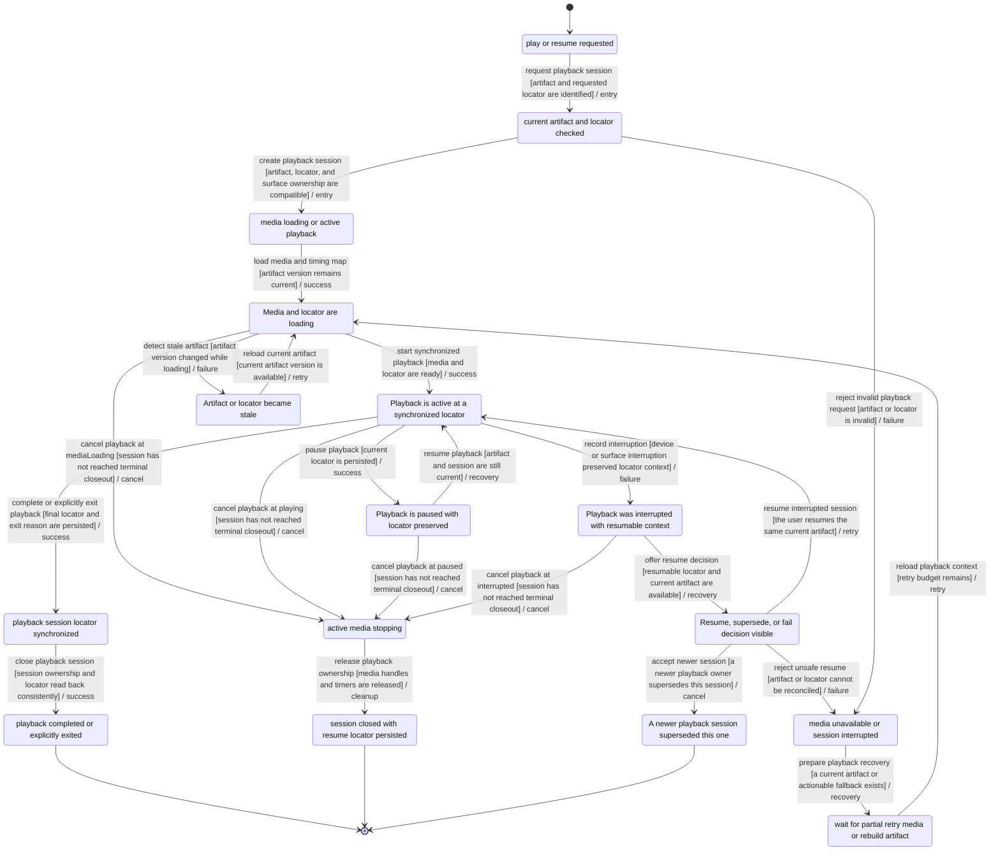
## SYNC-FIDELITY-001 — Read-along sync-fidelity and alignment decisions

- Primary owner: `speech-audio`
- Architecture family: `planning-policy`
- Shared subgraphs: `classified-failure-retry`, `cancellable-cleanup`
- Secondary owners: none
- Shared concerns: `RECOVERY`, `PRIVACY`, `I18N`, `ACCESSIBILITY`, `PERFORMANCE_TELEMETRY`, `OPERATIONAL_STATUS`

### Route ownership

- `GET /api/voice-jobs/:id/highlight-map`
- `GET /api/voice-jobs/:id/highlight-map-v2`
- `GET /api/voice-jobs/:id/timing/alignment`
- `GET /api/voice-jobs/:id/timing/fragments`
- `GET /api/voice-jobs/:id/timing/tokens`

### State contract

| State | Label | Kind | Authority | UI observable |
| --- | --- | --- | --- | --- |
| `SYNC_FIDELITY_001_REQUESTCAPTURED` | timed highlight requested | `stable` | `frontend` | UI shows timed highlight requested |
| `SYNC_FIDELITY_001_PRECONDITIONSCHECKED` | artifact generation timing source and locator checked | `stable` | `backend` | UI shows validation progress for sync fidelity decision |
| `SYNC_FIDELITY_001_DOMAINWORKACTIVE` | highlight map token fragment and alignment evidence loading | `transient` | `backend` | UI shows highlight map token fragment and alignment evidence loading |
| `SYNC_FIDELITY_001_DURABLEEFFECTRECORDED` | sync fidelity decision computed for current generation | `stable` | `backend` | UI shows committed sync fidelity decision state |
| `SYNC_FIDELITY_001_FLOWCOMPLETED` | exact phrase block audio-only or source-only mode declared | `terminal-success` | `shared` | UI shows exact phrase block audio-only or source-only mode declared |
| `SYNC_FIDELITY_001_CLASSIFIEDFAILURE` | timing artifact invalid or generation mismatched | `stable-failure` | `backend` | UI explains timing artifact invalid or generation mismatched |
| `SYNC_FIDELITY_001_CLEANUPINPROGRESS` | timing requests abandoned | `transient` | `backend` | UI shows timing requests abandoned |
| `SYNC_FIDELITY_001_CANCELEDCLEAN` | reader remains usable without stale highlight | `terminal-canceled` | `shared` | UI shows reader remains usable without stale highlight |
| `SYNC_FIDELITY_001_RECOVERYCONTEXTREADY` | lower fidelity or regenerated alignment selected | `stable` | `shared` | UI offers lower fidelity or regenerated alignment selected |
| `SYNC_FIDELITY_001_PLANDRAFTED` | Deterministic plan draft materialized | `stable` | `backend` | Deterministic plan draft materialized; the UI exposes this state or an actionable non-visual status. |
| `SYNC_FIDELITY_001_POLICYDECISION` | Policy conflict, fallback, or acceptance decided | `stable` | `shared` | Policy conflict, fallback, or acceptance decided; the UI exposes this state or an actionable non-visual status. |

### Semantic roles

- `requestCaptured` → `SYNC_FIDELITY_001_REQUESTCAPTURED`
- `preconditionsChecked` → `SYNC_FIDELITY_001_PRECONDITIONSCHECKED`
- `domainWorkActive` → `SYNC_FIDELITY_001_DOMAINWORKACTIVE`
- `durableEffectRecorded` → `SYNC_FIDELITY_001_DURABLEEFFECTRECORDED`
- `flowCompleted` → `SYNC_FIDELITY_001_FLOWCOMPLETED`
- `classifiedFailure` → `SYNC_FIDELITY_001_CLASSIFIEDFAILURE`
- `cleanupInProgress` → `SYNC_FIDELITY_001_CLEANUPINPROGRESS`
- `canceledClean` → `SYNC_FIDELITY_001_CANCELEDCLEAN`
- `recoveryContextReady` → `SYNC_FIDELITY_001_RECOVERYCONTEXTREADY`
- `planDrafted` → `SYNC_FIDELITY_001_PLANDRAFTED`
- `policyDecision` → `SYNC_FIDELITY_001_POLICYDECISION`

### Required decisions

- **policyDecision** at `SYNC_FIDELITY_001_POLICYDECISION`: `continue` → `SYNC-FIDELITY-001:T05:success`, `reject` → `SYNC-FIDELITY-001:T09:failure`, `cancel` → `SYNC-FIDELITY-001:T14:cancel`

### Family and flow invariants

- Every planning-policy flow exposes its required roles as canonical states.
- Every planning-policy decision has named outgoing outcomes bound to transition IDs.
- SYNC-FIDELITY-001 commit is not reached until sync fidelity decision computed for current generation
- SYNC-FIDELITY-001 cancellation phases equal ordinary cancel-edge sources exactly.
- Frozen BIC-09 planned-evidence ownership is provenance; responsive replacement ownership RSP-09 is planned only and is not covered or implemented.

### Transitions

| ID | From | To | Event | Guard | Branch |
| --- | --- | --- | --- | --- | --- |
| `SYNC-FIDELITY-001:T01:entry` | `SYNC_FIDELITY_001_REQUESTCAPTURED` | `SYNC_FIDELITY_001_PRECONDITIONSCHECKED` | capture request | required input and ownership context are present | `entry` |
| `SYNC-FIDELITY-001:T02:entry` | `SYNC_FIDELITY_001_PRECONDITIONSCHECKED` | `SYNC_FIDELITY_001_DOMAINWORKACTIVE` | start domain work | preconditions and trust-boundary checks pass | `entry` |
| `SYNC-FIDELITY-001:T03:success` | `SYNC_FIDELITY_001_DOMAINWORKACTIVE` | `SYNC_FIDELITY_001_PLANDRAFTED` | advance from domainWorkActive to planDrafted | domainWorkActive produced the evidence required by planDrafted | `success` |
| `SYNC-FIDELITY-001:T04:success` | `SYNC_FIDELITY_001_PLANDRAFTED` | `SYNC_FIDELITY_001_POLICYDECISION` | advance from planDrafted to policyDecision | planDrafted produced the evidence required by policyDecision | `success` |
| `SYNC-FIDELITY-001:T05:success` | `SYNC_FIDELITY_001_POLICYDECISION` | `SYNC_FIDELITY_001_DURABLEEFFECTRECORDED` | advance from policyDecision to durableEffectRecorded | policyDecision produced the evidence required by durableEffectRecorded | `success` |
| `SYNC-FIDELITY-001:T06:success` | `SYNC_FIDELITY_001_DURABLEEFFECTRECORDED` | `SYNC_FIDELITY_001_FLOWCOMPLETED` | advance from durableEffectRecorded to flowCompleted | durableEffectRecorded produced the evidence required by flowCompleted | `success` |
| `SYNC-FIDELITY-001:T07:failure` | `SYNC_FIDELITY_001_PRECONDITIONSCHECKED` | `SYNC_FIDELITY_001_CLASSIFIEDFAILURE` | classify preconditionsChecked failure | preconditionsChecked produced a domain-classified error | `failure` |
| `SYNC-FIDELITY-001:T08:failure` | `SYNC_FIDELITY_001_DOMAINWORKACTIVE` | `SYNC_FIDELITY_001_CLASSIFIEDFAILURE` | classify domainWorkActive failure | domainWorkActive produced a domain-classified error | `failure` |
| `SYNC-FIDELITY-001:T09:failure` | `SYNC_FIDELITY_001_POLICYDECISION` | `SYNC_FIDELITY_001_CLASSIFIEDFAILURE` | classify policyDecision failure | policyDecision produced a domain-classified error | `failure` |
| `SYNC-FIDELITY-001:T10:recovery` | `SYNC_FIDELITY_001_CLASSIFIEDFAILURE` | `SYNC_FIDELITY_001_RECOVERYCONTEXTREADY` | prepare bounded recovery | failure is retryable and identity is preserved | `recovery` |
| `SYNC-FIDELITY-001:T11:retry` | `SYNC_FIDELITY_001_RECOVERYCONTEXTREADY` | `SYNC_FIDELITY_001_DOMAINWORKACTIVE` | retry owned work | retry budget remains and committed effects are compatible | `retry` |
| `SYNC-FIDELITY-001:T12:cancel` | `SYNC_FIDELITY_001_DOMAINWORKACTIVE` | `SYNC_FIDELITY_001_CLEANUPINPROGRESS` | cancel while domainWorkActive | the flow remains in a declared cancellable phase | `cancel` |
| `SYNC-FIDELITY-001:T13:cancel` | `SYNC_FIDELITY_001_PLANDRAFTED` | `SYNC_FIDELITY_001_CLEANUPINPROGRESS` | cancel while planDrafted | the flow remains in a declared cancellable phase | `cancel` |
| `SYNC-FIDELITY-001:T14:cancel` | `SYNC_FIDELITY_001_POLICYDECISION` | `SYNC_FIDELITY_001_CLEANUPINPROGRESS` | cancel while policyDecision | the flow remains in a declared cancellable phase | `cancel` |
| `SYNC-FIDELITY-001:T15:cleanup` | `SYNC_FIDELITY_001_CLEANUPINPROGRESS` | `SYNC_FIDELITY_001_CANCELEDCLEAN` | finish owned cleanup | owned transient work and descendants are gone or quarantined | `cleanup` |

### Evidence

- `backend/internal/pipeline/sync_fidelity_decisions_test.go` — Executable source anchors only; no transition closure is claimed without a FLOW_ASSERT marker.
  - `TestSyncFidelityExactWordRequiresAllEvidence` — transitions: none (source anchor only)
  - `TestSyncFidelityLowResourceDowngradesExactEvidenceToBlock` — transitions: none (source anchor only)
  - `TestSyncFidelityUncheckedASRDisabledAudioDeniesExact` — transitions: none (source anchor only)
  - `TestSyncFidelityRetryableArtifactDeniesExact` — transitions: none (source anchor only)
  - `TestSyncFidelityMissingWordMappingFallsBackToPhrase` — transitions: none (source anchor only)
  - `TestSyncFidelityDivergedSourceWordTextDeniesExact` — transitions: none (source anchor only)
  - `TestSyncFidelityHeuristicTimingFallsBackToBlock` — transitions: none (source anchor only)
  - `TestSyncFidelityPlayableAudioWithoutSourceMappingIsAudioOnly` — transitions: none (source anchor only)

### Planned transition evidence

- `SYNC-FIDELITY-001:T01:entry`, `SYNC-FIDELITY-001:T02:entry`, `SYNC-FIDELITY-001:T03:success`, `SYNC-FIDELITY-001:T04:success`, `SYNC-FIDELITY-001:T05:success`, `SYNC-FIDELITY-001:T06:success`, `SYNC-FIDELITY-001:T07:failure`, `SYNC-FIDELITY-001:T08:failure`, `SYNC-FIDELITY-001:T09:failure`, `SYNC-FIDELITY-001:T10:recovery`, `SYNC-FIDELITY-001:T11:retry`, `SYNC-FIDELITY-001:T12:cancel`, `SYNC-FIDELITY-001:T13:cancel`, `SYNC-FIDELITY-001:T14:cancel`, `SYNC-FIDELITY-001:T15:cleanup` → `BIC-09`; verify with `cd backend && go test ./...` — Owner issue must add transition-specific executable FLOW_ASSERT markers and assertions before closeout.

### Mermaid

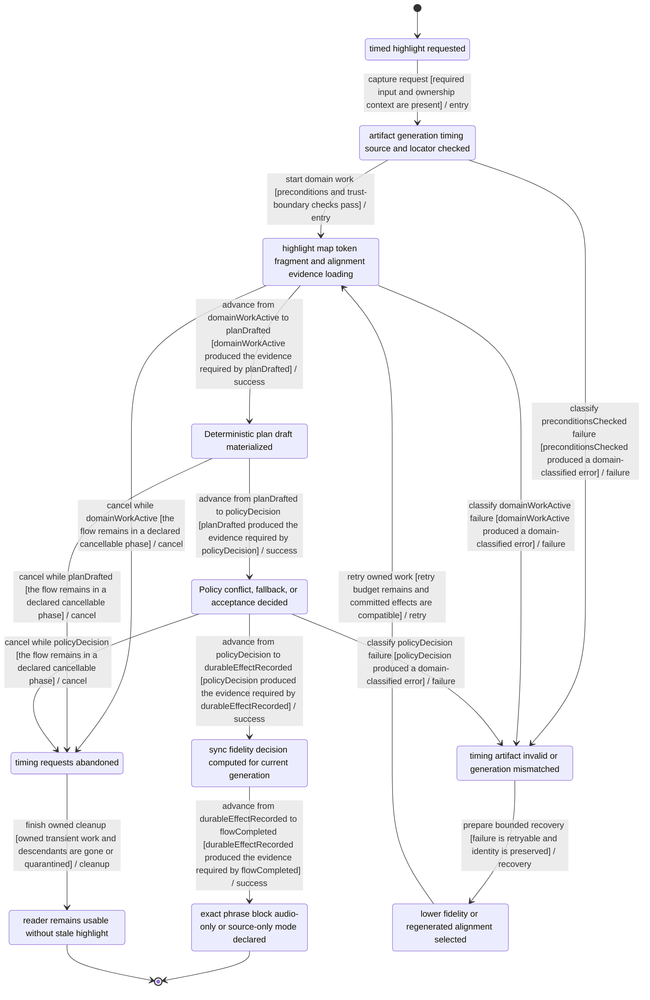
## CINEMA-001 — Cinema focused reading and listening session

- Primary owner: `experience`
- Architecture family: `immersive-reading`
- Shared subgraphs: `classified-failure-retry`, `cancellable-cleanup`
- Secondary owners: none
- Shared concerns: `RECOVERY`, `ACCESSIBILITY`, `PRIVACY`, `I18N`, `PERFORMANCE_TELEMETRY`, `OPERATIONAL_STATUS`

### Route ownership

- none

### State contract

| State | Label | Kind | Authority | UI observable |
| --- | --- | --- | --- | --- |
| `CINEMA_001_REQUESTCAPTURED` | Cinema opened for readable source | `stable` | `frontend` | UI shows Cinema opened for readable source |
| `CINEMA_001_PRECONDITIONSCHECKED` | source renderer and optional audio checked | `stable` | `backend` | UI shows validation progress for Cinema session |
| `CINEMA_001_DOMAINWORKACTIVE` | focused Cinema session active | `transient` | `backend` | UI shows focused Cinema session active |
| `CINEMA_001_DURABLEEFFECTRECORDED` | Cinema session preference and locator saved | `stable` | `backend` | UI shows committed Cinema session state |
| `CINEMA_001_FLOWCOMPLETED` | Cinema explicitly exited with return context | `terminal-success` | `shared` | UI shows Cinema explicitly exited with return context |
| `CINEMA_001_CLASSIFIEDFAILURE` | renderer timing or audio degraded during session | `stable-failure` | `backend` | UI explains renderer timing or audio degraded during session |
| `CINEMA_001_CLEANUPINPROGRESS` | Cinema session closing | `transient` | `backend` | UI shows Cinema session closing |
| `CINEMA_001_CANCELEDCLEAN` | return surface restored with locator | `terminal-canceled` | `shared` | UI shows return surface restored with locator |
| `CINEMA_001_RECOVERYCONTEXTREADY` | reading-only mode or standard reader selected | `stable` | `shared` | UI offers reading-only mode or standard reader selected |
| `CINEMA_001_RENDERERLOADING` | Dedicated reading renderer is loading | `transient` | `frontend` | Dedicated reading renderer is loading; the UI exposes this state or an actionable non-visual status. |
| `CINEMA_001_PRESENTING` | Dedicated surface is presenting synchronized content | `stable` | `frontend` | Dedicated surface is presenting synchronized content; the UI exposes this state or an actionable non-visual status. |
| `CINEMA_001_PAUSED` | Dedicated surface is paused with context preserved | `stable` | `frontend` | Dedicated surface is paused with context preserved; the UI exposes this state or an actionable non-visual status. |
| `CINEMA_001_FALLBACKDECISION` | Resume, fall back, or exit decision visible | `stable` | `frontend` | Resume, fall back, or exit decision visible; the UI exposes this state or an actionable non-visual status. |

### Semantic roles

- `requestCaptured` → `CINEMA_001_REQUESTCAPTURED`
- `preconditionsChecked` → `CINEMA_001_PRECONDITIONSCHECKED`
- `domainWorkActive` → `CINEMA_001_DOMAINWORKACTIVE`
- `durableEffectRecorded` → `CINEMA_001_DURABLEEFFECTRECORDED`
- `flowCompleted` → `CINEMA_001_FLOWCOMPLETED`
- `classifiedFailure` → `CINEMA_001_CLASSIFIEDFAILURE`
- `cleanupInProgress` → `CINEMA_001_CLEANUPINPROGRESS`
- `canceledClean` → `CINEMA_001_CANCELEDCLEAN`
- `recoveryContextReady` → `CINEMA_001_RECOVERYCONTEXTREADY`
- `rendererLoading` → `CINEMA_001_RENDERERLOADING`
- `presenting` → `CINEMA_001_PRESENTING`
- `paused` → `CINEMA_001_PAUSED`
- `fallbackDecision` → `CINEMA_001_FALLBACKDECISION`

### Required decisions

- **fallbackDecision** at `CINEMA_001_FALLBACKDECISION`: `continue` → `CINEMA-001:T07:success`, `reject` → `CINEMA-001:T11:failure`, `cancel` → `CINEMA-001:T18:cancel`

### Family and flow invariants

- Every immersive-reading flow exposes its required roles as canonical states.
- Every immersive-reading decision has named outgoing outcomes bound to transition IDs.
- CINEMA-001 commit is not reached until Cinema session preference and locator saved
- CINEMA-001 cancellation phases equal ordinary cancel-edge sources exactly.
- Frozen BIC-09 planned-evidence ownership is provenance; responsive replacement ownership RSP-03/RSP-08/RSP-09/RSP-10 is planned only and is not covered or implemented.

### Transitions

| ID | From | To | Event | Guard | Branch |
| --- | --- | --- | --- | --- | --- |
| `CINEMA-001:T01:entry` | `CINEMA_001_REQUESTCAPTURED` | `CINEMA_001_PRECONDITIONSCHECKED` | capture request | required input and ownership context are present | `entry` |
| `CINEMA-001:T02:entry` | `CINEMA_001_PRECONDITIONSCHECKED` | `CINEMA_001_DOMAINWORKACTIVE` | start domain work | preconditions and trust-boundary checks pass | `entry` |
| `CINEMA-001:T03:success` | `CINEMA_001_DOMAINWORKACTIVE` | `CINEMA_001_RENDERERLOADING` | advance from domainWorkActive to rendererLoading | domainWorkActive produced the evidence required by rendererLoading | `success` |
| `CINEMA-001:T04:success` | `CINEMA_001_RENDERERLOADING` | `CINEMA_001_PRESENTING` | advance from rendererLoading to presenting | rendererLoading produced the evidence required by presenting | `success` |
| `CINEMA-001:T05:success` | `CINEMA_001_PRESENTING` | `CINEMA_001_PAUSED` | advance from presenting to paused | presenting produced the evidence required by paused | `success` |
| `CINEMA-001:T06:success` | `CINEMA_001_PAUSED` | `CINEMA_001_FALLBACKDECISION` | advance from paused to fallbackDecision | paused produced the evidence required by fallbackDecision | `success` |
| `CINEMA-001:T07:success` | `CINEMA_001_FALLBACKDECISION` | `CINEMA_001_DURABLEEFFECTRECORDED` | advance from fallbackDecision to durableEffectRecorded | fallbackDecision produced the evidence required by durableEffectRecorded | `success` |
| `CINEMA-001:T08:success` | `CINEMA_001_DURABLEEFFECTRECORDED` | `CINEMA_001_FLOWCOMPLETED` | advance from durableEffectRecorded to flowCompleted | durableEffectRecorded produced the evidence required by flowCompleted | `success` |
| `CINEMA-001:T09:failure` | `CINEMA_001_PRECONDITIONSCHECKED` | `CINEMA_001_CLASSIFIEDFAILURE` | classify preconditionsChecked failure | preconditionsChecked produced a domain-classified error | `failure` |
| `CINEMA-001:T10:failure` | `CINEMA_001_DOMAINWORKACTIVE` | `CINEMA_001_CLASSIFIEDFAILURE` | classify domainWorkActive failure | domainWorkActive produced a domain-classified error | `failure` |
| `CINEMA-001:T11:failure` | `CINEMA_001_FALLBACKDECISION` | `CINEMA_001_CLASSIFIEDFAILURE` | classify fallbackDecision failure | fallbackDecision produced a domain-classified error | `failure` |
| `CINEMA-001:T12:recovery` | `CINEMA_001_CLASSIFIEDFAILURE` | `CINEMA_001_RECOVERYCONTEXTREADY` | prepare bounded recovery | failure is retryable and identity is preserved | `recovery` |
| `CINEMA-001:T13:retry` | `CINEMA_001_RECOVERYCONTEXTREADY` | `CINEMA_001_DOMAINWORKACTIVE` | retry owned work | retry budget remains and committed effects are compatible | `retry` |
| `CINEMA-001:T14:cancel` | `CINEMA_001_DOMAINWORKACTIVE` | `CINEMA_001_CLEANUPINPROGRESS` | cancel while domainWorkActive | the flow remains in a declared cancellable phase | `cancel` |
| `CINEMA-001:T15:cancel` | `CINEMA_001_RENDERERLOADING` | `CINEMA_001_CLEANUPINPROGRESS` | cancel while rendererLoading | the flow remains in a declared cancellable phase | `cancel` |
| `CINEMA-001:T16:cancel` | `CINEMA_001_PRESENTING` | `CINEMA_001_CLEANUPINPROGRESS` | cancel while presenting | the flow remains in a declared cancellable phase | `cancel` |
| `CINEMA-001:T17:cancel` | `CINEMA_001_PAUSED` | `CINEMA_001_CLEANUPINPROGRESS` | cancel while paused | the flow remains in a declared cancellable phase | `cancel` |
| `CINEMA-001:T18:cancel` | `CINEMA_001_FALLBACKDECISION` | `CINEMA_001_CLEANUPINPROGRESS` | cancel while fallbackDecision | the flow remains in a declared cancellable phase | `cancel` |
| `CINEMA-001:T19:cleanup` | `CINEMA_001_CLEANUPINPROGRESS` | `CINEMA_001_CANCELEDCLEAN` | finish owned cleanup | owned transient work and descendants are gone or quarantined | `cleanup` |

### Evidence

- `frontend/src/features/cinema/model.test.tsx` — Executable source anchors only; no transition closure is claimed without a FLOW_ASSERT marker.
  - `derives canonical playback state for transport visibility` — transitions: none (source anchor only)
  - `derives header readiness from renderer and audio state together` — transitions: none (source anchor only)
  - `explains disabled playback even when generated audio is ready` — transitions: none (source anchor only)
  - `renders pre-audio as create, summary, and settings without disabled playback controls` — transitions: none (source anchor only)
  - `groups Cinema More actions by useful information architecture` — transitions: none (source anchor only)

### Planned transition evidence

- `CINEMA-001:T01:entry`, `CINEMA-001:T02:entry`, `CINEMA-001:T03:success`, `CINEMA-001:T04:success`, `CINEMA-001:T05:success`, `CINEMA-001:T06:success`, `CINEMA-001:T07:success`, `CINEMA-001:T08:success`, `CINEMA-001:T09:failure`, `CINEMA-001:T10:failure`, `CINEMA-001:T11:failure`, `CINEMA-001:T12:recovery`, `CINEMA-001:T13:retry`, `CINEMA-001:T14:cancel`, `CINEMA-001:T15:cancel`, `CINEMA-001:T16:cancel`, `CINEMA-001:T17:cancel`, `CINEMA-001:T18:cancel`, `CINEMA-001:T19:cleanup` → `BIC-09`; verify with `mise exec -- pnpm --dir frontend exec vitest run frontend/src/features/cinema/model.test.tsx` — Owner issue must add transition-specific executable FLOW_ASSERT markers and assertions before closeout.

### Mermaid

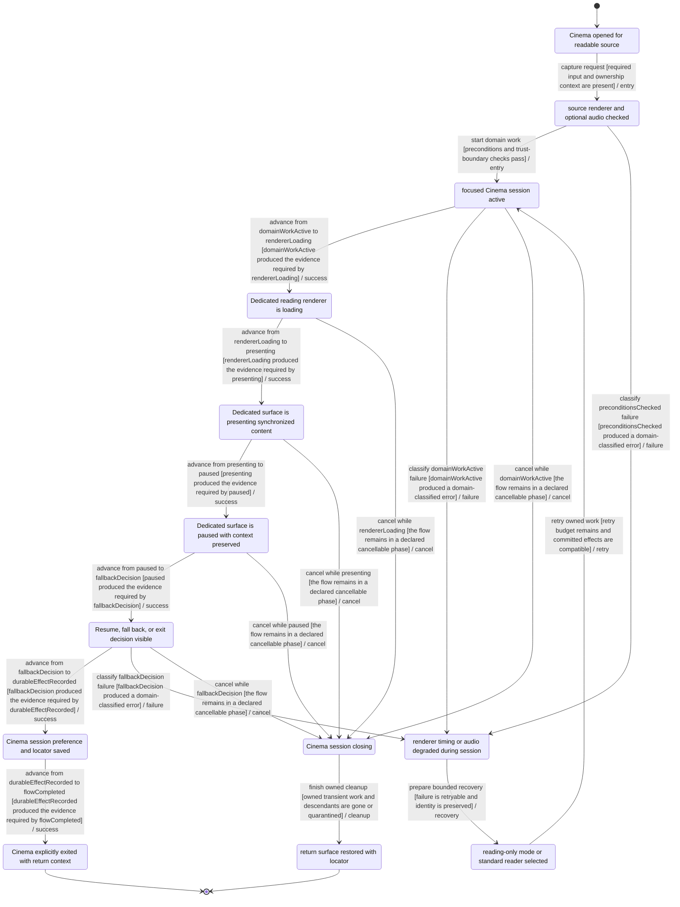
## READER-001 — Reader rendering, windowing, and readable degradation

- Primary owner: `experience`
- Architecture family: `playback-session`
- Shared subgraphs: `classified-failure-retry`, `cancellable-cleanup`
- Secondary owners: none
- Shared concerns: `RECOVERY`, `ACCESSIBILITY`, `PRIVACY`, `I18N`, `PERFORMANCE_TELEMETRY`, `OPERATIONAL_STATUS`

### Route ownership

- none

### State contract

| State | Label | Kind | Authority | UI observable |
| --- | --- | --- | --- | --- |
| `READER_001_REQUESTCAPTURED` | readable source opened | `stable` | `frontend` | UI shows readable source opened |
| `READER_001_PRECONDITIONSCHECKED` | revision locator and render contract checked | `stable` | `backend` | UI shows validation progress for reader rendering |
| `READER_001_DOMAINWORKACTIVE` | content window rendering | `transient` | `backend` | UI shows content window rendering |
| `READER_001_DURABLEEFFECTRECORDED` | rendered window bound to current revision | `stable` | `backend` | UI shows committed reader rendering state |
| `READER_001_FLOWCOMPLETED` | reader explicitly exited after usable session | `terminal-success` | `shared` | UI shows reader explicitly exited after usable session |
| `READER_001_CLASSIFIEDFAILURE` | renderer stale or content window failed | `stable-failure` | `backend` | UI explains renderer stale or content window failed |
| `READER_001_CLEANUPINPROGRESS` | render work superseded | `transient` | `backend` | UI shows render work superseded |
| `READER_001_CANCELEDCLEAN` | last readable window retained | `terminal-canceled` | `shared` | UI shows last readable window retained |
| `READER_001_RECOVERYCONTEXTREADY` | smaller window source-only mode or reload selected | `stable` | `shared` | UI offers smaller window source-only mode or reload selected |
| `READER_001_MEDIALOADING` | Media and locator are loading | `transient` | `frontend` | Media and locator are loading; the UI exposes this state or an actionable non-visual status. |
| `READER_001_PLAYING` | Playback is active at a synchronized locator | `stable` | `frontend` | Playback is active at a synchronized locator; the UI exposes this state or an actionable non-visual status. |
| `READER_001_PAUSED` | Playback is paused with locator preserved | `stable` | `frontend` | Playback is paused with locator preserved; the UI exposes this state or an actionable non-visual status. |
| `READER_001_INTERRUPTED` | Playback was interrupted with resumable context | `stable` | `shared` | Playback was interrupted with resumable context; the UI exposes this state or an actionable non-visual status. |
| `READER_001_STALE` | Artifact or locator became stale | `stable` | `shared` | Artifact or locator became stale; the UI exposes this state or an actionable non-visual status. |
| `READER_001_SUPERSEDED` | A newer playback session superseded this one | `terminal-canceled` | `frontend` | A newer playback session superseded this one; the UI exposes this state or an actionable non-visual status. |
| `READER_001_RESUMEDECISION` | Resume, supersede, or fail decision visible | `stable` | `frontend` | Resume, supersede, or fail decision visible; the UI exposes this state or an actionable non-visual status. |

### Semantic roles

- `requestCaptured` → `READER_001_REQUESTCAPTURED`
- `preconditionsChecked` → `READER_001_PRECONDITIONSCHECKED`
- `domainWorkActive` → `READER_001_DOMAINWORKACTIVE`
- `durableEffectRecorded` → `READER_001_DURABLEEFFECTRECORDED`
- `flowCompleted` → `READER_001_FLOWCOMPLETED`
- `classifiedFailure` → `READER_001_CLASSIFIEDFAILURE`
- `cleanupInProgress` → `READER_001_CLEANUPINPROGRESS`
- `canceledClean` → `READER_001_CANCELEDCLEAN`
- `recoveryContextReady` → `READER_001_RECOVERYCONTEXTREADY`
- `mediaLoading` → `READER_001_MEDIALOADING`
- `playing` → `READER_001_PLAYING`
- `paused` → `READER_001_PAUSED`
- `interrupted` → `READER_001_INTERRUPTED`
- `stale` → `READER_001_STALE`
- `superseded` → `READER_001_SUPERSEDED`
- `resumeDecision` → `READER_001_RESUMEDECISION`

### Required decisions

- **resumeDecision** at `READER_001_RESUMEDECISION`: `continue` → `READER-001:T10:success`, `reject` → `READER-001:T14:failure`, `cancel` → `READER-001:T24:cancel`

### Family and flow invariants

- Every playback-session flow exposes its required roles as canonical states.
- Every playback-session decision has named outgoing outcomes bound to transition IDs.
- READER-001 commit is not reached until rendered window bound to current revision
- READER-001 cancellation phases equal ordinary cancel-edge sources exactly.

### Transitions

| ID | From | To | Event | Guard | Branch |
| --- | --- | --- | --- | --- | --- |
| `READER-001:T01:entry` | `READER_001_REQUESTCAPTURED` | `READER_001_PRECONDITIONSCHECKED` | capture request | required input and ownership context are present | `entry` |
| `READER-001:T02:entry` | `READER_001_PRECONDITIONSCHECKED` | `READER_001_DOMAINWORKACTIVE` | start domain work | preconditions and trust-boundary checks pass | `entry` |
| `READER-001:T03:success` | `READER_001_DOMAINWORKACTIVE` | `READER_001_MEDIALOADING` | advance from domainWorkActive to mediaLoading | domainWorkActive produced the evidence required by mediaLoading | `success` |
| `READER-001:T04:success` | `READER_001_MEDIALOADING` | `READER_001_PLAYING` | advance from mediaLoading to playing | mediaLoading produced the evidence required by playing | `success` |
| `READER-001:T05:success` | `READER_001_PLAYING` | `READER_001_PAUSED` | advance from playing to paused | playing produced the evidence required by paused | `success` |
| `READER-001:T06:success` | `READER_001_PAUSED` | `READER_001_INTERRUPTED` | advance from paused to interrupted | paused produced the evidence required by interrupted | `success` |
| `READER-001:T07:success` | `READER_001_INTERRUPTED` | `READER_001_STALE` | advance from interrupted to stale | interrupted produced the evidence required by stale | `success` |
| `READER-001:T08:success` | `READER_001_STALE` | `READER_001_SUPERSEDED` | advance from stale to superseded | stale produced the evidence required by superseded | `success` |
| `READER-001:T09:success` | `READER_001_SUPERSEDED` | `READER_001_RESUMEDECISION` | advance from superseded to resumeDecision | superseded produced the evidence required by resumeDecision | `success` |
| `READER-001:T10:success` | `READER_001_RESUMEDECISION` | `READER_001_DURABLEEFFECTRECORDED` | advance from resumeDecision to durableEffectRecorded | resumeDecision produced the evidence required by durableEffectRecorded | `success` |
| `READER-001:T11:success` | `READER_001_DURABLEEFFECTRECORDED` | `READER_001_FLOWCOMPLETED` | advance from durableEffectRecorded to flowCompleted | durableEffectRecorded produced the evidence required by flowCompleted | `success` |
| `READER-001:T12:failure` | `READER_001_PRECONDITIONSCHECKED` | `READER_001_CLASSIFIEDFAILURE` | classify preconditionsChecked failure | preconditionsChecked produced a domain-classified error | `failure` |
| `READER-001:T13:failure` | `READER_001_DOMAINWORKACTIVE` | `READER_001_CLASSIFIEDFAILURE` | classify domainWorkActive failure | domainWorkActive produced a domain-classified error | `failure` |
| `READER-001:T14:failure` | `READER_001_RESUMEDECISION` | `READER_001_CLASSIFIEDFAILURE` | classify resumeDecision failure | resumeDecision produced a domain-classified error | `failure` |
| `READER-001:T15:recovery` | `READER_001_CLASSIFIEDFAILURE` | `READER_001_RECOVERYCONTEXTREADY` | prepare bounded recovery | failure is retryable and identity is preserved | `recovery` |
| `READER-001:T16:retry` | `READER_001_RECOVERYCONTEXTREADY` | `READER_001_DOMAINWORKACTIVE` | retry owned work | retry budget remains and committed effects are compatible | `retry` |
| `READER-001:T17:cancel` | `READER_001_DOMAINWORKACTIVE` | `READER_001_CLEANUPINPROGRESS` | cancel while domainWorkActive | the flow remains in a declared cancellable phase | `cancel` |
| `READER-001:T18:cancel` | `READER_001_MEDIALOADING` | `READER_001_CLEANUPINPROGRESS` | cancel while mediaLoading | the flow remains in a declared cancellable phase | `cancel` |
| `READER-001:T19:cancel` | `READER_001_PLAYING` | `READER_001_CLEANUPINPROGRESS` | cancel while playing | the flow remains in a declared cancellable phase | `cancel` |
| `READER-001:T20:cancel` | `READER_001_PAUSED` | `READER_001_CLEANUPINPROGRESS` | cancel while paused | the flow remains in a declared cancellable phase | `cancel` |
| `READER-001:T21:cancel` | `READER_001_INTERRUPTED` | `READER_001_CLEANUPINPROGRESS` | cancel while interrupted | the flow remains in a declared cancellable phase | `cancel` |
| `READER-001:T22:cancel` | `READER_001_STALE` | `READER_001_CLEANUPINPROGRESS` | cancel while stale | the flow remains in a declared cancellable phase | `cancel` |
| `READER-001:T23:cancel` | `READER_001_SUPERSEDED` | `READER_001_CLEANUPINPROGRESS` | cancel while superseded | the flow remains in a declared cancellable phase | `cancel` |
| `READER-001:T24:cancel` | `READER_001_RESUMEDECISION` | `READER_001_CLEANUPINPROGRESS` | cancel while resumeDecision | the flow remains in a declared cancellable phase | `cancel` |
| `READER-001:T25:cleanup` | `READER_001_CLEANUPINPROGRESS` | `READER_001_CANCELEDCLEAN` | finish owned cleanup | owned transient work and descendants are gone or quarantined | `cleanup` |

### Evidence

- `frontend/src/features/reading-surface/model.test.ts` — Executable source anchors only; no transition closure is claimed without a FLOW_ASSERT marker.
  - `maps typography presets onto existing reader settings` — transitions: none (source anchor only)
  - `derives the Reader shell state vocabulary from existing source and artifact state` — transitions: none (source anchor only)
  - `derives shell states from durable progress without treating current progress as audio-ready` — transitions: none (source anchor only)
  - `pins mixed shell-state precedence and unknown-token fallback` — transitions: none (source anchor only)
  - `derives Reader transport categories from shell and artifact evidence` — transitions: none (source anchor only)
  - `pins Reader transport precedence without overclaiming readiness` — transitions: none (source anchor only)
  - `maps non-retryable failed jobs to failed transport without hiding them behind checked audio` — transitions: none (source anchor only)
  - `does not let readerShellState weaken stronger raw transport evidence` — transitions: none (source anchor only)
  - `keeps Reader transport labels, reasons, and descriptors explicit` — transitions: none (source anchor only)
  - `keeps Reader shell labels and mode labels explicit and deterministic` — transitions: none (source anchor only)
  - `derives comparable reader metrics from measured elements` — transitions: none (source anchor only)

### Planned transition evidence

- `READER-001:T01:entry`, `READER-001:T02:entry`, `READER-001:T03:success`, `READER-001:T04:success`, `READER-001:T05:success`, `READER-001:T06:success`, `READER-001:T07:success`, `READER-001:T08:success`, `READER-001:T09:success`, `READER-001:T10:success`, `READER-001:T11:success`, `READER-001:T12:failure`, `READER-001:T13:failure`, `READER-001:T14:failure`, `READER-001:T15:recovery`, `READER-001:T16:retry`, `READER-001:T17:cancel`, `READER-001:T18:cancel`, `READER-001:T19:cancel`, `READER-001:T20:cancel`, `READER-001:T21:cancel`, `READER-001:T22:cancel`, `READER-001:T23:cancel`, `READER-001:T24:cancel`, `READER-001:T25:cleanup` → `BIC-09`; verify with `mise exec -- pnpm --dir frontend exec vitest run frontend/src/features/reading-surface/model.test.ts` — Owner issue must add transition-specific executable FLOW_ASSERT markers and assertions before closeout.

### Mermaid

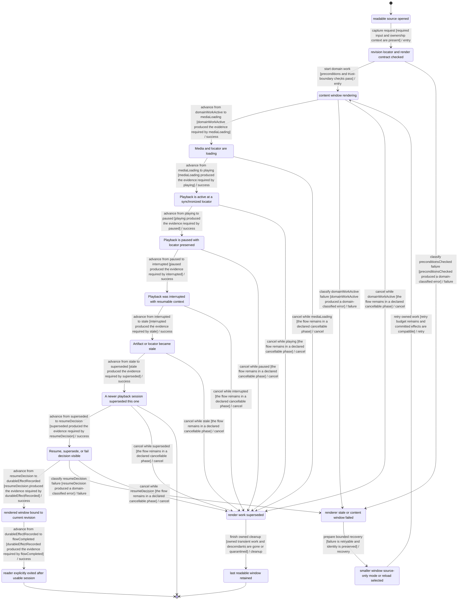
## THEATRE-001 — Theatre fullscreen and rehearsal runtime

- Primary owner: `experience`
- Architecture family: `immersive-reading`
- Shared subgraphs: `classified-failure-retry`, `cancellable-cleanup`
- Secondary owners: none
- Shared concerns: `RECOVERY`, `ACCESSIBILITY`, `PRIVACY`, `I18N`, `PERFORMANCE_TELEMETRY`, `OPERATIONAL_STATUS`

### Route ownership

- none

### State contract

| State | Label | Kind | Authority | UI observable |
| --- | --- | --- | --- | --- |
| `THEATRE_001_REQUESTCAPTURED` | Theatre mode requested | `stable` | `frontend` | UI shows Theatre mode requested |
| `THEATRE_001_PRECONDITIONSCHECKED` | fullscreen renderer controls and return target checked | `stable` | `backend` | UI shows validation progress for Theatre session |
| `THEATRE_001_DOMAINWORKACTIVE` | Theatre session active | `transient` | `backend` | UI shows Theatre session active |
| `THEATRE_001_DURABLEEFFECTRECORDED` | Theatre runtime and return context saved | `stable` | `backend` | UI shows committed Theatre session state |
| `THEATRE_001_FLOWCOMPLETED` | Theatre explicitly exited to originating surface | `terminal-success` | `shared` | UI shows Theatre explicitly exited to originating surface |
| `THEATRE_001_CLASSIFIEDFAILURE` | fullscreen audio or timing degraded | `stable-failure` | `backend` | UI explains fullscreen audio or timing degraded |
| `THEATRE_001_CLEANUPINPROGRESS` | fullscreen and media closing | `transient` | `backend` | UI shows fullscreen and media closing |
| `THEATRE_001_CANCELEDCLEAN` | inline presenter restored | `terminal-canceled` | `shared` | UI shows inline presenter restored |
| `THEATRE_001_RECOVERYCONTEXTREADY` | inline manual or audio-free mode selected | `stable` | `shared` | UI offers inline manual or audio-free mode selected |
| `THEATRE_001_RENDERERLOADING` | Dedicated reading renderer is loading | `transient` | `frontend` | Dedicated reading renderer is loading; the UI exposes this state or an actionable non-visual status. |
| `THEATRE_001_PRESENTING` | Dedicated surface is presenting synchronized content | `stable` | `frontend` | Dedicated surface is presenting synchronized content; the UI exposes this state or an actionable non-visual status. |
| `THEATRE_001_PAUSED` | Dedicated surface is paused with context preserved | `stable` | `frontend` | Dedicated surface is paused with context preserved; the UI exposes this state or an actionable non-visual status. |
| `THEATRE_001_FALLBACKDECISION` | Resume, fall back, or exit decision visible | `stable` | `frontend` | Resume, fall back, or exit decision visible; the UI exposes this state or an actionable non-visual status. |

### Semantic roles

- `requestCaptured` → `THEATRE_001_REQUESTCAPTURED`
- `preconditionsChecked` → `THEATRE_001_PRECONDITIONSCHECKED`
- `domainWorkActive` → `THEATRE_001_DOMAINWORKACTIVE`
- `durableEffectRecorded` → `THEATRE_001_DURABLEEFFECTRECORDED`
- `flowCompleted` → `THEATRE_001_FLOWCOMPLETED`
- `classifiedFailure` → `THEATRE_001_CLASSIFIEDFAILURE`
- `cleanupInProgress` → `THEATRE_001_CLEANUPINPROGRESS`
- `canceledClean` → `THEATRE_001_CANCELEDCLEAN`
- `recoveryContextReady` → `THEATRE_001_RECOVERYCONTEXTREADY`
- `rendererLoading` → `THEATRE_001_RENDERERLOADING`
- `presenting` → `THEATRE_001_PRESENTING`
- `paused` → `THEATRE_001_PAUSED`
- `fallbackDecision` → `THEATRE_001_FALLBACKDECISION`

### Required decisions

- **fallbackDecision** at `THEATRE_001_FALLBACKDECISION`: `continue` → `THEATRE-001:T07:success`, `reject` → `THEATRE-001:T11:failure`, `cancel` → `THEATRE-001:T18:cancel`

### Family and flow invariants

- Every immersive-reading flow exposes its required roles as canonical states.
- Every immersive-reading decision has named outgoing outcomes bound to transition IDs.
- THEATRE-001 commit is not reached until Theatre runtime and return context saved
- THEATRE-001 cancellation phases equal ordinary cancel-edge sources exactly.
- Frozen BIC-09 planned-evidence ownership is provenance; responsive replacement ownership RSP-08/RSP-13 is planned only and is not covered or implemented.

### Transitions

| ID | From | To | Event | Guard | Branch |
| --- | --- | --- | --- | --- | --- |
| `THEATRE-001:T01:entry` | `THEATRE_001_REQUESTCAPTURED` | `THEATRE_001_PRECONDITIONSCHECKED` | capture request | required input and ownership context are present | `entry` |
| `THEATRE-001:T02:entry` | `THEATRE_001_PRECONDITIONSCHECKED` | `THEATRE_001_DOMAINWORKACTIVE` | start domain work | preconditions and trust-boundary checks pass | `entry` |
| `THEATRE-001:T03:success` | `THEATRE_001_DOMAINWORKACTIVE` | `THEATRE_001_RENDERERLOADING` | advance from domainWorkActive to rendererLoading | domainWorkActive produced the evidence required by rendererLoading | `success` |
| `THEATRE-001:T04:success` | `THEATRE_001_RENDERERLOADING` | `THEATRE_001_PRESENTING` | advance from rendererLoading to presenting | rendererLoading produced the evidence required by presenting | `success` |
| `THEATRE-001:T05:success` | `THEATRE_001_PRESENTING` | `THEATRE_001_PAUSED` | advance from presenting to paused | presenting produced the evidence required by paused | `success` |
| `THEATRE-001:T06:success` | `THEATRE_001_PAUSED` | `THEATRE_001_FALLBACKDECISION` | advance from paused to fallbackDecision | paused produced the evidence required by fallbackDecision | `success` |
| `THEATRE-001:T07:success` | `THEATRE_001_FALLBACKDECISION` | `THEATRE_001_DURABLEEFFECTRECORDED` | advance from fallbackDecision to durableEffectRecorded | fallbackDecision produced the evidence required by durableEffectRecorded | `success` |
| `THEATRE-001:T08:success` | `THEATRE_001_DURABLEEFFECTRECORDED` | `THEATRE_001_FLOWCOMPLETED` | advance from durableEffectRecorded to flowCompleted | durableEffectRecorded produced the evidence required by flowCompleted | `success` |
| `THEATRE-001:T09:failure` | `THEATRE_001_PRECONDITIONSCHECKED` | `THEATRE_001_CLASSIFIEDFAILURE` | classify preconditionsChecked failure | preconditionsChecked produced a domain-classified error | `failure` |
| `THEATRE-001:T10:failure` | `THEATRE_001_DOMAINWORKACTIVE` | `THEATRE_001_CLASSIFIEDFAILURE` | classify domainWorkActive failure | domainWorkActive produced a domain-classified error | `failure` |
| `THEATRE-001:T11:failure` | `THEATRE_001_FALLBACKDECISION` | `THEATRE_001_CLASSIFIEDFAILURE` | classify fallbackDecision failure | fallbackDecision produced a domain-classified error | `failure` |
| `THEATRE-001:T12:recovery` | `THEATRE_001_CLASSIFIEDFAILURE` | `THEATRE_001_RECOVERYCONTEXTREADY` | prepare bounded recovery | failure is retryable and identity is preserved | `recovery` |
| `THEATRE-001:T13:retry` | `THEATRE_001_RECOVERYCONTEXTREADY` | `THEATRE_001_DOMAINWORKACTIVE` | retry owned work | retry budget remains and committed effects are compatible | `retry` |
| `THEATRE-001:T14:cancel` | `THEATRE_001_DOMAINWORKACTIVE` | `THEATRE_001_CLEANUPINPROGRESS` | cancel while domainWorkActive | the flow remains in a declared cancellable phase | `cancel` |
| `THEATRE-001:T15:cancel` | `THEATRE_001_RENDERERLOADING` | `THEATRE_001_CLEANUPINPROGRESS` | cancel while rendererLoading | the flow remains in a declared cancellable phase | `cancel` |
| `THEATRE-001:T16:cancel` | `THEATRE_001_PRESENTING` | `THEATRE_001_CLEANUPINPROGRESS` | cancel while presenting | the flow remains in a declared cancellable phase | `cancel` |
| `THEATRE-001:T17:cancel` | `THEATRE_001_PAUSED` | `THEATRE_001_CLEANUPINPROGRESS` | cancel while paused | the flow remains in a declared cancellable phase | `cancel` |
| `THEATRE-001:T18:cancel` | `THEATRE_001_FALLBACKDECISION` | `THEATRE_001_CLEANUPINPROGRESS` | cancel while fallbackDecision | the flow remains in a declared cancellable phase | `cancel` |
| `THEATRE-001:T19:cleanup` | `THEATRE_001_CLEANUPINPROGRESS` | `THEATRE_001_CANCELEDCLEAN` | finish owned cleanup | owned transient work and descendants are gone or quarantined | `cleanup` |

### Evidence

- `frontend/src/features/theatre/model.test.ts` — Executable source anchors only; no transition closure is claimed without a FLOW_ASSERT marker.
  - `distinguishes audio, timing, confidence, and renderer fallback states` — transitions: none (source anchor only)

### Planned transition evidence

- `THEATRE-001:T01:entry`, `THEATRE-001:T02:entry`, `THEATRE-001:T03:success`, `THEATRE-001:T04:success`, `THEATRE-001:T05:success`, `THEATRE-001:T06:success`, `THEATRE-001:T07:success`, `THEATRE-001:T08:success`, `THEATRE-001:T09:failure`, `THEATRE-001:T10:failure`, `THEATRE-001:T11:failure`, `THEATRE-001:T12:recovery`, `THEATRE-001:T13:retry`, `THEATRE-001:T14:cancel`, `THEATRE-001:T15:cancel`, `THEATRE-001:T16:cancel`, `THEATRE-001:T17:cancel`, `THEATRE-001:T18:cancel`, `THEATRE-001:T19:cleanup` → `BIC-09`; verify with `mise exec -- pnpm --dir frontend exec vitest run frontend/src/features/theatre/model.test.ts` — Owner issue must add transition-specific executable FLOW_ASSERT markers and assertions before closeout.

### Mermaid

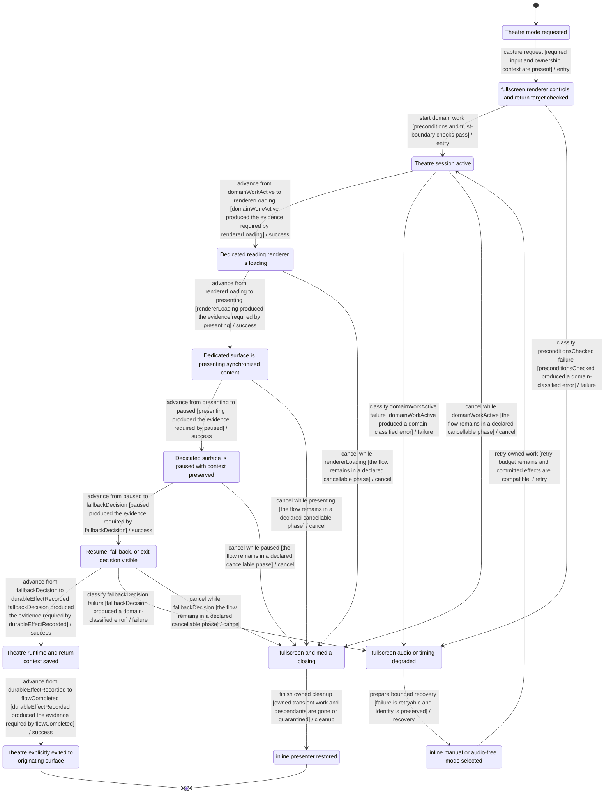
## PROGRESS-001 — Reading progress, bookmark, remap, and resume

- Primary owner: `project-data`
- Architecture family: `event-stream`
- Shared subgraphs: `classified-failure-retry`, `cancellable-cleanup`
- Secondary owners: none
- Shared concerns: `RECOVERY`, `LOCAL_ORIGIN_AUTH`, `FILESYSTEM`, `PRIVACY`, `ACCESSIBILITY`, `OPERATIONAL_STATUS`

### Route ownership

- `GET /api/projects/:id/progress`
- `PATCH /api/progress/:targetId`

### State contract

| State | Label | Kind | Authority | UI observable |
| --- | --- | --- | --- | --- |
| `PROGRESS_001_REQUESTCAPTURED` | reading or playback locator changed | `stable` | `frontend` | UI shows reading or playback locator changed |
| `PROGRESS_001_PRECONDITIONSCHECKED` | target revision and locator confidence checked | `stable` | `backend` | UI shows validation progress for progress update |
| `PROGRESS_001_DOMAINWORKACTIVE` | progress coalescing and remap running | `transient` | `backend` | UI shows progress coalescing and remap running |
| `PROGRESS_001_DURABLEEFFECTRECORDED` | durable progress locator persisted | `stable` | `backend` | UI shows committed progress update state |
| `PROGRESS_001_FLOWCOMPLETED` | resumable current position visible | `terminal-success` | `shared` | UI shows resumable current position visible |
| `PROGRESS_001_CLASSIFIEDFAILURE` | stale or low-confidence locator requires choice | `stable-failure` | `backend` | UI explains stale or low-confidence locator requires choice |
| `PROGRESS_001_CLEANUPINPROGRESS` | pending progress write superseded | `transient` | `backend` | UI shows pending progress write superseded |
| `PROGRESS_001_CANCELEDCLEAN` | last durable locator retained | `terminal-canceled` | `shared` | UI shows last durable locator retained |
| `PROGRESS_001_RECOVERYCONTEXTREADY` | automatic remap or explicit location chosen | `stable` | `shared` | UI offers automatic remap or explicit location chosen |
| `PROGRESS_001_CURSORREPLAYED` | Durable cursor replay completed | `stable` | `backend` | Durable cursor replay completed; the UI exposes this state or an actionable non-visual status. |
| `PROGRESS_001_GAPDECISION` | Gap, duplicate, or stale event decision made | `stable` | `shared` | Gap, duplicate, or stale event decision made; the UI exposes this state or an actionable non-visual status. |
| `PROGRESS_001_SNAPSHOTRECONCILED` | Canonical snapshot and stream cursor agree | `stable` | `shared` | Canonical snapshot and stream cursor agree; the UI exposes this state or an actionable non-visual status. |

### Semantic roles

- `requestCaptured` → `PROGRESS_001_REQUESTCAPTURED`
- `preconditionsChecked` → `PROGRESS_001_PRECONDITIONSCHECKED`
- `domainWorkActive` → `PROGRESS_001_DOMAINWORKACTIVE`
- `durableEffectRecorded` → `PROGRESS_001_DURABLEEFFECTRECORDED`
- `flowCompleted` → `PROGRESS_001_FLOWCOMPLETED`
- `classifiedFailure` → `PROGRESS_001_CLASSIFIEDFAILURE`
- `cleanupInProgress` → `PROGRESS_001_CLEANUPINPROGRESS`
- `canceledClean` → `PROGRESS_001_CANCELEDCLEAN`
- `recoveryContextReady` → `PROGRESS_001_RECOVERYCONTEXTREADY`
- `cursorReplayed` → `PROGRESS_001_CURSORREPLAYED`
- `gapDecision` → `PROGRESS_001_GAPDECISION`
- `snapshotReconciled` → `PROGRESS_001_SNAPSHOTRECONCILED`

### Required decisions

- **gapDecision** at `PROGRESS_001_GAPDECISION`: `continue` → `PROGRESS-001:T05:success`, `reject` → `PROGRESS-001:T10:failure`, `cancel` → `PROGRESS-001:T15:cancel`

### Family and flow invariants

- Every event-stream flow exposes its required roles as canonical states.
- Every event-stream decision has named outgoing outcomes bound to transition IDs.
- PROGRESS-001 commit is not reached until durable progress locator persisted
- PROGRESS-001 cancellation phases equal ordinary cancel-edge sources exactly.

### Transitions

| ID | From | To | Event | Guard | Branch |
| --- | --- | --- | --- | --- | --- |
| `PROGRESS-001:T01:entry` | `PROGRESS_001_REQUESTCAPTURED` | `PROGRESS_001_PRECONDITIONSCHECKED` | capture request | required input and ownership context are present | `entry` |
| `PROGRESS-001:T02:entry` | `PROGRESS_001_PRECONDITIONSCHECKED` | `PROGRESS_001_DOMAINWORKACTIVE` | start domain work | preconditions and trust-boundary checks pass | `entry` |
| `PROGRESS-001:T03:success` | `PROGRESS_001_DOMAINWORKACTIVE` | `PROGRESS_001_CURSORREPLAYED` | advance from domainWorkActive to cursorReplayed | domainWorkActive produced the evidence required by cursorReplayed | `success` |
| `PROGRESS-001:T04:success` | `PROGRESS_001_CURSORREPLAYED` | `PROGRESS_001_GAPDECISION` | advance from cursorReplayed to gapDecision | cursorReplayed produced the evidence required by gapDecision | `success` |
| `PROGRESS-001:T05:success` | `PROGRESS_001_GAPDECISION` | `PROGRESS_001_SNAPSHOTRECONCILED` | advance from gapDecision to snapshotReconciled | gapDecision produced the evidence required by snapshotReconciled | `success` |
| `PROGRESS-001:T06:success` | `PROGRESS_001_SNAPSHOTRECONCILED` | `PROGRESS_001_DURABLEEFFECTRECORDED` | advance from snapshotReconciled to durableEffectRecorded | snapshotReconciled produced the evidence required by durableEffectRecorded | `success` |
| `PROGRESS-001:T07:success` | `PROGRESS_001_DURABLEEFFECTRECORDED` | `PROGRESS_001_FLOWCOMPLETED` | advance from durableEffectRecorded to flowCompleted | durableEffectRecorded produced the evidence required by flowCompleted | `success` |
| `PROGRESS-001:T08:failure` | `PROGRESS_001_PRECONDITIONSCHECKED` | `PROGRESS_001_CLASSIFIEDFAILURE` | classify preconditionsChecked failure | preconditionsChecked produced a domain-classified error | `failure` |
| `PROGRESS-001:T09:failure` | `PROGRESS_001_DOMAINWORKACTIVE` | `PROGRESS_001_CLASSIFIEDFAILURE` | classify domainWorkActive failure | domainWorkActive produced a domain-classified error | `failure` |
| `PROGRESS-001:T10:failure` | `PROGRESS_001_GAPDECISION` | `PROGRESS_001_CLASSIFIEDFAILURE` | classify gapDecision failure | gapDecision produced a domain-classified error | `failure` |
| `PROGRESS-001:T11:recovery` | `PROGRESS_001_CLASSIFIEDFAILURE` | `PROGRESS_001_RECOVERYCONTEXTREADY` | prepare bounded recovery | failure is retryable and identity is preserved | `recovery` |
| `PROGRESS-001:T12:retry` | `PROGRESS_001_RECOVERYCONTEXTREADY` | `PROGRESS_001_DOMAINWORKACTIVE` | retry owned work | retry budget remains and committed effects are compatible | `retry` |
| `PROGRESS-001:T13:cancel` | `PROGRESS_001_DOMAINWORKACTIVE` | `PROGRESS_001_CLEANUPINPROGRESS` | cancel while domainWorkActive | the flow remains in a declared cancellable phase | `cancel` |
| `PROGRESS-001:T14:cancel` | `PROGRESS_001_CURSORREPLAYED` | `PROGRESS_001_CLEANUPINPROGRESS` | cancel while cursorReplayed | the flow remains in a declared cancellable phase | `cancel` |
| `PROGRESS-001:T15:cancel` | `PROGRESS_001_GAPDECISION` | `PROGRESS_001_CLEANUPINPROGRESS` | cancel while gapDecision | the flow remains in a declared cancellable phase | `cancel` |
| `PROGRESS-001:T16:cancel` | `PROGRESS_001_SNAPSHOTRECONCILED` | `PROGRESS_001_CLEANUPINPROGRESS` | cancel while snapshotReconciled | the flow remains in a declared cancellable phase | `cancel` |
| `PROGRESS-001:T17:cleanup` | `PROGRESS_001_CLEANUPINPROGRESS` | `PROGRESS_001_CANCELEDCLEAN` | finish owned cleanup | owned transient work and descendants are gone or quarantined | `cleanup` |

### Evidence

- `backend/internal/pipeline/durable_progress_test.go` — Executable source anchors only; no transition closure is claimed without a FLOW_ASSERT marker.
  - `TestDurableProgressPersistsCanonicalAndRejectsMismatchedContext` — transitions: none (source anchor only)
  - `TestDurableProgressConcurrentCanonicalWritesLeaveSingleCanonical` — transitions: none (source anchor only)
  - `TestDurableProgressReloadReconcilesDuplicateCanonicalRecords` — transitions: none (source anchor only)
  - `TestDurableProgressReloadPromotesNewestRecordWhenContextHasZeroCanonical` — transitions: none (source anchor only)
  - `TestDurableProgressCanonicalDemotionWriteFailurePreservesPreviousCanonical` — transitions: none (source anchor only)
  - `TestDurableProgressReloadPromotesDeterministicCanonicalAfterNewWriteFailure` — transitions: none (source anchor only)
  - `TestDurableProgressReloadSkipsInvalidContextRecords` — transitions: none (source anchor only)
  - `TestResumeResolverReturnsDeterministicCurrentDegradedAudioSourceRetryAndFailedDecisions` — transitions: none (source anchor only)
  - `TestResumeResolverRemapsStaleProgressOnlyWithSameSourceHighConfidenceRevisionMap` — transitions: none (source anchor only)
  - `TestResumeResolverRemappedDecisionUsesRevisionMapLocatorMapping` — transitions: none (source anchor only)
  - `TestResumeResolverStaleOrSupersededSameManifestRequiresRevisionMap` — transitions: none (source anchor only)
  - `TestResumeResolverRejectsMissingLowConfidenceAmbiguousOrWrongSourceLocatorMappings` — transitions: none (source anchor only)

### Planned transition evidence

- `PROGRESS-001:T01:entry`, `PROGRESS-001:T02:entry`, `PROGRESS-001:T03:success`, `PROGRESS-001:T04:success`, `PROGRESS-001:T05:success`, `PROGRESS-001:T06:success`, `PROGRESS-001:T07:success`, `PROGRESS-001:T08:failure`, `PROGRESS-001:T09:failure`, `PROGRESS-001:T10:failure`, `PROGRESS-001:T11:recovery`, `PROGRESS-001:T12:retry`, `PROGRESS-001:T13:cancel`, `PROGRESS-001:T14:cancel`, `PROGRESS-001:T15:cancel`, `PROGRESS-001:T16:cancel`, `PROGRESS-001:T17:cleanup` → `BIC-09`; verify with `cd backend && go test ./...` — Owner issue must add transition-specific executable FLOW_ASSERT markers and assertions before closeout.

### Mermaid

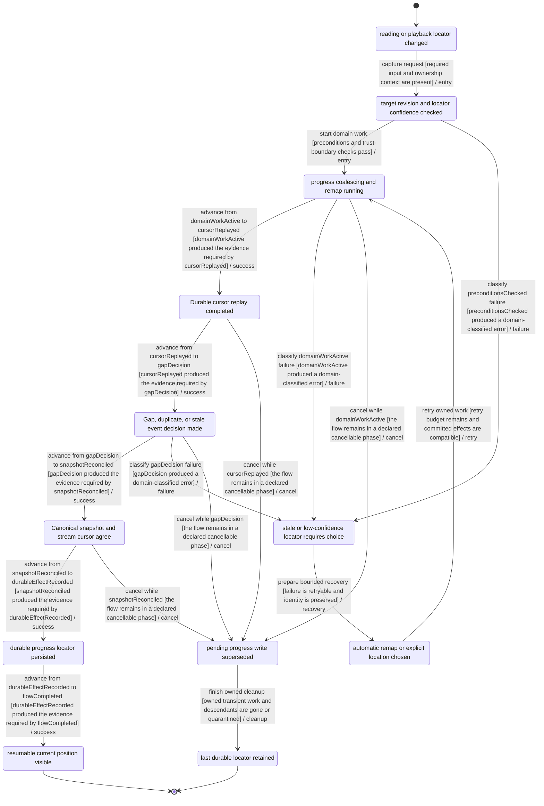
## REPAIR-001 — Immutable source repair and dependent invalidation

- Primary owner: `source-data`
- Architecture family: `job-recovery`
- Shared subgraphs: `classified-failure-retry`, `cancellable-cleanup`
- Secondary owners: `speech-audio`
- Shared concerns: `RECOVERY`, `FILESYSTEM`, `PRIVACY`, `I18N`, `ACCESSIBILITY`, `OPERATIONAL_STATUS`

### Route ownership

- none

### State contract

| State | Label | Kind | Authority | UI observable |
| --- | --- | --- | --- | --- |
| `REPAIR_001_REQUESTCAPTURED` | source defect repair requested | `stable` | `frontend` | UI shows source defect repair requested |
| `REPAIR_001_PRECONDITIONSCHECKED` | current revision edit scope and dependents checked | `stable` | `backend` | UI shows validation progress for source repair |
| `REPAIR_001_DOMAINWORKACTIVE` | superseding revision and locator remap building | `transient` | `backend` | UI shows superseding revision and locator remap building |
| `REPAIR_001_DURABLEEFFECTRECORDED` | new source revision atomically selected | `stable` | `backend` | UI shows committed source repair state |
| `REPAIR_001_FLOWCOMPLETED` | consistent repaired revision visible | `terminal-success` | `shared` | UI shows consistent repaired revision visible |
| `REPAIR_001_CLASSIFIEDFAILURE` | revision write remap or invalidation failed | `stable-failure` | `backend` | UI explains revision write remap or invalidation failed |
| `REPAIR_001_CLEANUPINPROGRESS` | pre-commit repair stopping | `transient` | `backend` | UI shows pre-commit repair stopping |
| `REPAIR_001_CANCELEDCLEAN` | original revision remains current | `terminal-canceled` | `shared` | UI shows original revision remains current |
| `REPAIR_001_RECOVERYCONTEXTREADY` | quarantine partial revision and retry affected scope | `stable` | `shared` | UI offers quarantine partial revision and retry affected scope |
| `REPAIR_001_CHECKPOINTLOADED` | Compatible checkpoint and committed prefix loaded | `stable` | `backend` | Compatible checkpoint and committed prefix loaded; the UI exposes this state or an actionable non-visual status. |
| `REPAIR_001_RETRYSCOPEDECISION` | Retry, resume, or repair scope decided | `stable` | `shared` | Retry, resume, or repair scope decided; the UI exposes this state or an actionable non-visual status. |
| `REPAIR_001_READYPREFIXREUSED` | Verified ready prefix reused without duplicate work | `stable` | `backend` | Verified ready prefix reused without duplicate work; the UI exposes this state or an actionable non-visual status. |

### Semantic roles

- `requestCaptured` → `REPAIR_001_REQUESTCAPTURED`
- `preconditionsChecked` → `REPAIR_001_PRECONDITIONSCHECKED`
- `domainWorkActive` → `REPAIR_001_DOMAINWORKACTIVE`
- `durableEffectRecorded` → `REPAIR_001_DURABLEEFFECTRECORDED`
- `flowCompleted` → `REPAIR_001_FLOWCOMPLETED`
- `classifiedFailure` → `REPAIR_001_CLASSIFIEDFAILURE`
- `cleanupInProgress` → `REPAIR_001_CLEANUPINPROGRESS`
- `canceledClean` → `REPAIR_001_CANCELEDCLEAN`
- `recoveryContextReady` → `REPAIR_001_RECOVERYCONTEXTREADY`
- `checkpointLoaded` → `REPAIR_001_CHECKPOINTLOADED`
- `retryScopeDecision` → `REPAIR_001_RETRYSCOPEDECISION`
- `readyPrefixReused` → `REPAIR_001_READYPREFIXREUSED`

### Required decisions

- **retryScopeDecision** at `REPAIR_001_RETRYSCOPEDECISION`: `continue` → `REPAIR-001:T05:success`, `reject` → `REPAIR-001:T10:failure`, `cancel` → `REPAIR-001:T15:cancel`

### Family and flow invariants

- Every job-recovery flow exposes its required roles as canonical states.
- Every job-recovery decision has named outgoing outcomes bound to transition IDs.
- REPAIR-001 commit is not reached until new source revision atomically selected
- REPAIR-001 cancellation phases equal ordinary cancel-edge sources exactly.
- Frozen BIC-09 planned-evidence ownership is provenance; responsive replacement ownership RSP-03/RSP-10 is planned only and is not covered or implemented.

### Transitions

| ID | From | To | Event | Guard | Branch |
| --- | --- | --- | --- | --- | --- |
| `REPAIR-001:T01:entry` | `REPAIR_001_REQUESTCAPTURED` | `REPAIR_001_PRECONDITIONSCHECKED` | capture request | required input and ownership context are present | `entry` |
| `REPAIR-001:T02:entry` | `REPAIR_001_PRECONDITIONSCHECKED` | `REPAIR_001_DOMAINWORKACTIVE` | start domain work | preconditions and trust-boundary checks pass | `entry` |
| `REPAIR-001:T03:success` | `REPAIR_001_DOMAINWORKACTIVE` | `REPAIR_001_CHECKPOINTLOADED` | advance from domainWorkActive to checkpointLoaded | domainWorkActive produced the evidence required by checkpointLoaded | `success` |
| `REPAIR-001:T04:success` | `REPAIR_001_CHECKPOINTLOADED` | `REPAIR_001_RETRYSCOPEDECISION` | advance from checkpointLoaded to retryScopeDecision | checkpointLoaded produced the evidence required by retryScopeDecision | `success` |
| `REPAIR-001:T05:success` | `REPAIR_001_RETRYSCOPEDECISION` | `REPAIR_001_READYPREFIXREUSED` | advance from retryScopeDecision to readyPrefixReused | retryScopeDecision produced the evidence required by readyPrefixReused | `success` |
| `REPAIR-001:T06:success` | `REPAIR_001_READYPREFIXREUSED` | `REPAIR_001_DURABLEEFFECTRECORDED` | advance from readyPrefixReused to durableEffectRecorded | readyPrefixReused produced the evidence required by durableEffectRecorded | `success` |
| `REPAIR-001:T07:success` | `REPAIR_001_DURABLEEFFECTRECORDED` | `REPAIR_001_FLOWCOMPLETED` | advance from durableEffectRecorded to flowCompleted | durableEffectRecorded produced the evidence required by flowCompleted | `success` |
| `REPAIR-001:T08:failure` | `REPAIR_001_PRECONDITIONSCHECKED` | `REPAIR_001_CLASSIFIEDFAILURE` | classify preconditionsChecked failure | preconditionsChecked produced a domain-classified error | `failure` |
| `REPAIR-001:T09:failure` | `REPAIR_001_DOMAINWORKACTIVE` | `REPAIR_001_CLASSIFIEDFAILURE` | classify domainWorkActive failure | domainWorkActive produced a domain-classified error | `failure` |
| `REPAIR-001:T10:failure` | `REPAIR_001_RETRYSCOPEDECISION` | `REPAIR_001_CLASSIFIEDFAILURE` | classify retryScopeDecision failure | retryScopeDecision produced a domain-classified error | `failure` |
| `REPAIR-001:T11:recovery` | `REPAIR_001_CLASSIFIEDFAILURE` | `REPAIR_001_RECOVERYCONTEXTREADY` | prepare bounded recovery | failure is retryable and identity is preserved | `recovery` |
| `REPAIR-001:T12:retry` | `REPAIR_001_RECOVERYCONTEXTREADY` | `REPAIR_001_DOMAINWORKACTIVE` | retry owned work | retry budget remains and committed effects are compatible | `retry` |
| `REPAIR-001:T13:cancel` | `REPAIR_001_DOMAINWORKACTIVE` | `REPAIR_001_CLEANUPINPROGRESS` | cancel while domainWorkActive | the flow remains in a declared cancellable phase | `cancel` |
| `REPAIR-001:T14:cancel` | `REPAIR_001_CHECKPOINTLOADED` | `REPAIR_001_CLEANUPINPROGRESS` | cancel while checkpointLoaded | the flow remains in a declared cancellable phase | `cancel` |
| `REPAIR-001:T15:cancel` | `REPAIR_001_RETRYSCOPEDECISION` | `REPAIR_001_CLEANUPINPROGRESS` | cancel while retryScopeDecision | the flow remains in a declared cancellable phase | `cancel` |
| `REPAIR-001:T16:cancel` | `REPAIR_001_READYPREFIXREUSED` | `REPAIR_001_CLEANUPINPROGRESS` | cancel while readyPrefixReused | the flow remains in a declared cancellable phase | `cancel` |
| `REPAIR-001:T17:cleanup` | `REPAIR_001_CLEANUPINPROGRESS` | `REPAIR_001_CANCELEDCLEAN` | finish owned cleanup | owned transient work and descendants are gone or quarantined | `cleanup` |

### Evidence

- `backend/internal/pipeline/source_lifecycle_test.go` — Executable source anchors only; no transition closure is claimed without a FLOW_ASSERT marker.
  - `TestPersistSourceLifecycleStoresEnvelopeRevisionAndRawArtifact` — transitions: none (source anchor only)
  - `TestSourceLifecycleStartupMarksOnlyActiveWorkInterrupted` — transitions: none (source anchor only)
  - `TestCreatePreparedSourcePersistsSourceLifecycle` — transitions: none (source anchor only)
  - `TestPersistSourceLifecycleRollsBackNewRevisionWhenEnvelopeWriteFails` — transitions: none (source anchor only)
  - `TestPersistSourceLifecycleRollsBackEnvelopeWhenPreviousRevisionWriteFails` — transitions: none (source anchor only)
  - `TestUpdateSourceLifecycleWorkStatusWriteFailureKeepsMemoryAndDiskStatus` — transitions: none (source anchor only)

### Planned transition evidence

- `REPAIR-001:T01:entry`, `REPAIR-001:T02:entry`, `REPAIR-001:T03:success`, `REPAIR-001:T04:success`, `REPAIR-001:T05:success`, `REPAIR-001:T06:success`, `REPAIR-001:T07:success`, `REPAIR-001:T08:failure`, `REPAIR-001:T09:failure`, `REPAIR-001:T10:failure`, `REPAIR-001:T11:recovery`, `REPAIR-001:T12:retry`, `REPAIR-001:T13:cancel`, `REPAIR-001:T14:cancel`, `REPAIR-001:T15:cancel`, `REPAIR-001:T16:cancel`, `REPAIR-001:T17:cleanup` → `BIC-09`; verify with `cd backend && go test ./...` — Owner issue must add transition-specific executable FLOW_ASSERT markers and assertions before closeout.

### Mermaid

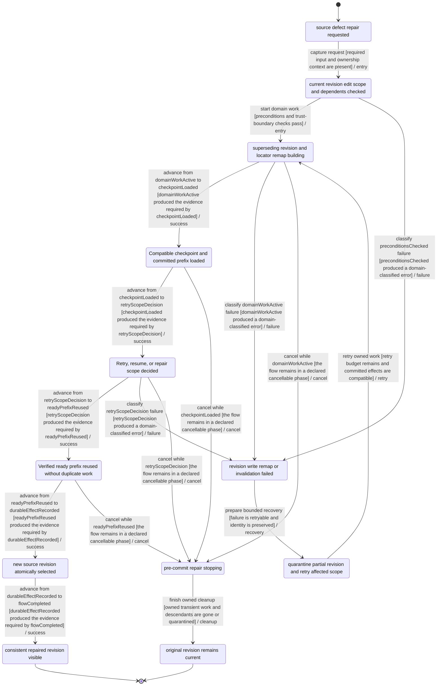
