# Candidate application flows — Content Audio Reader

Status: `candidate_pending_chatgpt`

Each diagram is architectural. Exact route/state ownership is gated by the proposed validator issue.

## VOICE-SOURCE-001 — Voice source normalization and analysis

Owner: `voice-profiles`

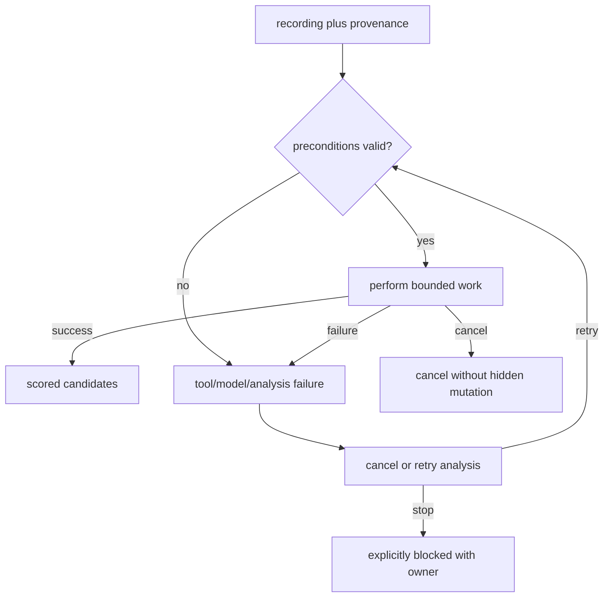
```mermaid
%% flow-id: VOICE-SOURCE-001
%% flow-version: 1
flowchart TD
  VOICE_SOURCE_001_ENTRY["recording plus provenance"] --> VOICE_SOURCE_001_VALIDATE{"preconditions valid?"}
  VOICE_SOURCE_001_VALIDATE -->|yes| VOICE_SOURCE_001_WORK["perform bounded work"]
  VOICE_SOURCE_001_WORK -->|success| VOICE_SOURCE_001_SUCCESS["scored candidates"]
  VOICE_SOURCE_001_VALIDATE -->|no| VOICE_SOURCE_001_FAIL["tool/model/analysis failure"]
  VOICE_SOURCE_001_WORK -->|failure| VOICE_SOURCE_001_FAIL
  VOICE_SOURCE_001_WORK -->|cancel| VOICE_SOURCE_001_CANCEL["cancel without hidden mutation"]
  VOICE_SOURCE_001_FAIL --> VOICE_SOURCE_001_RECOVER["cancel or retry analysis"]
  VOICE_SOURCE_001_RECOVER -->|retry| VOICE_SOURCE_001_VALIDATE
  VOICE_SOURCE_001_RECOVER -->|stop| VOICE_SOURCE_001_BLOCKED["explicitly blocked with owner"]
```

## VOICE-PROFILE-001 — Voice profile creation and readiness

Owner: `voice-profiles`

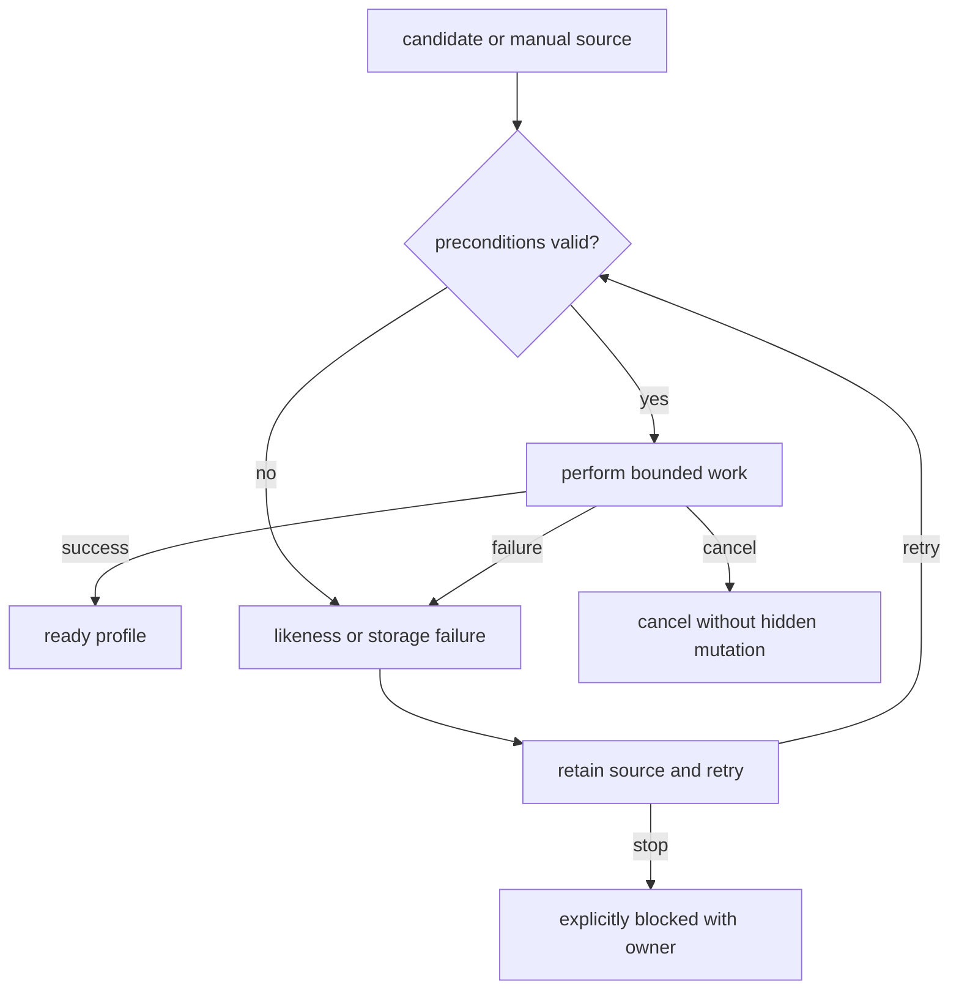
```mermaid
%% flow-id: VOICE-PROFILE-001
%% flow-version: 1
flowchart TD
  VOICE_PROFILE_001_ENTRY["candidate or manual source"] --> VOICE_PROFILE_001_VALIDATE{"preconditions valid?"}
  VOICE_PROFILE_001_VALIDATE -->|yes| VOICE_PROFILE_001_WORK["perform bounded work"]
  VOICE_PROFILE_001_WORK -->|success| VOICE_PROFILE_001_SUCCESS["ready profile"]
  VOICE_PROFILE_001_VALIDATE -->|no| VOICE_PROFILE_001_FAIL["likeness or storage failure"]
  VOICE_PROFILE_001_WORK -->|failure| VOICE_PROFILE_001_FAIL
  VOICE_PROFILE_001_WORK -->|cancel| VOICE_PROFILE_001_CANCEL["cancel without hidden mutation"]
  VOICE_PROFILE_001_FAIL --> VOICE_PROFILE_001_RECOVER["retain source and retry"]
  VOICE_PROFILE_001_RECOVER -->|retry| VOICE_PROFILE_001_VALIDATE
  VOICE_PROFILE_001_RECOVER -->|stop| VOICE_PROFILE_001_BLOCKED["explicitly blocked with owner"]
```

## VOICE-TARGET-001 — Voice target build and validation

Owner: `voice-inference`

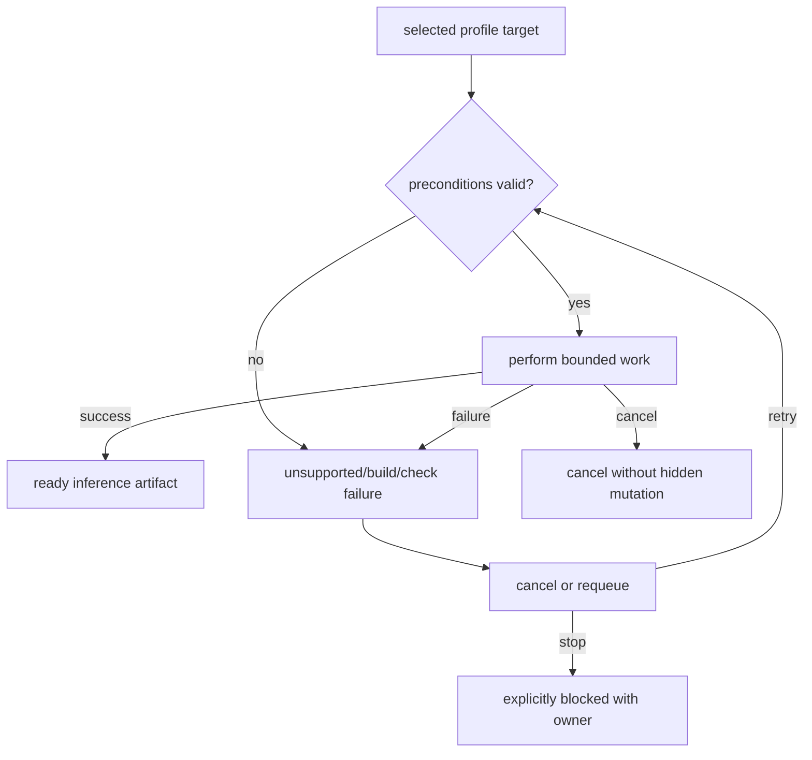
```mermaid
%% flow-id: VOICE-TARGET-001
%% flow-version: 1
flowchart TD
  VOICE_TARGET_001_ENTRY["selected profile target"] --> VOICE_TARGET_001_VALIDATE{"preconditions valid?"}
  VOICE_TARGET_001_VALIDATE -->|yes| VOICE_TARGET_001_WORK["perform bounded work"]
  VOICE_TARGET_001_WORK -->|success| VOICE_TARGET_001_SUCCESS["ready inference artifact"]
  VOICE_TARGET_001_VALIDATE -->|no| VOICE_TARGET_001_FAIL["unsupported/build/check failure"]
  VOICE_TARGET_001_WORK -->|failure| VOICE_TARGET_001_FAIL
  VOICE_TARGET_001_WORK -->|cancel| VOICE_TARGET_001_CANCEL["cancel without hidden mutation"]
  VOICE_TARGET_001_FAIL --> VOICE_TARGET_001_RECOVER["cancel or requeue"]
  VOICE_TARGET_001_RECOVER -->|retry| VOICE_TARGET_001_VALIDATE
  VOICE_TARGET_001_RECOVER -->|stop| VOICE_TARGET_001_BLOCKED["explicitly blocked with owner"]
```

## JOB-CREATE-001 — Synthesis job validation and creation

Owner: `pipeline`

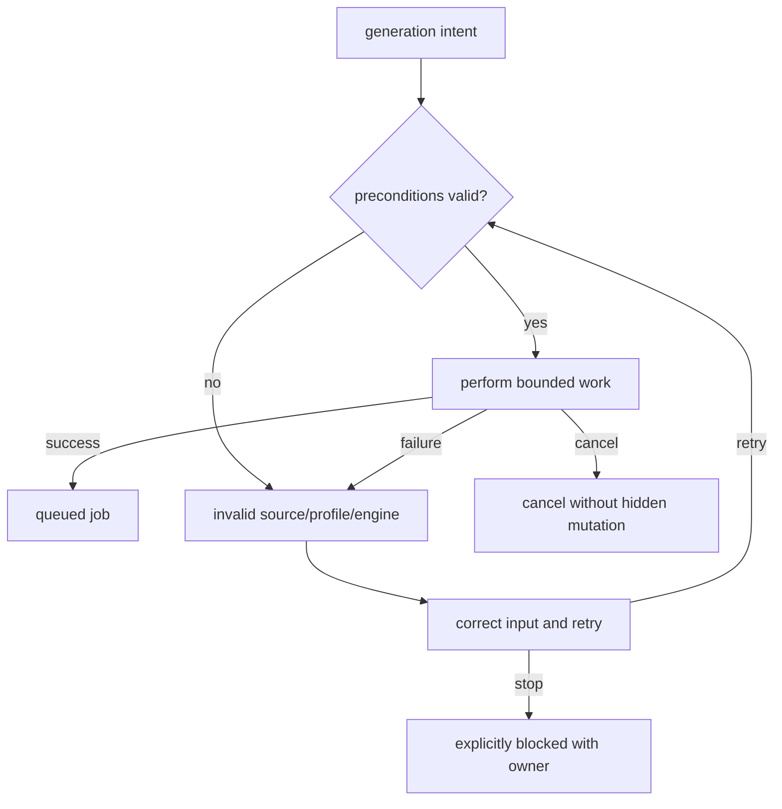
```mermaid
%% flow-id: JOB-CREATE-001
%% flow-version: 1
flowchart TD
  JOB_CREATE_001_ENTRY["generation intent"] --> JOB_CREATE_001_VALIDATE{"preconditions valid?"}
  JOB_CREATE_001_VALIDATE -->|yes| JOB_CREATE_001_WORK["perform bounded work"]
  JOB_CREATE_001_WORK -->|success| JOB_CREATE_001_SUCCESS["queued job"]
  JOB_CREATE_001_VALIDATE -->|no| JOB_CREATE_001_FAIL["invalid source/profile/engine"]
  JOB_CREATE_001_WORK -->|failure| JOB_CREATE_001_FAIL
  JOB_CREATE_001_WORK -->|cancel| JOB_CREATE_001_CANCEL["cancel without hidden mutation"]
  JOB_CREATE_001_FAIL --> JOB_CREATE_001_RECOVER["correct input and retry"]
  JOB_CREATE_001_RECOVER -->|retry| JOB_CREATE_001_VALIDATE
  JOB_CREATE_001_RECOVER -->|stop| JOB_CREATE_001_BLOCKED["explicitly blocked with owner"]
```

## JOB-RUN-001 — Synthesis, checking, retry, and cancellation

Owner: `pipeline`

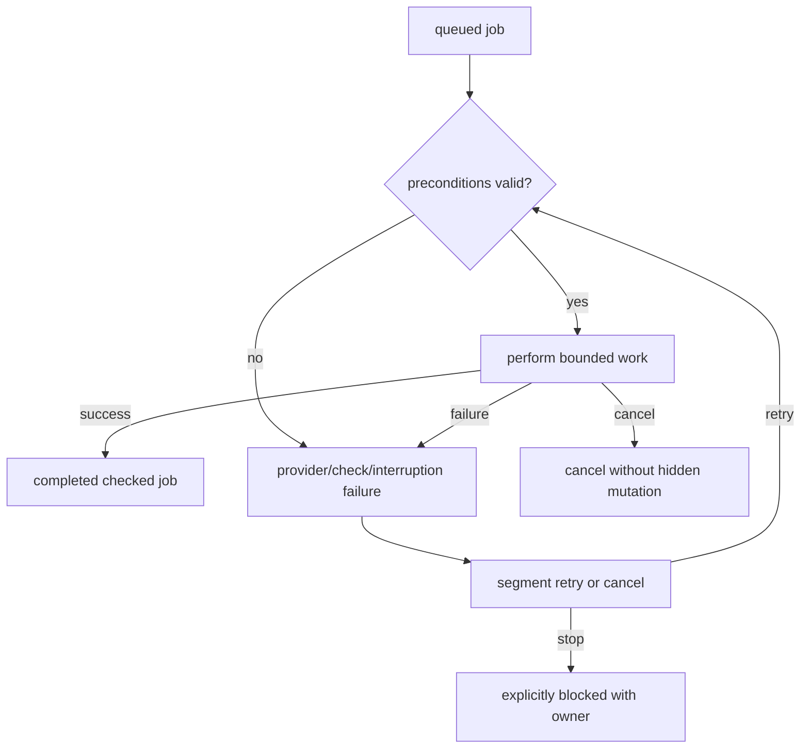
```mermaid
%% flow-id: JOB-RUN-001
%% flow-version: 1
flowchart TD
  JOB_RUN_001_ENTRY["queued job"] --> JOB_RUN_001_VALIDATE{"preconditions valid?"}
  JOB_RUN_001_VALIDATE -->|yes| JOB_RUN_001_WORK["perform bounded work"]
  JOB_RUN_001_WORK -->|success| JOB_RUN_001_SUCCESS["completed checked job"]
  JOB_RUN_001_VALIDATE -->|no| JOB_RUN_001_FAIL["provider/check/interruption failure"]
  JOB_RUN_001_WORK -->|failure| JOB_RUN_001_FAIL
  JOB_RUN_001_WORK -->|cancel| JOB_RUN_001_CANCEL["cancel without hidden mutation"]
  JOB_RUN_001_FAIL --> JOB_RUN_001_RECOVER["segment retry or cancel"]
  JOB_RUN_001_RECOVER -->|retry| JOB_RUN_001_VALIDATE
  JOB_RUN_001_RECOVER -->|stop| JOB_RUN_001_BLOCKED["explicitly blocked with owner"]
```

## JOB-EVENTS-001 — Job event stream and snapshot recovery

Owner: `pipeline-api`

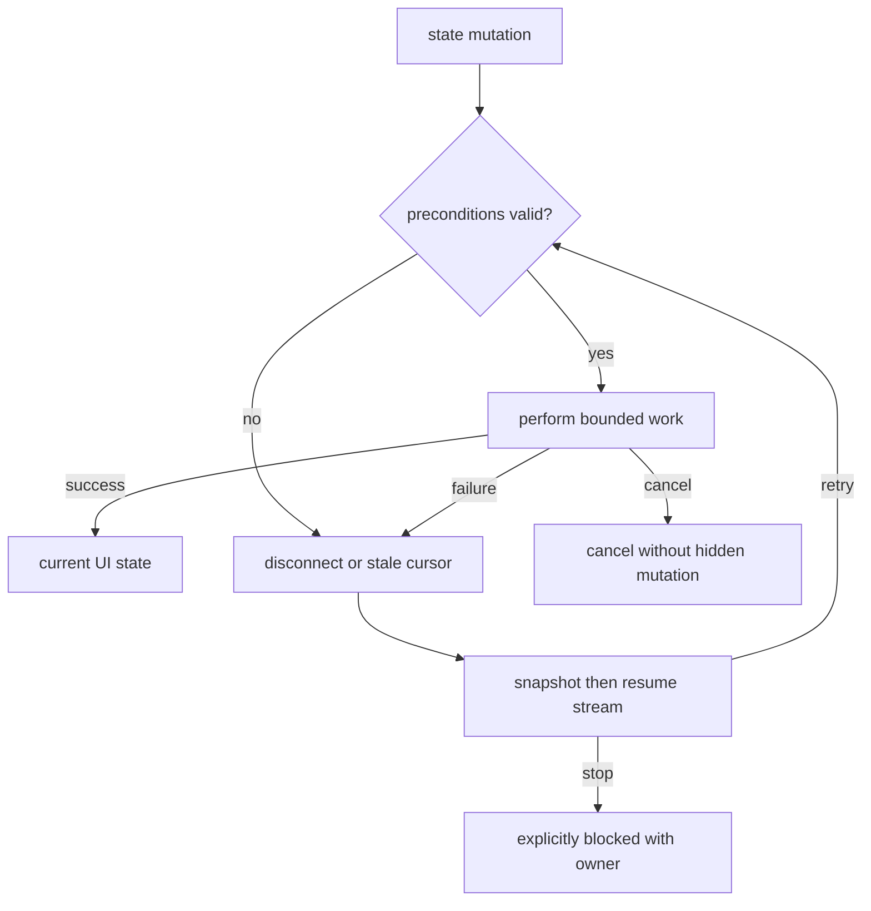
```mermaid
%% flow-id: JOB-EVENTS-001
%% flow-version: 1
flowchart TD
  JOB_EVENTS_001_ENTRY["state mutation"] --> JOB_EVENTS_001_VALIDATE{"preconditions valid?"}
  JOB_EVENTS_001_VALIDATE -->|yes| JOB_EVENTS_001_WORK["perform bounded work"]
  JOB_EVENTS_001_WORK -->|success| JOB_EVENTS_001_SUCCESS["current UI state"]
  JOB_EVENTS_001_VALIDATE -->|no| JOB_EVENTS_001_FAIL["disconnect or stale cursor"]
  JOB_EVENTS_001_WORK -->|failure| JOB_EVENTS_001_FAIL
  JOB_EVENTS_001_WORK -->|cancel| JOB_EVENTS_001_CANCEL["cancel without hidden mutation"]
  JOB_EVENTS_001_FAIL --> JOB_EVENTS_001_RECOVER["snapshot then resume stream"]
  JOB_EVENTS_001_RECOVER -->|retry| JOB_EVENTS_001_VALIDATE
  JOB_EVENTS_001_RECOVER -->|stop| JOB_EVENTS_001_BLOCKED["explicitly blocked with owner"]
```

## PERSIST-RECOVER-001 — Persistence, restart, and orphan recovery

Owner: `pipeline-data`

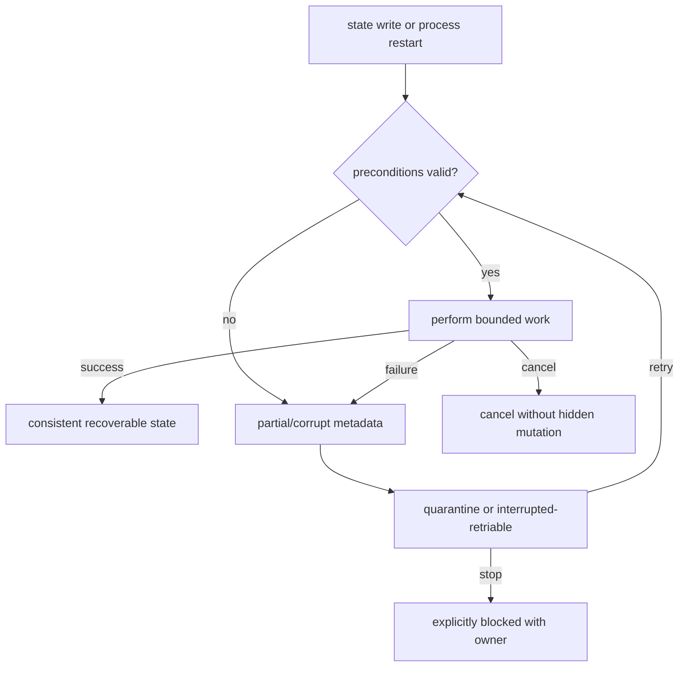
```mermaid
%% flow-id: PERSIST-RECOVER-001
%% flow-version: 1
flowchart TD
  PERSIST_RECOVER_001_ENTRY["state write or process restart"] --> PERSIST_RECOVER_001_VALIDATE{"preconditions valid?"}
  PERSIST_RECOVER_001_VALIDATE -->|yes| PERSIST_RECOVER_001_WORK["perform bounded work"]
  PERSIST_RECOVER_001_WORK -->|success| PERSIST_RECOVER_001_SUCCESS["consistent recoverable state"]
  PERSIST_RECOVER_001_VALIDATE -->|no| PERSIST_RECOVER_001_FAIL["partial/corrupt metadata"]
  PERSIST_RECOVER_001_WORK -->|failure| PERSIST_RECOVER_001_FAIL
  PERSIST_RECOVER_001_WORK -->|cancel| PERSIST_RECOVER_001_CANCEL["cancel without hidden mutation"]
  PERSIST_RECOVER_001_FAIL --> PERSIST_RECOVER_001_RECOVER["quarantine or interrupted-retriable"]
  PERSIST_RECOVER_001_RECOVER -->|retry| PERSIST_RECOVER_001_VALIDATE
  PERSIST_RECOVER_001_RECOVER -->|stop| PERSIST_RECOVER_001_BLOCKED["explicitly blocked with owner"]
```

## ARTIFACT-001 — Audio artifact currentness and replacement

Owner: `pipeline-audio`

```mermaid
%% flow-id: ARTIFACT-001
%% flow-version: 1
flowchart TD
  ARTIFACT_001_ENTRY["segment generation"] --> ARTIFACT_001_VALIDATE{"preconditions valid?"}
  ARTIFACT_001_VALIDATE -->|yes| ARTIFACT_001_WORK["perform bounded work"]
  ARTIFACT_001_WORK -->|success| ARTIFACT_001_SUCCESS["current playable artifact"]
  ARTIFACT_001_VALIDATE -->|no| ARTIFACT_001_FAIL["failed/stale/replaced artifact"]
  ARTIFACT_001_WORK -->|failure| ARTIFACT_001_FAIL
  ARTIFACT_001_WORK -->|cancel| ARTIFACT_001_CANCEL["cancel without hidden mutation"]
  ARTIFACT_001_FAIL --> ARTIFACT_001_RECOVER["rebuild or compatible reuse"]
  ARTIFACT_001_RECOVER -->|retry| ARTIFACT_001_VALIDATE
  ARTIFACT_001_RECOVER -->|stop| ARTIFACT_001_BLOCKED["explicitly blocked with owner"]
```

## PLAYBACK-001 — Playback queue, transport, seek, and partial arrival

Owner: `playback`

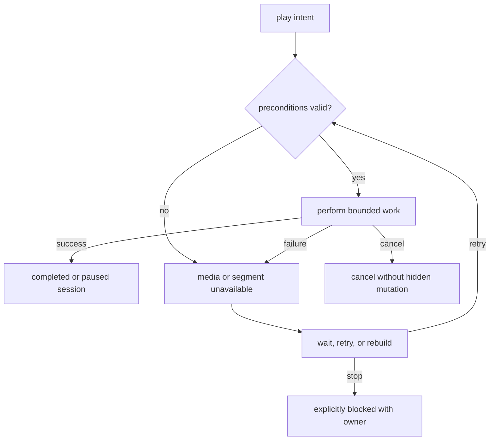
```mermaid
%% flow-id: PLAYBACK-001
%% flow-version: 1
flowchart TD
  PLAYBACK_001_ENTRY["play intent"] --> PLAYBACK_001_VALIDATE{"preconditions valid?"}
  PLAYBACK_001_VALIDATE -->|yes| PLAYBACK_001_WORK["perform bounded work"]
  PLAYBACK_001_WORK -->|success| PLAYBACK_001_SUCCESS["completed or paused session"]
  PLAYBACK_001_VALIDATE -->|no| PLAYBACK_001_FAIL["media or segment unavailable"]
  PLAYBACK_001_WORK -->|failure| PLAYBACK_001_FAIL
  PLAYBACK_001_WORK -->|cancel| PLAYBACK_001_CANCEL["cancel without hidden mutation"]
  PLAYBACK_001_FAIL --> PLAYBACK_001_RECOVER["wait, retry, or rebuild"]
  PLAYBACK_001_RECOVER -->|retry| PLAYBACK_001_VALIDATE
  PLAYBACK_001_RECOVER -->|stop| PLAYBACK_001_BLOCKED["explicitly blocked with owner"]
```

## CINEMA-001 — Cinema focus mode

Owner: `reader-cinema`

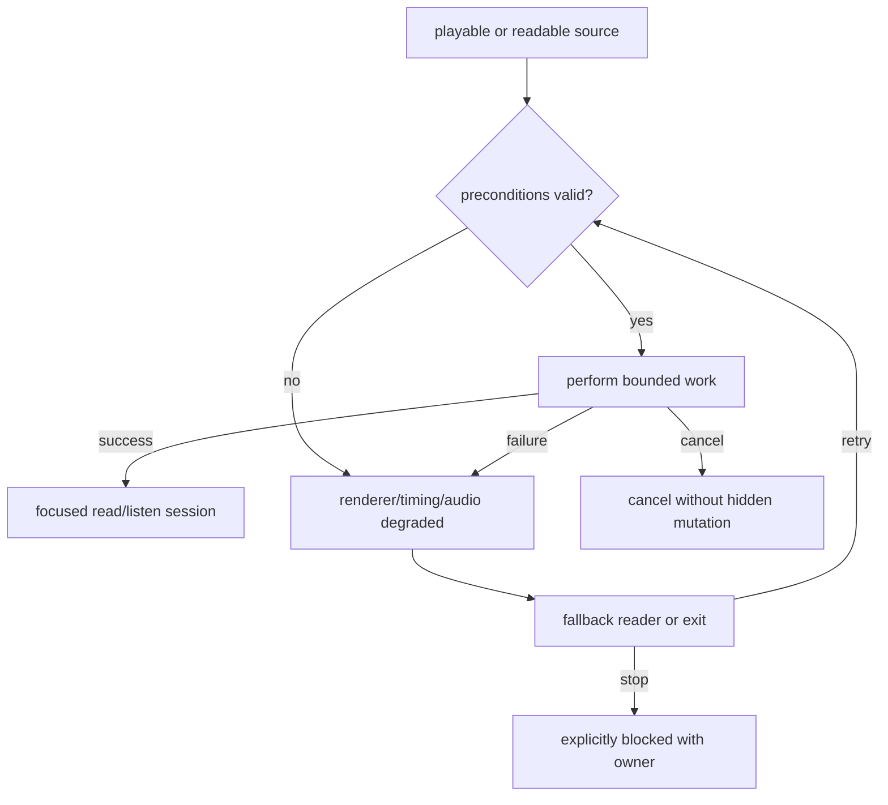
```mermaid
%% flow-id: CINEMA-001
%% flow-version: 1
flowchart TD
  CINEMA_001_ENTRY["playable or readable source"] --> CINEMA_001_VALIDATE{"preconditions valid?"}
  CINEMA_001_VALIDATE -->|yes| CINEMA_001_WORK["perform bounded work"]
  CINEMA_001_WORK -->|success| CINEMA_001_SUCCESS["focused read/listen session"]
  CINEMA_001_VALIDATE -->|no| CINEMA_001_FAIL["renderer/timing/audio degraded"]
  CINEMA_001_WORK -->|failure| CINEMA_001_FAIL
  CINEMA_001_WORK -->|cancel| CINEMA_001_CANCEL["cancel without hidden mutation"]
  CINEMA_001_FAIL --> CINEMA_001_RECOVER["fallback reader or exit"]
  CINEMA_001_RECOVER -->|retry| CINEMA_001_VALIDATE
  CINEMA_001_RECOVER -->|stop| CINEMA_001_BLOCKED["explicitly blocked with owner"]
```

## READER-001 — Reader rendering and follow-along fidelity

Owner: `reader`

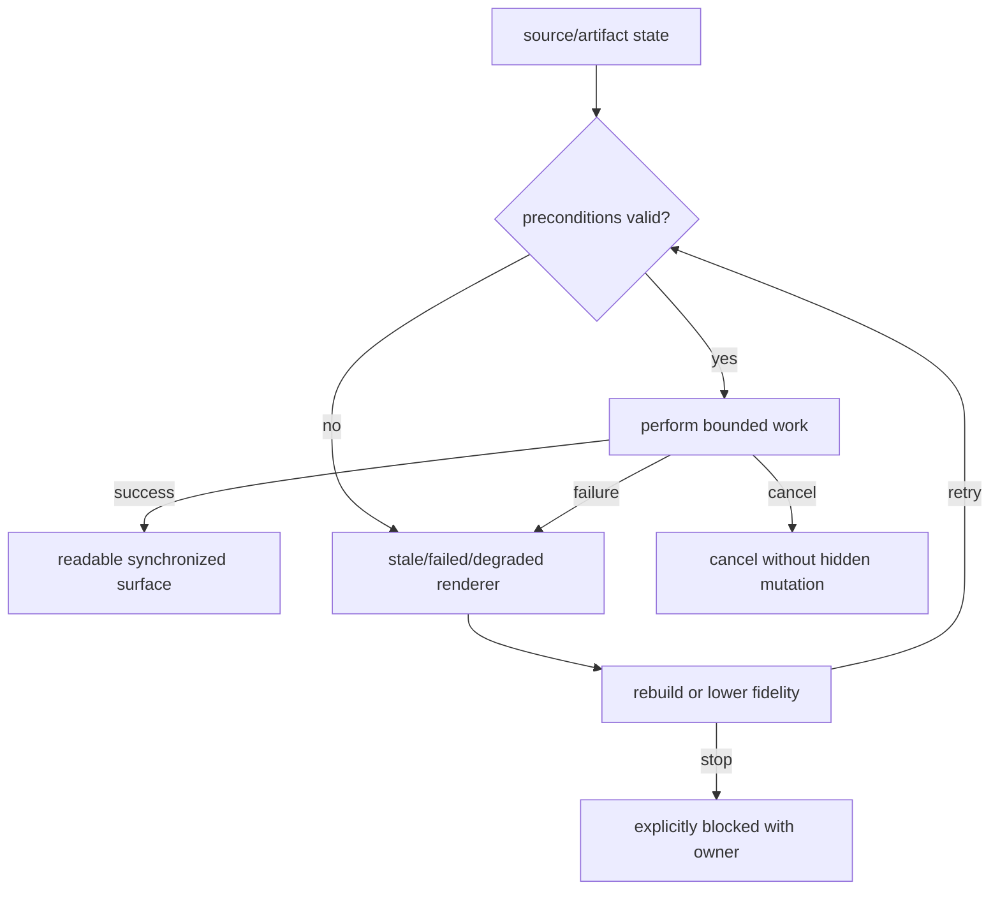
```mermaid
%% flow-id: READER-001
%% flow-version: 1
flowchart TD
  READER_001_ENTRY["source/artifact state"] --> READER_001_VALIDATE{"preconditions valid?"}
  READER_001_VALIDATE -->|yes| READER_001_WORK["perform bounded work"]
  READER_001_WORK -->|success| READER_001_SUCCESS["readable synchronized surface"]
  READER_001_VALIDATE -->|no| READER_001_FAIL["stale/failed/degraded renderer"]
  READER_001_WORK -->|failure| READER_001_FAIL
  READER_001_WORK -->|cancel| READER_001_CANCEL["cancel without hidden mutation"]
  READER_001_FAIL --> READER_001_RECOVER["rebuild or lower fidelity"]
  READER_001_RECOVER -->|retry| READER_001_VALIDATE
  READER_001_RECOVER -->|stop| READER_001_BLOCKED["explicitly blocked with owner"]
```

## THEATRE-001 — Theatre fullscreen and rehearsal modes

Owner: `reader-theatre`

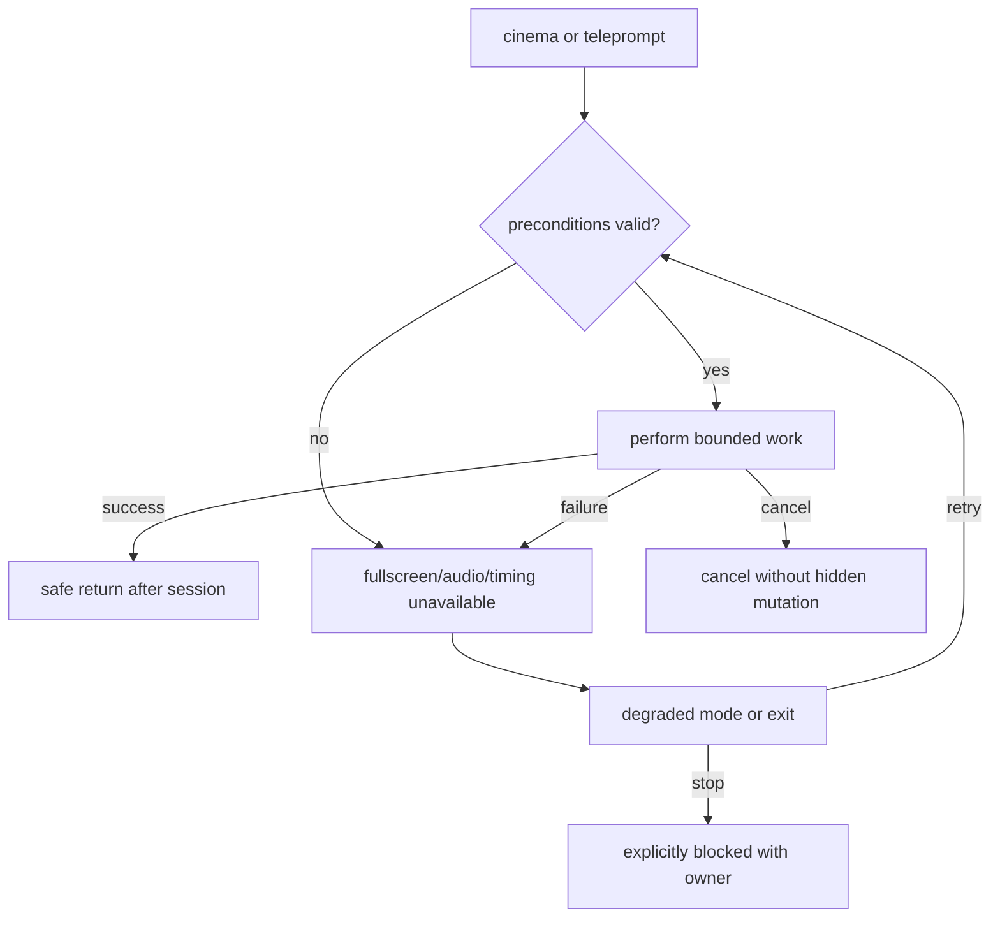
```mermaid
%% flow-id: THEATRE-001
%% flow-version: 1
flowchart TD
  THEATRE_001_ENTRY["cinema or teleprompt"] --> THEATRE_001_VALIDATE{"preconditions valid?"}
  THEATRE_001_VALIDATE -->|yes| THEATRE_001_WORK["perform bounded work"]
  THEATRE_001_WORK -->|success| THEATRE_001_SUCCESS["safe return after session"]
  THEATRE_001_VALIDATE -->|no| THEATRE_001_FAIL["fullscreen/audio/timing unavailable"]
  THEATRE_001_WORK -->|failure| THEATRE_001_FAIL
  THEATRE_001_WORK -->|cancel| THEATRE_001_CANCEL["cancel without hidden mutation"]
  THEATRE_001_FAIL --> THEATRE_001_RECOVER["degraded mode or exit"]
  THEATRE_001_RECOVER -->|retry| THEATRE_001_VALIDATE
  THEATRE_001_RECOVER -->|stop| THEATRE_001_BLOCKED["explicitly blocked with owner"]
```

## PROGRESS-001 — Reading/playback progress, bookmark, and resume

Owner: `reader-data`

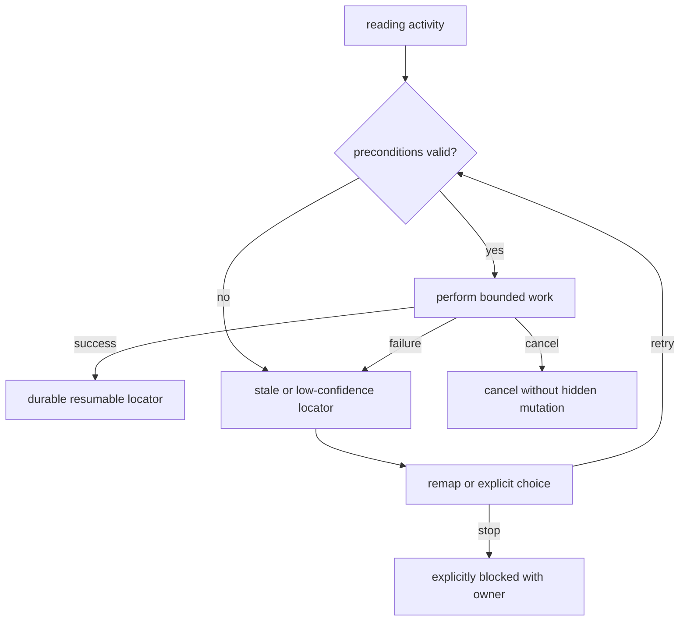
```mermaid
%% flow-id: PROGRESS-001
%% flow-version: 1
flowchart TD
  PROGRESS_001_ENTRY["reading activity"] --> PROGRESS_001_VALIDATE{"preconditions valid?"}
  PROGRESS_001_VALIDATE -->|yes| PROGRESS_001_WORK["perform bounded work"]
  PROGRESS_001_WORK -->|success| PROGRESS_001_SUCCESS["durable resumable locator"]
  PROGRESS_001_VALIDATE -->|no| PROGRESS_001_FAIL["stale or low-confidence locator"]
  PROGRESS_001_WORK -->|failure| PROGRESS_001_FAIL
  PROGRESS_001_WORK -->|cancel| PROGRESS_001_CANCEL["cancel without hidden mutation"]
  PROGRESS_001_FAIL --> PROGRESS_001_RECOVER["remap or explicit choice"]
  PROGRESS_001_RECOVER -->|retry| PROGRESS_001_VALIDATE
  PROGRESS_001_RECOVER -->|stop| PROGRESS_001_BLOCKED["explicitly blocked with owner"]
```

## REPAIR-001 — Immutable source repair and artifact invalidation

Owner: `source-repair`

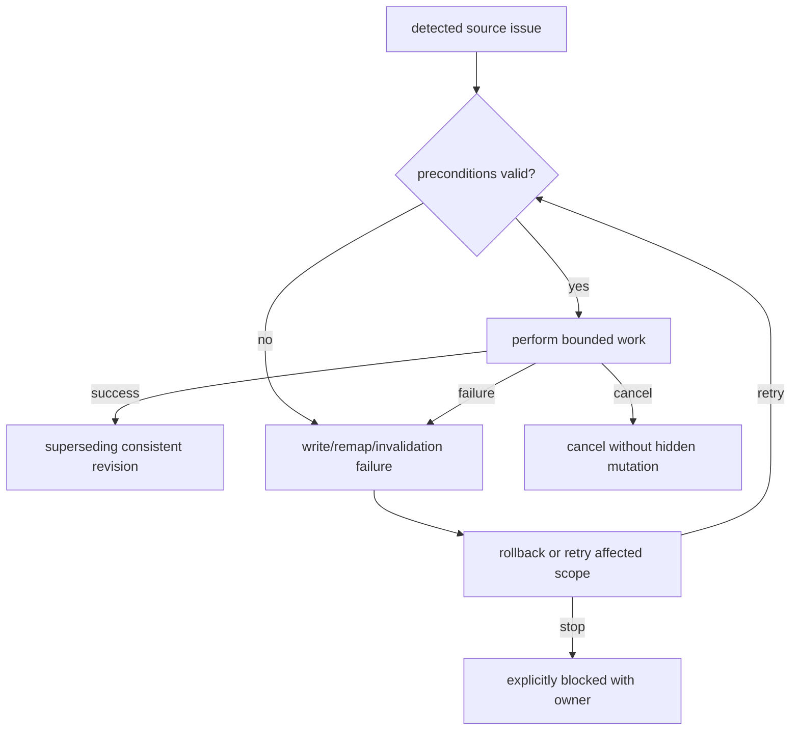
```mermaid
%% flow-id: REPAIR-001
%% flow-version: 1
flowchart TD
  REPAIR_001_ENTRY["detected source issue"] --> REPAIR_001_VALIDATE{"preconditions valid?"}
  REPAIR_001_VALIDATE -->|yes| REPAIR_001_WORK["perform bounded work"]
  REPAIR_001_WORK -->|success| REPAIR_001_SUCCESS["superseding consistent revision"]
  REPAIR_001_VALIDATE -->|no| REPAIR_001_FAIL["write/remap/invalidation failure"]
  REPAIR_001_WORK -->|failure| REPAIR_001_FAIL
  REPAIR_001_WORK -->|cancel| REPAIR_001_CANCEL["cancel without hidden mutation"]
  REPAIR_001_FAIL --> REPAIR_001_RECOVER["rollback or retry affected scope"]
  REPAIR_001_RECOVER -->|retry| REPAIR_001_VALIDATE
  REPAIR_001_RECOVER -->|stop| REPAIR_001_BLOCKED["explicitly blocked with owner"]
```
