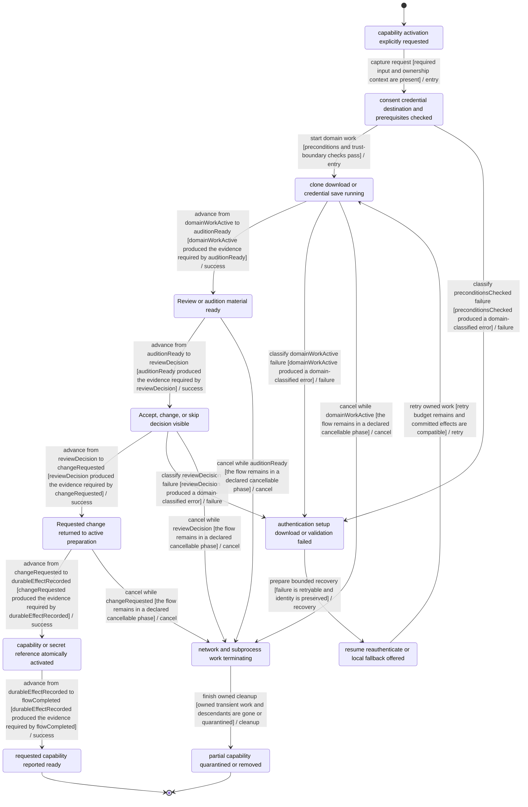
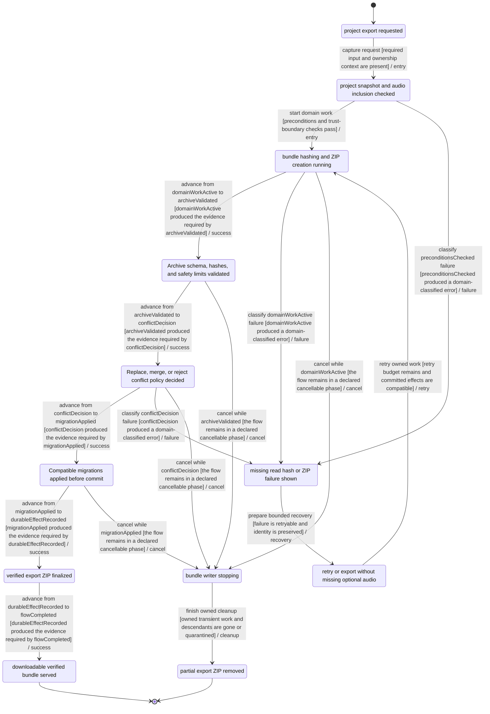
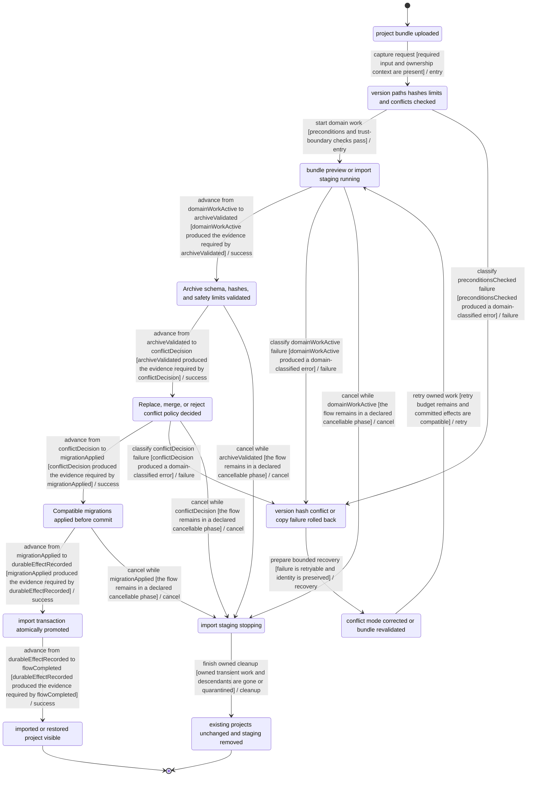
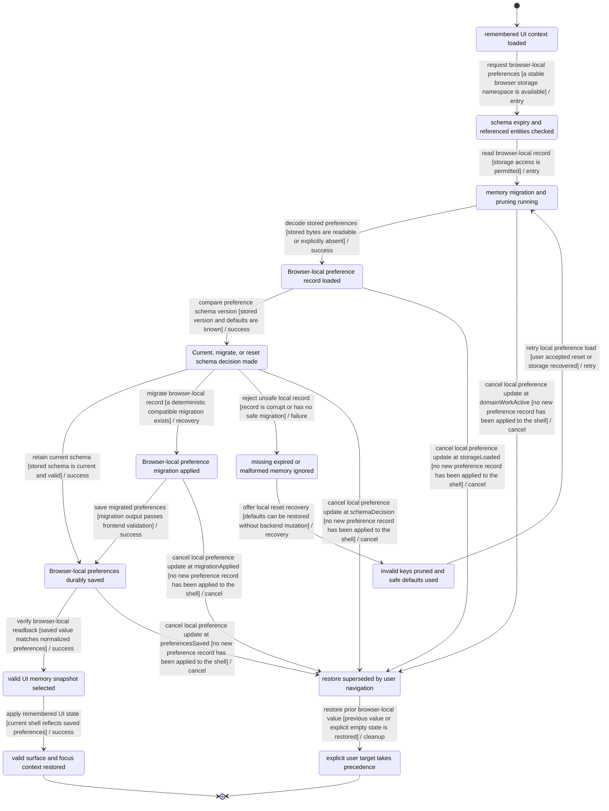
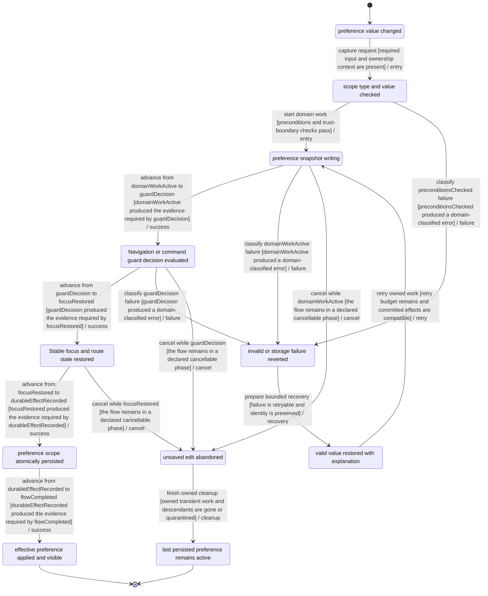
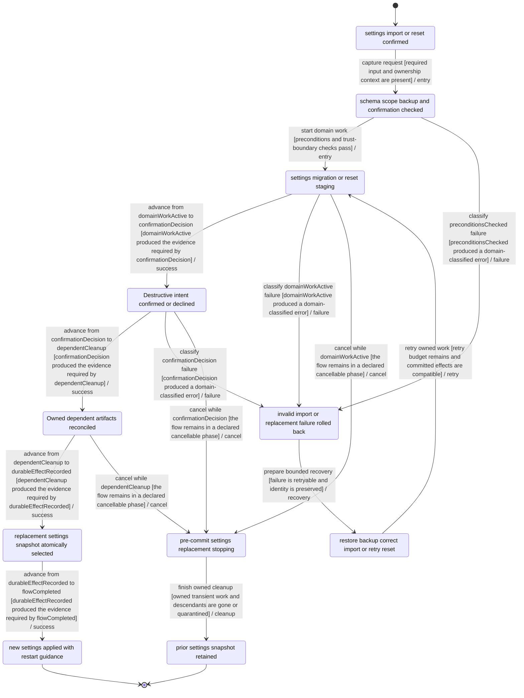

```mermaid
stateDiagram-v2
  state "health or diagnostics view requested" as DIAGNOSTICS_001_REQUESTCAPTURED
  state "probe class and disclosure policy checked" as DIAGNOSTICS_001_PRECONDITIONSCHECKED
  state "bounded passive probes collecting" as DIAGNOSTICS_001_DOMAINWORKACTIVE
  state "timestamped diagnostic snapshot assembled" as DIAGNOSTICS_001_DURABLEEFFECTRECORDED
  state "redacted readiness and degraded status visible" as DIAGNOSTICS_001_FLOWCOMPLETED
  state "probe timeout or unavailable tool classified" as DIAGNOSTICS_001_CLASSIFIEDFAILURE
  state "diagnostic probes terminating" as DIAGNOSTICS_001_CLEANUPINPROGRESS
  state "prior diagnostic snapshot retained" as DIAGNOSTICS_001_CANCELEDCLEAN
  state "manual setup action or degraded mode offered" as DIAGNOSTICS_001_RECOVERYCONTEXTREADY
  state "Bounded diagnostic probe is running" as DIAGNOSTICS_001_PROBERUNNING
  state "Healthy, degraded, or unavailable condition decided" as DIAGNOSTICS_001_DEGRADEDDECISION
  state "Actionable operator next step emitted" as DIAGNOSTICS_001_OPERATORACTION
  [*] --> DIAGNOSTICS_001_REQUESTCAPTURED
  DIAGNOSTICS_001_REQUESTCAPTURED --> DIAGNOSTICS_001_PRECONDITIONSCHECKED: capture request [required input and ownership context are present] / entry
  DIAGNOSTICS_001_PRECONDITIONSCHECKED --> DIAGNOSTICS_001_DOMAINWORKACTIVE: start domain work [preconditions and trust-boundary checks pass] / entry
  DIAGNOSTICS_001_DOMAINWORKACTIVE --> DIAGNOSTICS_001_PROBERUNNING: advance from domainWorkActive to probeRunning [domainWorkActive produced the evidence required by probeRunning] / success
  DIAGNOSTICS_001_PROBERUNNING --> DIAGNOSTICS_001_DEGRADEDDECISION: advance from probeRunning to degradedDecision [probeRunning produced the evidence required by degradedDecision] / success
  DIAGNOSTICS_001_DEGRADEDDECISION --> DIAGNOSTICS_001_OPERATORACTION: advance from degradedDecision to operatorAction [degradedDecision produced the evidence required by operatorAction] / success
  DIAGNOSTICS_001_OPERATORACTION --> DIAGNOSTICS_001_DURABLEEFFECTRECORDED: advance from operatorAction to durableEffectRecorded [operatorAction produced the evidence required by durableEffectRecorded] / success
  DIAGNOSTICS_001_DURABLEEFFECTRECORDED --> DIAGNOSTICS_001_FLOWCOMPLETED: advance from durableEffectRecorded to flowCompleted [durableEffectRecorded produced the evidence required by flowCompleted] / success
  DIAGNOSTICS_001_PRECONDITIONSCHECKED --> DIAGNOSTICS_001_CLASSIFIEDFAILURE: classify preconditionsChecked failure [preconditionsChecked produced a domain-classified error] / failure
  DIAGNOSTICS_001_DOMAINWORKACTIVE --> DIAGNOSTICS_001_CLASSIFIEDFAILURE: classify domainWorkActive failure [domainWorkActive produced a domain-classified error] / failure
  DIAGNOSTICS_001_DEGRADEDDECISION --> DIAGNOSTICS_001_CLASSIFIEDFAILURE: classify degradedDecision failure [degradedDecision produced a domain-classified error] / failure
  DIAGNOSTICS_001_CLASSIFIEDFAILURE --> DIAGNOSTICS_001_RECOVERYCONTEXTREADY: prepare bounded recovery [failure is retryable and identity is preserved] / recovery
  DIAGNOSTICS_001_RECOVERYCONTEXTREADY --> DIAGNOSTICS_001_DOMAINWORKACTIVE: retry owned work [retry budget remains and committed effects are compatible] / retry
  DIAGNOSTICS_001_DOMAINWORKACTIVE --> DIAGNOSTICS_001_CLEANUPINPROGRESS: cancel while domainWorkActive [the flow remains in a declared cancellable phase] / cancel
  DIAGNOSTICS_001_PROBERUNNING --> DIAGNOSTICS_001_CLEANUPINPROGRESS: cancel while probeRunning [the flow remains in a declared cancellable phase] / cancel
  DIAGNOSTICS_001_DEGRADEDDECISION --> DIAGNOSTICS_001_CLEANUPINPROGRESS: cancel while degradedDecision [the flow remains in a declared cancellable phase] / cancel
  DIAGNOSTICS_001_OPERATORACTION --> DIAGNOSTICS_001_CLEANUPINPROGRESS: cancel while operatorAction [the flow remains in a declared cancellable phase] / cancel
  DIAGNOSTICS_001_CLEANUPINPROGRESS --> DIAGNOSTICS_001_CANCELEDCLEAN: finish owned cleanup [owned transient work and descendants are gone or quarantined] / cleanup
  DIAGNOSTICS_001_FLOWCOMPLETED --> [*]
  DIAGNOSTICS_001_CANCELEDCLEAN --> [*]
```

# Runtime, data, and security flow contracts

Capabilities, portability, preferences, recovery, trust boundaries, and diagnostics contracts.

Generated from `manifest.json` by `pnpm validate:flows`; do not hand-edit.

## CAPABILITY-ACTIVATE-001 — Capability acquisition, credentials, and model or tool activation

- Primary owner: `runtime-platform`
- Architecture family: `review-decision`
- Shared subgraphs: `classified-failure-retry`, `cancellable-cleanup`
- Secondary owners: none
- Shared concerns: `RECOVERY`, `LOCAL_ORIGIN_AUTH`, `FILESYSTEM`, `SUBPROCESS`, `NETWORK_EGRESS`, `CREDENTIALS_SECRETS`, `PRIVACY`, `ACCESSIBILITY`, `PERFORMANCE_TELEMETRY`, `OPERATIONAL_STATUS`

### Route ownership

- `DELETE /api/voice-profile-credentials/hugging-face-token`
- `GET /api/research-modules`
- `GET /api/voice-profile-credentials`
- `POST /api/research-modules/:id/clone`
- `PUT /api/voice-profile-credentials/hugging-face-token`

### State contract

| State | Label | Kind | Authority | UI observable |
| --- | --- | --- | --- | --- |
| `CAPABILITY_ACTIVATE_001_REQUESTCAPTURED` | capability activation explicitly requested | `stable` | `frontend` | UI shows capability activation explicitly requested |
| `CAPABILITY_ACTIVATE_001_PRECONDITIONSCHECKED` | consent credential destination and prerequisites checked | `stable` | `backend` | UI shows validation progress for capability activation |
| `CAPABILITY_ACTIVATE_001_DOMAINWORKACTIVE` | clone download or credential save running | `transient` | `backend` | UI shows clone download or credential save running |
| `CAPABILITY_ACTIVATE_001_DURABLEEFFECTRECORDED` | capability or secret reference atomically activated | `stable` | `backend` | UI shows committed capability activation state |
| `CAPABILITY_ACTIVATE_001_FLOWCOMPLETED` | requested capability reported ready | `terminal-success` | `shared` | UI shows requested capability reported ready |
| `CAPABILITY_ACTIVATE_001_CLASSIFIEDFAILURE` | authentication setup download or validation failed | `stable-failure` | `backend` | UI explains authentication setup download or validation failed |
| `CAPABILITY_ACTIVATE_001_CLEANUPINPROGRESS` | network and subprocess work terminating | `transient` | `backend` | UI shows network and subprocess work terminating |
| `CAPABILITY_ACTIVATE_001_CANCELEDCLEAN` | partial capability quarantined or removed | `terminal-canceled` | `shared` | UI shows partial capability quarantined or removed |
| `CAPABILITY_ACTIVATE_001_RECOVERYCONTEXTREADY` | resume reauthenticate or local fallback offered | `stable` | `shared` | UI offers resume reauthenticate or local fallback offered |
| `CAPABILITY_ACTIVATE_001_AUDITIONREADY` | Review or audition material ready | `stable` | `shared` | Review or audition material ready; the UI exposes this state or an actionable non-visual status. |
| `CAPABILITY_ACTIVATE_001_REVIEWDECISION` | Accept, change, or skip decision visible | `stable` | `frontend` | Accept, change, or skip decision visible; the UI exposes this state or an actionable non-visual status. |
| `CAPABILITY_ACTIVATE_001_CHANGEREQUESTED` | Requested change returned to active preparation | `transient` | `shared` | Requested change returned to active preparation; the UI exposes this state or an actionable non-visual status. |

### Semantic roles

- `requestCaptured` → `CAPABILITY_ACTIVATE_001_REQUESTCAPTURED`
- `preconditionsChecked` → `CAPABILITY_ACTIVATE_001_PRECONDITIONSCHECKED`
- `domainWorkActive` → `CAPABILITY_ACTIVATE_001_DOMAINWORKACTIVE`
- `durableEffectRecorded` → `CAPABILITY_ACTIVATE_001_DURABLEEFFECTRECORDED`
- `flowCompleted` → `CAPABILITY_ACTIVATE_001_FLOWCOMPLETED`
- `classifiedFailure` → `CAPABILITY_ACTIVATE_001_CLASSIFIEDFAILURE`
- `cleanupInProgress` → `CAPABILITY_ACTIVATE_001_CLEANUPINPROGRESS`
- `canceledClean` → `CAPABILITY_ACTIVATE_001_CANCELEDCLEAN`
- `recoveryContextReady` → `CAPABILITY_ACTIVATE_001_RECOVERYCONTEXTREADY`
- `auditionReady` → `CAPABILITY_ACTIVATE_001_AUDITIONREADY`
- `reviewDecision` → `CAPABILITY_ACTIVATE_001_REVIEWDECISION`
- `changeRequested` → `CAPABILITY_ACTIVATE_001_CHANGEREQUESTED`

### Required decisions

- **reviewDecision** at `CAPABILITY_ACTIVATE_001_REVIEWDECISION`: `continue` → `CAPABILITY-ACTIVATE-001:T05:success`, `reject` → `CAPABILITY-ACTIVATE-001:T10:failure`, `cancel` → `CAPABILITY-ACTIVATE-001:T15:cancel`

### Family and flow invariants

- Every review-decision flow exposes its required roles as canonical states.
- Every review-decision decision has named outgoing outcomes bound to transition IDs.
- CAPABILITY-ACTIVATE-001 commit is not reached until capability or secret reference atomically activated
- CAPABILITY-ACTIVATE-001 cancellation phases equal ordinary cancel-edge sources exactly.

### Transitions

| ID | From | To | Event | Guard | Branch |
| --- | --- | --- | --- | --- | --- |
| `CAPABILITY-ACTIVATE-001:T01:entry` | `CAPABILITY_ACTIVATE_001_REQUESTCAPTURED` | `CAPABILITY_ACTIVATE_001_PRECONDITIONSCHECKED` | capture request | required input and ownership context are present | `entry` |
| `CAPABILITY-ACTIVATE-001:T02:entry` | `CAPABILITY_ACTIVATE_001_PRECONDITIONSCHECKED` | `CAPABILITY_ACTIVATE_001_DOMAINWORKACTIVE` | start domain work | preconditions and trust-boundary checks pass | `entry` |
| `CAPABILITY-ACTIVATE-001:T03:success` | `CAPABILITY_ACTIVATE_001_DOMAINWORKACTIVE` | `CAPABILITY_ACTIVATE_001_AUDITIONREADY` | advance from domainWorkActive to auditionReady | domainWorkActive produced the evidence required by auditionReady | `success` |
| `CAPABILITY-ACTIVATE-001:T04:success` | `CAPABILITY_ACTIVATE_001_AUDITIONREADY` | `CAPABILITY_ACTIVATE_001_REVIEWDECISION` | advance from auditionReady to reviewDecision | auditionReady produced the evidence required by reviewDecision | `success` |
| `CAPABILITY-ACTIVATE-001:T05:success` | `CAPABILITY_ACTIVATE_001_REVIEWDECISION` | `CAPABILITY_ACTIVATE_001_CHANGEREQUESTED` | advance from reviewDecision to changeRequested | reviewDecision produced the evidence required by changeRequested | `success` |
| `CAPABILITY-ACTIVATE-001:T06:success` | `CAPABILITY_ACTIVATE_001_CHANGEREQUESTED` | `CAPABILITY_ACTIVATE_001_DURABLEEFFECTRECORDED` | advance from changeRequested to durableEffectRecorded | changeRequested produced the evidence required by durableEffectRecorded | `success` |
| `CAPABILITY-ACTIVATE-001:T07:success` | `CAPABILITY_ACTIVATE_001_DURABLEEFFECTRECORDED` | `CAPABILITY_ACTIVATE_001_FLOWCOMPLETED` | advance from durableEffectRecorded to flowCompleted | durableEffectRecorded produced the evidence required by flowCompleted | `success` |
| `CAPABILITY-ACTIVATE-001:T08:failure` | `CAPABILITY_ACTIVATE_001_PRECONDITIONSCHECKED` | `CAPABILITY_ACTIVATE_001_CLASSIFIEDFAILURE` | classify preconditionsChecked failure | preconditionsChecked produced a domain-classified error | `failure` |
| `CAPABILITY-ACTIVATE-001:T09:failure` | `CAPABILITY_ACTIVATE_001_DOMAINWORKACTIVE` | `CAPABILITY_ACTIVATE_001_CLASSIFIEDFAILURE` | classify domainWorkActive failure | domainWorkActive produced a domain-classified error | `failure` |
| `CAPABILITY-ACTIVATE-001:T10:failure` | `CAPABILITY_ACTIVATE_001_REVIEWDECISION` | `CAPABILITY_ACTIVATE_001_CLASSIFIEDFAILURE` | classify reviewDecision failure | reviewDecision produced a domain-classified error | `failure` |
| `CAPABILITY-ACTIVATE-001:T11:recovery` | `CAPABILITY_ACTIVATE_001_CLASSIFIEDFAILURE` | `CAPABILITY_ACTIVATE_001_RECOVERYCONTEXTREADY` | prepare bounded recovery | failure is retryable and identity is preserved | `recovery` |
| `CAPABILITY-ACTIVATE-001:T12:retry` | `CAPABILITY_ACTIVATE_001_RECOVERYCONTEXTREADY` | `CAPABILITY_ACTIVATE_001_DOMAINWORKACTIVE` | retry owned work | retry budget remains and committed effects are compatible | `retry` |
| `CAPABILITY-ACTIVATE-001:T13:cancel` | `CAPABILITY_ACTIVATE_001_DOMAINWORKACTIVE` | `CAPABILITY_ACTIVATE_001_CLEANUPINPROGRESS` | cancel while domainWorkActive | the flow remains in a declared cancellable phase | `cancel` |
| `CAPABILITY-ACTIVATE-001:T14:cancel` | `CAPABILITY_ACTIVATE_001_AUDITIONREADY` | `CAPABILITY_ACTIVATE_001_CLEANUPINPROGRESS` | cancel while auditionReady | the flow remains in a declared cancellable phase | `cancel` |
| `CAPABILITY-ACTIVATE-001:T15:cancel` | `CAPABILITY_ACTIVATE_001_REVIEWDECISION` | `CAPABILITY_ACTIVATE_001_CLEANUPINPROGRESS` | cancel while reviewDecision | the flow remains in a declared cancellable phase | `cancel` |
| `CAPABILITY-ACTIVATE-001:T16:cancel` | `CAPABILITY_ACTIVATE_001_CHANGEREQUESTED` | `CAPABILITY_ACTIVATE_001_CLEANUPINPROGRESS` | cancel while changeRequested | the flow remains in a declared cancellable phase | `cancel` |
| `CAPABILITY-ACTIVATE-001:T17:cleanup` | `CAPABILITY_ACTIVATE_001_CLEANUPINPROGRESS` | `CAPABILITY_ACTIVATE_001_CANCELEDCLEAN` | finish owned cleanup | owned transient work and descendants are gone or quarantined | `cleanup` |

### Evidence

- `frontend/src/features/provider-capabilities/providerCapabilityMatrix.test.ts` — Executable source anchors only; no transition closure is claimed without a FLOW_ASSERT marker.
  - `explains unsupported provider actions with the provider label` — transitions: none (source anchor only)
  - `maps playback-like actions onto provider capabilities` — transitions: none (source anchor only)

### Planned transition evidence

- `CAPABILITY-ACTIVATE-001:T01:entry`, `CAPABILITY-ACTIVATE-001:T02:entry`, `CAPABILITY-ACTIVATE-001:T03:success`, `CAPABILITY-ACTIVATE-001:T04:success`, `CAPABILITY-ACTIVATE-001:T05:success`, `CAPABILITY-ACTIVATE-001:T06:success`, `CAPABILITY-ACTIVATE-001:T07:success`, `CAPABILITY-ACTIVATE-001:T08:failure`, `CAPABILITY-ACTIVATE-001:T09:failure`, `CAPABILITY-ACTIVATE-001:T10:failure`, `CAPABILITY-ACTIVATE-001:T11:recovery`, `CAPABILITY-ACTIVATE-001:T12:retry`, `CAPABILITY-ACTIVATE-001:T13:cancel`, `CAPABILITY-ACTIVATE-001:T14:cancel`, `CAPABILITY-ACTIVATE-001:T15:cancel`, `CAPABILITY-ACTIVATE-001:T16:cancel`, `CAPABILITY-ACTIVATE-001:T17:cleanup` → `BIC-07`; verify with `mise exec -- pnpm --dir frontend exec vitest run frontend/src/features/provider-capabilities/providerCapabilityMatrix.test.ts` — Owner issue must add transition-specific executable FLOW_ASSERT markers and assertions before closeout.

### Mermaid

## EXPORT-BUNDLE-001 — Project export bundle creation and verification

- Primary owner: `project-data`
- Architecture family: `portability`
- Shared subgraphs: `classified-failure-retry`, `cancellable-cleanup`
- Secondary owners: none
- Shared concerns: `RECOVERY`, `LOCAL_ORIGIN_AUTH`, `FILESYSTEM`, `PRIVACY`, `ACCESSIBILITY`, `PERFORMANCE_TELEMETRY`, `OPERATIONAL_STATUS`

### Route ownership

- `GET /api/projects/:id/bundle`
- `GET /api/projects/:id/bundle/summary`

### State contract

| State | Label | Kind | Authority | UI observable |
| --- | --- | --- | --- | --- |
| `EXPORT_BUNDLE_001_REQUESTCAPTURED` | project export requested | `stable` | `frontend` | UI shows project export requested |
| `EXPORT_BUNDLE_001_PRECONDITIONSCHECKED` | project snapshot and audio inclusion checked | `stable` | `backend` | UI shows validation progress for project export |
| `EXPORT_BUNDLE_001_DOMAINWORKACTIVE` | bundle hashing and ZIP creation running | `transient` | `backend` | UI shows bundle hashing and ZIP creation running |
| `EXPORT_BUNDLE_001_DURABLEEFFECTRECORDED` | verified export ZIP finalized | `stable` | `backend` | UI shows committed project export state |
| `EXPORT_BUNDLE_001_FLOWCOMPLETED` | downloadable verified bundle served | `terminal-success` | `shared` | UI shows downloadable verified bundle served |
| `EXPORT_BUNDLE_001_CLASSIFIEDFAILURE` | missing read hash or ZIP failure shown | `stable-failure` | `backend` | UI explains missing read hash or ZIP failure shown |
| `EXPORT_BUNDLE_001_CLEANUPINPROGRESS` | bundle writer stopping | `transient` | `backend` | UI shows bundle writer stopping |
| `EXPORT_BUNDLE_001_CANCELEDCLEAN` | partial export ZIP removed | `terminal-canceled` | `shared` | UI shows partial export ZIP removed |
| `EXPORT_BUNDLE_001_RECOVERYCONTEXTREADY` | retry or export without missing optional audio | `stable` | `shared` | UI offers retry or export without missing optional audio |
| `EXPORT_BUNDLE_001_ARCHIVEVALIDATED` | Archive schema, hashes, and safety limits validated | `stable` | `backend` | Archive schema, hashes, and safety limits validated; the UI exposes this state or an actionable non-visual status. |
| `EXPORT_BUNDLE_001_CONFLICTDECISION` | Replace, merge, or reject conflict policy decided | `stable` | `shared` | Replace, merge, or reject conflict policy decided; the UI exposes this state or an actionable non-visual status. |
| `EXPORT_BUNDLE_001_MIGRATIONAPPLIED` | Compatible migrations applied before commit | `stable` | `backend` | Compatible migrations applied before commit; the UI exposes this state or an actionable non-visual status. |

### Semantic roles

- `requestCaptured` → `EXPORT_BUNDLE_001_REQUESTCAPTURED`
- `preconditionsChecked` → `EXPORT_BUNDLE_001_PRECONDITIONSCHECKED`
- `domainWorkActive` → `EXPORT_BUNDLE_001_DOMAINWORKACTIVE`
- `durableEffectRecorded` → `EXPORT_BUNDLE_001_DURABLEEFFECTRECORDED`
- `flowCompleted` → `EXPORT_BUNDLE_001_FLOWCOMPLETED`
- `classifiedFailure` → `EXPORT_BUNDLE_001_CLASSIFIEDFAILURE`
- `cleanupInProgress` → `EXPORT_BUNDLE_001_CLEANUPINPROGRESS`
- `canceledClean` → `EXPORT_BUNDLE_001_CANCELEDCLEAN`
- `recoveryContextReady` → `EXPORT_BUNDLE_001_RECOVERYCONTEXTREADY`
- `archiveValidated` → `EXPORT_BUNDLE_001_ARCHIVEVALIDATED`
- `conflictDecision` → `EXPORT_BUNDLE_001_CONFLICTDECISION`
- `migrationApplied` → `EXPORT_BUNDLE_001_MIGRATIONAPPLIED`

### Required decisions

- **conflictDecision** at `EXPORT_BUNDLE_001_CONFLICTDECISION`: `continue` → `EXPORT-BUNDLE-001:T05:success`, `reject` → `EXPORT-BUNDLE-001:T10:failure`, `cancel` → `EXPORT-BUNDLE-001:T15:cancel`

### Family and flow invariants

- Every portability flow exposes its required roles as canonical states.
- Every portability decision has named outgoing outcomes bound to transition IDs.
- EXPORT-BUNDLE-001 commit is not reached until verified export ZIP finalized
- EXPORT-BUNDLE-001 cancellation phases equal ordinary cancel-edge sources exactly.

### Transitions

| ID | From | To | Event | Guard | Branch |
| --- | --- | --- | --- | --- | --- |
| `EXPORT-BUNDLE-001:T01:entry` | `EXPORT_BUNDLE_001_REQUESTCAPTURED` | `EXPORT_BUNDLE_001_PRECONDITIONSCHECKED` | capture request | required input and ownership context are present | `entry` |
| `EXPORT-BUNDLE-001:T02:entry` | `EXPORT_BUNDLE_001_PRECONDITIONSCHECKED` | `EXPORT_BUNDLE_001_DOMAINWORKACTIVE` | start domain work | preconditions and trust-boundary checks pass | `entry` |
| `EXPORT-BUNDLE-001:T03:success` | `EXPORT_BUNDLE_001_DOMAINWORKACTIVE` | `EXPORT_BUNDLE_001_ARCHIVEVALIDATED` | advance from domainWorkActive to archiveValidated | domainWorkActive produced the evidence required by archiveValidated | `success` |
| `EXPORT-BUNDLE-001:T04:success` | `EXPORT_BUNDLE_001_ARCHIVEVALIDATED` | `EXPORT_BUNDLE_001_CONFLICTDECISION` | advance from archiveValidated to conflictDecision | archiveValidated produced the evidence required by conflictDecision | `success` |
| `EXPORT-BUNDLE-001:T05:success` | `EXPORT_BUNDLE_001_CONFLICTDECISION` | `EXPORT_BUNDLE_001_MIGRATIONAPPLIED` | advance from conflictDecision to migrationApplied | conflictDecision produced the evidence required by migrationApplied | `success` |
| `EXPORT-BUNDLE-001:T06:success` | `EXPORT_BUNDLE_001_MIGRATIONAPPLIED` | `EXPORT_BUNDLE_001_DURABLEEFFECTRECORDED` | advance from migrationApplied to durableEffectRecorded | migrationApplied produced the evidence required by durableEffectRecorded | `success` |
| `EXPORT-BUNDLE-001:T07:success` | `EXPORT_BUNDLE_001_DURABLEEFFECTRECORDED` | `EXPORT_BUNDLE_001_FLOWCOMPLETED` | advance from durableEffectRecorded to flowCompleted | durableEffectRecorded produced the evidence required by flowCompleted | `success` |
| `EXPORT-BUNDLE-001:T08:failure` | `EXPORT_BUNDLE_001_PRECONDITIONSCHECKED` | `EXPORT_BUNDLE_001_CLASSIFIEDFAILURE` | classify preconditionsChecked failure | preconditionsChecked produced a domain-classified error | `failure` |
| `EXPORT-BUNDLE-001:T09:failure` | `EXPORT_BUNDLE_001_DOMAINWORKACTIVE` | `EXPORT_BUNDLE_001_CLASSIFIEDFAILURE` | classify domainWorkActive failure | domainWorkActive produced a domain-classified error | `failure` |
| `EXPORT-BUNDLE-001:T10:failure` | `EXPORT_BUNDLE_001_CONFLICTDECISION` | `EXPORT_BUNDLE_001_CLASSIFIEDFAILURE` | classify conflictDecision failure | conflictDecision produced a domain-classified error | `failure` |
| `EXPORT-BUNDLE-001:T11:recovery` | `EXPORT_BUNDLE_001_CLASSIFIEDFAILURE` | `EXPORT_BUNDLE_001_RECOVERYCONTEXTREADY` | prepare bounded recovery | failure is retryable and identity is preserved | `recovery` |
| `EXPORT-BUNDLE-001:T12:retry` | `EXPORT_BUNDLE_001_RECOVERYCONTEXTREADY` | `EXPORT_BUNDLE_001_DOMAINWORKACTIVE` | retry owned work | retry budget remains and committed effects are compatible | `retry` |
| `EXPORT-BUNDLE-001:T13:cancel` | `EXPORT_BUNDLE_001_DOMAINWORKACTIVE` | `EXPORT_BUNDLE_001_CLEANUPINPROGRESS` | cancel while domainWorkActive | the flow remains in a declared cancellable phase | `cancel` |
| `EXPORT-BUNDLE-001:T14:cancel` | `EXPORT_BUNDLE_001_ARCHIVEVALIDATED` | `EXPORT_BUNDLE_001_CLEANUPINPROGRESS` | cancel while archiveValidated | the flow remains in a declared cancellable phase | `cancel` |
| `EXPORT-BUNDLE-001:T15:cancel` | `EXPORT_BUNDLE_001_CONFLICTDECISION` | `EXPORT_BUNDLE_001_CLEANUPINPROGRESS` | cancel while conflictDecision | the flow remains in a declared cancellable phase | `cancel` |
| `EXPORT-BUNDLE-001:T16:cancel` | `EXPORT_BUNDLE_001_MIGRATIONAPPLIED` | `EXPORT_BUNDLE_001_CLEANUPINPROGRESS` | cancel while migrationApplied | the flow remains in a declared cancellable phase | `cancel` |
| `EXPORT-BUNDLE-001:T17:cleanup` | `EXPORT_BUNDLE_001_CLEANUPINPROGRESS` | `EXPORT_BUNDLE_001_CANCELEDCLEAN` | finish owned cleanup | owned transient work and descendants are gone or quarantined | `cleanup` |

### Evidence

- `frontend/src/BundlePanelsHelpers.test.tsx` — Executable source anchors only; no transition closure is claimed without a FLOW_ASSERT marker.
  - `renders export generated-audio policy in the manifest review` — transitions: none (source anchor only)

### Planned transition evidence

- `EXPORT-BUNDLE-001:T01:entry`, `EXPORT-BUNDLE-001:T02:entry`, `EXPORT-BUNDLE-001:T03:success`, `EXPORT-BUNDLE-001:T04:success`, `EXPORT-BUNDLE-001:T05:success`, `EXPORT-BUNDLE-001:T06:success`, `EXPORT-BUNDLE-001:T07:success`, `EXPORT-BUNDLE-001:T08:failure`, `EXPORT-BUNDLE-001:T09:failure`, `EXPORT-BUNDLE-001:T10:failure`, `EXPORT-BUNDLE-001:T11:recovery`, `EXPORT-BUNDLE-001:T12:retry`, `EXPORT-BUNDLE-001:T13:cancel`, `EXPORT-BUNDLE-001:T14:cancel`, `EXPORT-BUNDLE-001:T15:cancel`, `EXPORT-BUNDLE-001:T16:cancel`, `EXPORT-BUNDLE-001:T17:cleanup` → `BIC-10`; verify with `mise exec -- pnpm --dir frontend exec vitest run frontend/src/BundlePanelsHelpers.test.tsx` — Owner issue must add transition-specific executable FLOW_ASSERT markers and assertions before closeout.

### Mermaid

## IMPORT-BUNDLE-001 — Bundle preview and transactional project import or restore

- Primary owner: `project-data`
- Architecture family: `portability`
- Shared subgraphs: `classified-failure-retry`, `cancellable-cleanup`
- Secondary owners: `runtime-platform`
- Shared concerns: `RECOVERY`, `LOCAL_ORIGIN_AUTH`, `FILESYSTEM`, `PRIVACY`, `ACCESSIBILITY`, `PERFORMANCE_TELEMETRY`, `OPERATIONAL_STATUS`

### Route ownership

- `POST /api/project-bundles/import`
- `POST /api/project-bundles/preview`

### State contract

| State | Label | Kind | Authority | UI observable |
| --- | --- | --- | --- | --- |
| `IMPORT_BUNDLE_001_REQUESTCAPTURED` | project bundle uploaded | `stable` | `frontend` | UI shows project bundle uploaded |
| `IMPORT_BUNDLE_001_PRECONDITIONSCHECKED` | version paths hashes limits and conflicts checked | `stable` | `backend` | UI shows validation progress for project bundle import |
| `IMPORT_BUNDLE_001_DOMAINWORKACTIVE` | bundle preview or import staging running | `transient` | `backend` | UI shows bundle preview or import staging running |
| `IMPORT_BUNDLE_001_DURABLEEFFECTRECORDED` | import transaction atomically promoted | `stable` | `backend` | UI shows committed project bundle import state |
| `IMPORT_BUNDLE_001_FLOWCOMPLETED` | imported or restored project visible | `terminal-success` | `shared` | UI shows imported or restored project visible |
| `IMPORT_BUNDLE_001_CLASSIFIEDFAILURE` | version hash conflict or copy failure rolled back | `stable-failure` | `backend` | UI explains version hash conflict or copy failure rolled back |
| `IMPORT_BUNDLE_001_CLEANUPINPROGRESS` | import staging stopping | `transient` | `backend` | UI shows import staging stopping |
| `IMPORT_BUNDLE_001_CANCELEDCLEAN` | existing projects unchanged and staging removed | `terminal-canceled` | `shared` | UI shows existing projects unchanged and staging removed |
| `IMPORT_BUNDLE_001_RECOVERYCONTEXTREADY` | conflict mode corrected or bundle revalidated | `stable` | `shared` | UI offers conflict mode corrected or bundle revalidated |
| `IMPORT_BUNDLE_001_ARCHIVEVALIDATED` | Archive schema, hashes, and safety limits validated | `stable` | `backend` | Archive schema, hashes, and safety limits validated; the UI exposes this state or an actionable non-visual status. |
| `IMPORT_BUNDLE_001_CONFLICTDECISION` | Replace, merge, or reject conflict policy decided | `stable` | `shared` | Replace, merge, or reject conflict policy decided; the UI exposes this state or an actionable non-visual status. |
| `IMPORT_BUNDLE_001_MIGRATIONAPPLIED` | Compatible migrations applied before commit | `stable` | `backend` | Compatible migrations applied before commit; the UI exposes this state or an actionable non-visual status. |

### Semantic roles

- `requestCaptured` → `IMPORT_BUNDLE_001_REQUESTCAPTURED`
- `preconditionsChecked` → `IMPORT_BUNDLE_001_PRECONDITIONSCHECKED`
- `domainWorkActive` → `IMPORT_BUNDLE_001_DOMAINWORKACTIVE`
- `durableEffectRecorded` → `IMPORT_BUNDLE_001_DURABLEEFFECTRECORDED`
- `flowCompleted` → `IMPORT_BUNDLE_001_FLOWCOMPLETED`
- `classifiedFailure` → `IMPORT_BUNDLE_001_CLASSIFIEDFAILURE`
- `cleanupInProgress` → `IMPORT_BUNDLE_001_CLEANUPINPROGRESS`
- `canceledClean` → `IMPORT_BUNDLE_001_CANCELEDCLEAN`
- `recoveryContextReady` → `IMPORT_BUNDLE_001_RECOVERYCONTEXTREADY`
- `archiveValidated` → `IMPORT_BUNDLE_001_ARCHIVEVALIDATED`
- `conflictDecision` → `IMPORT_BUNDLE_001_CONFLICTDECISION`
- `migrationApplied` → `IMPORT_BUNDLE_001_MIGRATIONAPPLIED`

### Required decisions

- **conflictDecision** at `IMPORT_BUNDLE_001_CONFLICTDECISION`: `continue` → `IMPORT-BUNDLE-001:T05:success`, `reject` → `IMPORT-BUNDLE-001:T10:failure`, `cancel` → `IMPORT-BUNDLE-001:T15:cancel`

### Family and flow invariants

- Every portability flow exposes its required roles as canonical states.
- Every portability decision has named outgoing outcomes bound to transition IDs.
- IMPORT-BUNDLE-001 commit is not reached until import transaction atomically promoted
- IMPORT-BUNDLE-001 cancellation phases equal ordinary cancel-edge sources exactly.

### Transitions

| ID | From | To | Event | Guard | Branch |
| --- | --- | --- | --- | --- | --- |
| `IMPORT-BUNDLE-001:T01:entry` | `IMPORT_BUNDLE_001_REQUESTCAPTURED` | `IMPORT_BUNDLE_001_PRECONDITIONSCHECKED` | capture request | required input and ownership context are present | `entry` |
| `IMPORT-BUNDLE-001:T02:entry` | `IMPORT_BUNDLE_001_PRECONDITIONSCHECKED` | `IMPORT_BUNDLE_001_DOMAINWORKACTIVE` | start domain work | preconditions and trust-boundary checks pass | `entry` |
| `IMPORT-BUNDLE-001:T03:success` | `IMPORT_BUNDLE_001_DOMAINWORKACTIVE` | `IMPORT_BUNDLE_001_ARCHIVEVALIDATED` | advance from domainWorkActive to archiveValidated | domainWorkActive produced the evidence required by archiveValidated | `success` |
| `IMPORT-BUNDLE-001:T04:success` | `IMPORT_BUNDLE_001_ARCHIVEVALIDATED` | `IMPORT_BUNDLE_001_CONFLICTDECISION` | advance from archiveValidated to conflictDecision | archiveValidated produced the evidence required by conflictDecision | `success` |
| `IMPORT-BUNDLE-001:T05:success` | `IMPORT_BUNDLE_001_CONFLICTDECISION` | `IMPORT_BUNDLE_001_MIGRATIONAPPLIED` | advance from conflictDecision to migrationApplied | conflictDecision produced the evidence required by migrationApplied | `success` |
| `IMPORT-BUNDLE-001:T06:success` | `IMPORT_BUNDLE_001_MIGRATIONAPPLIED` | `IMPORT_BUNDLE_001_DURABLEEFFECTRECORDED` | advance from migrationApplied to durableEffectRecorded | migrationApplied produced the evidence required by durableEffectRecorded | `success` |
| `IMPORT-BUNDLE-001:T07:success` | `IMPORT_BUNDLE_001_DURABLEEFFECTRECORDED` | `IMPORT_BUNDLE_001_FLOWCOMPLETED` | advance from durableEffectRecorded to flowCompleted | durableEffectRecorded produced the evidence required by flowCompleted | `success` |
| `IMPORT-BUNDLE-001:T08:failure` | `IMPORT_BUNDLE_001_PRECONDITIONSCHECKED` | `IMPORT_BUNDLE_001_CLASSIFIEDFAILURE` | classify preconditionsChecked failure | preconditionsChecked produced a domain-classified error | `failure` |
| `IMPORT-BUNDLE-001:T09:failure` | `IMPORT_BUNDLE_001_DOMAINWORKACTIVE` | `IMPORT_BUNDLE_001_CLASSIFIEDFAILURE` | classify domainWorkActive failure | domainWorkActive produced a domain-classified error | `failure` |
| `IMPORT-BUNDLE-001:T10:failure` | `IMPORT_BUNDLE_001_CONFLICTDECISION` | `IMPORT_BUNDLE_001_CLASSIFIEDFAILURE` | classify conflictDecision failure | conflictDecision produced a domain-classified error | `failure` |
| `IMPORT-BUNDLE-001:T11:recovery` | `IMPORT_BUNDLE_001_CLASSIFIEDFAILURE` | `IMPORT_BUNDLE_001_RECOVERYCONTEXTREADY` | prepare bounded recovery | failure is retryable and identity is preserved | `recovery` |
| `IMPORT-BUNDLE-001:T12:retry` | `IMPORT_BUNDLE_001_RECOVERYCONTEXTREADY` | `IMPORT_BUNDLE_001_DOMAINWORKACTIVE` | retry owned work | retry budget remains and committed effects are compatible | `retry` |
| `IMPORT-BUNDLE-001:T13:cancel` | `IMPORT_BUNDLE_001_DOMAINWORKACTIVE` | `IMPORT_BUNDLE_001_CLEANUPINPROGRESS` | cancel while domainWorkActive | the flow remains in a declared cancellable phase | `cancel` |
| `IMPORT-BUNDLE-001:T14:cancel` | `IMPORT_BUNDLE_001_ARCHIVEVALIDATED` | `IMPORT_BUNDLE_001_CLEANUPINPROGRESS` | cancel while archiveValidated | the flow remains in a declared cancellable phase | `cancel` |
| `IMPORT-BUNDLE-001:T15:cancel` | `IMPORT_BUNDLE_001_CONFLICTDECISION` | `IMPORT_BUNDLE_001_CLEANUPINPROGRESS` | cancel while conflictDecision | the flow remains in a declared cancellable phase | `cancel` |
| `IMPORT-BUNDLE-001:T16:cancel` | `IMPORT_BUNDLE_001_MIGRATIONAPPLIED` | `IMPORT_BUNDLE_001_CLEANUPINPROGRESS` | cancel while migrationApplied | the flow remains in a declared cancellable phase | `cancel` |
| `IMPORT-BUNDLE-001:T17:cleanup` | `IMPORT_BUNDLE_001_CLEANUPINPROGRESS` | `IMPORT_BUNDLE_001_CANCELEDCLEAN` | finish owned cleanup | owned transient work and descendants are gone or quarantined | `cleanup` |

### Evidence

- `frontend/src/BundlePanelsHelpers.test.tsx` — Executable source anchors only; no transition closure is claimed without a FLOW_ASSERT marker.
  - `renders import validation, dependencies, conflicts, and exclusions` — transitions: none (source anchor only)

### Planned transition evidence

- `IMPORT-BUNDLE-001:T01:entry`, `IMPORT-BUNDLE-001:T02:entry`, `IMPORT-BUNDLE-001:T03:success`, `IMPORT-BUNDLE-001:T04:success`, `IMPORT-BUNDLE-001:T05:success`, `IMPORT-BUNDLE-001:T06:success`, `IMPORT-BUNDLE-001:T07:success`, `IMPORT-BUNDLE-001:T08:failure`, `IMPORT-BUNDLE-001:T09:failure`, `IMPORT-BUNDLE-001:T10:failure`, `IMPORT-BUNDLE-001:T11:recovery`, `IMPORT-BUNDLE-001:T12:retry`, `IMPORT-BUNDLE-001:T13:cancel`, `IMPORT-BUNDLE-001:T14:cancel`, `IMPORT-BUNDLE-001:T15:cancel`, `IMPORT-BUNDLE-001:T16:cancel`, `IMPORT-BUNDLE-001:T17:cleanup` → `BIC-10`; verify with `mise exec -- pnpm --dir frontend exec vitest run frontend/src/BundlePanelsHelpers.test.tsx` — Owner issue must add transition-specific executable FLOW_ASSERT markers and assertions before closeout.

### Mermaid

## UI-MEMORY-001 — UI memory validation, pruning, and restoration

- Primary owner: `experience`
- Architecture family: `ui-memory`
- Shared subgraphs: `classified-failure-retry`, `cancellable-cleanup`
- Secondary owners: none
- Shared concerns: `RECOVERY`, `ACCESSIBILITY`, `PRIVACY`, `I18N`, `OPERATIONAL_STATUS`

### Route ownership

- none

### State contract

| State | Label | Kind | Authority | UI observable |
| --- | --- | --- | --- | --- |
| `UI_MEMORY_001_REQUESTCAPTURED` | remembered UI context loaded | `stable` | `frontend` | UI shows remembered UI context loaded |
| `UI_MEMORY_001_PRECONDITIONSCHECKED` | schema expiry and referenced entities checked | `stable` | `frontend` | UI shows validation progress for UI memory restoration |
| `UI_MEMORY_001_DOMAINWORKACTIVE` | memory migration and pruning running | `transient` | `frontend` | UI shows memory migration and pruning running |
| `UI_MEMORY_001_DURABLEEFFECTRECORDED` | valid UI memory snapshot selected | `stable` | `frontend` | UI shows committed UI memory restoration state |
| `UI_MEMORY_001_FLOWCOMPLETED` | valid surface and focus context restored | `terminal-success` | `frontend` | UI shows valid surface and focus context restored |
| `UI_MEMORY_001_CLASSIFIEDFAILURE` | missing expired or malformed memory ignored | `stable-failure` | `frontend` | UI explains missing expired or malformed memory ignored |
| `UI_MEMORY_001_CLEANUPINPROGRESS` | restore superseded by user navigation | `transient` | `frontend` | UI shows restore superseded by user navigation |
| `UI_MEMORY_001_CANCELEDCLEAN` | explicit user target takes precedence | `terminal-canceled` | `frontend` | UI shows explicit user target takes precedence |
| `UI_MEMORY_001_RECOVERYCONTEXTREADY` | invalid keys pruned and safe defaults used | `stable` | `frontend` | UI offers invalid keys pruned and safe defaults used |
| `UI_MEMORY_001_STORAGELOADED` | Browser-local preference record loaded | `stable` | `frontend` | Browser-local preference record loaded; the UI exposes this state or an actionable non-visual status. |
| `UI_MEMORY_001_SCHEMADECISION` | Current, migrate, or reset schema decision made | `stable` | `frontend` | Current, migrate, or reset schema decision made; the UI exposes this state or an actionable non-visual status. |
| `UI_MEMORY_001_MIGRATIONAPPLIED` | Browser-local preference migration applied | `stable` | `frontend` | Browser-local preference migration applied; the UI exposes this state or an actionable non-visual status. |
| `UI_MEMORY_001_PREFERENCESSAVED` | Browser-local preferences durably saved | `stable` | `frontend` | Browser-local preferences durably saved; the UI exposes this state or an actionable non-visual status. |

### Semantic roles

- `requestCaptured` → `UI_MEMORY_001_REQUESTCAPTURED`
- `preconditionsChecked` → `UI_MEMORY_001_PRECONDITIONSCHECKED`
- `domainWorkActive` → `UI_MEMORY_001_DOMAINWORKACTIVE`
- `durableEffectRecorded` → `UI_MEMORY_001_DURABLEEFFECTRECORDED`
- `flowCompleted` → `UI_MEMORY_001_FLOWCOMPLETED`
- `classifiedFailure` → `UI_MEMORY_001_CLASSIFIEDFAILURE`
- `cleanupInProgress` → `UI_MEMORY_001_CLEANUPINPROGRESS`
- `canceledClean` → `UI_MEMORY_001_CANCELEDCLEAN`
- `recoveryContextReady` → `UI_MEMORY_001_RECOVERYCONTEXTREADY`
- `storageLoaded` → `UI_MEMORY_001_STORAGELOADED`
- `schemaDecision` → `UI_MEMORY_001_SCHEMADECISION`
- `migrationApplied` → `UI_MEMORY_001_MIGRATIONAPPLIED`
- `preferencesSaved` → `UI_MEMORY_001_PREFERENCESSAVED`

### Required decisions

- **current-migrate-reset** at `UI_MEMORY_001_SCHEMADECISION`: `current` → `UI-MEMORY-001:T05:success`, `migrate` → `UI-MEMORY-001:T06:recovery`, `reset` → `UI-MEMORY-001:T07:failure`

### Family and flow invariants

- Every ui-memory flow exposes its required roles as canonical states.
- Every ui-memory decision has named outgoing outcomes bound to transition IDs.
- UI-MEMORY-001 commit is not reached until valid UI memory snapshot selected
- UI-MEMORY-001 cancellation phases equal ordinary cancel-edge sources exactly.

### Transitions

| ID | From | To | Event | Guard | Branch |
| --- | --- | --- | --- | --- | --- |
| `UI-MEMORY-001:T01:entry` | `UI_MEMORY_001_REQUESTCAPTURED` | `UI_MEMORY_001_PRECONDITIONSCHECKED` | request browser-local preferences | a stable browser storage namespace is available | `entry` |
| `UI-MEMORY-001:T02:entry` | `UI_MEMORY_001_PRECONDITIONSCHECKED` | `UI_MEMORY_001_DOMAINWORKACTIVE` | read browser-local record | storage access is permitted | `entry` |
| `UI-MEMORY-001:T03:success` | `UI_MEMORY_001_DOMAINWORKACTIVE` | `UI_MEMORY_001_STORAGELOADED` | decode stored preferences | stored bytes are readable or explicitly absent | `success` |
| `UI-MEMORY-001:T04:success` | `UI_MEMORY_001_STORAGELOADED` | `UI_MEMORY_001_SCHEMADECISION` | compare preference schema version | stored version and defaults are known | `success` |
| `UI-MEMORY-001:T05:success` | `UI_MEMORY_001_SCHEMADECISION` | `UI_MEMORY_001_PREFERENCESSAVED` | retain current schema | stored schema is current and valid | `success` |
| `UI-MEMORY-001:T06:recovery` | `UI_MEMORY_001_SCHEMADECISION` | `UI_MEMORY_001_MIGRATIONAPPLIED` | migrate browser-local record | a deterministic compatible migration exists | `recovery` |
| `UI-MEMORY-001:T07:failure` | `UI_MEMORY_001_SCHEMADECISION` | `UI_MEMORY_001_CLASSIFIEDFAILURE` | reject unsafe local record | record is corrupt or has no safe migration | `failure` |
| `UI-MEMORY-001:T08:success` | `UI_MEMORY_001_MIGRATIONAPPLIED` | `UI_MEMORY_001_PREFERENCESSAVED` | save migrated preferences | migration output passes frontend validation | `success` |
| `UI-MEMORY-001:T09:success` | `UI_MEMORY_001_PREFERENCESSAVED` | `UI_MEMORY_001_DURABLEEFFECTRECORDED` | verify browser-local readback | saved value matches normalized preferences | `success` |
| `UI-MEMORY-001:T10:success` | `UI_MEMORY_001_DURABLEEFFECTRECORDED` | `UI_MEMORY_001_FLOWCOMPLETED` | apply remembered UI state | current shell reflects saved preferences | `success` |
| `UI-MEMORY-001:T11:recovery` | `UI_MEMORY_001_CLASSIFIEDFAILURE` | `UI_MEMORY_001_RECOVERYCONTEXTREADY` | offer local reset recovery | defaults can be restored without backend mutation | `recovery` |
| `UI-MEMORY-001:T12:retry` | `UI_MEMORY_001_RECOVERYCONTEXTREADY` | `UI_MEMORY_001_DOMAINWORKACTIVE` | retry local preference load | user accepted reset or storage recovered | `retry` |
| `UI-MEMORY-001:T13:cancel` | `UI_MEMORY_001_DOMAINWORKACTIVE` | `UI_MEMORY_001_CLEANUPINPROGRESS` | cancel local preference update at domainWorkActive | no new preference record has been applied to the shell | `cancel` |
| `UI-MEMORY-001:T14:cancel` | `UI_MEMORY_001_STORAGELOADED` | `UI_MEMORY_001_CLEANUPINPROGRESS` | cancel local preference update at storageLoaded | no new preference record has been applied to the shell | `cancel` |
| `UI-MEMORY-001:T15:cancel` | `UI_MEMORY_001_SCHEMADECISION` | `UI_MEMORY_001_CLEANUPINPROGRESS` | cancel local preference update at schemaDecision | no new preference record has been applied to the shell | `cancel` |
| `UI-MEMORY-001:T16:cancel` | `UI_MEMORY_001_MIGRATIONAPPLIED` | `UI_MEMORY_001_CLEANUPINPROGRESS` | cancel local preference update at migrationApplied | no new preference record has been applied to the shell | `cancel` |
| `UI-MEMORY-001:T17:cancel` | `UI_MEMORY_001_PREFERENCESSAVED` | `UI_MEMORY_001_CLEANUPINPROGRESS` | cancel local preference update at preferencesSaved | no new preference record has been applied to the shell | `cancel` |
| `UI-MEMORY-001:T18:cleanup` | `UI_MEMORY_001_CLEANUPINPROGRESS` | `UI_MEMORY_001_CANCELEDCLEAN` | restore prior browser-local value | previous value or explicit empty state is restored | `cleanup` |

### Evidence

- `frontend/src/features/preferences/model.test.ts` — Executable source anchors only; no transition closure is claimed without a FLOW_ASSERT marker.
  - `defaults memory off and resolves documented layout defaults` — transitions: none (source anchor only)
  - `persists project layout before local layout defaults when memory is enabled` — transitions: none (source anchor only)
  - `persists disclosure panel pins only when panel memory is enabled` — transitions: none (source anchor only)
  - `does not persist remembered layout details while memory is disabled` — transitions: none (source anchor only)
  - `normalizes corrupt storage and removes the legacy workspace layout key` — transitions: none (source anchor only)
  - `migrates legacy workspace layout as an opt-in default without enabling memory` — transitions: none (source anchor only)
  - `normalizes and persists Studio tutorial launcher visibility` — transitions: none (source anchor only)

### Planned transition evidence

- `UI-MEMORY-001:T01:entry`, `UI-MEMORY-001:T02:entry`, `UI-MEMORY-001:T03:success`, `UI-MEMORY-001:T04:success`, `UI-MEMORY-001:T05:success`, `UI-MEMORY-001:T06:recovery`, `UI-MEMORY-001:T07:failure`, `UI-MEMORY-001:T08:success`, `UI-MEMORY-001:T09:success`, `UI-MEMORY-001:T10:success`, `UI-MEMORY-001:T11:recovery`, `UI-MEMORY-001:T12:retry`, `UI-MEMORY-001:T13:cancel`, `UI-MEMORY-001:T14:cancel`, `UI-MEMORY-001:T15:cancel`, `UI-MEMORY-001:T16:cancel`, `UI-MEMORY-001:T17:cancel`, `UI-MEMORY-001:T18:cleanup` → `BIC-10`; verify with `mise exec -- pnpm --dir frontend exec vitest run frontend/src/features/preferences/model.test.ts` — Owner issue must add transition-specific executable FLOW_ASSERT markers and assertions before closeout.

### Mermaid

## SETTINGS-001 — Ordinary scoped preference persistence

- Primary owner: `experience`
- Architecture family: `guarded-ui-command`
- Shared subgraphs: `classified-failure-retry`, `cancellable-cleanup`
- Secondary owners: none
- Shared concerns: `RECOVERY`, `ACCESSIBILITY`, `PRIVACY`, `I18N`, `OPERATIONAL_STATUS`

### Route ownership

- none

### State contract

| State | Label | Kind | Authority | UI observable |
| --- | --- | --- | --- | --- |
| `SETTINGS_001_REQUESTCAPTURED` | preference value changed | `stable` | `frontend` | UI shows preference value changed |
| `SETTINGS_001_PRECONDITIONSCHECKED` | scope type and value checked | `stable` | `backend` | UI shows validation progress for preference change |
| `SETTINGS_001_DOMAINWORKACTIVE` | preference snapshot writing | `transient` | `backend` | UI shows preference snapshot writing |
| `SETTINGS_001_DURABLEEFFECTRECORDED` | preference scope atomically persisted | `stable` | `backend` | UI shows committed preference change state |
| `SETTINGS_001_FLOWCOMPLETED` | effective preference applied and visible | `terminal-success` | `shared` | UI shows effective preference applied and visible |
| `SETTINGS_001_CLASSIFIEDFAILURE` | invalid or storage failure reverted | `stable-failure` | `backend` | UI explains invalid or storage failure reverted |
| `SETTINGS_001_CLEANUPINPROGRESS` | unsaved edit abandoned | `transient` | `backend` | UI shows unsaved edit abandoned |
| `SETTINGS_001_CANCELEDCLEAN` | last persisted preference remains active | `terminal-canceled` | `shared` | UI shows last persisted preference remains active |
| `SETTINGS_001_RECOVERYCONTEXTREADY` | valid value restored with explanation | `stable` | `shared` | UI offers valid value restored with explanation |
| `SETTINGS_001_GUARDDECISION` | Navigation or command guard decision evaluated | `stable` | `frontend` | Navigation or command guard decision evaluated; the UI exposes this state or an actionable non-visual status. |
| `SETTINGS_001_FOCUSRESTORED` | Stable focus and route state restored | `stable` | `frontend` | Stable focus and route state restored; the UI exposes this state or an actionable non-visual status. |

### Semantic roles

- `requestCaptured` → `SETTINGS_001_REQUESTCAPTURED`
- `preconditionsChecked` → `SETTINGS_001_PRECONDITIONSCHECKED`
- `domainWorkActive` → `SETTINGS_001_DOMAINWORKACTIVE`
- `durableEffectRecorded` → `SETTINGS_001_DURABLEEFFECTRECORDED`
- `flowCompleted` → `SETTINGS_001_FLOWCOMPLETED`
- `classifiedFailure` → `SETTINGS_001_CLASSIFIEDFAILURE`
- `cleanupInProgress` → `SETTINGS_001_CLEANUPINPROGRESS`
- `canceledClean` → `SETTINGS_001_CANCELEDCLEAN`
- `recoveryContextReady` → `SETTINGS_001_RECOVERYCONTEXTREADY`
- `guardDecision` → `SETTINGS_001_GUARDDECISION`
- `focusRestored` → `SETTINGS_001_FOCUSRESTORED`

### Required decisions

- **guardDecision** at `SETTINGS_001_GUARDDECISION`: `continue` → `SETTINGS-001:T04:success`, `reject` → `SETTINGS-001:T09:failure`, `cancel` → `SETTINGS-001:T13:cancel`

### Family and flow invariants

- Every guarded-ui-command flow exposes its required roles as canonical states.
- Every guarded-ui-command decision has named outgoing outcomes bound to transition IDs.
- SETTINGS-001 commit is not reached until preference scope atomically persisted
- SETTINGS-001 cancellation phases equal ordinary cancel-edge sources exactly.

### Transitions

| ID | From | To | Event | Guard | Branch |
| --- | --- | --- | --- | --- | --- |
| `SETTINGS-001:T01:entry` | `SETTINGS_001_REQUESTCAPTURED` | `SETTINGS_001_PRECONDITIONSCHECKED` | capture request | required input and ownership context are present | `entry` |
| `SETTINGS-001:T02:entry` | `SETTINGS_001_PRECONDITIONSCHECKED` | `SETTINGS_001_DOMAINWORKACTIVE` | start domain work | preconditions and trust-boundary checks pass | `entry` |
| `SETTINGS-001:T03:success` | `SETTINGS_001_DOMAINWORKACTIVE` | `SETTINGS_001_GUARDDECISION` | advance from domainWorkActive to guardDecision | domainWorkActive produced the evidence required by guardDecision | `success` |
| `SETTINGS-001:T04:success` | `SETTINGS_001_GUARDDECISION` | `SETTINGS_001_FOCUSRESTORED` | advance from guardDecision to focusRestored | guardDecision produced the evidence required by focusRestored | `success` |
| `SETTINGS-001:T05:success` | `SETTINGS_001_FOCUSRESTORED` | `SETTINGS_001_DURABLEEFFECTRECORDED` | advance from focusRestored to durableEffectRecorded | focusRestored produced the evidence required by durableEffectRecorded | `success` |
| `SETTINGS-001:T06:success` | `SETTINGS_001_DURABLEEFFECTRECORDED` | `SETTINGS_001_FLOWCOMPLETED` | advance from durableEffectRecorded to flowCompleted | durableEffectRecorded produced the evidence required by flowCompleted | `success` |
| `SETTINGS-001:T07:failure` | `SETTINGS_001_PRECONDITIONSCHECKED` | `SETTINGS_001_CLASSIFIEDFAILURE` | classify preconditionsChecked failure | preconditionsChecked produced a domain-classified error | `failure` |
| `SETTINGS-001:T08:failure` | `SETTINGS_001_DOMAINWORKACTIVE` | `SETTINGS_001_CLASSIFIEDFAILURE` | classify domainWorkActive failure | domainWorkActive produced a domain-classified error | `failure` |
| `SETTINGS-001:T09:failure` | `SETTINGS_001_GUARDDECISION` | `SETTINGS_001_CLASSIFIEDFAILURE` | classify guardDecision failure | guardDecision produced a domain-classified error | `failure` |
| `SETTINGS-001:T10:recovery` | `SETTINGS_001_CLASSIFIEDFAILURE` | `SETTINGS_001_RECOVERYCONTEXTREADY` | prepare bounded recovery | failure is retryable and identity is preserved | `recovery` |
| `SETTINGS-001:T11:retry` | `SETTINGS_001_RECOVERYCONTEXTREADY` | `SETTINGS_001_DOMAINWORKACTIVE` | retry owned work | retry budget remains and committed effects are compatible | `retry` |
| `SETTINGS-001:T12:cancel` | `SETTINGS_001_DOMAINWORKACTIVE` | `SETTINGS_001_CLEANUPINPROGRESS` | cancel while domainWorkActive | the flow remains in a declared cancellable phase | `cancel` |
| `SETTINGS-001:T13:cancel` | `SETTINGS_001_GUARDDECISION` | `SETTINGS_001_CLEANUPINPROGRESS` | cancel while guardDecision | the flow remains in a declared cancellable phase | `cancel` |
| `SETTINGS-001:T14:cancel` | `SETTINGS_001_FOCUSRESTORED` | `SETTINGS_001_CLEANUPINPROGRESS` | cancel while focusRestored | the flow remains in a declared cancellable phase | `cancel` |
| `SETTINGS-001:T15:cleanup` | `SETTINGS_001_CLEANUPINPROGRESS` | `SETTINGS_001_CANCELEDCLEAN` | finish owned cleanup | owned transient work and descendants are gone or quarantined | `cleanup` |

### Evidence

- `frontend/src/features/settings/model.test.ts` — Executable source anchors only; no transition closure is claimed without a FLOW_ASSERT marker.
  - `defines the task-oriented settings groups in navigation order` — transitions: none (source anchor only)
  - `keeps scope labels and applies-to copy centralized` — transitions: none (source anchor only)
  - `assigns searchable fields to settings groups` — transitions: none (source anchor only)
  - `defines a scoped contract for every searchable setting` — transitions: none (source anchor only)
  - `keeps the formal settings precedence visible and ordered` — transitions: none (source anchor only)
  - `builds scoped change sets and audit rows from the shared contract` — transitions: none (source anchor only)
  - `routes settings command targets into progressive layers` — transitions: none (source anchor only)

### Planned transition evidence

- `SETTINGS-001:T01:entry`, `SETTINGS-001:T02:entry`, `SETTINGS-001:T03:success`, `SETTINGS-001:T04:success`, `SETTINGS-001:T05:success`, `SETTINGS-001:T06:success`, `SETTINGS-001:T07:failure`, `SETTINGS-001:T08:failure`, `SETTINGS-001:T09:failure`, `SETTINGS-001:T10:recovery`, `SETTINGS-001:T11:retry`, `SETTINGS-001:T12:cancel`, `SETTINGS-001:T13:cancel`, `SETTINGS-001:T14:cancel`, `SETTINGS-001:T15:cleanup` → `BIC-10`; verify with `mise exec -- pnpm --dir frontend exec vitest run frontend/src/features/settings/model.test.ts` — Owner issue must add transition-specific executable FLOW_ASSERT markers and assertions before closeout.

### Mermaid

## SETTINGS-IMPORT-RESET-001 — Settings import and destructive reset

- Primary owner: `experience`
- Architecture family: `destructive-reset`
- Shared subgraphs: `classified-failure-retry`, `cancellable-cleanup`
- Secondary owners: none
- Shared concerns: `RECOVERY`, `FILESYSTEM`, `PRIVACY`, `ACCESSIBILITY`, `I18N`, `OPERATIONAL_STATUS`

### Route ownership

- none

### State contract

| State | Label | Kind | Authority | UI observable |
| --- | --- | --- | --- | --- |
| `SETTINGS_IMPORT_RESET_001_REQUESTCAPTURED` | settings import or reset confirmed | `stable` | `frontend` | UI shows settings import or reset confirmed |
| `SETTINGS_IMPORT_RESET_001_PRECONDITIONSCHECKED` | schema scope backup and confirmation checked | `stable` | `backend` | UI shows validation progress for settings replacement |
| `SETTINGS_IMPORT_RESET_001_DOMAINWORKACTIVE` | settings migration or reset staging | `transient` | `backend` | UI shows settings migration or reset staging |
| `SETTINGS_IMPORT_RESET_001_DURABLEEFFECTRECORDED` | replacement settings snapshot atomically selected | `stable` | `backend` | UI shows committed settings replacement state |
| `SETTINGS_IMPORT_RESET_001_FLOWCOMPLETED` | new settings applied with restart guidance | `terminal-success` | `shared` | UI shows new settings applied with restart guidance |
| `SETTINGS_IMPORT_RESET_001_CLASSIFIEDFAILURE` | invalid import or replacement failure rolled back | `stable-failure` | `backend` | UI explains invalid import or replacement failure rolled back |
| `SETTINGS_IMPORT_RESET_001_CLEANUPINPROGRESS` | pre-commit settings replacement stopping | `transient` | `backend` | UI shows pre-commit settings replacement stopping |
| `SETTINGS_IMPORT_RESET_001_CANCELEDCLEAN` | prior settings snapshot retained | `terminal-canceled` | `shared` | UI shows prior settings snapshot retained |
| `SETTINGS_IMPORT_RESET_001_RECOVERYCONTEXTREADY` | restore backup correct import or retry reset | `stable` | `shared` | UI offers restore backup correct import or retry reset |
| `SETTINGS_IMPORT_RESET_001_CONFIRMATIONDECISION` | Destructive intent confirmed or declined | `stable` | `frontend` | Destructive intent confirmed or declined; the UI exposes this state or an actionable non-visual status. |
| `SETTINGS_IMPORT_RESET_001_DEPENDENTCLEANUP` | Owned dependent artifacts reconciled | `transient` | `backend` | Owned dependent artifacts reconciled; the UI exposes this state or an actionable non-visual status. |

### Semantic roles

- `requestCaptured` → `SETTINGS_IMPORT_RESET_001_REQUESTCAPTURED`
- `preconditionsChecked` → `SETTINGS_IMPORT_RESET_001_PRECONDITIONSCHECKED`
- `domainWorkActive` → `SETTINGS_IMPORT_RESET_001_DOMAINWORKACTIVE`
- `durableEffectRecorded` → `SETTINGS_IMPORT_RESET_001_DURABLEEFFECTRECORDED`
- `flowCompleted` → `SETTINGS_IMPORT_RESET_001_FLOWCOMPLETED`
- `classifiedFailure` → `SETTINGS_IMPORT_RESET_001_CLASSIFIEDFAILURE`
- `cleanupInProgress` → `SETTINGS_IMPORT_RESET_001_CLEANUPINPROGRESS`
- `canceledClean` → `SETTINGS_IMPORT_RESET_001_CANCELEDCLEAN`
- `recoveryContextReady` → `SETTINGS_IMPORT_RESET_001_RECOVERYCONTEXTREADY`
- `confirmationDecision` → `SETTINGS_IMPORT_RESET_001_CONFIRMATIONDECISION`
- `dependentCleanup` → `SETTINGS_IMPORT_RESET_001_DEPENDENTCLEANUP`

### Required decisions

- **confirmationDecision** at `SETTINGS_IMPORT_RESET_001_CONFIRMATIONDECISION`: `continue` → `SETTINGS-IMPORT-RESET-001:T04:success`, `reject` → `SETTINGS-IMPORT-RESET-001:T09:failure`, `cancel` → `SETTINGS-IMPORT-RESET-001:T13:cancel`

### Family and flow invariants

- Every destructive-reset flow exposes its required roles as canonical states.
- Every destructive-reset decision has named outgoing outcomes bound to transition IDs.
- SETTINGS-IMPORT-RESET-001 commit is not reached until replacement settings snapshot atomically selected
- SETTINGS-IMPORT-RESET-001 cancellation phases equal ordinary cancel-edge sources exactly.

### Transitions

| ID | From | To | Event | Guard | Branch |
| --- | --- | --- | --- | --- | --- |
| `SETTINGS-IMPORT-RESET-001:T01:entry` | `SETTINGS_IMPORT_RESET_001_REQUESTCAPTURED` | `SETTINGS_IMPORT_RESET_001_PRECONDITIONSCHECKED` | capture request | required input and ownership context are present | `entry` |
| `SETTINGS-IMPORT-RESET-001:T02:entry` | `SETTINGS_IMPORT_RESET_001_PRECONDITIONSCHECKED` | `SETTINGS_IMPORT_RESET_001_DOMAINWORKACTIVE` | start domain work | preconditions and trust-boundary checks pass | `entry` |
| `SETTINGS-IMPORT-RESET-001:T03:success` | `SETTINGS_IMPORT_RESET_001_DOMAINWORKACTIVE` | `SETTINGS_IMPORT_RESET_001_CONFIRMATIONDECISION` | advance from domainWorkActive to confirmationDecision | domainWorkActive produced the evidence required by confirmationDecision | `success` |
| `SETTINGS-IMPORT-RESET-001:T04:success` | `SETTINGS_IMPORT_RESET_001_CONFIRMATIONDECISION` | `SETTINGS_IMPORT_RESET_001_DEPENDENTCLEANUP` | advance from confirmationDecision to dependentCleanup | confirmationDecision produced the evidence required by dependentCleanup | `success` |
| `SETTINGS-IMPORT-RESET-001:T05:success` | `SETTINGS_IMPORT_RESET_001_DEPENDENTCLEANUP` | `SETTINGS_IMPORT_RESET_001_DURABLEEFFECTRECORDED` | advance from dependentCleanup to durableEffectRecorded | dependentCleanup produced the evidence required by durableEffectRecorded | `success` |
| `SETTINGS-IMPORT-RESET-001:T06:success` | `SETTINGS_IMPORT_RESET_001_DURABLEEFFECTRECORDED` | `SETTINGS_IMPORT_RESET_001_FLOWCOMPLETED` | advance from durableEffectRecorded to flowCompleted | durableEffectRecorded produced the evidence required by flowCompleted | `success` |
| `SETTINGS-IMPORT-RESET-001:T07:failure` | `SETTINGS_IMPORT_RESET_001_PRECONDITIONSCHECKED` | `SETTINGS_IMPORT_RESET_001_CLASSIFIEDFAILURE` | classify preconditionsChecked failure | preconditionsChecked produced a domain-classified error | `failure` |
| `SETTINGS-IMPORT-RESET-001:T08:failure` | `SETTINGS_IMPORT_RESET_001_DOMAINWORKACTIVE` | `SETTINGS_IMPORT_RESET_001_CLASSIFIEDFAILURE` | classify domainWorkActive failure | domainWorkActive produced a domain-classified error | `failure` |
| `SETTINGS-IMPORT-RESET-001:T09:failure` | `SETTINGS_IMPORT_RESET_001_CONFIRMATIONDECISION` | `SETTINGS_IMPORT_RESET_001_CLASSIFIEDFAILURE` | classify confirmationDecision failure | confirmationDecision produced a domain-classified error | `failure` |
| `SETTINGS-IMPORT-RESET-001:T10:recovery` | `SETTINGS_IMPORT_RESET_001_CLASSIFIEDFAILURE` | `SETTINGS_IMPORT_RESET_001_RECOVERYCONTEXTREADY` | prepare bounded recovery | failure is retryable and identity is preserved | `recovery` |
| `SETTINGS-IMPORT-RESET-001:T11:retry` | `SETTINGS_IMPORT_RESET_001_RECOVERYCONTEXTREADY` | `SETTINGS_IMPORT_RESET_001_DOMAINWORKACTIVE` | retry owned work | retry budget remains and committed effects are compatible | `retry` |
| `SETTINGS-IMPORT-RESET-001:T12:cancel` | `SETTINGS_IMPORT_RESET_001_DOMAINWORKACTIVE` | `SETTINGS_IMPORT_RESET_001_CLEANUPINPROGRESS` | cancel while domainWorkActive | the flow remains in a declared cancellable phase | `cancel` |
| `SETTINGS-IMPORT-RESET-001:T13:cancel` | `SETTINGS_IMPORT_RESET_001_CONFIRMATIONDECISION` | `SETTINGS_IMPORT_RESET_001_CLEANUPINPROGRESS` | cancel while confirmationDecision | the flow remains in a declared cancellable phase | `cancel` |
| `SETTINGS-IMPORT-RESET-001:T14:cancel` | `SETTINGS_IMPORT_RESET_001_DEPENDENTCLEANUP` | `SETTINGS_IMPORT_RESET_001_CLEANUPINPROGRESS` | cancel while dependentCleanup | the flow remains in a declared cancellable phase | `cancel` |
| `SETTINGS-IMPORT-RESET-001:T15:cleanup` | `SETTINGS_IMPORT_RESET_001_CLEANUPINPROGRESS` | `SETTINGS_IMPORT_RESET_001_CANCELEDCLEAN` | finish owned cleanup | owned transient work and descendants are gone or quarantined | `cleanup` |

### Evidence

- `frontend/src/features/settings/model.test.ts` — Executable source anchors only; no transition closure is claimed without a FLOW_ASSERT marker.
  - `defines the task-oriented settings groups in navigation order` — transitions: none (source anchor only)
  - `keeps scope labels and applies-to copy centralized` — transitions: none (source anchor only)
  - `assigns searchable fields to settings groups` — transitions: none (source anchor only)
  - `defines a scoped contract for every searchable setting` — transitions: none (source anchor only)
  - `keeps the formal settings precedence visible and ordered` — transitions: none (source anchor only)
  - `builds scoped change sets and audit rows from the shared contract` — transitions: none (source anchor only)

### Planned transition evidence

- `SETTINGS-IMPORT-RESET-001:T01:entry`, `SETTINGS-IMPORT-RESET-001:T02:entry`, `SETTINGS-IMPORT-RESET-001:T03:success`, `SETTINGS-IMPORT-RESET-001:T04:success`, `SETTINGS-IMPORT-RESET-001:T05:success`, `SETTINGS-IMPORT-RESET-001:T06:success`, `SETTINGS-IMPORT-RESET-001:T07:failure`, `SETTINGS-IMPORT-RESET-001:T08:failure`, `SETTINGS-IMPORT-RESET-001:T09:failure`, `SETTINGS-IMPORT-RESET-001:T10:recovery`, `SETTINGS-IMPORT-RESET-001:T11:retry`, `SETTINGS-IMPORT-RESET-001:T12:cancel`, `SETTINGS-IMPORT-RESET-001:T13:cancel`, `SETTINGS-IMPORT-RESET-001:T14:cancel`, `SETTINGS-IMPORT-RESET-001:T15:cleanup` → `BIC-10`; verify with `mise exec -- pnpm --dir frontend exec vitest run frontend/src/features/settings/model.test.ts` — Owner issue must add transition-specific executable FLOW_ASSERT markers and assertions before closeout.

### Mermaid

## DIAGNOSTICS-001 — Passive health, capability, and operational diagnostics

- Primary owner: `runtime-platform`
- Architecture family: `runtime-observability`
- Shared subgraphs: `classified-failure-retry`, `cancellable-cleanup`
- Secondary owners: none
- Shared concerns: `RECOVERY`, `LOCAL_ORIGIN_AUTH`, `FILESYSTEM`, `SUBPROCESS`, `CREDENTIALS_SECRETS`, `PRIVACY`, `ACCESSIBILITY`, `I18N`, `PERFORMANCE_TELEMETRY`, `OPERATIONAL_STATUS`

### Route ownership

- `GET /api/adapters/capabilities`
- `GET /api/adapters/diagnostics`
- `GET /api/book-cinema/diagnostics`
- `GET /api/health`
- `GET /api/system-metrics`
- `GET /api/tts-engines`
- `GET /api/voice-profile-sources/diagnostics`

### State contract

| State | Label | Kind | Authority | UI observable |
| --- | --- | --- | --- | --- |
| `DIAGNOSTICS_001_REQUESTCAPTURED` | health or diagnostics view requested | `stable` | `frontend` | UI shows health or diagnostics view requested |
| `DIAGNOSTICS_001_PRECONDITIONSCHECKED` | probe class and disclosure policy checked | `stable` | `backend` | UI shows validation progress for diagnostic snapshot |
| `DIAGNOSTICS_001_DOMAINWORKACTIVE` | bounded passive probes collecting | `transient` | `backend` | UI shows bounded passive probes collecting |
| `DIAGNOSTICS_001_DURABLEEFFECTRECORDED` | timestamped diagnostic snapshot assembled | `stable` | `backend` | UI shows committed diagnostic snapshot state |
| `DIAGNOSTICS_001_FLOWCOMPLETED` | redacted readiness and degraded status visible | `terminal-success` | `shared` | UI shows redacted readiness and degraded status visible |
| `DIAGNOSTICS_001_CLASSIFIEDFAILURE` | probe timeout or unavailable tool classified | `stable-failure` | `backend` | UI explains probe timeout or unavailable tool classified |
| `DIAGNOSTICS_001_CLEANUPINPROGRESS` | diagnostic probes terminating | `transient` | `backend` | UI shows diagnostic probes terminating |
| `DIAGNOSTICS_001_CANCELEDCLEAN` | prior diagnostic snapshot retained | `terminal-canceled` | `shared` | UI shows prior diagnostic snapshot retained |
| `DIAGNOSTICS_001_RECOVERYCONTEXTREADY` | manual setup action or degraded mode offered | `stable` | `shared` | UI offers manual setup action or degraded mode offered |
| `DIAGNOSTICS_001_PROBERUNNING` | Bounded diagnostic probe is running | `transient` | `backend` | Bounded diagnostic probe is running; the UI exposes this state or an actionable non-visual status. |
| `DIAGNOSTICS_001_DEGRADEDDECISION` | Healthy, degraded, or unavailable condition decided | `stable` | `shared` | Healthy, degraded, or unavailable condition decided; the UI exposes this state or an actionable non-visual status. |
| `DIAGNOSTICS_001_OPERATORACTION` | Actionable operator next step emitted | `stable` | `frontend` | Actionable operator next step emitted; the UI exposes this state or an actionable non-visual status. |

### Semantic roles

- `requestCaptured` → `DIAGNOSTICS_001_REQUESTCAPTURED`
- `preconditionsChecked` → `DIAGNOSTICS_001_PRECONDITIONSCHECKED`
- `domainWorkActive` → `DIAGNOSTICS_001_DOMAINWORKACTIVE`
- `durableEffectRecorded` → `DIAGNOSTICS_001_DURABLEEFFECTRECORDED`
- `flowCompleted` → `DIAGNOSTICS_001_FLOWCOMPLETED`
- `classifiedFailure` → `DIAGNOSTICS_001_CLASSIFIEDFAILURE`
- `cleanupInProgress` → `DIAGNOSTICS_001_CLEANUPINPROGRESS`
- `canceledClean` → `DIAGNOSTICS_001_CANCELEDCLEAN`
- `recoveryContextReady` → `DIAGNOSTICS_001_RECOVERYCONTEXTREADY`
- `probeRunning` → `DIAGNOSTICS_001_PROBERUNNING`
- `degradedDecision` → `DIAGNOSTICS_001_DEGRADEDDECISION`
- `operatorAction` → `DIAGNOSTICS_001_OPERATORACTION`

### Required decisions

- **degradedDecision** at `DIAGNOSTICS_001_DEGRADEDDECISION`: `continue` → `DIAGNOSTICS-001:T05:success`, `reject` → `DIAGNOSTICS-001:T10:failure`, `cancel` → `DIAGNOSTICS-001:T15:cancel`

### Family and flow invariants

- Every runtime-observability flow exposes its required roles as canonical states.
- Every runtime-observability decision has named outgoing outcomes bound to transition IDs.
- DIAGNOSTICS-001 commit is not reached until timestamped diagnostic snapshot assembled
- DIAGNOSTICS-001 cancellation phases equal ordinary cancel-edge sources exactly.
- Frozen BIC-10 planned-evidence ownership is provenance; responsive replacement ownership RSP-12/RSP-14 is planned only and is not covered or implemented.

### Transitions

| ID | From | To | Event | Guard | Branch |
| --- | --- | --- | --- | --- | --- |
| `DIAGNOSTICS-001:T01:entry` | `DIAGNOSTICS_001_REQUESTCAPTURED` | `DIAGNOSTICS_001_PRECONDITIONSCHECKED` | capture request | required input and ownership context are present | `entry` |
| `DIAGNOSTICS-001:T02:entry` | `DIAGNOSTICS_001_PRECONDITIONSCHECKED` | `DIAGNOSTICS_001_DOMAINWORKACTIVE` | start domain work | preconditions and trust-boundary checks pass | `entry` |
| `DIAGNOSTICS-001:T03:success` | `DIAGNOSTICS_001_DOMAINWORKACTIVE` | `DIAGNOSTICS_001_PROBERUNNING` | advance from domainWorkActive to probeRunning | domainWorkActive produced the evidence required by probeRunning | `success` |
| `DIAGNOSTICS-001:T04:success` | `DIAGNOSTICS_001_PROBERUNNING` | `DIAGNOSTICS_001_DEGRADEDDECISION` | advance from probeRunning to degradedDecision | probeRunning produced the evidence required by degradedDecision | `success` |
| `DIAGNOSTICS-001:T05:success` | `DIAGNOSTICS_001_DEGRADEDDECISION` | `DIAGNOSTICS_001_OPERATORACTION` | advance from degradedDecision to operatorAction | degradedDecision produced the evidence required by operatorAction | `success` |
| `DIAGNOSTICS-001:T06:success` | `DIAGNOSTICS_001_OPERATORACTION` | `DIAGNOSTICS_001_DURABLEEFFECTRECORDED` | advance from operatorAction to durableEffectRecorded | operatorAction produced the evidence required by durableEffectRecorded | `success` |
| `DIAGNOSTICS-001:T07:success` | `DIAGNOSTICS_001_DURABLEEFFECTRECORDED` | `DIAGNOSTICS_001_FLOWCOMPLETED` | advance from durableEffectRecorded to flowCompleted | durableEffectRecorded produced the evidence required by flowCompleted | `success` |
| `DIAGNOSTICS-001:T08:failure` | `DIAGNOSTICS_001_PRECONDITIONSCHECKED` | `DIAGNOSTICS_001_CLASSIFIEDFAILURE` | classify preconditionsChecked failure | preconditionsChecked produced a domain-classified error | `failure` |
| `DIAGNOSTICS-001:T09:failure` | `DIAGNOSTICS_001_DOMAINWORKACTIVE` | `DIAGNOSTICS_001_CLASSIFIEDFAILURE` | classify domainWorkActive failure | domainWorkActive produced a domain-classified error | `failure` |
| `DIAGNOSTICS-001:T10:failure` | `DIAGNOSTICS_001_DEGRADEDDECISION` | `DIAGNOSTICS_001_CLASSIFIEDFAILURE` | classify degradedDecision failure | degradedDecision produced a domain-classified error | `failure` |
| `DIAGNOSTICS-001:T11:recovery` | `DIAGNOSTICS_001_CLASSIFIEDFAILURE` | `DIAGNOSTICS_001_RECOVERYCONTEXTREADY` | prepare bounded recovery | failure is retryable and identity is preserved | `recovery` |
| `DIAGNOSTICS-001:T12:retry` | `DIAGNOSTICS_001_RECOVERYCONTEXTREADY` | `DIAGNOSTICS_001_DOMAINWORKACTIVE` | retry owned work | retry budget remains and committed effects are compatible | `retry` |
| `DIAGNOSTICS-001:T13:cancel` | `DIAGNOSTICS_001_DOMAINWORKACTIVE` | `DIAGNOSTICS_001_CLEANUPINPROGRESS` | cancel while domainWorkActive | the flow remains in a declared cancellable phase | `cancel` |
| `DIAGNOSTICS-001:T14:cancel` | `DIAGNOSTICS_001_PROBERUNNING` | `DIAGNOSTICS_001_CLEANUPINPROGRESS` | cancel while probeRunning | the flow remains in a declared cancellable phase | `cancel` |
| `DIAGNOSTICS-001:T15:cancel` | `DIAGNOSTICS_001_DEGRADEDDECISION` | `DIAGNOSTICS_001_CLEANUPINPROGRESS` | cancel while degradedDecision | the flow remains in a declared cancellable phase | `cancel` |
| `DIAGNOSTICS-001:T16:cancel` | `DIAGNOSTICS_001_OPERATORACTION` | `DIAGNOSTICS_001_CLEANUPINPROGRESS` | cancel while operatorAction | the flow remains in a declared cancellable phase | `cancel` |
| `DIAGNOSTICS-001:T17:cleanup` | `DIAGNOSTICS_001_CLEANUPINPROGRESS` | `DIAGNOSTICS_001_CANCELEDCLEAN` | finish owned cleanup | owned transient work and descendants are gone or quarantined | `cleanup` |

### Evidence

- `backend/internal/httpapi/router_test.go` — Executable source anchors only; no transition closure is claimed without a FLOW_ASSERT marker.
  - `TestAdapterCapabilityEndpoints` — transitions: none (source anchor only)

### Planned transition evidence

- `DIAGNOSTICS-001:T01:entry`, `DIAGNOSTICS-001:T02:entry`, `DIAGNOSTICS-001:T03:success`, `DIAGNOSTICS-001:T04:success`, `DIAGNOSTICS-001:T05:success`, `DIAGNOSTICS-001:T06:success`, `DIAGNOSTICS-001:T07:success`, `DIAGNOSTICS-001:T08:failure`, `DIAGNOSTICS-001:T09:failure`, `DIAGNOSTICS-001:T10:failure`, `DIAGNOSTICS-001:T11:recovery`, `DIAGNOSTICS-001:T12:retry`, `DIAGNOSTICS-001:T13:cancel`, `DIAGNOSTICS-001:T14:cancel`, `DIAGNOSTICS-001:T15:cancel`, `DIAGNOSTICS-001:T16:cancel`, `DIAGNOSTICS-001:T17:cleanup` → `BIC-10`; verify with `cd backend && go test ./...` — Owner issue must add transition-specific executable FLOW_ASSERT markers and assertions before closeout.

### Mermaid

