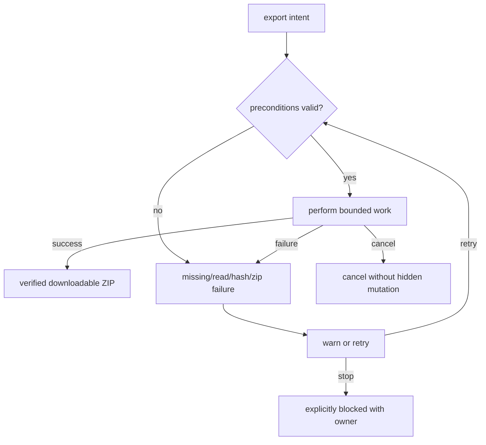
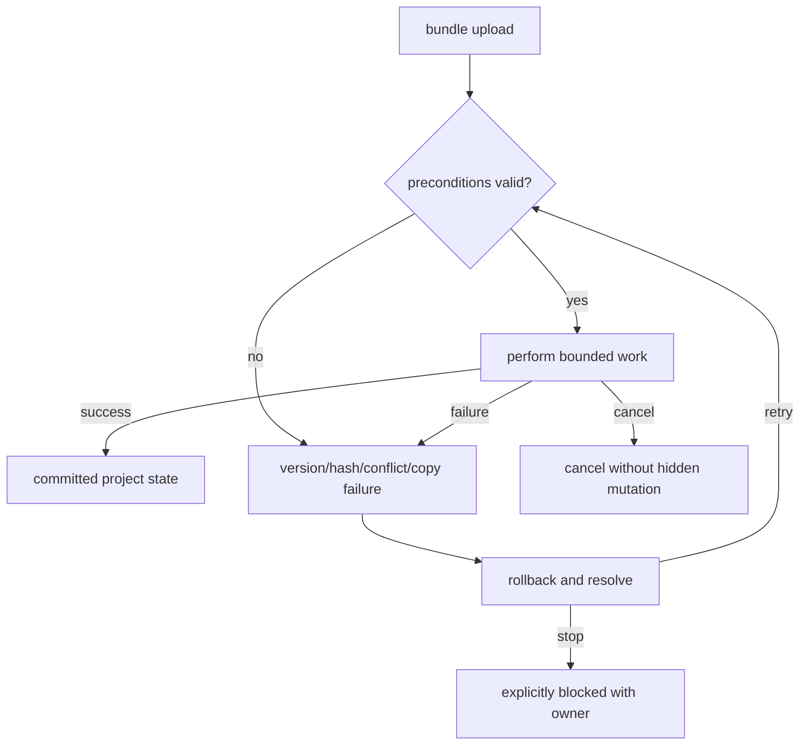
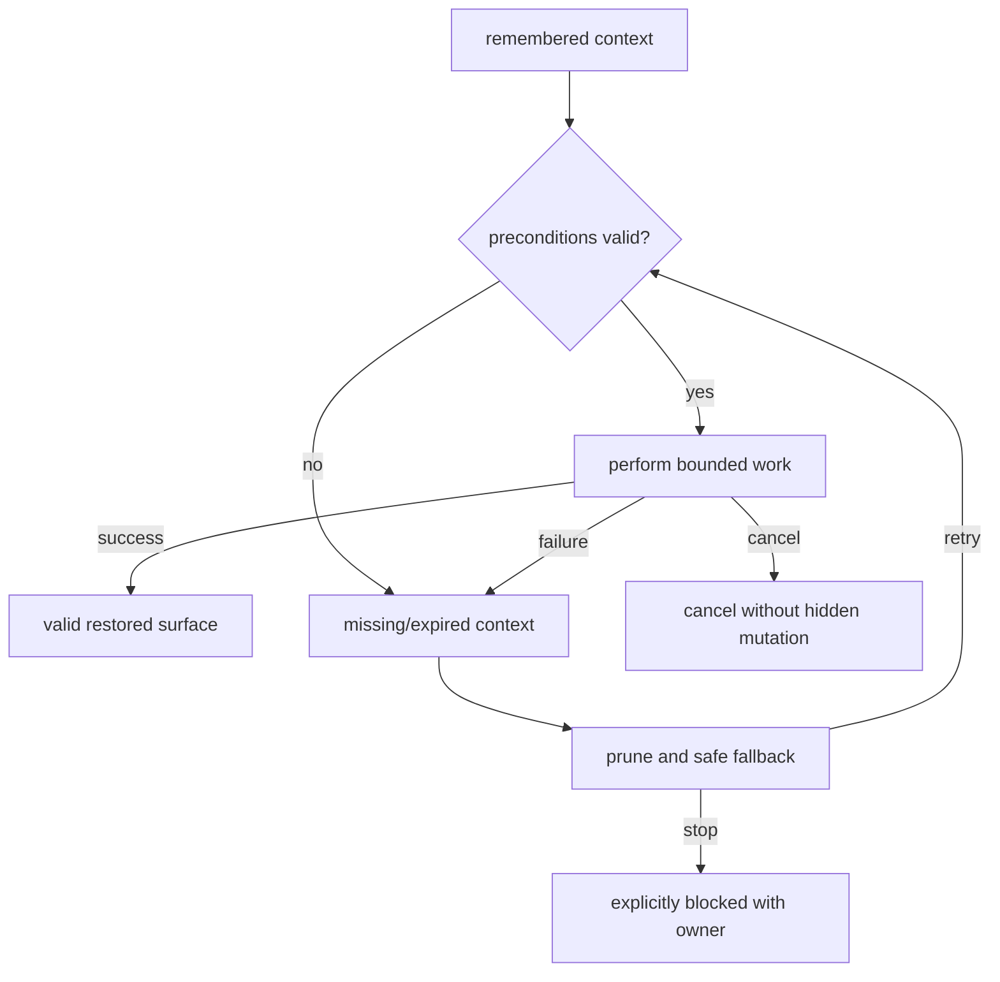
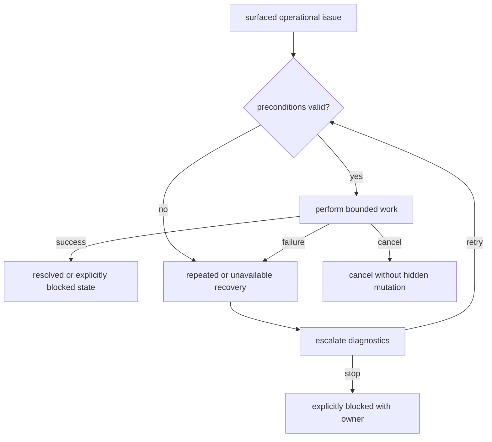
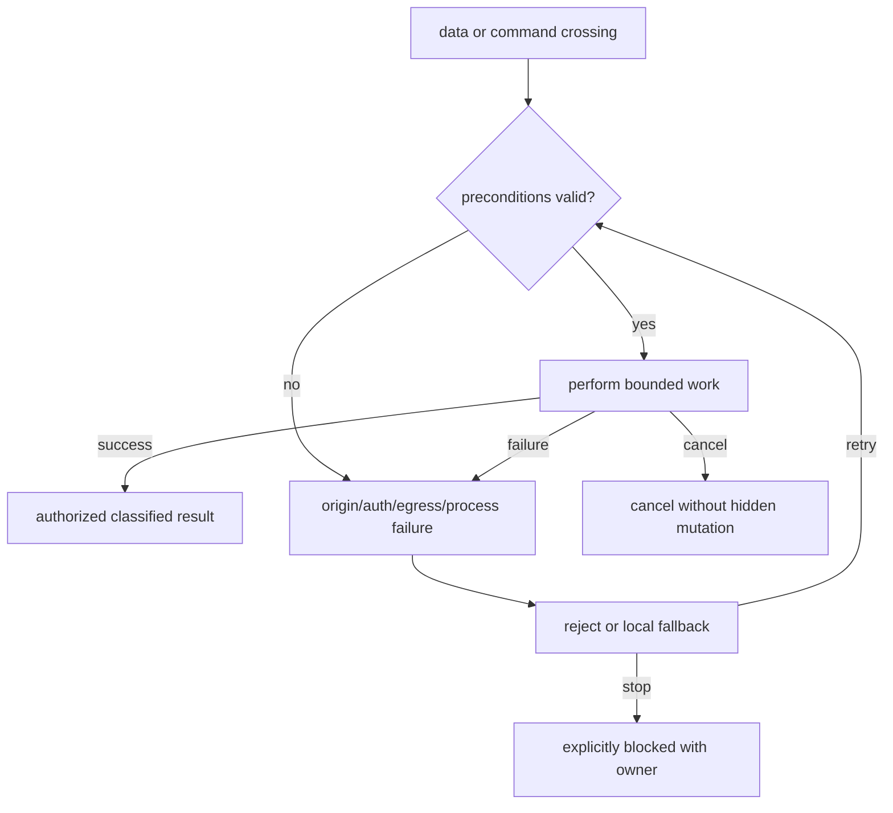
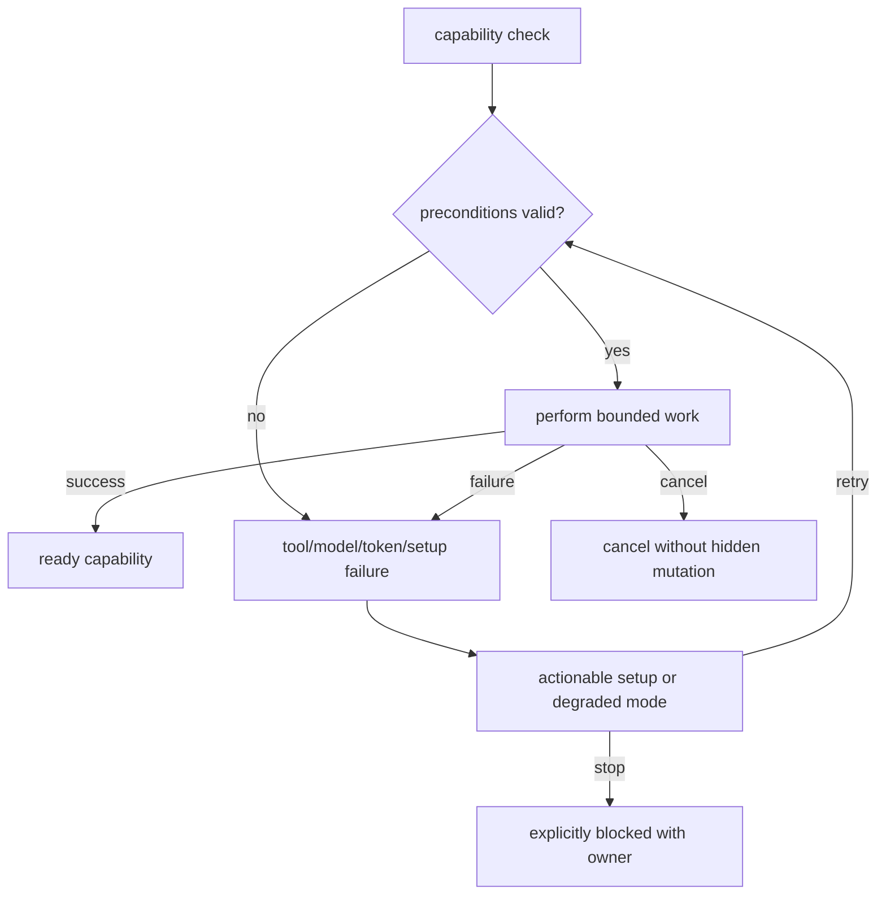

# Candidate application flows — Runtime Data Security

Status: `candidate_pending_chatgpt`

Each diagram is architectural. Exact route/state ownership is gated by the proposed validator issue.

## EXPORT-BUNDLE-001 — Project export bundle

Owner: `data-portability`

## IMPORT-BUNDLE-001 — Project bundle preview and transactional import

Owner: `data-portability`

## UI-MEMORY-001 — UI memory, pruning, and restoration

Owner: `frontend-data`

## SETTINGS-001 — Settings scope, capability, import, and reset

Owner: `frontend-runtime`

## ERROR-RECOVERY-001 — Operational error routing and recovery ownership

Owner: `cross-functional`

## BOUNDARY-001 — Local, filesystem, subprocess, URL, and provider boundaries

Owner: `runtime-security`

## DIAGNOSTICS-001 — Health, capability, and setup diagnostics

Owner: `runtime-platform`

