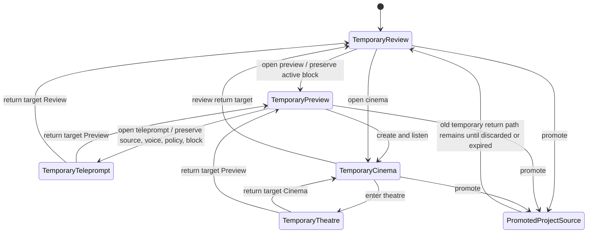

# UI Memory

UI memory is the machine-local preference layer for presentation state. It is separate from project
content, generated audio, provider credentials, model paths, and source text.

Workbench layout semantics and responsive rules are defined in `docs/workbench-layout.md`.

## Remembered State

Users can control these categories from Settings > Reader > UI memory:

- `Remember layout`: Workspace layout mode, Custom source/inspector/status density, and active Review detail tab.
- `Remember theme`: the selected Studio theme for this browser.
- `Remember last project`: the project id used to reopen the last active project.
- `Remember reader preferences`: typography, spacing, contrast, and motion preferences.
- `Remember Teleprompt return target`: Review or Preview return target and Teleprompt return
  presentation memory.
- `Remember panel pins`: Cinema focus panel state and pinned context panels.
- `Remember temporary work for this session`: recent temporary source return context, Theatre /
  Teleprompt position, bookmarks, and progress until the temporary source expires or is cleared.

Advanced disclosure pins, Cinema focus mode, active panel, and pinned panel state remain
session-only by default. They only become machine-local when `Remember panel pins` is enabled.

## Temporary Source Memory

Temporary source memory is recoverable session state for one-off sources. It helps users return to
active temporary work after accidental navigation, refresh, or stage changes, but it must not create
hidden project history.

Temporary source memory is controlled by `Remember temporary work for this session`. The preference
defaults on for the current browser session and is scoped to `sessionStorage` plus the temporary
source service expiry. Turning it off immediately removes temporary UI memory entries while leaving
the temporary source content itself intact until the source is discarded, cleared, promoted, or
expired.

Temporary memory may include:

- Recent temporary source ids, source titles, kind, lifecycle status, and expiry timestamps needed
  to render a `Recent temporary work` recovery entry.
- Active temporary stage: Review, Preview, Teleprompt, Cinema, or Theatre.
- Active block id and selection cursor for temporary Review and Preview.
- Temporary voice selection, run intent, and effective speech-policy reference used to enter
  Teleprompt or Preview.
- Temporary Teleprompt cue, scroll position, pacing mode, and return target.
- Temporary Theatre route, focus mode, selected cue or timestamp, and return target.
- Temporary bookmarks, reading position, playback progress, and context-panel history state.

Temporary memory must not include raw source text, extracted blocks, generated audio bytes, provider
secrets, durable project ids unless the source has been promoted, or any field that would let
`Remember last project` reopen the temporary source as a project.

Temporary source content remains owned by the temporary source storage model documented in
`docs/temporary-source-domain-model.md`. Resetting UI memory can remove pointers and presentation
state, but only source cleanup can delete temporary content and temporary artifacts.

### Return Context

Temporary return context is session-scoped and uses a stack-like model. Each entry records
`sourceOwner: "temporary"`, `temporarySourceId`, `fromSurface`, `toSurface`, optional `blockId`,
optional `voiceId`, optional `policyProfileId`, optional `runMode`, and `createdAt`.

State transitions:

Return rules:

- Leaving temporary Review for Preview preserves the active block.
- Leaving temporary Preview for Teleprompt preserves the source, selected voice, effective policy,
  run mode, and active block.
- Leaving temporary Theatre returns to temporary Cinema when Theatre was opened from generated
  playback; it returns to temporary Preview when Theatre was opened from preview auditioning.
- Promotion routes the user to the new project-owned source. The old temporary return path remains
  available until the temporary source is discarded, cleared, or expired, and it must be labeled as
  temporary.
- If a return target references an expired, discarded, or missing temporary source, the UI shows the
  temporary recovery/expired state and offers project-safe actions only: dismiss, clear temporary
  work, or open the promoted project source when one exists.

### Storage Keys And Expiry

Use versioned, source-owner-specific keys so temporary memory cannot collide with project memory:

| Key | Scope | Stores | Expiry |
|---|---|---|---|
| `tts.ui.temporaryMemory.v1.preference` | session | Whether session temporary memory is enabled. | Browser session. |
| `tts.ui.temporaryMemory.v1.recent` | session | Ordered lightweight recovery records. | Earlier of browser session end or each source `expiresAt`. |
| `tts.ui.temporaryMemory.v1.returnStack` | session | Temporary return-context stack. | Earlier of browser session end or each source `expiresAt`. |
| `tts.ui.temporaryMemory.v1.telepromptPosition` | session | Cue, scroll, pacing, and return target by temporary source id. | Earlier of browser session end or source `expiresAt`. |
| `tts.ui.temporaryMemory.v1.theatrePosition` | session | Route, cue/timestamp, focus mode, and return target by temporary source id. | Earlier of browser session end or source `expiresAt`. |
| `tts.ui.temporaryMemory.v1.progress` | session | Bookmarks, active block, reading position, playback progress pointers. | Earlier of browser session end or source `expiresAt`. |

Expiry pruning runs whenever the app boots, Settings opens, a temporary route loads, or temporary
cleanup succeeds. Pruning removes entries whose `temporarySourceId` no longer exists, whose
`expiresAt` is in the past, or whose lifecycle is `discarded` or `expired`. Promoted entries remain
temporary entries until they are pruned; promotion creates separate durable memory only for the new
project source.

Project memory keys must continue to require `projectId` or durable source ids. Any remembered
record with `sourceOwner: "temporary"` is invalid for `Remember last project`, project dashboards,
project source cards, import history, and durable exports.

### Settings Controls

Settings > Reader > UI memory includes a `Temporary work` row:

- Toggle: `Remember temporary work for this session`.
- Helper copy: `Keeps return position, bookmarks, and progress for temporary sources until they
  expire or you clear them. Temporary work is not project history.`
- Action: `Clear temporary sources`, which deletes temporary source content and related UI memory
  after confirmation.
- Summary: count of recoverable temporary sources and nearest expiry, for example
  `2 temporary sources remembered, next expires in 3 hours`.

The reset confirmation copy must distinguish layout memory from content cleanup. Resetting layout
can change presentation state, but clearing temporary sources deletes disposable source content and
temporary artifacts.

## Reset Scopes

UI memory supports these reset scopes:

- `Reset workspace layout`: clears Workspace layout mode, Custom density, advanced panel pins,
  and Review detail-tab memory. It does not delete temporary source content. It may clear temporary
  layout pointers only when they are presentation-only, and it must leave recoverable temporary
  source records intact.
- `Reset reader preferences`: restores reader accessibility preferences to defaults.
- `Reset all UI memory`: clears layout, theme, last project, reader preferences, Teleprompt return
  memory, panel pin memory, and temporary UI memory pointers. It does not delete temporary source
  content; users must choose `Clear temporary sources` for that.
- `Clear temporary sources`: deletes temporary source content, temporary artifacts, temporary
  bookmarks/progress, and temporary return memory. It does not reset durable project memory,
  machine-level layout preferences, theme, or reader preferences.

Every reset requires confirmation before it mutates local state.

## Export And Import

The preferences export is a JSON document with kind `tts-ui-preferences`. It can include enabled
UI memory preferences, theme, last project id, and reader accessibility preferences.

Exports intentionally omit:

- generated audio
- model paths
- provider secrets
- private project content
- raw Teleprompt script snapshots
- temporary source content and temporary source return stacks

Imports accept only known preference fields. Unknown fields are ignored, and imported last-project
memory is applied only when the project already exists locally.

The broader local-first data boundary is documented in `docs/privacy-local-first.md`.

## Validation

Local validation should confirm that disabling a memory category removes its local storage entry,
reset controls show confirmation, exported JSON does not include project content or runtime paths,
and Teleprompt return memory does not persist when that preference is disabled.

Temporary source validation should confirm:

- Users can navigate away from temporary Review, Preview, Teleprompt, Cinema, and Theatre and return
  to active temporary work before expiry.
- Temporary source state does not appear in project dashboards, durable project history, last-project
  restore, project source cards, or preference exports.
- Clearing temporary sources removes related bookmarks, progress, Teleprompt/Theatre position, and
  return-stack entries.
- Reset workspace layout does not delete temporary source content.
- Promotion creates durable memory only for the promoted project source while the old temporary
  return path remains temporary until discarded or expired.
